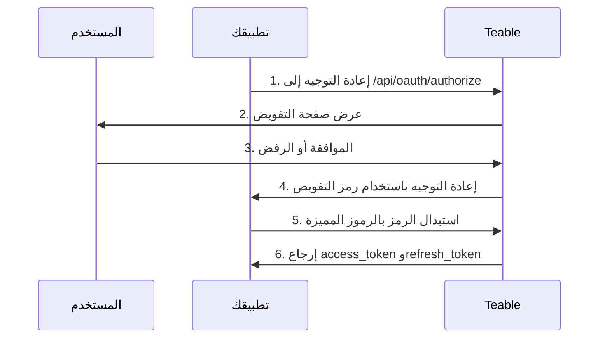

تتيح تطبيقات OAuth لتطبيقات الجهات الخارجية الوصول إلى Teable نيابةً عن المستخدمين. يوضح هذا الدليل كيفية إنشاء تطبيق OAuth وتهيئته، وتنفيذ مسار التفويض في OAuth 2.0، واستخدام رموز الوصول للتفاعل مع Teable API.

يدعم Teable ثلاثة أوضاع للتفويض في OAuth 2.0:

- **رمز التفويض + سر العميل**: لتطبيقات الويب التي لديها خادم خلفي
- **رمز التفويض + PKCE**: للتطبيقات الأصلية وأدوات CLI وتطبيقات الصفحة الواحدة وغيرها من العملاء العامّين الذين لا يمكنهم تخزين سر العميل بأمان
- **منح التفويض للجهاز**: للعملاء الذين لا يمكنهم تلقي إعادة توجيه من المتصفح مطلقًا، مثل أداة CLI تعمل عبر SSH أو داخل حاوية أو في بيئة تطوير سحابية

## إنشاء تطبيق OAuth

1. انتقل إلى [الإعدادات > تطبيقات OAuth](https://app.teable.ai/setting/oauth-app) في حسابك على Teable.
2. انقر على **تطبيقات OAuth جديدة** لإنشاء تطبيق جديد.
3. أدخل المعلومات المطلوبة:
   - **اسم تطبيق OAuth**: اسم وصفي لتطبيقك
   - **عنوان URL للصفحة الرئيسية**: عنوان URL الكامل لموقع تطبيقك
   - **عنوان URL لمعاودة الاتصال**: عنوان URL الذي سيُعاد توجيه المستخدمين إليه بعد التفويض
   - **النطاقات**: الأذونات التي يحتاج إليها تطبيقك
   - **تمكين مسار الجهاز**: يكون معطّلًا افتراضيًا. لا تمكّنه إلا إذا كان تطبيقك يسجّل دخول المستخدمين باستخدام رمز جهاز

4. بعد إنشاء التطبيق، أنشئ **سر العميل**. تأكد من نسخه وحفظه بأمان، إذ لن تتمكن من رؤيته مرة أخرى.

<Note>ستتلقى **معرّف العميل**، وستحتاج إلى إنشاء **سر العميل**. حافظ على أمان بيانات الاعتماد هذه ولا تكشفها مطلقًا في الشيفرة من جانب العميل. عند استخدام مسار PKCE، لا يلزم سر عميل.</Note>

## النطاقات المتاحة {#available-scopes}

تحدد النطاقات الإجراءات التي يمكن لتطبيق OAuth تنفيذها. تُنظّم النطاقات المتاحة حسب نوع المورد:

| المورد | النطاقات |
|----------|--------|
| **التطبيق** | `app\|create`, `app\|read`, `app\|update`, `app\|delete` |
| **قاعدة البيانات** | `base\|read`, `base\|read_all`, `base\|update`, `base\|table_import`, `base\|table_export`, `base\|query_data` |
| **الجدول** | `table\|create`, `table\|delete`, `table\|export`, `table\|import`, `table\|read`, `table\|update`, `table\|trash_read`, `table\|trash_update`, `table\|trash_reset` |
| **طريقة العرض** | `view\|create`, `view\|delete`, `view\|read`, `view\|update` |
| **الحقل** | `field\|create`, `field\|delete`, `field\|read`, `field\|update` |
| **السجل** | `record\|comment`, `record\|create`, `record\|delete`, `record\|read`, `record\|update` |
| **الأتمتة** | `automation\|create`, `automation\|delete`, `automation\|read`, `automation\|update` |
| **المستخدم** | `user\|email_read`, `user\|integrations` |

<Tip>لا تطلب إلا النطاقات التي يحتاج إليها تطبيقك فعليًا. سيرى المستخدمون الأذونات المطلوبة أثناء التفويض.</Tip>

## مسار رمز التفويض في OAuth 2.0

يطبّق Teable مسار رمز التفويض القياسي في OAuth 2.0:



### الخطوة 1: إعادة توجيه المستخدمين إلى التفويض

وجّه المستخدمين إلى نقطة نهاية التفويض مع معلمات تطبيقك:

```
GET https://app.teable.ai/api/oauth/authorize
```

**معلمات الاستعلام:**

| المعلمة | مطلوبة | الوصف |
|-----------|----------|-------------|
| `response_type` | نعم | يجب أن تكون `code` |
| `client_id` | نعم | معرّف العميل لتطبيق OAuth الخاص بك |
| `redirect_uri` | لا | يجب أن يطابق أحد عناوين URL المسجلة لمعاودة الاتصال. عند حذفه، سيُستخدم أول عنوان URL مسجل لمعاودة الاتصال |
| `scope` | لا | قائمة نطاقات مفصولة بمسافات. عند حذفها، تُستخدم النطاقات المهيأة في تطبيق OAuth |
| `state` | لا | سلسلة عشوائية لمنع هجمات CSRF. ستُعاد في معاودة الاتصال |

**مثال:**

```
https://app.teable.ai/api/oauth/authorize?response_type=code&client_id=YOUR_CLIENT_ID&redirect_uri=https://yourapp.com/callback&scope=table|read%20record|read&state=random_state_string
```

### الخطوة 2: تفويض المستخدم

سيرى المستخدمون صفحة تفويض تعرض ما يلي:
- اسم تطبيقك وشعاره
- الأذونات المطلوبة (النطاقات)
- خياري الموافقة على الوصول أو رفضه

إذا سبق للمستخدم تفويض تطبيقك (خلال 7 أيام افتراضيًا)، فستتم إعادة توجيهه فورًا من دون رؤية صفحة التفويض مرة أخرى.

### الخطوة 3: معالجة معاودة الاتصال

بعد موافقة المستخدم (أو رفضه)، يعيد Teable التوجيه إلى عنوان URL لمعاودة الاتصال:

**عند النجاح:**
```
https://yourapp.com/callback?code=AUTHORIZATION_CODE&state=random_state_string
```

**عند الرفض:**
```
https://yourapp.com/callback?error=access_denied&state=random_state_string
```

### الخطوة 4: استبدال الرمز برموز وصول

استبدل رمز التفويض برمز وصول ورمز تحديث:

```
POST https://app.teable.ai/api/oauth/access_token
Content-Type: application/x-www-form-urlencoded
```

**نص الطلب:**

| المعلمة | مطلوبة | الوصف |
|-----------|----------|-------------|
| `grant_type` | نعم | يجب أن تكون `authorization_code` |
| `code` | نعم | رمز التفويض المستلَم |
| `client_id` | نعم | معرّف العميل لتطبيق OAuth الخاص بك |
| `client_secret` | نعم | سر العميل لتطبيق OAuth الخاص بك |
| `redirect_uri` | نعم | يجب أن يطابق تمامًا redirect_uri المستخدم في التفويض |

**مثال على الطلب:**

```bash
curl -X POST https://app.teable.ai/api/oauth/access_token \
  -H "Content-Type: application/x-www-form-urlencoded" \
  -d "grant_type=authorization_code" \
  -d "code=AUTHORIZATION_CODE" \
  -d "client_id=YOUR_CLIENT_ID" \
  -d "client_secret=YOUR_CLIENT_SECRET" \
  -d "redirect_uri=https://yourapp.com/callback"
```

**الاستجابة:**

```json
{
  "token_type": "Bearer",
  "access_token": "teable_xxxxxxxxxxxx",
  "refresh_token": "eyJhbGciOiJIUzI1NiIsInR5cCI6IkpXVCJ9...",
  "expires_in": 600,
  "refresh_expires_in": 2592000,
  "scopes": ["table|read", "record|read"]
}
```

| الحقل | الوصف |
|-------|-------------|
| `token_type` | دائمًا `Bearer` |
| `access_token` | الرمز المستخدم لطلبات API |
| `refresh_token` | الرمز المستخدم للحصول على رموز وصول جديدة |
| `expires_in` | مدة صلاحية رمز الوصول بالثواني (الافتراضي: 600 = 10 دقائق) |
| `refresh_expires_in` | مدة صلاحية رمز التحديث بالثواني (الافتراضي: 2592000 = 30 يومًا) |
| `scopes` | مصفوفة النطاقات الممنوحة |

## مسار التفويض باستخدام PKCE

صُمم PKCE (إثبات المفتاح لتبادل الرمز) للتطبيقات التي لا يمكنها تخزين سر العميل بأمان، مثل تطبيقات سطح المكتب الأصلية وتطبيقات الأجهزة المحمولة وأدوات CLI وتطبيقات الصفحة الواحدة.

### الخطوة 1: إنشاء معلمات PKCE

قبل بدء التفويض، يحتاج العميل إلى إنشاء زوج من معلمات PKCE:

```javascript
// إنشاء code_verifier (سلسلة عشوائية من 43 إلى 128 حرفًا)
const codeVerifier = generateRandomString(43);

// إنشاء code_challenge = BASE64URL(SHA256(code_verifier))
const encoder = new TextEncoder();
const data = encoder.encode(codeVerifier);
const digest = await crypto.subtle.digest('SHA-256', data);
const codeChallenge = btoa(String.fromCharCode(...new Uint8Array(digest)))
  .replace(/\+/g, '-').replace(/\//g, '_').replace(/=+$/, '');
```

### الخطوة 2: إعادة توجيه المستخدمين إلى التفويض

```
GET https://app.teable.ai/api/oauth/authorize
```

**معلمات الاستعلام:**

| المعلمة | مطلوبة | الوصف |
|-----------|----------|-------------|
| `response_type` | نعم | يجب أن تكون `code` |
| `client_id` | نعم | معرّف العميل لتطبيق OAuth الخاص بك |
| `redirect_uri` | لا | عنوان URL لمعاودة الاتصال. يدعم وضع PKCE عناوين الاسترجاع المحلي |
| `scope` | لا | قائمة نطاقات مفصولة بمسافات |
| `state` | لا | سلسلة عشوائية لمنع هجمات CSRF |
| `code_challenge` | نعم | تجزئة SHA-256 للقيمة code_verifier (مرمّزة بصيغة Base64URL) |
| `code_challenge_method` | نعم | يجب أن تكون `S256` |

**مثال:**

```
https://app.teable.ai/api/oauth/authorize?response_type=code&client_id=YOUR_CLIENT_ID&redirect_uri=http://127.0.0.1:8080/callback&code_challenge=YOUR_CODE_CHALLENGE&code_challenge_method=S256&state=random_state_string
```

<Tip>في وضع PKCE، يدعم `redirect_uri` عناوين الاسترجاع المحلي (`http://127.0.0.1` و`http://[::1]` و`http://localhost`) مع مطابقة مرنة للمنافذ؛ فلا تحتاج إلى تسجيل كل منفذ بدقة.</Tip>

### الخطوة 3: معالجة معاودة الاتصال

كما في مسار رمز التفويض القياسي، يُعاد رمز التفويض عبر إعادة التوجيه بعد موافقة المستخدم.

### الخطوة 4: استبدال الرمز وcode_verifier برموز وصول

```
POST https://app.teable.ai/api/oauth/access_token
Content-Type: application/x-www-form-urlencoded
```

**نص الطلب:**

| المعلمة | مطلوبة | الوصف |
|-----------|----------|-------------|
| `grant_type` | نعم | يجب أن تكون `authorization_code` |
| `code` | نعم | رمز التفويض المستلَم |
| `client_id` | نعم | معرّف العميل لتطبيق OAuth الخاص بك |
| `code_verifier` | نعم | السلسلة العشوائية الأصلية التي أُنشئت في الخطوة 1 |
| `redirect_uri` | نعم | يجب أن يطابق تمامًا redirect_uri المستخدم في التفويض |

<Note>لا يتطلب وضع PKCE القيمة `client_secret`. تُستخدم القيمة `code_verifier` بدلاً منها للتحقق من هوية العميل.</Note>

**مثال على الطلب:**

```bash
curl -X POST https://app.teable.ai/api/oauth/access_token \
  -H "Content-Type: application/x-www-form-urlencoded" \
  -d "grant_type=authorization_code" \
  -d "code=AUTHORIZATION_CODE" \
  -d "client_id=YOUR_CLIENT_ID" \
  -d "code_verifier=YOUR_CODE_VERIFIER" \
  -d "redirect_uri=http://127.0.0.1:8080/callback"
```

تنسيق الاستجابة مماثل لمسار رمز التفويض القياسي.

## مسار تفويض الجهاز

يُستخدم منح تفويض الجهاز ([RFC 8628](https://datatracker.ietf.org/doc/html/rfc8628)) للعملاء الذين لا يمكنهم تلقي إعادة توجيه من المتصفح: مثل أداة CLI تعمل عبر SSH أو داخل حاوية أو في بيئة تطوير سحابية. يعرض عميلك عنوان URL ورمزًا قصيرًا، ويوافق المستخدم في أي متصفح، ولا يلزم إدخال أي شيء مجددًا في الطرفية.

يتبع Teable معيار RFC 8628، لذا يمكن لمعظم مكتبات عميل OAuth تشغيل هذا المسار من دون شيفرة مخصصة. وفيما يلي ما يخص Teable تحديدًا.

<Warning>يكون مسار الجهاز معطّلًا افتراضيًا. فعّل **تمكين مسار الجهاز** في إعدادات تطبيق OAuth قبل استخدامه. يمكن لأي شخص يعرف معرّف العميل بدء هذا المسار باسم تطبيقك، لذا لا تمكّنه إلا إذا كان تطبيقك يحتاج إليه. كما يؤدي تعطيله مرة أخرى إلى إيقاف الطلبات التي لا تزال بانتظار الموافقة.</Warning>

### طلب رمز جهاز

أرسل `POST /api/oauth/device/code` مع `client_id` و`scope` اختياري. نقطة النهاية مجهولة الهوية ومحدودة بمعدل 30 طلبًا لكل 15 دقيقة لكل عنوان IP.

```json
{
  "device_code": "xxxxxxxxxxxx",
  "user_code": "BCDF-GHJK",
  "verification_uri": "https://app.teable.ai/oauth/device",
  "expires_in": 900,
  "interval": 5
}
```

تنتهي صلاحية كلا الرمزين بعد 15 دقيقة (`BACKEND_OAUTH_DEVICE_CODE_EXPIRE_IN`)، وتمثل `interval` الحد الأدنى لعدد الثواني الواجب انتظاره بين عمليات الاستقصاء.

اعرض `verification_uri` و`user_code`. في تلك الصفحة، يسجّل المستخدم الدخول ويدخل الرمز ويراجع اسم تطبيقك وصفحته الرئيسية ونطاقاته المطلوبة قبل الموافقة أو الرفض. تحذّره الصفحة من الموافقة على رمز لم يبدأ طلبه بنفسه. ولا يمكن استخدام كل رمز إلا مرة واحدة.

<Note>لا يُرجع Teable القيمة `verification_uri_complete`، وينبغي ألا ينشئ عميلك واحدة. يُسجّل الرمز الموافق عليه دخول الشخص الذي وافق إلى حسابه الخاص في Teable؛ ولذلك فإن الرابط الذي يحمل الرمز مسبقًا هو تحديدًا ما تعتمد عليه هجمات التصيد الاحتيالي لرمز الجهاز.</Note>

### الاستقصاء عن رموز الوصول

أرسل `POST /api/oauth/access_token` مع `grant_type=urn:ietf:params:oauth:grant-type:device_code` و`device_code` و`client_id`. لا يرسل العملاء العامّون `client_secret`، بينما يضيفه العملاء السريون كما في المسارات الأخرى.

إلى أن يوافق شخص على الرمز، تستجيب نقطة النهاية بخطأ بدلاً من رموز الوصول:

| الخطأ | ما ينبغي لعميلك فعله |
|-------|----------------------------|
| `authorization_pending` | لم يوافق أحد بعد. واصل الاستقصاء وفق `interval` |
| `slow_down` | أجريت الاستقصاء بسرعة زائدة. انتظر مدة أطول قبل الاستقصاء التالي |
| `access_denied` | رفض المستخدم الطلب. أوقف الاستقصاء |
| `expired_token` | انتهت صلاحية الرمز أو سبق استخدامه. ابدأ من جديد |

بعد موافقة المستخدم، تكون الاستجابة هي حمولة رموز الوصول نفسها المستخدمة في المسارات الأخرى.

## استخدام رموز الوصول

ضمّن رمز الوصول في ترويسة `Authorization` لطلبات API:

```bash
curl https://app.teable.ai/api/table/TABLE_ID/record \
  -H "Authorization: Bearer YOUR_ACCESS_TOKEN"
```

تكون الخطوة الأولى بعد الحصول على رمز عادةً هي جلب جميع قواعد البيانات التي يمكن للمستخدم الحالي الوصول إليها:

```bash
curl https://app.teable.ai/api/base/access/all \
  -H "Authorization: Bearer YOUR_ACCESS_TOKEN"
```

تُرجع نقطة النهاية هذه جميع قواعد البيانات التي يملك المستخدم الحالي إذنًا للوصول إليها. ويمكنك استخدام `baseId` من الاستجابة في استدعاءات API اللاحقة.

## تحديث رموز الوصول

عند انتهاء صلاحية رمز الوصول، استخدم رمز التحديث للحصول على رمز جديد:

```
POST https://app.teable.ai/api/oauth/access_token
Content-Type: application/x-www-form-urlencoded
```

**نص الطلب:**

| المعلمة | مطلوبة | الوصف |
|-----------|----------|-------------|
| `grant_type` | نعم | يجب أن تكون `refresh_token` |
| `refresh_token` | نعم | رمز التحديث الحالي |
| `client_id` | نعم | معرّف العميل لتطبيق OAuth الخاص بك |
| `client_secret` | مشروطة | مطلوبة لوضع رمز التفويض القياسي، وغير مطلوبة لوضع PKCE |

**مثال على الطلب:**

```bash
curl -X POST https://app.teable.ai/api/oauth/access_token \
  -H "Content-Type: application/x-www-form-urlencoded" \
  -d "grant_type=refresh_token" \
  -d "refresh_token=YOUR_REFRESH_TOKEN" \
  -d "client_id=YOUR_CLIENT_ID" \
  -d "client_secret=YOUR_CLIENT_SECRET"
```

<Warning>بعد التحديث، يصبح رمز التحديث السابق غير صالح (تدوير رمز التحديث). احفظ دائمًا رمز التحديث الجديد الوارد في الاستجابة.</Warning>

## إلغاء الوصول

### لمالكي تطبيق OAuth

ألغِ وصول التطبيق **لجميع المستخدمين** (لا يمكن تنفيذ ذلك إلا بواسطة منشئ التطبيق):

```
POST https://app.teable.ai/api/oauth/client/{clientId}/revoke-access
```

يحذف ذلك جميع سجلات التفويض ورموز الوصول الخاصة بالمستخدمين، ويمنع التطبيق تمامًا من الوصول إلى بيانات أي مستخدم.

### للمستخدمين

ألغِ تفويضك **الخاص** لتطبيق محدد:

```
POST https://app.teable.ai/api/oauth/client/{clientId}/revoke-token
```

لا يؤدي ذلك إلا إلى إبطال رموز الوصول ورموز التحديث للمستخدم الحالي، من دون التأثير في المستخدمين الآخرين.

يمكن للمستخدمين أيضًا إلغاء الوصول من خلال صفحة إعدادات [التطبيقات المصرّح بها](https://app.teable.ai/setting/authorized-apps).

### للتطبيقات

يمكن للتطبيقات إلغاء وصولها باستخدام رمز وصول:

```
GET https://app.teable.ai/api/oauth/client/{clientId}/revoke-token
Authorization: Bearer YOUR_ACCESS_TOKEN
```

<Note>لا تقبل نقطة النهاية هذه إلا المصادقة باستخدام رمز الوصول، وليس مصادقة الجلسة.</Note>

## انتهاء صلاحية الرموز

| نوع الرمز | انتهاء الصلاحية الافتراضي | قابل للتهيئة عبر |
|------------|-------------------|------------------|
| رمز التفويض | 5 دقائق | `BACKEND_OAUTH_CODE_EXPIRE_IN` |
| رمز الجهاز | 15 دقيقة | `BACKEND_OAUTH_DEVICE_CODE_EXPIRE_IN` |
| رمز الوصول | 10 دقائق | `BACKEND_OAUTH_ACCESS_TOKEN_EXPIRE_IN` |
| رمز التحديث | 30 يومًا | `BACKEND_OAUTH_REFRESH_TOKEN_EXPIRE_IN` |
| تذكّر التفويض | 7 أيام | `BACKEND_OAUTH_AUTHORIZED_EXPIRE_IN` |

## معالجة الأخطاء

استجابات الأخطاء الشائعة:

| الخطأ | الوصف |
|-------|-------------|
| `invalid_client` | معرّف العميل أو سر العميل غير صالح |
| `invalid_grant` | انتهت صلاحية رمز التفويض أو سبق استخدامه |
| `invalid_scope` | النطاق المطلوب غير مسموح به لتطبيق OAuth هذا |
| `access_denied` | رفض المستخدم طلب التفويض |
| `redirect_uri_mismatch` | لا يطابق معرّف URI لإعادة التوجيه عناوين URL المسجلة |
| `unauthorized_client` | لم يمكّن تطبيق OAuth مسار الجهاز |
| `too_many_requests` | تم تجاوز حد المعدل. الحد الافتراضي لطلبات رموز الوصول هو 30 طلبًا لكل 15 دقيقة، ولطلبات رمز الجهاز 30 طلبًا لكل 15 دقيقة لكل عنوان IP |

## أفضل الممارسات

1. **اختيار الوضع المناسب**: استخدم وضع سر العميل لتطبيقات الويب ذات الخادم الخلفي، ووضع PKCE للتطبيقات الأصلية وأدوات CLI وتطبيقات الصفحة الواحدة، ومسار الجهاز عندما يتعذر على العميل تلقي إعادة توجيه من المتصفح
2. **حفظ الأسرار بأمان**: لا تكشف سر العميل مطلقًا في الشيفرة من جانب العميل
3. **استخدام معلمة state**: ضمّن دائمًا معلمة `state` عشوائية لمنع هجمات CSRF
4. **طلب الحد الأدنى من النطاقات**: لا تطلب إلا الأذونات التي يحتاج إليها تطبيقك فعليًا
5. **معالجة تحديث الرموز**: نفّذ تحديثًا تلقائيًا للرموز قبل انتهاء صلاحيتها
6. **تأمين تخزين الرموز**: خزّن رموز الوصول والتحديث بأمان على خادمك

## أمثلة كاملة

### Node.js (رمز التفويض + سر العميل)

```javascript
const express = require('express');
const crypto = require('crypto');
const app = express();

const CLIENT_ID = 'your_client_id';
const CLIENT_SECRET = 'your_client_secret';
const REDIRECT_URI = 'http://localhost:3000/callback';
const TEABLE_URL = 'https://app.teable.ai';

// الخطوة 1: إعادة توجيه المستخدم إلى صفحة التفويض
app.get('/login', (req, res) => {
  const state = crypto.randomBytes(16).toString('hex');
  req.session.oauthState = state; // تخزين state في الجلسة
  const authUrl = `${TEABLE_URL}/api/oauth/authorize?` +
    `response_type=code&` +
    `client_id=${CLIENT_ID}&` +
    `redirect_uri=${encodeURIComponent(REDIRECT_URI)}&` +
    `scope=${encodeURIComponent('record|read table|read')}&` +
    `state=${state}`;
  res.redirect(authUrl);
});

// الخطوة 2: معالجة رد الاتصال واستبدال الرمز بالرموز المميزة
app.get('/callback', async (req, res) => {
  const { code, state } = req.query;

  // التحقق من state لمنع هجمات CSRF
  if (state !== req.session.oauthState) {
    return res.status(403).send('قيمة state غير صالحة');
  }

  const response = await fetch(`${TEABLE_URL}/api/oauth/access_token`, {
    method: 'POST',
    headers: { 'Content-Type': 'application/x-www-form-urlencoded' },
    body: new URLSearchParams({
      grant_type: 'authorization_code',
      client_id: CLIENT_ID,
      client_secret: CLIENT_SECRET,
      code,
      redirect_uri: REDIRECT_URI,
    }),
  });

  const tokens = await response.json();
  // tokens.access_token — يُستخدم لاستدعاءات API
  // tokens.refresh_token — يُستخدم لتحديث الرموز المميزة
  res.json({ success: true, scopes: tokens.scopes });
});

app.listen(3000);
```

### Python (وضع PKCE لأدوات CLI)

```python
import hashlib
import base64
import secrets
import http.server
import urllib.parse
import requests

CLIENT_ID = 'your_client_id'
TEABLE_URL = 'https://app.teable.ai'
PORT = 8080
REDIRECT_URI = f'http://127.0.0.1:{PORT}/callback'

# الخطوة 1: إنشاء معلمات PKCE
code_verifier = secrets.token_urlsafe(32)  # 43 characters
code_challenge = base64.urlsafe_b64encode(
    hashlib.sha256(code_verifier.encode()).digest()
).rstrip(b'=').decode()

# الخطوة 2: إنشاء عنوان URL للتفويض (افتحه في المتصفح)
auth_url = (
    f"{TEABLE_URL}/api/oauth/authorize?"
    f"response_type=code&"
    f"client_id={CLIENT_ID}&"
    f"redirect_uri={urllib.parse.quote(REDIRECT_URI)}&"
    f"code_challenge={code_challenge}&"
    f"code_challenge_method=S256"
)
print(f"افتح في متصفحك:\n{auth_url}")

# الخطوة 3: تشغيل خادم محلي لاستقبال رد الاتصال
authorization_code = None

class CallbackHandler(http.server.BaseHTTPRequestHandler):
    def do_GET(self):
        global authorization_code
        query = urllib.parse.urlparse(self.path).query
        params = urllib.parse.parse_qs(query)
        authorization_code = params.get('code', [None])[0]
        self.send_response(200)
        self.end_headers()
        self.wfile.write('تم التفويض بنجاح! يمكنك إغلاق هذه الصفحة.'.encode('utf-8'))

    def log_message(self, format, *args):
        pass  # تعطيل السجلات

server = http.server.HTTPServer(('127.0.0.1', PORT), CallbackHandler)
server.handle_request()  # معالجة طلب واحد

# الخطوة 4: استبدال code + code_verifier بالرموز المميزة
response = requests.post(f"{TEABLE_URL}/api/oauth/access_token", data={
    'grant_type': 'authorization_code',
    'client_id': CLIENT_ID,
    'code': authorization_code,
    'redirect_uri': REDIRECT_URI,
    'code_verifier': code_verifier,
})

tokens = response.json()
print(f"رمز الوصول: {tokens['access_token']}")
print(f"تنتهي الصلاحية خلال: {tokens['expires_in']} ثانية")
```
