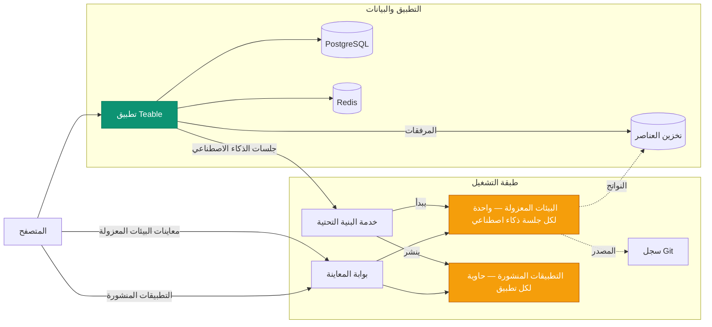

ينشر تشغيل Teable باستضافة ذاتية أربع منصات في منصة واحدة:

- **بيئة وكيل معزولة وآمنة وقابلة للتوسع** — تعمل كل جلسة ذكاء اصطناعي داخل
  حاويتها المعزولة، وتبدأ عند الطلب وتُزال عند انتهاء الجلسة.
- **منصة موفرة للموارد لنشر التطبيقات** — يعمل كل تطبيق ينشئه فريقك
  وينشره في حاوية مستقلة خفيفة وطويلة العمر.
- **محرك سير عمل للذكاء الاصطناعي** — عمليات أتمتة تشغّلها تغييرات السجلات
  والجداول الزمنية وخطافات الويب، وتتضمن خطوات ذكاء اصطناعي تعمل حيث توجد بياناتك.
- **منصة متكاملة للتعاون في قواعد البيانات على PostgreSQL** — الجداول
  وطرق العرض وAPI.

تغلف استضافة Teable ذاتيًا موارد الحوسبة الخاصة بك ضمن **بيئة إنتاجية جاهزة للوكلاء
وتحت سيطرتك بالكامل**، ما يضع الذكاء الاصطناعي في متناول جميع
أفراد فريقك.

توضح هذه الصفحة الخدمات التي تقف وراء ذلك وكيف تترابط. توجد
أصول النشر (ملفات Compose ومخطط Helm والقيم) في
[teableio/teable-deployment](https://github.com/teableio/teable-deployment).

<Tip>تتاح ميزات الذكاء الاصطناعي لخطة Business ذاتية الاستضافة والخطط الأعلى.</Tip>

## ما يشغّله النشر

| الخدمة | الغرض |
|---|---|
| **تطبيق Teable** | واجهة الويب وAPI والأتمتة ومحادثة الذكاء الاصطناعي — صورة واحدة: `ghcr.io/teableio/teable` |
| **PostgreSQL** | قاعدة البيانات الرئيسية: جميع جداولك وطرق عرضك وبياناتك الوصفية |
| **Redis** | التخزين المؤقت وقوائم الانتظار والتعاون الفوري |
| **تخزين العناصر** | تخزين ملفات متوافق مع S3 بثلاث حاويات: **عامة** (الصور الرمزية والأصول العامة الأخرى)، و**خاصة** (المرفقات)، و**نواتج البناء** (مخرجات منشئ التطبيقات) |
| **خدمة البنية التحتية** | نقطة الدخول الوحيدة التي يتصل بها تطبيق Teable؛ تنسق عمليات البناء ونشر التطبيقات، ولها وحدة تحكم وAPI خاصان بها |
| **محرك البيئة المعزولة** | يشغّل كل جلسة ذكاء اصطناعي في حاوية معزولة |
| **سجل Git** | يخزن الشيفرة المصدرية للتطبيقات التي تنشئها (يدفع منشئ التطبيقات إليها) |
| **بوابة المعاينة** | توجّه المتصفحات إلى معاينات البيئات المعزولة والتطبيقات المنشورة |

تشكّل الخدمات الأربع الأخيرة طبقة التشغيل. وتثبّت أصول النشر كل ذلك
كمنصة واحدة.

## كيفية ترابط المكوّنات

يتصل تطبيق Teable بطبقة التشغيل عبر **اتصال واحد**: خدمة
البنية التحتية (`TEABLE_INFRA_API_URL` / `TEABLE_INFRA_API_KEY`). وكل ما
وراءها داخلي. ينفذ نوعان من أحمال العمل العمل الحقيقي، وهما
ما يستهلك موارد جهازك:

- **البيئات المعزولة.** تحصل كل جلسة لمحادثة الذكاء الاصطناعي أو منشئ التطبيقات على حاوية
  معزولة خاصة بها، تبدأ مع الجلسة وتُزال عند انتهائها. وهذا
  هو الحمل الرئيسي للمنصة ويأتي على دفعات؛ لذا حدّد حجم جهازك وفق
  **ذروة جلسات الذكاء الاصطناعي المتزامنة** لا عدد المستخدمين (يمكن ضبط حدود الموارد
  لكل بيئة معزولة في لوحة الإدارة).
- **التطبيقات المنشورة.** يعمل كل تطبيق ينشره شخص ما في حاوية مستقلة طويلة العمر
  ويُعرض على `*.app.<domain>`. تأتي البيئات المعزولة وتذهب، أما التطبيقات المنشورة
  فتتراكم وتظل قيد التشغيل.

تؤدي الخدمات الأخرى أدوارًا مساندة: يجري البناء داخل بيئة الجلسة
المعزولة، ويحتفظ سجل Git وتخزين العناصر بما تنتجه
(الشيفرة المصدرية ونواتج البناء)، وتوجّه البوابة كل طلب من المتصفح
إلى البيئة المعزولة أو التطبيق الصحيح.

## نطاق واحد وأربعة سجلات DNS

يُعرض كل شيء ضمن **نطاق أساسي واحد**، وغالبًا يكون نطاقًا فرعيًا
لديك مثل `teable.example.com`:

| السجل | ما يعرضه |
|---|---|
| `<domain>` | تطبيق Teable |
| `infra.<domain>` | وحدة تحكم خدمة البنية التحتية وAPI؛ ويُعرض Git (`/git`) وتخزين العناصر أيضًا عبر مسارات على هذا المضيف |
| `*.app.<domain>` | التطبيقات التي أنشأتها ونشرتها |
| `*.sandbox.<domain>` | معاينات البيئات المعزولة في المتصفح |

كل اسم مجرد قيمة افتراضية، ويمكن تجاوز كل اسم مضيف بصورة مستقلة
(راجع مثال القيم في مستودع النشر).

## الإصدارات

تُطرح المنصة في صورة **إصدارات منصة** (`v<year>.<month>.<seq>`) من
مستودع النشر:

- علامة **الإصدار** هي لقطة موثقة: يثبّت `versions.yaml` الإصدار الدقيق
  لكل مكوّن، ويوضح `CHANGELOG.md` في المستودع ما تغير وما يجب
  عليك فعله إن لزم.
- فرع `main` في المستودع هو أحدث إصدار متجدد.
- يقارن نص **الفحص** المضمّن ما يشغّله نشرك فعليًا
  بالإصدار، ويعرض واحدة من ثلاث نتائج: متوافق، أو ترقية
  تطبيق Teable، أو تركيبة مجهولة (غير متحقق منها).

لتطبيق Teable مسار إصدارات مستقل (علامات حسب التاريخ؛ و`latest` هي
القناة المستقرة) — راجع [ترقية الإصدار](/ar/deploy/upgrade). يذكر كل إصدار
للمنصة إصدارات التطبيق التي جرى التحقق معه منها، ويتولى نص الفحص
التحقق لك. ويتبع وكيل البيئة المعزولة خلف جلسات الذكاء الاصطناعي
إصدار التطبيق تلقائيًا؛ فلا يوجد شيء إضافي لترقيته أو إدارته.

## النشر

يثبّت المساران المنصة كاملة، ويغطيهما مستودع
النشر من البداية إلى النهاية:

<CardGroup cols={2}>
  <Card title="Docker متكامل" icon="docker" href="https://github.com/teableio/teable-deployment/blob/main/docker/all-in-one/README.md">
    كل شيء على جهاز واحد — أول نشر كامل، بوضع `local` أو `server`.
  </Card>
  <Card title="Kubernetes (Helm)" icon="dharmachakra" href="https://github.com/teableio/teable-deployment/blob/main/helm/README.md">
    مخطط Helm واحد على مجموعة موجودة؛ لا يلزم سوى `global.baseDomain`.
  </Card>
</CardGroup>

لا تحتاج إلى الذكاء الاصطناعي بعد؟ يمكنك تشغيل التطبيق فقط مع PostgreSQL وRedis
والتخزين — نشر **مستقل** ([النشر باستخدام Docker](/ar/deploy/docker))
— وإرفاق طبقة التشغيل لاحقًا مع بقاء بياناتك في مكانها.

موضوعات ذات صلة، كلها محفوظة في مستودع النشر:

- **هل تشغّل Teable مستقلًا بالفعل؟** تبقى بياناتك في مكانها، وتُثبّت
  طبقة التشغيل بجواره: [دليل الترحيل](https://github.com/teableio/teable-deployment/blob/main/migration/2026-07-basic-to-full-featured.md)
- **شهادات داخلية للشركة؟** إذا كان نطاقك يستخدم سلطة شهادات خاصة أو
  مؤسسية، فيجب إخبار البيئات المعزولة بالوثوق بها —
  [private-ca.md](https://github.com/teableio/teable-deployment/blob/main/helm/private-ca.md)
- **الأحجام والإصدارات والمرايا**: [VERSIONS.md](https://github.com/teableio/teable-deployment/blob/main/VERSIONS.md) ·
  [images/README.md](https://github.com/teableio/teable-deployment/blob/main/images/README.md)
- **عند حدوث فشل**: شغّل نص الفحص أولًا، ثم راجع
  [TROUBLESHOOTING.md](https://github.com/teableio/teable-deployment/blob/main/TROUBLESHOOTING.md)

بعد النشر، اربط تطبيق Teable بطبقة التشغيل باستخدام
`TEABLE_INFRA_API_URL` / `TEABLE_INFRA_API_KEY` (تغطي أدلة النشر
ذلك)، ثم عيّن حدود الموارد في
[لوحة الإدارة ← وكيل البيئة المعزولة](/ar/basic/admin-panel/sandbox-agent).
