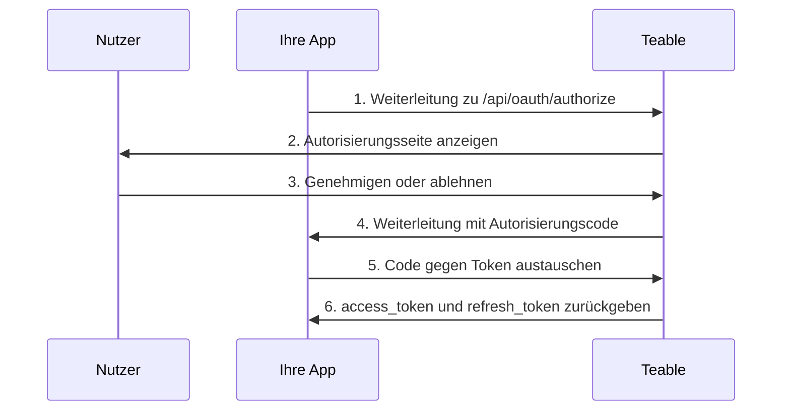

OAuth-Apps ermöglichen Drittanbieteranwendungen den Zugriff auf Teable im Namen von Nutzern. Dieser Leitfaden erläutert, wie Sie eine OAuth-App erstellen und konfigurieren, den OAuth-2.0-Autorisierungsablauf implementieren und Zugriffstoken für die Interaktion mit der Teable-API verwenden.

Teable unterstützt drei OAuth-2.0-Autorisierungsmodi:

- **Autorisierungscode + Client Secret**: Für Webanwendungen mit einem Backend-Server
- **Autorisierungscode + PKCE**: Für native Apps, CLI-Tools, SPAs und andere öffentliche Clients, die ein Client Secret nicht sicher speichern können
- **Geräteautorisierungs-Grant**: Für Clients, die überhaupt keine Browser-Weiterleitung empfangen können, etwa eine über SSH ausgeführte CLI, ein Container oder eine Cloud-IDE

## Erstellen einer OAuth-App

1. Gehen Sie in Ihrem Teable-Konto zu [Einstellungen > OAuth-Apps](https://app.teable.ai/setting/oauth-app).
2. Klicken Sie auf **Neue OAuth-Apps**, um eine neue Anwendung zu erstellen.
3. Füllen Sie die erforderlichen Informationen aus:
   - **Name der OAuth-App**: Ein aussagekräftiger Name für Ihre Anwendung
   - **Homepage-URL**: Die vollständige URL der Website Ihrer Anwendung
   - **Callback-URL**: Die URL, an die Nutzer nach der Autorisierung weitergeleitet werden
   - **Scopes**: Die Berechtigungen, die Ihre Anwendung benötigt
   - **Geräteablauf aktivieren**: Standardmäßig deaktiviert. Aktivieren Sie diese Option nur, wenn Ihre Anwendung Nutzer mit einem Gerätecode anmeldet

4. Generieren Sie nach dem Erstellen der App ein **Client Secret**. Kopieren und speichern Sie es unbedingt sicher – Sie können es später nicht erneut anzeigen.

<Note>Sie erhalten eine **Client ID** und müssen ein **Client Secret** generieren. Bewahren Sie diese Zugangsdaten sicher auf und legen Sie sie niemals in clientseitigem Code offen. Bei Verwendung des PKCE-Ablaufs ist kein Client Secret erforderlich.</Note>

## Verfügbare Scopes {#available-scopes}

Scopes legen fest, welche Aktionen Ihre OAuth-App ausführen kann. Die verfügbaren Scopes sind nach Ressourcentyp organisiert:

| Ressource | Scopes |
|----------|--------|
| **App** | `app\|create`, `app\|read`, `app\|update`, `app\|delete` |
| **Base** | `base\|read`, `base\|read_all`, `base\|update`, `base\|table_import`, `base\|table_export`, `base\|query_data` |
| **Tabelle** | `table\|create`, `table\|delete`, `table\|export`, `table\|import`, `table\|read`, `table\|update`, `table\|trash_read`, `table\|trash_update`, `table\|trash_reset` |
| **Ansicht** | `view\|create`, `view\|delete`, `view\|read`, `view\|update` |
| **Feld** | `field\|create`, `field\|delete`, `field\|read`, `field\|update` |
| **Datensatz** | `record\|comment`, `record\|create`, `record\|delete`, `record\|read`, `record\|update` |
| **Automatisierung** | `automation\|create`, `automation\|delete`, `automation\|read`, `automation\|update` |
| **Nutzer** | `user\|email_read`, `user\|integrations` |

<Tip>Fordern Sie nur die Scopes an, die Ihre Anwendung tatsächlich benötigt. Nutzer sehen die angeforderten Berechtigungen während der Autorisierung.</Tip>

## OAuth-2.0-Autorisierungscode-Ablauf

Teable implementiert den standardmäßigen OAuth-2.0-Autorisierungscode-Ablauf:



### Schritt 1: Nutzer zur Autorisierung weiterleiten

Leiten Sie Nutzer mit den Parametern Ihrer Anwendung an den Autorisierungsendpunkt weiter:

```
GET https://app.teable.ai/api/oauth/authorize
```

**Abfrageparameter:**

| Parameter | Erforderlich | Beschreibung |
|-----------|----------|-------------|
| `response_type` | Ja | Muss `code` sein |
| `client_id` | Ja | Die Client ID Ihrer OAuth-App |
| `redirect_uri` | Nein | Muss mit einer Ihrer registrierten Callback-URLs übereinstimmen. Falls nicht angegeben, wird die erste registrierte Callback-URL verwendet |
| `scope` | Nein | Durch Leerzeichen getrennte Liste von Scopes. Falls nicht angegeben, werden die in Ihrer OAuth-App konfigurierten Scopes verwendet |
| `state` | Nein | Zufällige Zeichenfolge zum Schutz vor CSRF-Angriffen. Wird im Callback zurückgegeben |

**Beispiel:**

```
https://app.teable.ai/api/oauth/authorize?response_type=code&client_id=YOUR_CLIENT_ID&redirect_uri=https://yourapp.com/callback&scope=table|read%20record|read&state=random_state_string
```

### Schritt 2: Nutzerautorisierung

Nutzer sehen eine Autorisierungsseite mit:
- Ihrem Anwendungsnamen und Logo
- Den angeforderten Berechtigungen (Scopes)
- Optionen zum Genehmigen oder Ablehnen des Zugriffs

Wenn der Nutzer Ihre App zuvor autorisiert hat (standardmäßig innerhalb von 7 Tagen), wird er sofort weitergeleitet, ohne die Autorisierungsseite erneut zu sehen.

### Schritt 3: Den Callback verarbeiten

Nachdem der Nutzer genehmigt (oder abgelehnt) hat, leitet Teable zur Callback-URL weiter:

**Bei Erfolg:**
```
https://yourapp.com/callback?code=AUTHORIZATION_CODE&state=random_state_string
```

**Bei Ablehnung:**
```
https://yourapp.com/callback?error=access_denied&state=random_state_string
```

### Schritt 4: Code gegen Token austauschen

Tauschen Sie den Autorisierungscode gegen Zugriffs- und Aktualisierungstoken aus:

```
POST https://app.teable.ai/api/oauth/access_token
Content-Type: application/x-www-form-urlencoded
```

**Request-Body:**

| Parameter | Erforderlich | Beschreibung |
|-----------|----------|-------------|
| `grant_type` | Ja | Muss `authorization_code` sein |
| `code` | Ja | Der empfangene Autorisierungscode |
| `client_id` | Ja | Die Client ID Ihrer OAuth-App |
| `client_secret` | Ja | Das Client Secret Ihrer OAuth-App |
| `redirect_uri` | Ja | Muss exakt mit dem bei der Autorisierung verwendeten redirect_uri übereinstimmen |

**Beispielanfrage:**

```bash
curl -X POST https://app.teable.ai/api/oauth/access_token \
  -H "Content-Type: application/x-www-form-urlencoded" \
  -d "grant_type=authorization_code" \
  -d "code=AUTHORIZATION_CODE" \
  -d "client_id=YOUR_CLIENT_ID" \
  -d "client_secret=YOUR_CLIENT_SECRET" \
  -d "redirect_uri=https://yourapp.com/callback"
```

**Antwort:**

```json
{
  "token_type": "Bearer",
  "access_token": "teable_xxxxxxxxxxxx",
  "refresh_token": "eyJhbGciOiJIUzI1NiIsInR5cCI6IkpXVCJ9...",
  "expires_in": 600,
  "refresh_expires_in": 2592000,
  "scopes": ["table|read", "record|read"]
}
```

| Feld | Beschreibung |
|-------|-------------|
| `token_type` | Immer `Bearer` |
| `access_token` | Token für API-Anfragen |
| `refresh_token` | Token zum Abrufen neuer Zugriffstoken |
| `expires_in` | Gültigkeitsdauer des Zugriffstokens in Sekunden (Standard: 600 = 10 Minuten) |
| `refresh_expires_in` | Gültigkeitsdauer des Aktualisierungstokens in Sekunden (Standard: 2592000 = 30 Tage) |
| `scopes` | Array der gewährten Scopes |

## PKCE-Autorisierungsablauf

PKCE (Proof Key for Code Exchange) wurde für Anwendungen entwickelt, die ein Client Secret nicht sicher speichern können, etwa native Desktop-Apps, mobile Apps, CLI-Tools oder Single-Page-Anwendungen.

### Schritt 1: PKCE-Parameter generieren

Vor dem Start der Autorisierung muss der Client ein Paar von PKCE-Parametern generieren:

```javascript
// code_verifier generieren (zufällige Zeichenfolge mit 43–128 Zeichen)
const codeVerifier = generateRandomString(43);

// code_challenge = BASE64URL(SHA256(code_verifier)) generieren
const encoder = new TextEncoder();
const data = encoder.encode(codeVerifier);
const digest = await crypto.subtle.digest('SHA-256', data);
const codeChallenge = btoa(String.fromCharCode(...new Uint8Array(digest)))
  .replace(/\+/g, '-').replace(/\//g, '_').replace(/=+$/, '');
```

### Schritt 2: Nutzer zur Autorisierung weiterleiten

```
GET https://app.teable.ai/api/oauth/authorize
```

**Abfrageparameter:**

| Parameter | Erforderlich | Beschreibung |
|-----------|----------|-------------|
| `response_type` | Ja | Muss `code` sein |
| `client_id` | Ja | Die Client ID Ihrer OAuth-App |
| `redirect_uri` | Nein | Callback-URL. Der PKCE-Modus unterstützt Loopback-Adressen |
| `scope` | Nein | Durch Leerzeichen getrennte Liste von Scopes |
| `state` | Nein | Zufällige Zeichenfolge zum Schutz vor CSRF-Angriffen |
| `code_challenge` | Ja | SHA-256-Hash des code_verifier (Base64URL-codiert) |
| `code_challenge_method` | Ja | Muss `S256` sein |

**Beispiel:**

```
https://app.teable.ai/api/oauth/authorize?response_type=code&client_id=YOUR_CLIENT_ID&redirect_uri=http://127.0.0.1:8080/callback&code_challenge=YOUR_CODE_CHALLENGE&code_challenge_method=S256&state=random_state_string
```

<Tip>Im PKCE-Modus unterstützt `redirect_uri` Loopback-Adressen (`http://127.0.0.1`, `http://[::1]`, `http://localhost`) mit flexibler Portübereinstimmung – Sie müssen nicht jeden Port exakt registrieren.</Tip>

### Schritt 3: Den Callback verarbeiten

Wie beim standardmäßigen Autorisierungscode-Ablauf wird der Autorisierungscode nach der Genehmigung durch den Nutzer per Weiterleitung zurückgegeben.

### Schritt 4: Code + code_verifier gegen Token austauschen

```
POST https://app.teable.ai/api/oauth/access_token
Content-Type: application/x-www-form-urlencoded
```

**Request-Body:**

| Parameter | Erforderlich | Beschreibung |
|-----------|----------|-------------|
| `grant_type` | Ja | Muss `authorization_code` sein |
| `code` | Ja | Der empfangene Autorisierungscode |
| `client_id` | Ja | Die Client ID Ihrer OAuth-App |
| `code_verifier` | Ja | Die in Schritt 1 generierte ursprüngliche Zufallszeichenfolge |
| `redirect_uri` | Ja | Muss exakt mit dem bei der Autorisierung verwendeten redirect_uri übereinstimmen |

<Note>Der PKCE-Modus benötigt kein `client_secret`. Stattdessen wird der `code_verifier` verwendet, um die Identität des Clients zu verifizieren.</Note>

**Beispielanfrage:**

```bash
curl -X POST https://app.teable.ai/api/oauth/access_token \
  -H "Content-Type: application/x-www-form-urlencoded" \
  -d "grant_type=authorization_code" \
  -d "code=AUTHORIZATION_CODE" \
  -d "client_id=YOUR_CLIENT_ID" \
  -d "code_verifier=YOUR_CODE_VERIFIER" \
  -d "redirect_uri=http://127.0.0.1:8080/callback"
```

Das Antwortformat entspricht dem standardmäßigen Autorisierungscode-Ablauf.

## Geräteautorisierungsablauf

Der Geräteautorisierungs-Grant ([RFC 8628](https://datatracker.ietf.org/doc/html/rfc8628)) ist für Clients gedacht, die keine Browser-Weiterleitung empfangen können: eine über SSH ausgeführte CLI, innerhalb eines Containers oder in einer Cloud-IDE. Ihr Client zeigt eine URL und einen kurzen Code an, der Nutzer genehmigt ihn in einem beliebigen Browser, und es muss nichts zurück in das Terminal eingegeben werden.

Teable folgt RFC 8628, daher können die meisten OAuth-Client-Bibliotheken diesen Ablauf ohne benutzerdefinierten Code steuern. Im Folgenden finden Sie die Teable-spezifischen Details.

<Warning>Der Geräteablauf ist standardmäßig deaktiviert. Aktivieren Sie vor der Nutzung **Geräteablauf aktivieren** in den Einstellungen Ihrer OAuth-App. Jeder, der Ihre Client ID kennt, kann diesen Ablauf im Namen Ihrer App starten. Aktivieren Sie ihn daher nur, wenn Ihre App ihn benötigt. Wenn Sie ihn wieder deaktivieren, werden auch Anfragen gestoppt, die bereits auf Genehmigung warten.</Warning>

### Einen Gerätecode anfordern

`POST /api/oauth/device/code` mit Ihrer `client_id` und einem optionalen `scope`. Der Endpunkt ist anonym und auf 30 Anfragen pro 15 Minuten und IP-Adresse begrenzt.

```json
{
  "device_code": "xxxxxxxxxxxx",
  "user_code": "BCDF-GHJK",
  "verification_uri": "https://app.teable.ai/oauth/device",
  "expires_in": 900,
  "interval": 5
}
```

Beide Codes laufen nach 15 Minuten ab (`BACKEND_OAUTH_DEVICE_CODE_EXPIRE_IN`), und `interval` ist die Mindestanzahl von Sekunden, die zwischen Abfragen gewartet werden muss.

Geben Sie die `verification_uri` und den `user_code` aus. Auf dieser Seite meldet sich der Nutzer an, gibt den Code ein und überprüft Name, Homepage und angeforderte Scopes Ihrer App, bevor er genehmigt oder ablehnt. Die Seite warnt davor, einen Code zu genehmigen, den sie nicht selbst gestartet haben. Jeder Code kann einmal verwendet werden.

<Note>Teable gibt `verification_uri_complete` nicht zurück, und Ihr Client sollte keine solche URL erstellen. Ein genehmigter Code meldet die genehmigende Person bei ihrem eigenen Teable-Konto an; ein Link, der den Code bereits enthält, ist genau das, worauf Phishing mit Gerätecodes beruht.</Note>

### Nach Token abfragen

`POST /api/oauth/access_token` mit `grant_type=urn:ietf:params:oauth:grant-type:device_code`, dem `device_code` und Ihrer `client_id`. Öffentliche Clients senden kein `client_secret`; vertrauliche Clients fügen es wie in den anderen Abläufen hinzu.

Solange niemand den Code genehmigt, antwortet der Endpunkt mit einem Fehler statt mit Token:

| Fehler | Was Ihr Client tun sollte |
|-------|----------------------------|
| `authorization_pending` | Noch niemand hat genehmigt. Fragen Sie weiterhin im `interval` ab |
| `slow_down` | Sie haben zu schnell abgefragt. Warten Sie vor der nächsten Abfrage länger |
| `access_denied` | Der Nutzer hat die Anfrage abgelehnt. Beenden Sie die Abfrage |
| `expired_token` | Der Code ist abgelaufen oder wurde bereits verwendet. Starten Sie erneut |

Sobald der Nutzer genehmigt, entspricht die Antwort der Token-Nutzlast der anderen Abläufe.

## Zugriffstoken verwenden

Fügen Sie das Zugriffstoken für API-Anfragen in den Header `Authorization` ein:

```bash
curl https://app.teable.ai/api/table/TABLE_ID/record \
  -H "Authorization: Bearer YOUR_ACCESS_TOKEN"
```

In der Regel besteht der erste Schritt nach dem Abrufen eines Tokens darin, alle Bases abzurufen, auf die der aktuelle Nutzer zugreifen kann:

```bash
curl https://app.teable.ai/api/base/access/all \
  -H "Authorization: Bearer YOUR_ACCESS_TOKEN"
```

Dieser Endpunkt gibt alle Bases zurück, für die der aktuelle Nutzer eine Zugriffsberechtigung hat. Sie können die `baseId` aus der Antwort für nachfolgende API-Aufrufe verwenden.

## Zugriffstoken aktualisieren

Wenn ein Zugriffstoken abläuft, verwenden Sie das Aktualisierungstoken, um ein neues abzurufen:

```
POST https://app.teable.ai/api/oauth/access_token
Content-Type: application/x-www-form-urlencoded
```

**Request-Body:**

| Parameter | Erforderlich | Beschreibung |
|-----------|----------|-------------|
| `grant_type` | Ja | Muss `refresh_token` sein |
| `refresh_token` | Ja | Ihr aktuelles Aktualisierungstoken |
| `client_id` | Ja | Die Client ID Ihrer OAuth-App |
| `client_secret` | Bedingt | Erforderlich für den standardmäßigen Autorisierungscode-Modus, im PKCE-Modus nicht nötig |

**Beispielanfrage:**

```bash
curl -X POST https://app.teable.ai/api/oauth/access_token \
  -H "Content-Type: application/x-www-form-urlencoded" \
  -d "grant_type=refresh_token" \
  -d "refresh_token=YOUR_REFRESH_TOKEN" \
  -d "client_id=YOUR_CLIENT_ID" \
  -d "client_secret=YOUR_CLIENT_SECRET"
```

<Warning>Nach der Aktualisierung wird das vorherige Aktualisierungstoken ungültig (Refresh-Token-Rotation). Speichern Sie stets das neue Aktualisierungstoken aus der Antwort.</Warning>

## Zugriff widerrufen

### Für Inhaber von OAuth-Apps

Widerrufen Sie den Zugriff der App für **alle Nutzer** (das kann nur der Ersteller der App):

```
POST https://app.teable.ai/api/oauth/client/{clientId}/revoke-access
```

Dadurch werden die Autorisierungsdatensätze und Token aller Nutzer gelöscht, sodass die App vollständig daran gehindert wird, auf die Daten eines Nutzers zuzugreifen.

### Für Nutzer

Widerrufen Sie **Ihre eigene** Autorisierung für eine bestimmte App:

```
POST https://app.teable.ai/api/oauth/client/{clientId}/revoke-token
```

Dadurch werden nur die Zugriffstoken und Aktualisierungstoken des aktuellen Nutzers ungültig, ohne andere Nutzer zu beeinträchtigen.

Nutzer können den Zugriff auch über die Einstellungsseite [Autorisierte Apps](https://app.teable.ai/setting/authorized-apps) widerrufen.

### Für Anwendungen

Anwendungen können ihren eigenen Zugriff mithilfe eines Zugriffstokens widerrufen:

```
GET https://app.teable.ai/api/oauth/client/{clientId}/revoke-token
Authorization: Bearer YOUR_ACCESS_TOKEN
```

<Note>Dieser Endpunkt akzeptiert nur die Zugriffstoken-Authentifizierung, keine Sitzungsauthentifizierung.</Note>

## Token-Ablauf

| Token-Typ | Standardablaufzeit | Konfigurierbar über |
|------------|-------------------|------------------|
| Autorisierungscode | 5 Minuten | `BACKEND_OAUTH_CODE_EXPIRE_IN` |
| Gerätecode | 15 Minuten | `BACKEND_OAUTH_DEVICE_CODE_EXPIRE_IN` |
| Zugriffstoken | 10 Minuten | `BACKEND_OAUTH_ACCESS_TOKEN_EXPIRE_IN` |
| Aktualisierungstoken | 30 Tage | `BACKEND_OAUTH_REFRESH_TOKEN_EXPIRE_IN` |
| Autorisierungsspeicher | 7 Tage | `BACKEND_OAUTH_AUTHORIZED_EXPIRE_IN` |

## Fehlerbehandlung

Häufige Fehlerantworten:

| Fehler | Beschreibung |
|-------|-------------|
| `invalid_client` | Ungültige Client ID oder ungültiges Client Secret |
| `invalid_grant` | Autorisierungscode abgelaufen oder bereits verwendet |
| `invalid_scope` | Angeforderter Scope ist für diese OAuth-App nicht erlaubt |
| `access_denied` | Nutzer hat die Autorisierungsanfrage abgelehnt |
| `redirect_uri_mismatch` | Redirect URI stimmt nicht mit registrierten URLs überein |
| `unauthorized_client` | Die OAuth-App hat den Geräteablauf nicht aktiviert |
| `too_many_requests` | Ratenlimit überschritten. Token-Anfragen sind standardmäßig auf 30 pro 15 Minuten begrenzt, Gerätecode-Anfragen auf 30 pro 15 Minuten und IP-Adresse |

## Bewährte Verfahren

1. **Wählen Sie den richtigen Modus**: Verwenden Sie den Client-Secret-Modus für Web-Apps mit Backend, den PKCE-Modus für native Apps/CLI/SPA und den Geräteablauf, wenn der Client keine Browser-Weiterleitung empfangen kann
2. **Speichern Sie Secrets sicher**: Legen Sie Ihr Client Secret niemals in clientseitigem Code offen
3. **Verwenden Sie den State-Parameter**: Schließen Sie immer einen zufälligen `state`-Parameter ein, um CSRF-Angriffe zu verhindern
4. **Fordern Sie minimale Scopes an**: Fordern Sie nur Berechtigungen an, die Ihre Anwendung tatsächlich benötigt
5. **Behandeln Sie Token-Aktualisierungen**: Implementieren Sie die automatische Token-Aktualisierung vor dem Ablauf
6. **Sichere Token-Speicherung**: Speichern Sie Zugriffs- und Aktualisierungstoken sicher auf Ihrem Server

## Vollständige Beispiele

### Node.js (Autorisierungscode + Client Secret)

```javascript
const express = require('express');
const crypto = require('crypto');
const app = express();

const CLIENT_ID = 'your_client_id';
const CLIENT_SECRET = 'your_client_secret';
const REDIRECT_URI = 'http://localhost:3000/callback';
const TEABLE_URL = 'https://app.teable.ai';

// Schritt 1: Nutzer zur Autorisierung weiterleiten
app.get('/login', (req, res) => {
  const state = crypto.randomBytes(16).toString('hex');
  req.session.oauthState = state; // Store state in session
  const authUrl = `${TEABLE_URL}/api/oauth/authorize?` +
    `response_type=code&` +
    `client_id=${CLIENT_ID}&` +
    `redirect_uri=${encodeURIComponent(REDIRECT_URI)}&` +
    `scope=${encodeURIComponent('record|read table|read')}&` +
    `state=${state}`;
  res.redirect(authUrl);
});

// Schritt 2: Callback verarbeiten und Code gegen Token austauschen
app.get('/callback', async (req, res) => {
  const { code, state } = req.query;

  // state zum Schutz vor CSRF überprüfen
  if (state !== req.session.oauthState) {
    return res.status(403).send('Invalid state');
  }

  const response = await fetch(`${TEABLE_URL}/api/oauth/access_token`, {
    method: 'POST',
    headers: { 'Content-Type': 'application/x-www-form-urlencoded' },
    body: new URLSearchParams({
      grant_type: 'authorization_code',
      client_id: CLIENT_ID,
      client_secret: CLIENT_SECRET,
      code,
      redirect_uri: REDIRECT_URI,
    }),
  });

  const tokens = await response.json();
  // tokens.access_token — für API-Aufrufe verwenden
  // tokens.refresh_token — zum Aktualisieren von Token verwenden
  res.json({ success: true, scopes: tokens.scopes });
});

app.listen(3000);
```

### Python (PKCE-Modus für CLI-Tools)

```python
import hashlib
import base64
import secrets
import http.server
import urllib.parse
import requests

CLIENT_ID = 'your_client_id'
TEABLE_URL = 'https://app.teable.ai'
PORT = 8080
REDIRECT_URI = f'http://127.0.0.1:{PORT}/callback'

# Schritt 1: PKCE-Parameter generieren
code_verifier = secrets.token_urlsafe(32)  # 43 characters
code_challenge = base64.urlsafe_b64encode(
    hashlib.sha256(code_verifier.encode()).digest()
).rstrip(b'=').decode()

# Schritt 2: Autorisierungs-URL erstellen (im Browser öffnen)
auth_url = (
    f"{TEABLE_URL}/api/oauth/authorize?"
    f"response_type=code&"
    f"client_id={CLIENT_ID}&"
    f"redirect_uri={urllib.parse.quote(REDIRECT_URI)}&"
    f"code_challenge={code_challenge}&"
    f"code_challenge_method=S256"
)
print(f"Im Browser öffnen:\n{auth_url}")

# Schritt 3: Lokalen Server zum Empfangen des Callbacks starten
authorization_code = None

class CallbackHandler(http.server.BaseHTTPRequestHandler):
    def do_GET(self):
        global authorization_code
        query = urllib.parse.urlparse(self.path).query
        params = urllib.parse.parse_qs(query)
        authorization_code = params.get('code', [None])[0]
        self.send_response(200)
        self.end_headers()
        self.wfile.write('Autorisierung erfolgreich! Sie können diese Seite schließen.'.encode('utf-8'))

    def log_message(self, format, *args):
        pass  # Silence logs

server = http.server.HTTPServer(('127.0.0.1', PORT), CallbackHandler)
server.handle_request()  # Handle single request

# Schritt 4: code + code_verifier gegen Token austauschen
response = requests.post(f"{TEABLE_URL}/api/oauth/access_token", data={
    'grant_type': 'authorization_code',
    'client_id': CLIENT_ID,
    'code': authorization_code,
    'redirect_uri': REDIRECT_URI,
    'code_verifier': code_verifier,
})

tokens = response.json()
print(f"Access Token: {tokens['access_token']}")
print(f"Expires in: {tokens['expires_in']}s")
```
