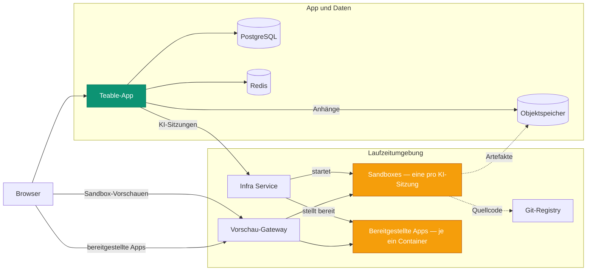

Durch das Self-hosting von Teable werden vier Plattformen in einer bereitgestellt:

- **Eine sichere, skalierbare Agenten-Sandbox** — jede KI-Sitzung wird in einem eigenen
  isolierten Container ausgeführt, bei Bedarf gestartet und nach Ende der Sitzung entfernt.
- **Eine ressourceneffiziente Plattform zur App-Bereitstellung** — jede App, die Ihr Team
  erstellt und veröffentlicht, wird in einem eigenen schlanken, langlebigen Container ausgeführt.
- **Eine KI-Workflow-Engine** — Automatisierungen, die durch Änderungen an Datensätzen,
  Zeitpläne und Webhooks ausgelöst werden, mit KI-Schritten, direkt dort ausgeführt, wo Ihre Daten liegen.
- **Eine umfassende Datenbank-Kollaborationsplattform auf PostgreSQL** — Tabellen,
  Ansichten und API.

Das Self-hosting von Teable bündelt Ihre eigene Rechenleistung in einer **agentenfähigen, vollständig
kontrollierten Produktivitätsumgebung** — und stellt KI allen Mitgliedern
Ihres Teams zur Verfügung.

Diese Seite erläutert die zugrunde liegenden Dienste und ihr Zusammenspiel. Die
bereitstellbaren Ressourcen (Compose-Dateien, Helm-Chart, Werte) befinden sich in
[teableio/teable-deployment](https://github.com/teableio/teable-deployment).

<Tip>KI-Funktionen sind ab dem Self-hosted-Business-Plan verfügbar.</Tip>

## Was bei einer Bereitstellung ausgeführt wird

| Dienst | Zweck |
|---|---|
| **Teable-App** | Web-UI, API, Automatisierungen, KI-Chat — ein einziges Image: `ghcr.io/teableio/teable` |
| **PostgreSQL** | Die Hauptdatenbank: alle Ihre Tabellen, Ansichten und Metadaten |
| **Redis** | Cache, Warteschlangen, Echtzeit-Zusammenarbeit |
| **Objektspeicher** | S3-kompatibler Dateispeicher mit drei Buckets: **public** (Avatare und andere öffentliche Ressourcen), **private** (Anhänge), **build artifacts** (App-Builder-Ausgabe) |
| **Infra Service** | Der einzige Einstiegspunkt, mit dem sich die Teable-App verbindet; koordiniert Builds und App-Bereitstellungen und verfügt über eine eigene Konsole und API |
| **Sandbox-Engine** | Führt jede KI-Sitzung in einem eigenen isolierten Container aus |
| **Git-Registry** | Speichert den Quellcode der Apps, die Sie erstellen (App Builder überträgt ihn hierher) |
| **Vorschau-Gateway** | Leitet Browser zu Sandbox-Vorschauen und bereitgestellten Apps weiter |

Die letzten vier bilden die Runtime-Ebene. Die Bereitstellungsressourcen installieren all
dies als eine Plattform.

## So passt alles zusammen

Die Teable-App kommuniziert über **eine Verbindung** mit der Runtime-Ebene: dem
Infra Service (`TEABLE_INFRA_API_URL` / `TEABLE_INFRA_API_KEY`). Alles
dahinter ist intern. Zwei Arten von Workloads erledigen die eigentliche Arbeit — und sie
beanspruchen Ihre Maschine:

- **Sandboxes.** Jeder KI-Chat bzw. jede App-Builder-Sitzung erhält einen eigenen isolierten
  Container, der beim Beginn der Sitzung gestartet und nach ihrem Ende entfernt wird. Dies
  ist die Hauptlast der Plattform und sie tritt schubweise auf: Dimensionieren Sie Ihre Maschine nach der
  **maximalen Anzahl gleichzeitiger KI-Sitzungen**, nicht nach der Benutzerzahl (Ressourcenlimits
  pro Sandbox können in der Systemverwaltung festgelegt werden).
- **Bereitgestellte Apps.** Jede App, die jemand veröffentlicht, wird in einem eigenen langlebigen
  Container ausgeführt, der unter `*.app.<domain>` bereitgestellt wird. Sandboxes kommen und gehen;
  bereitgestellte Apps summieren sich und laufen dauerhaft weiter.

Die anderen Dienste unterstützen dies: Das Erstellen erfolgt innerhalb der Sandbox der
Sitzung, die Git-Registry und der Objektspeicher bewahren die erzeugten Inhalte
(Quellcode und Build-Artefakte) auf, und das Gateway leitet jede Browseranfrage an
die richtige Sandbox oder App weiter.

## Eine Domain, vier DNS-Einträge

Alles wird unter **einer Basisdomain** bereitgestellt — typischerweise einer Ihrer
Subdomains, beispielsweise `teable.example.com`:

| Eintrag | Bereitgestellt |
|---|---|
| `<domain>` | Die Teable-App |
| `infra.<domain>` | Die Infra-Service-Konsole und API; Git (`/git`) und Objektspeicher werden ebenfalls über Pfade auf diesem Host bereitgestellt |
| `*.app.<domain>` | Apps, die Sie erstellt und bereitgestellt haben |
| `*.sandbox.<domain>` | Sandbox-Vorschauen im Browser |

Jeder Name ist lediglich ein Standardwert, und jeder Hostname kann individuell überschrieben
werden (siehe das Wertebeispiel im Bereitstellungs-Repository).

## Versionierung

Die Plattform wird als **Plattform-Releases** (`v<year>.<month>.<seq>`) des
Bereitstellungs-Repositorys veröffentlicht:

- Ein Release-**Tag** ist ein verifizierter Snapshot: `versions.yaml` fixiert die exakte
  Version jeder Komponente, und die `CHANGELOG.md` des Repositorys beschreibt, was sich
  geändert hat und was Sie gegebenenfalls tun müssen.
- Der Branch `main` des Repositorys ist die fortlaufend aktualisierte neueste Version.
- Das enthaltene **doctor**-Skript vergleicht, was Ihre Bereitstellung tatsächlich ausführt,
  mit dem Release und meldet eines von drei Ergebnissen: kompatibel, Teable-App aktualisieren
  oder eine unbekannte (nicht verifizierte) Kombination.

Die Teable-App hat eine eigene Release-Reihe (datumsbasierte Tags; `latest` ist der
stabile Kanal) — siehe [Versionsaktualisierung](/de/deploy/upgrade). Jedes Plattform-Release
nennt die App-Versionen, mit denen es verifiziert wurde, und doctor prüft dies für Sie. Der
Sandbox-Agent hinter den KI-Sitzungen folgt immer eigenständig der Version der App — es gibt
nichts Zusätzliches zu aktualisieren oder zu verwalten.

## Bereitstellen

Beide Wege installieren die gesamte Plattform und werden im Bereitstellungs-Repository
durchgängig beschrieben:

<CardGroup cols={2}>
  <Card title="Docker-Komplettlösung" icon="docker" href="https://github.com/teableio/teable-deployment/blob/main/docker/all-in-one/README.md">
    Alles auf einer Maschine — erste vollständige Bereitstellung, Modus `local` oder `server`.
  </Card>
  <Card title="Kubernetes (Helm)" icon="dharmachakra" href="https://github.com/teableio/teable-deployment/blob/main/helm/README.md">
    Ein einzelnes Helm-Chart auf einem vorhandenen Cluster; nur `global.baseDomain` ist erforderlich.
  </Card>
</CardGroup>

Sie benötigen noch keine KI? Sie können nur die App mit PostgreSQL, Redis und
Speicher — eine **eigenständige** Bereitstellung ([Docker-Bereitstellung](/de/deploy/docker)) — ausführen
und die Runtime-Ebene später mit Ihren vorhandenen Daten verbinden.

Verwandte Themen, die alle im Bereitstellungs-Repository gepflegt werden:

- **Teable eigenständig bereits im Einsatz?** Ihre Daten bleiben erhalten — die
  Runtime-Ebene wird daneben installiert: [Migrationsleitfaden](https://github.com/teableio/teable-deployment/blob/main/migration/2026-07-basic-to-full-featured.md)
- **Unternehmensinterne Zertifikate?** Wenn Ihre Domain eine private oder
  unternehmenseigene CA verwendet, müssen Sandboxes angewiesen werden, ihr zu vertrauen —
  [private-ca.md](https://github.com/teableio/teable-deployment/blob/main/helm/private-ca.md)
- **Dimensionierung, Versionen und Mirrors**: [VERSIONS.md](https://github.com/teableio/teable-deployment/blob/main/VERSIONS.md) ·
  [images/README.md](https://github.com/teableio/teable-deployment/blob/main/images/README.md)
- **Wenn etwas fehlschlägt**: Führen Sie zuerst doctor aus, anschließend
  [TROUBLESHOOTING.md](https://github.com/teableio/teable-deployment/blob/main/TROUBLESHOOTING.md)

Verbinden Sie die Teable-App nach der Bereitstellung über
`TEABLE_INFRA_API_URL` / `TEABLE_INFRA_API_KEY` mit der Runtime-Ebene (dies wird in den
Bereitstellungsanleitungen beschrieben), und legen Sie anschließend Ressourcenlimits in der
[Systemverwaltung → Sandbox-Agent](/de/basic/admin-panel/sandbox-agent) fest.
