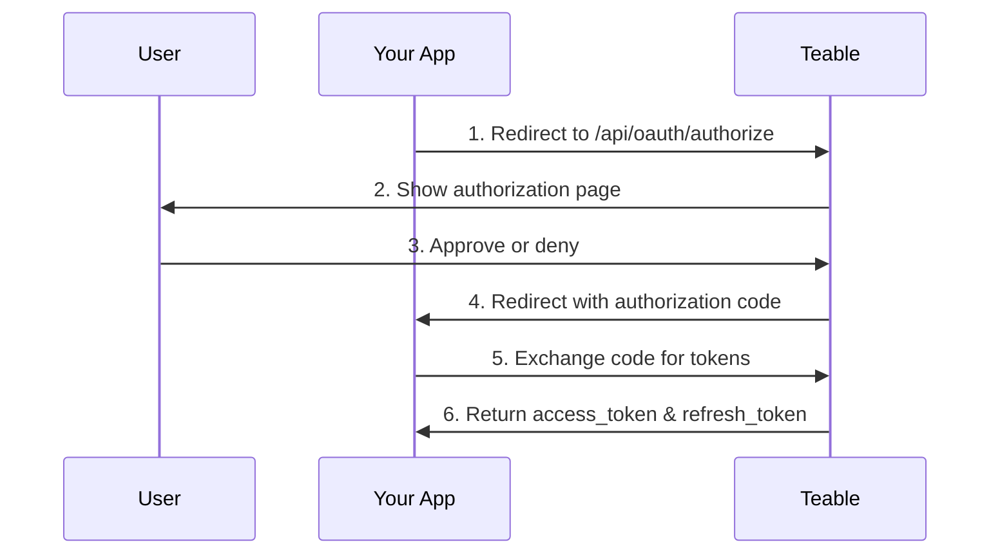

OAuth Apps allow third-party applications to access Teable on behalf of users. This guide explains how to create and configure an OAuth App, implement the OAuth 2.0 authorization flow, and use access tokens to interact with the Teable API.

## Creating an OAuth App

1. Go to [Settings > OAuth Apps](https://app.teable.ai/setting/oauth-app) in your Teable account.
2. Click **New OAuth Apps** to create a new application.
3. Fill in the required information:
   - **OAuth App name**: A descriptive name for your application
   - **Homepage URL**: The full URL to your application's website
   - **Callback URL**: The URL where users will be redirected after authorization
   - **Scopes**: The permissions your application needs

4. After creating the app, generate a **Client Secret**. Make sure to copy and store it securely - you won't be able to see it again.

<Note>You'll receive a **Client ID** and need to generate a **Client Secret**. Keep these credentials secure and never expose them in client-side code.</Note>

## Available Scopes

Scopes define what actions your OAuth App can perform. Available scopes are organized by resource type:

| Resource | Scopes |
|----------|--------|
| **Table** | `table\|create`, `table\|delete`, `table\|export`, `table\|import`, `table\|read`, `table\|update`, `table\|trash_read`, `table\|trash_update`, `table\|trash_reset` |
| **View** | `view\|create`, `view\|delete`, `view\|read`, `view\|update` |
| **Field** | `field\|create`, `field\|delete`, `field\|read`, `field\|update` |
| **Record** | `record\|comment`, `record\|create`, `record\|delete`, `record\|read`, `record\|update` |
| **Automation** | `automation\|create`, `automation\|delete`, `automation\|read`, `automation\|update` |
| **User** | `user\|email_read` |

<Tip>Request only the scopes your application actually needs. Users will see the requested permissions during authorization.</Tip>

## OAuth 2.0 Authorization Flow

Teable implements the standard OAuth 2.0 Authorization Code flow:



### Step 1: Redirect Users to Authorization

Direct users to the authorization endpoint with your application parameters:

```
GET https://app.teable.ai/api/oauth/authorize
```

**Query Parameters:**

| Parameter | Required | Description |
|-----------|----------|-------------|
| `response_type` | Yes | Must be `code` |
| `client_id` | Yes | Your OAuth App's Client ID |
| `redirect_uri` | No | Must match one of your registered callback URLs. If omitted, the first registered callback URL will be used |
| `scope` | No | Space-separated list of scopes. If omitted, uses scopes configured in your OAuth App |
| `state` | No | Random string to prevent CSRF attacks. Will be returned in the callback |

**Example:**

```
https://app.teable.ai/api/oauth/authorize?response_type=code&client_id=YOUR_CLIENT_ID&redirect_uri=https://yourapp.com/callback&scope=table|read%20record|read&state=random_state_string
```

### Step 2: User Authorization

Users will see an authorization page showing:
- Your application name and logo
- The requested permissions (scopes)
- Options to approve or deny access

If the user has previously authorized your app (within 7 days by default), they will be redirected immediately without seeing the authorization page again.

### Step 3: Handle the Callback

After the user approves (or denies), Teable redirects to your callback URL:

**On success:**
```
https://yourapp.com/callback?code=AUTHORIZATION_CODE&state=random_state_string
```

**On denial:**
```
https://yourapp.com/callback?error=access_denied&state=random_state_string
```

### Step 4: Exchange Code for Tokens

Exchange the authorization code for access and refresh tokens:

```
POST https://app.teable.ai/api/oauth/access_token
Content-Type: application/x-www-form-urlencoded
```

**Request Body:**

| Parameter | Required | Description |
|-----------|----------|-------------|
| `grant_type` | Yes | Must be `authorization_code` |
| `code` | Yes | The authorization code received |
| `client_id` | Yes | Your OAuth App's Client ID |
| `client_secret` | Yes | Your OAuth App's Client Secret |
| `redirect_uri` | No | Must match the redirect_uri used in authorization |

**Example Request:**

```bash
curl -X POST https://app.teable.ai/api/oauth/access_token \
  -H "Content-Type: application/x-www-form-urlencoded" \
  -d "grant_type=authorization_code" \
  -d "code=AUTHORIZATION_CODE" \
  -d "client_id=YOUR_CLIENT_ID" \
  -d "client_secret=YOUR_CLIENT_SECRET" \
  -d "redirect_uri=https://yourapp.com/callback"
```

**Response:**

```json
{
  "token_type": "Bearer",
  "access_token": "teable_xxxxxxxxxxxx",
  "refresh_token": "eyJhbGciOiJIUzI1NiIsInR5cCI6IkpXVCJ9...",
  "expires_in": 600,
  "refresh_expires_in": 2592000,
  "scopes": ["table|read", "record|read"]
}
```

| Field | Description |
|-------|-------------|
| `token_type` | Always `Bearer` |
| `access_token` | Token to use for API requests |
| `refresh_token` | Token to obtain new access tokens |
| `expires_in` | Access token lifetime in seconds (default: 600 = 10 minutes) |
| `refresh_expires_in` | Refresh token lifetime in seconds (default: 2592000 = 30 days) |
| `scopes` | Array of granted scopes |

## Using Access Tokens

Include the access token in the `Authorization` header for API requests:

```bash
curl https://app.teable.ai/api/table/TABLE_ID/record \
  -H "Authorization: Bearer YOUR_ACCESS_TOKEN"
```

## Refreshing Access Tokens

When an access token expires, use the refresh token to obtain a new one:

```
POST https://app.teable.ai/api/oauth/access_token
Content-Type: application/x-www-form-urlencoded
```

**Request Body:**

| Parameter | Required | Description |
|-----------|----------|-------------|
| `grant_type` | Yes | Must be `refresh_token` |
| `refresh_token` | Yes | Your current refresh token |
| `client_id` | Yes | Your OAuth App's Client ID |
| `client_secret` | Yes | Your OAuth App's Client Secret |

**Example Request:**

```bash
curl -X POST https://app.teable.ai/api/oauth/access_token \
  -H "Content-Type: application/x-www-form-urlencoded" \
  -d "grant_type=refresh_token" \
  -d "refresh_token=YOUR_REFRESH_TOKEN" \
  -d "client_id=YOUR_CLIENT_ID" \
  -d "client_secret=YOUR_CLIENT_SECRET"
```

<Warning>After refreshing, the previous refresh token becomes invalid. Always store the new refresh token from the response.</Warning>

## Revoking Access

### For OAuth App Owners

To revoke all tokens issued for a specific client, use the revoke endpoint:

```
POST https://app.teable.ai/api/oauth/client/{clientId}/revoke-token
```

This will invalidate all access tokens and refresh tokens for that OAuth App.

### For Users

Users can revoke access through their [Authorized Apps](https://app.teable.ai/setting/authorized-apps) settings page.

### For Applications

Applications can revoke their own access:

```
GET https://app.teable.ai/api/oauth/client/{clientId}/revoke-token
Authorization: Bearer YOUR_ACCESS_TOKEN
```

## Token Expiration

| Token Type | Default Expiration | Configurable Via |
|------------|-------------------|------------------|
| Authorization Code | 5 minutes | `BACKEND_OAUTH_CODE_EXPIRE_IN` |
| Access Token | 10 minutes | `BACKEND_OAUTH_ACCESS_TOKEN_EXPIRE_IN` |
| Refresh Token | 30 days | `BACKEND_OAUTH_REFRESH_TOKEN_EXPIRE_IN` |
| Authorization Memory | 7 days | `BACKEND_OAUTH_AUTHORIZED_EXPIRE_IN` |

## Error Handling

Common error responses:

| Error | Description |
|-------|-------------|
| `invalid_client` | Invalid Client ID or Client Secret |
| `invalid_grant` | Authorization code expired or already used |
| `invalid_scope` | Requested scope not allowed for this OAuth App |
| `access_denied` | User denied the authorization request |
| `redirect_uri_mismatch` | Redirect URI doesn't match registered URLs |

## Best Practices

1. **Store secrets securely**: Never expose your Client Secret in client-side code
2. **Use state parameter**: Always include a random `state` parameter to prevent CSRF attacks
3. **Request minimal scopes**: Only request permissions your application actually needs
4. **Handle token refresh**: Implement automatic token refresh before expiration
5. **Secure token storage**: Store access and refresh tokens securely on your server

