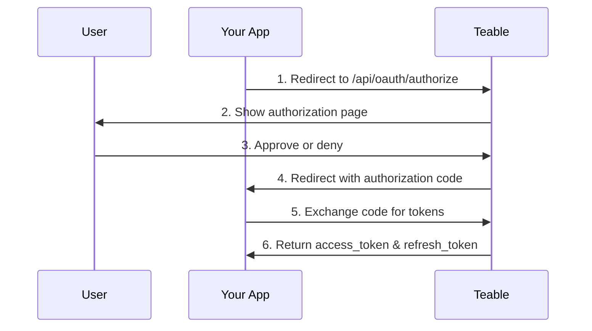

OAuth Apps allow third-party applications to access Teable on behalf of users. This guide explains how to create and configure an OAuth App, implement the OAuth 2.0 authorization flow, and use access tokens to interact with the Teable API.

Teable supports two OAuth 2.0 authorization modes:

- **Authorization Code + Client Secret**: For web applications with a backend server
- **Authorization Code + PKCE**: For native apps, CLI tools, SPAs, and other public clients that cannot securely store a client secret

## Creating an OAuth App

1. Go to [Settings > OAuth Apps](https://app.teable.ai/setting/oauth-app) in your Teable account.
2. Click **New OAuth Apps** to create a new application.
3. Fill in the required information:
   - **OAuth App name**: A descriptive name for your application
   - **Homepage URL**: The full URL to your application's website
   - **Callback URL**: The URL where users will be redirected after authorization
   - **Scopes**: The permissions your application needs

4. After creating the app, generate a **Client Secret**. Make sure to copy and store it securely - you won't be able to see it again.

<Note>You'll receive a **Client ID** and need to generate a **Client Secret**. Keep these credentials secure and never expose them in client-side code. If using the PKCE flow, a client secret is not required.</Note>

## Available Scopes

Scopes define what actions your OAuth App can perform. Available scopes are organized by resource type:

| Resource | Scopes |
|----------|--------|
| **App** | `app\|create`, `app\|read`, `app\|update`, `app\|delete` |
| **Base** | `base\|read`, `base\|read_all`, `base\|update`, `base\|table_import`, `base\|table_export`, `base\|query_data` |
| **Table** | `table\|create`, `table\|delete`, `table\|export`, `table\|import`, `table\|read`, `table\|update`, `table\|trash_read`, `table\|trash_update`, `table\|trash_reset` |
| **View** | `view\|create`, `view\|delete`, `view\|read`, `view\|update` |
| **Field** | `field\|create`, `field\|delete`, `field\|read`, `field\|update` |
| **Record** | `record\|comment`, `record\|create`, `record\|delete`, `record\|read`, `record\|update` |
| **Automation** | `automation\|create`, `automation\|delete`, `automation\|read`, `automation\|update` |
| **User** | `user\|email_read`, `user\|integrations` |

<Tip>Request only the scopes your application actually needs. Users will see the requested permissions during authorization.</Tip>

## OAuth 2.0 Authorization Code Flow

Teable implements the standard OAuth 2.0 Authorization Code flow:


```mermaid
sequenceDiagram
    participant User
    participant App as Your App
    participant Teable

    App->>Teable: 1. Redirect to /api/oauth/authorize
    Teable->>User: 2. Show authorization page
    User->>Teable: 3. Approve or deny
    Teable->>App: 4. Redirect with authorization code
    App->>Teable: 5. Exchange code for tokens
    Teable->>App: 6. Return access_token & refresh_token
```

### Step 1: Redirect Users to Authorization

Direct users to the authorization endpoint with your application parameters:

```
GET https://app.teable.ai/api/oauth/authorize
```

**Query Parameters:**

| Parameter | Required | Description |
|-----------|----------|-------------|
| `response_type` | Yes | Must be `code` |
| `client_id` | Yes | Your OAuth App's Client ID |
| `redirect_uri` | No | Must match one of your registered callback URLs. If omitted, the first registered callback URL will be used |
| `scope` | No | Space-separated list of scopes. If omitted, uses scopes configured in your OAuth App |
| `state` | No | Random string to prevent CSRF attacks. Will be returned in the callback |

**Example:**

```
https://app.teable.ai/api/oauth/authorize?response_type=code&client_id=YOUR_CLIENT_ID&redirect_uri=https://yourapp.com/callback&scope=table|read%20record|read&state=random_state_string
```

### Step 2: User Authorization

Users will see an authorization page showing:
- Your application name and logo
- The requested permissions (scopes)
- Options to approve or deny access

If the user has previously authorized your app (within 7 days by default), they will be redirected immediately without seeing the authorization page again.

### Step 3: Handle the Callback

After the user approves (or denies), Teable redirects to your callback URL:

**On success:**
```
https://yourapp.com/callback?code=AUTHORIZATION_CODE&state=random_state_string
```

**On denial:**
```
https://yourapp.com/callback?error=access_denied&state=random_state_string
```

### Step 4: Exchange Code for Tokens

Exchange the authorization code for access and refresh tokens:

```
POST https://app.teable.ai/api/oauth/access_token
Content-Type: application/x-www-form-urlencoded
```

**Request Body:**

| Parameter | Required | Description |
|-----------|----------|-------------|
| `grant_type` | Yes | Must be `authorization_code` |
| `code` | Yes | The authorization code received |
| `client_id` | Yes | Your OAuth App's Client ID |
| `client_secret` | Yes | Your OAuth App's Client Secret |
| `redirect_uri` | Yes | Must exactly match the redirect_uri used in authorization |

**Example Request:**

```bash
curl -X POST https://app.teable.ai/api/oauth/access_token \
  -H "Content-Type: application/x-www-form-urlencoded" \
  -d "grant_type=authorization_code" \
  -d "code=AUTHORIZATION_CODE" \
  -d "client_id=YOUR_CLIENT_ID" \
  -d "client_secret=YOUR_CLIENT_SECRET" \
  -d "redirect_uri=https://yourapp.com/callback"
```

**Response:**

```json
{
  "token_type": "Bearer",
  "access_token": "teable_xxxxxxxxxxxx",
  "refresh_token": "eyJhbGciOiJIUzI1NiIsInR5cCI6IkpXVCJ9...",
  "expires_in": 600,
  "refresh_expires_in": 2592000,
  "scopes": ["table|read", "record|read"]
}
```

| Field | Description |
|-------|-------------|
| `token_type` | Always `Bearer` |
| `access_token` | Token to use for API requests |
| `refresh_token` | Token to obtain new access tokens |
| `expires_in` | Access token lifetime in seconds (default: 600 = 10 minutes) |
| `refresh_expires_in` | Refresh token lifetime in seconds (default: 2592000 = 30 days) |
| `scopes` | Array of granted scopes |

## PKCE Authorization Flow

PKCE (Proof Key for Code Exchange) is designed for applications that cannot securely store a client secret, such as native desktop apps, mobile apps, CLI tools, or single-page applications.

### Step 1: Generate PKCE Parameters

Before initiating authorization, the client needs to generate a pair of PKCE parameters:

```javascript
// Generate code_verifier (43-128 character random string)
const codeVerifier = generateRandomString(43);

// Generate code_challenge = BASE64URL(SHA256(code_verifier))
const encoder = new TextEncoder();
const data = encoder.encode(codeVerifier);
const digest = await crypto.subtle.digest('SHA-256', data);
const codeChallenge = btoa(String.fromCharCode(...new Uint8Array(digest)))
  .replace(/\+/g, '-').replace(/\//g, '_').replace(/=+$/, '');
```

### Step 2: Redirect Users to Authorization

```
GET https://app.teable.ai/api/oauth/authorize
```

**Query Parameters:**

| Parameter | Required | Description |
|-----------|----------|-------------|
| `response_type` | Yes | Must be `code` |
| `client_id` | Yes | Your OAuth App's Client ID |
| `redirect_uri` | No | Callback URL. PKCE mode supports loopback addresses |
| `scope` | No | Space-separated list of scopes |
| `state` | No | Random string to prevent CSRF attacks |
| `code_challenge` | Yes | SHA-256 hash of the code_verifier (Base64URL encoded) |
| `code_challenge_method` | Yes | Must be `S256` |

**Example:**

```
https://app.teable.ai/api/oauth/authorize?response_type=code&client_id=YOUR_CLIENT_ID&redirect_uri=http://127.0.0.1:8080/callback&code_challenge=YOUR_CODE_CHALLENGE&code_challenge_method=S256&state=random_state_string
```

<Tip>In PKCE mode, `redirect_uri` supports loopback addresses (`http://127.0.0.1`, `http://[::1]`, `http://localhost`) with flexible port matching - you don't need to register each port exactly.</Tip>

### Step 3: Handle the Callback

Same as the standard authorization code flow - after user approval, the authorization code is returned via redirect.

### Step 4: Exchange Code + code_verifier for Tokens

```
POST https://app.teable.ai/api/oauth/access_token
Content-Type: application/x-www-form-urlencoded
```

**Request Body:**

| Parameter | Required | Description |
|-----------|----------|-------------|
| `grant_type` | Yes | Must be `authorization_code` |
| `code` | Yes | The authorization code received |
| `client_id` | Yes | Your OAuth App's Client ID |
| `code_verifier` | Yes | The original random string generated in Step 1 |
| `redirect_uri` | Yes | Must exactly match the redirect_uri used in authorization |

<Note>PKCE mode does not require `client_secret`. The `code_verifier` is used instead to verify the client's identity.</Note>

**Example Request:**

```bash
curl -X POST https://app.teable.ai/api/oauth/access_token \
  -H "Content-Type: application/x-www-form-urlencoded" \
  -d "grant_type=authorization_code" \
  -d "code=AUTHORIZATION_CODE" \
  -d "client_id=YOUR_CLIENT_ID" \
  -d "code_verifier=YOUR_CODE_VERIFIER" \
  -d "redirect_uri=http://127.0.0.1:8080/callback"
```

The response format is the same as the standard authorization code flow.

## Using Access Tokens

Include the access token in the `Authorization` header for API requests:

```bash
curl https://app.teable.ai/api/table/TABLE_ID/record \
  -H "Authorization: Bearer YOUR_ACCESS_TOKEN"
```

Typically, the first step after obtaining a token is to retrieve all Bases accessible to the current user:

```bash
curl https://app.teable.ai/api/base/access/all \
  -H "Authorization: Bearer YOUR_ACCESS_TOKEN"
```

This endpoint returns all Bases the current user has permission to access. You can use the `baseId` from the response for subsequent API calls.

## Refreshing Access Tokens

When an access token expires, use the refresh token to obtain a new one:

```
POST https://app.teable.ai/api/oauth/access_token
Content-Type: application/x-www-form-urlencoded
```

**Request Body:**

| Parameter | Required | Description |
|-----------|----------|-------------|
| `grant_type` | Yes | Must be `refresh_token` |
| `refresh_token` | Yes | Your current refresh token |
| `client_id` | Yes | Your OAuth App's Client ID |
| `client_secret` | Conditional | Required for standard authorization code mode, not needed for PKCE mode |

**Example Request:**

```bash
curl -X POST https://app.teable.ai/api/oauth/access_token \
  -H "Content-Type: application/x-www-form-urlencoded" \
  -d "grant_type=refresh_token" \
  -d "refresh_token=YOUR_REFRESH_TOKEN" \
  -d "client_id=YOUR_CLIENT_ID" \
  -d "client_secret=YOUR_CLIENT_SECRET"
```

<Warning>After refreshing, the previous refresh token becomes invalid (Refresh Token Rotation). Always store the new refresh token from the response.</Warning>

## Revoking Access

### For OAuth App Owners

Revoke the app's access for **all users** (only the app creator can do this):

```
POST https://app.teable.ai/api/oauth/client/{clientId}/revoke-access
```

This deletes all users' authorization records and tokens, completely preventing the app from accessing any user's data.

### For Users

Revoke **your own** authorization for a specific app:

```
POST https://app.teable.ai/api/oauth/client/{clientId}/revoke-token
```

This only invalidates the current user's access tokens and refresh tokens, without affecting other users.

Users can also revoke access through their [Authorized Apps](https://app.teable.ai/setting/authorized-apps) settings page.

### For Applications

Applications can revoke their own access using an Access Token:

```
GET https://app.teable.ai/api/oauth/client/{clientId}/revoke-token
Authorization: Bearer YOUR_ACCESS_TOKEN
```

<Note>This endpoint only accepts Access Token authentication, not session authentication.</Note>

## Token Expiration

| Token Type | Default Expiration | Configurable Via |
|------------|-------------------|------------------|
| Authorization Code | 5 minutes | `BACKEND_OAUTH_CODE_EXPIRE_IN` |
| Access Token | 10 minutes | `BACKEND_OAUTH_ACCESS_TOKEN_EXPIRE_IN` |
| Refresh Token | 30 days | `BACKEND_OAUTH_REFRESH_TOKEN_EXPIRE_IN` |
| Authorization Memory | 7 days | `BACKEND_OAUTH_AUTHORIZED_EXPIRE_IN` |

## Error Handling

Common error responses:

| Error | Description |
|-------|-------------|
| `invalid_client` | Invalid Client ID or Client Secret |
| `invalid_grant` | Authorization code expired or already used |
| `invalid_scope` | Requested scope not allowed for this OAuth App |
| `access_denied` | User denied the authorization request |
| `redirect_uri_mismatch` | Redirect URI doesn't match registered URLs |
| `too_many_requests` | Token request rate limit exceeded (default: 30 per 15 minutes) |

## Best Practices

1. **Choose the right mode**: Use client secret mode for web apps with a backend, PKCE mode for native apps/CLI/SPA
2. **Store secrets securely**: Never expose your Client Secret in client-side code
3. **Use state parameter**: Always include a random `state` parameter to prevent CSRF attacks
4. **Request minimal scopes**: Only request permissions your application actually needs
5. **Handle token refresh**: Implement automatic token refresh before expiration
6. **Secure token storage**: Store access and refresh tokens securely on your server

## Complete Examples

### Node.js (Authorization Code + Client Secret)

```javascript
const express = require('express');
const crypto = require('crypto');
const app = express();

const CLIENT_ID = 'your_client_id';
const CLIENT_SECRET = 'your_client_secret';
const REDIRECT_URI = 'http://localhost:3000/callback';
const TEABLE_URL = 'https://app.teable.ai';

// Step 1: Redirect user to authorization
app.get('/login', (req, res) => {
  const state = crypto.randomBytes(16).toString('hex');
  req.session.oauthState = state; // Store state in session
  const authUrl = `${TEABLE_URL}/api/oauth/authorize?` +
    `response_type=code&` +
    `client_id=${CLIENT_ID}&` +
    `redirect_uri=${encodeURIComponent(REDIRECT_URI)}&` +
    `scope=${encodeURIComponent('record|read table|read')}&` +
    `state=${state}`;
  res.redirect(authUrl);
});

// Step 2: Handle callback and exchange code for tokens
app.get('/callback', async (req, res) => {
  const { code, state } = req.query;

  // Verify state to prevent CSRF
  if (state !== req.session.oauthState) {
    return res.status(403).send('Invalid state');
  }

  const response = await fetch(`${TEABLE_URL}/api/oauth/access_token`, {
    method: 'POST',
    headers: { 'Content-Type': 'application/x-www-form-urlencoded' },
    body: new URLSearchParams({
      grant_type: 'authorization_code',
      client_id: CLIENT_ID,
      client_secret: CLIENT_SECRET,
      code,
      redirect_uri: REDIRECT_URI,
    }),
  });

  const tokens = await response.json();
  // tokens.access_token — use for API calls
  // tokens.refresh_token — use to refresh tokens
  res.json({ success: true, scopes: tokens.scopes });
});

app.listen(3000);
```

### Python (PKCE Mode for CLI Tools)

```python
import hashlib
import base64
import secrets
import http.server
import urllib.parse
import requests

CLIENT_ID = 'your_client_id'
TEABLE_URL = 'https://app.teable.ai'
PORT = 8080
REDIRECT_URI = f'http://127.0.0.1:{PORT}/callback'

# Step 1: Generate PKCE parameters
code_verifier = secrets.token_urlsafe(32)  # 43 characters
code_challenge = base64.urlsafe_b64encode(
    hashlib.sha256(code_verifier.encode()).digest()
).rstrip(b'=').decode()

# Step 2: Build authorization URL (open in browser)
auth_url = (
    f"{TEABLE_URL}/api/oauth/authorize?"
    f"response_type=code&"
    f"client_id={CLIENT_ID}&"
    f"redirect_uri={urllib.parse.quote(REDIRECT_URI)}&"
    f"code_challenge={code_challenge}&"
    f"code_challenge_method=S256"
)
print(f"Open in your browser:\n{auth_url}")

# Step 3: Start local server to receive callback
authorization_code = None

class CallbackHandler(http.server.BaseHTTPRequestHandler):
    def do_GET(self):
        global authorization_code
        query = urllib.parse.urlparse(self.path).query
        params = urllib.parse.parse_qs(query)
        authorization_code = params.get('code', [None])[0]
        self.send_response(200)
        self.end_headers()
        self.wfile.write(b'Authorization successful! You can close this page.')

    def log_message(self, format, *args):
        pass  # Silence logs

server = http.server.HTTPServer(('127.0.0.1', PORT), CallbackHandler)
server.handle_request()  # Handle single request

# Step 4: Exchange code + code_verifier for tokens
response = requests.post(f"{TEABLE_URL}/api/oauth/access_token", data={
    'grant_type': 'authorization_code',
    'client_id': CLIENT_ID,
    'code': authorization_code,
    'redirect_uri': REDIRECT_URI,
    'code_verifier': code_verifier,
})

tokens = response.json()
print(f"Access Token: {tokens['access_token']}")
print(f"Expires in: {tokens['expires_in']}s")
```
