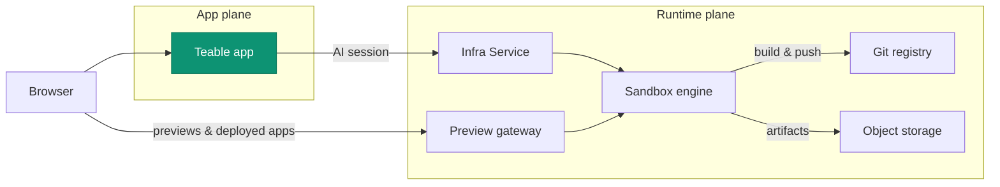

<Tip>Available for self-hosted Business plan and above</Tip>

Teable's AI features — **AI Chat**, **App Builder**, and **app deployments** —
run on a dedicated **runtime plane** that you self-host next to the Teable app.
This page explains the architecture. The deployable assets (compose files, Helm
chart, values) live in
[teableio/teable-deployment](https://github.com/teableio/teable-deployment) and
are the single source of truth — nothing on this page needs to be copied.

## Two planes

A full-featured deployment is two planes working together:

| Plane | What runs there |
|---|---|
| **App plane** | The Teable app itself, with its PostgreSQL and Redis |
| **Runtime plane** | Everything that powers the AI features (below) |

The runtime plane consists of five services:

| Service | Purpose |
|---|---|
| **Sandbox engine** | Runs every AI session inside an isolated sandbox container |
| **Infra Service** | Console + API the Teable app talks to; orchestrates builds and app deployments |
| **Git registry** | Source of truth for the apps you build (App Builder pushes here) |
| **Object storage** | Attachments and build artifacts (S3-compatible) |
| **Preview gateway** | Serves sandbox previews and deployed apps in the browser |

An AI chat session runs inside a sandbox; App Builder builds inside the same
sandbox, pushes source to the git registry, stores the build artifact in object
storage, and the deployed app is served through the gateway.

## One domain, four DNS records

Everything hangs off **one base domain** — typically a subdomain of yours, such
as `teable.example.com`:

| Record | Serves |
|---|---|
| `<domain>` | The Teable app |
| `infra.<domain>` | Infra console + API — git (`/git`) and object storage (bucket paths) ride this host as paths |
| `*.app.<domain>` | Apps you built and deployed |
| `*.sandbox.<domain>` | Sandbox previews in the browser |

Each name is only a default; every hostname can be overridden individually
(see the values example in the deployment repository).

## How the agent stays in sync with the app

The sandbox agent image is configured as a **prefix without a tag**. The Teable
app appends **its own release tag** when launching AI sessions, so the agent
always matches the app version — and the app preheats that exact image through
the Infra Service, so the first session doesn't wait on a multi-gigabyte pull.
You never pull or pin the agent manually.

## Versioning

The runtime plane ships as **platform releases** (`v<year>.<month>.<seq>`) of
the deployment repository:

- A **tag** is a verified snapshot: `versions.yaml` pins every component image
  (with digests), and the repository's `CHANGELOG.md` says what changed and
  what, if anything, you must do.
- The repository's `main` is the rolling latest.
- The bundled **doctor** scripts compare what your deployment actually runs
  against the release manifest and report one of three states: compatible,
  upgrade the Teable app, or an unknown (unverified) combination.

The Teable app has its own release line (date-based tags; `latest` is the
stable channel) — see [Version Upgrade](/en/deploy/upgrade). Platform releases
declare the app compatibility window; the doctor checks it for you.

## Deploy it

Both paths install the same platform and are covered end to end in the
deployment repository:

<CardGroup cols={2}>
  <Card title="Docker all-in-one" icon="docker" href="https://github.com/teableio/teable-deployment/blob/main/docker/all-in-one/README.md">
    Everything on one machine — first full deployment, `local` or `server` mode.
  </Card>
  <Card title="Kubernetes (Helm)" icon="dharmachakra" href="https://github.com/teableio/teable-deployment/blob/main/helm/README.md">
    One umbrella chart on an existing cluster; only `global.baseDomain` is required.
  </Card>
</CardGroup>

Related topics, all maintained in the deployment repository:

- **Already running standalone Teable?** Your data stays in place — the runtime
  plane attaches next to it: [migration guide](https://github.com/teableio/teable-deployment/blob/main/migration/2026-07-basic-to-full-featured.md)
- **Private / corporate CA**: sandboxes must trust the CA your entry serves —
  [private-ca.md](https://github.com/teableio/teable-deployment/blob/main/helm/private-ca.md)
- **Sizing, versions and mirrors**: [VERSIONS.md](https://github.com/teableio/teable-deployment/blob/main/VERSIONS.md) ·
  [images/README.md](https://github.com/teableio/teable-deployment/blob/main/images/README.md)
- **When something fails**: run the doctor first, then
  [TROUBLESHOOTING.md](https://github.com/teableio/teable-deployment/blob/main/TROUBLESHOOTING.md)

After deploying, connect your Teable app to the runtime plane with
`TEABLE_INFRA_API_URL` / `TEABLE_INFRA_API_KEY` (the deployment guides cover
this), then configure limits in
[Admin Panel → Sandbox Agent](/en/basic/admin-panel/sandbox-agent).
