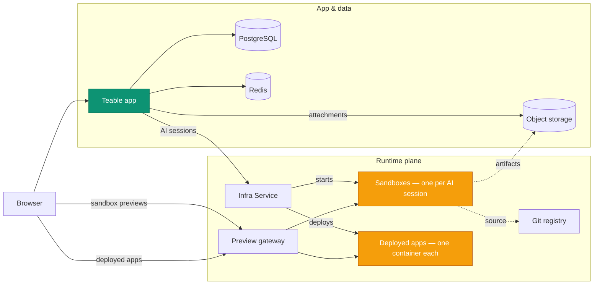

Self-hosting Teable deploys four platforms in one:

- **A secure, scalable agent sandbox** — every AI session runs in its own
  isolated container, started on demand and gone when the session ends.
- **A resource-efficient app deployment platform** — every app your team
  builds and publishes runs as its own lightweight, long-lived container.
- **An AI workflow engine** — automations triggered by record changes,
  schedules, and webhooks, with AI steps, running right where your data lives.
- **A full-featured database collaboration platform on PostgreSQL** — tables,
  views, and API.

Self-hosting Teable wraps your own compute into an **agent-ready, fully
controlled productivity environment** — putting AI in the hands of everyone
on your team.

This page explains the services behind this and how they fit together. The
deployable assets (compose files, Helm chart, values) live in
[teableio/teable-deployment](https://github.com/teableio/teable-deployment) and
are the single source of truth — nothing on this page needs to be copied.

<Tip>AI features are available for self-hosted Business plan and above.</Tip>

## What a deployment runs

| Service | Purpose |
|---|---|
| **Teable app** | Web UI, API, automations, AI chat — a single image: `ghcr.io/teableio/teable` |
| **PostgreSQL** | The main database: all your tables, views, and metadata |
| **Redis** | Cache, queues, realtime collaboration |
| **Object storage** | S3-compatible file storage with three buckets: **public** (avatars and other public assets), **private** (attachments), **build artifacts** (App Builder output) |
| **Infra Service** | The single entry point the Teable app connects to; coordinates builds and app deployments, with its own console and API |
| **Sandbox engine** | Runs every AI session in its own isolated container |
| **Git registry** | Stores the source code of the apps you build (App Builder pushes here) |
| **Preview gateway** | Routes browsers to sandbox previews and deployed apps |

The last four make up the runtime plane. The deployment assets install all of
this as one platform.

## How it fits together

```mermaid
graph LR
    U["Browser"]
    subgraph "App & data"
        T["Teable app"]
        P[("PostgreSQL")]
        R[("Redis")]
        S[("Object storage")]
    end
    subgraph "Runtime plane"
        I["Infra Service"]
        E["Sandboxes — one per AI session"]
        A["Deployed apps — one container each"]
        G["Git registry"]
        W["Preview gateway"]
    end
    U --> T
    T --> P
    T --> R
    T -- "attachments" --> S
    T -- "AI sessions" --> I
    I -- "starts" --> E
    I -- "deploys" --> A
    E -. "source" .-> G
    E -. "artifacts" .-> S
    U -- "sandbox previews" --> W
    U -- "deployed apps" --> W
    W --> E
    W --> A

    style T fill:#0D9373,stroke:#0a7a5e,color:#fff
    style E fill:#F59E0B,stroke:#b45309,color:#fff
    style A fill:#F59E0B,stroke:#b45309,color:#fff
```

The Teable app talks to the runtime plane through **one connection**: the
Infra Service (`TEABLE_INFRA_API_URL` / `TEABLE_INFRA_API_KEY`). Everything
behind it is internal. Two kinds of workload do the real work — and they are
what consume your machine:

- **Sandboxes.** Every AI chat or App Builder session gets its own isolated
  container, started when the session begins and removed when it ends. This
  is the platform's main load, and it arrives in bursts: size your machine by
  **peak concurrent AI sessions**, not by user count (per-sandbox resource
  limits can be set in the admin panel).
- **Deployed apps.** Every app someone publishes runs as its own long-lived
  container, served at `*.app.<domain>`. Sandboxes come and go; deployed apps
  add up and keep running.

The other services play supporting roles: building happens inside the
session's sandbox, the git registry and object storage keep what it produces
(source code and build artifacts), and the gateway routes each browser
request to the right sandbox or app.

## One domain, four DNS records

Everything is served under **one base domain** — typically a subdomain of
yours, such as `teable.example.com`:

| Record | Serves |
|---|---|
| `<domain>` | The Teable app |
| `infra.<domain>` | The Infra Service console and API; git (`/git`) and object storage are also served from paths on this host |
| `*.app.<domain>` | Apps you built and deployed |
| `*.sandbox.<domain>` | Sandbox previews in the browser |

Each name is only a default, and every hostname can be overridden individually
(see the values example in the deployment repository).

## Versioning

The platform ships as **platform releases** (`v<year>.<month>.<seq>`) of the
deployment repository:

- A release **tag** is a verified snapshot: `versions.yaml` locks the exact
  version of every component, and the repository's `CHANGELOG.md` says what
  changed and what, if anything, you must do.
- The repository's `main` branch is the rolling latest.
- The bundled **doctor** script compares what your deployment actually runs
  against the release and reports one of three results: compatible, upgrade
  the Teable app, or an unknown (unverified) combination.

The Teable app has its own release line (date-based tags; `latest` is the
stable channel) — see [Version Upgrade](/en/deploy/upgrade). Each platform
release states which app versions it has been verified with, and the doctor
checks this for you. The sandbox agent behind AI sessions always follows the
app's version on its own — there is nothing extra to upgrade or manage.

## Deploy it

Both paths install the whole platform and are covered end to end in the
deployment repository:

<CardGroup cols={2}>
  <Card title="Docker all-in-one" icon="docker" href="https://github.com/teableio/teable-deployment/blob/main/docker/all-in-one/README.md">
    Everything on one machine — first full deployment, `local` or `server` mode.
  </Card>
  <Card title="Kubernetes (Helm)" icon="dharmachakra" href="https://github.com/teableio/teable-deployment/blob/main/helm/README.md">
    A single Helm chart on an existing cluster; only `global.baseDomain` is required.
  </Card>
</CardGroup>

Don't need AI yet? You can run just the app with PostgreSQL, Redis, and
storage — a **standalone** deployment ([Docker Deployment](/en/deploy/docker))
— and attach the runtime plane later with your data in place.

Related topics, all maintained in the deployment repository:

- **Already running standalone Teable?** Your data stays in place — the
  runtime plane installs next to it: [migration guide](https://github.com/teableio/teable-deployment/blob/main/migration/2026-07-basic-to-full-featured.md)
- **Company-internal certificates?** If your domain uses a private or
  corporate CA, sandboxes need to be told to trust it —
  [private-ca.md](https://github.com/teableio/teable-deployment/blob/main/helm/private-ca.md)
- **Sizing, versions and mirrors**: [VERSIONS.md](https://github.com/teableio/teable-deployment/blob/main/VERSIONS.md) ·
  [images/README.md](https://github.com/teableio/teable-deployment/blob/main/images/README.md)
- **When something fails**: run the doctor first, then
  [TROUBLESHOOTING.md](https://github.com/teableio/teable-deployment/blob/main/TROUBLESHOOTING.md)

After deploying, connect the Teable app to the runtime plane with
`TEABLE_INFRA_API_URL` / `TEABLE_INFRA_API_KEY` (the deployment guides cover
this), then set resource limits in
[Admin Panel → Sandbox Agent](/en/basic/admin-panel/sandbox-agent).
