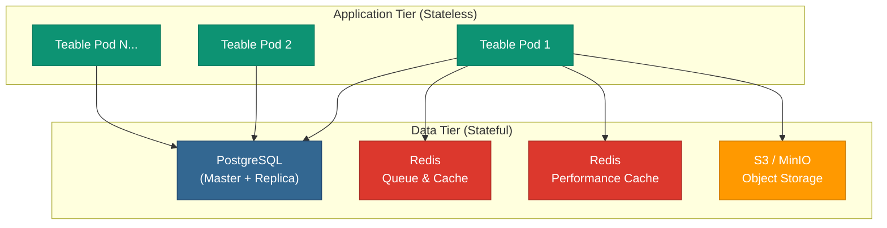

<Callout type="info">
**Recommended for:** Production deployments with 50+ users
</Callout>

## Architecture Overview

Teable uses a **stateless application tier** with externalized state services. This design enables horizontal scaling and high availability.

### Components

| Component | Purpose | Managed Service Examples |
|-----------|---------|-------------------------|
| **Teable App** | Stateless web application | K8s, AWS ECS, Azure App Service, GCP Cloud Run |
| **PostgreSQL** | Primary data storage | AWS RDS, Azure PostgreSQL, Google Cloud SQL |
| **Redis (Queue)** | Background jobs & cache | ElastiCache, Azure Cache, Memorystore |
| **Redis (Perf)** | Performance cache for reads | Same or separate Redis instance |
| **Object Storage** | Files & attachments | AWS S3, MinIO, any S3-compatible |

<Note>
**Key insight**: The Teable application holds no persistent state. You can scale horizontally by adding pods, and any pod can handle any request.
</Note>

---

## Resource Recommendations

<Warning>
These are **production** recommendations from the Teable engineering team. For evaluation/testing, see [Docker Quick Start](/en/deploy/docker).
</Warning>

### Application Tier (Teable Pods)

| Setting | Recommended Value |
|---------|-------------------|
| CPU per pod | 2 vCPU |
| Memory per pod | 4 GB |
| Minimum replicas | 2 |
| Auto-scale trigger | 50% CPU utilization |

<Tip>
Use Kubernetes with Horizontal Pod Autoscaler (HPA), or equivalent auto-scaling on AWS ECS / Azure App Service / GCP Cloud Run.
</Tip>

### Database (PostgreSQL)

| Setting | Recommended Value |
|---------|-------------------|
| CPU | 4 vCPU |
| Memory | 16 GB |
| Topology | 1 Master + 1 Replica |
| Backup | Daily automated |
| Version | 15+ recommended |

<Warning>
Always deploy with a replica for high availability. Use managed database services for automatic failover.
</Warning>

### Cache (Redis)

Teable uses **two separate Redis instances** for different purposes:

| Purpose | Environment Variable | CPU | Memory |
|---------|---------------------|-----|--------|
| Queue & Cache | `BACKEND_CACHE_REDIS_URI` | 1 vCPU | 2 GB |
| Performance Cache | `BACKEND_PERFORMANCE_CACHE` | 2 vCPU | 4 GB |

<Note>
The Performance Cache (`BACKEND_PERFORMANCE_CACHE`) is optional but **strongly recommended** for multi-user collaboration. It significantly improves read performance in busy workspaces.
</Note>

### Object Storage

- **Type**: S3-compatible (AWS S3, MinIO, etc.)
- **Buckets**: 2 required (public + private)
- **Capacity**: Scales automatically with managed S3

See [Object Storage Guide](/en/deploy/storage) for bucket configuration details.

---

## Scaling Strategy

| Component | Scaling Type | When to Scale |
|-----------|--------------|---------------|
| Teable App | **Automatic** (horizontal) | CPU > 50% (add pods) |
| PostgreSQL | **Manual** (vertical) | CPU > 70% sustained |
| Redis | **Manual** (vertical) | Memory > 80% or CPU > 60% |

<Accordion title="Why two scaling approaches?">
**Application tier**: Stateless design allows automatic horizontal scaling. Kubernetes HPA or cloud auto-scaling handles this automatically based on CPU metrics.

**Database & Redis**: These are stateful services where vertical scaling (bigger instance) is simpler and safer than horizontal scaling. Monitor metrics and resize when thresholds are exceeded.
</Accordion>

---

## Minimum vs. Production Comparison

| | Minimum (PoC) | Production |
|---|---------------|------------|
| Teable App | 1 instance, 2c4g | 2+ pods, 2c4g each, auto-scaling |
| PostgreSQL | 2c4g, single instance | 4c16g, 1 master + 1 replica |
| Redis | 1 instance, 1c2g | 2 instances (queue + performance) |
| Storage | S3-compatible object storage | S3-compatible object storage |
| Availability | None (single point of failure) | High availability with redundancy |

<Warning>
The "Minimum" setup is for **evaluation only**. It has no redundancy—data loss is possible if the server fails.
</Warning>

---

## Next Steps: Choose Your Platform

<CardGroup cols={2}>
  <Card title="Kubernetes" icon="dharmachakra" href="/en/deploy/k8s">
    Deploy on any K8s cluster with full control over infrastructure.
  </Card>
  <Card title="AWS" icon="aws" href="/en/deploy/aws">
    ECS + RDS + ElastiCache + S3. Recommended for 50+ users.
  </Card>
  <Card title="Azure" icon="microsoft" href="/en/deploy/azure">
    App Service + PostgreSQL + Redis + S3-compatible storage.
  </Card>
  <Card title="Google Cloud" icon="google" href="/en/deploy/gcp">
    Cloud Run + Cloud SQL + Memorystore + Cloud Storage.
  </Card>
</CardGroup>

---

## Related Documentation

- [Environment Variables Reference](/en/deploy/env) — All configuration options
- [Object Storage Setup](/en/deploy/storage) — S3 bucket configuration
- [License Activation](/en/deploy/activate) — Activate your self-hosted license
