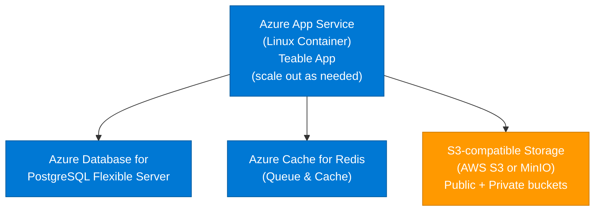

<Callout type="info">
**Recommended for:** Production deployments with 50-500 users
</Callout>

## Architecture overview



<Note>
**Important**: Teable requires **S3-compatible storage**. You can use:
- **AWS S3** (cross-cloud setup)
- **MinIO** (self-hosted on Azure VM/AKS)
- Any other S3-compatible service

Azure Blob Storage is **not** directly supported because it uses a different API.
</Note>

## Prerequisites

- Azure CLI installed and logged in
- Azure subscription with permissions for App Service, PostgreSQL, Redis
- Access to an **S3-compatible storage** (e.g., AWS S3 account, or MinIO deployment)

---

## Step 1: Create Azure resources

### 1.1 Create resource group

```bash
az group create \
  --name teable-rg \
  --location eastus
```

### 1.2 Create PostgreSQL Flexible Server

```bash
az postgres flexible-server create \
  --resource-group teable-rg \
  --name teable-db \
  --location eastus \
  --admin-user teableadmin \
  --admin-password '<YourStrongPassword>' \
  --sku-name Standard_B2s \
  --tier Burstable \
  --storage-size 128 \
  --version 16 \
  --public-access 0.0.0.0-255.255.255.255
```

<Note>
Wait until provisioning completes. Get the connection string:
```bash
az postgres flexible-server show \
  --resource-group teable-rg \
  --name teable-db \
  --query "fullyQualifiedDomainName" --output tsv
```
Result: `teable-db.postgres.database.azure.com`
</Note>

### 1.3 Create Azure Cache for Redis

```bash
az redis create \
  --resource-group teable-rg \
  --name teable-cache \
  --location eastus \
  --sku Basic \
  --vm-size c0 \
  --minimum-tls-version 1.2
```

<Note>
Get the access key:
```bash
az redis list-keys \
  --resource-group teable-rg \
  --name teable-cache \
  --query "primaryKey" --output tsv
```
</Note>

---

## Step 2: Set up S3-compatible storage

Since Azure Blob Storage is not S3-compatible, choose one of the following options:

### Option A: Use AWS S3 (cross-cloud)

This is the simplest approach if you already have AWS access or don't want to manage MinIO.

1. **Create S3 buckets on AWS** (see [AWS deployment guide](/en/deploy/aws) steps 1.3-1.4)
   - Public bucket: `teable-public-<unique-suffix>`
   - Private bucket: `teable-private-<unique-suffix>`

2. **Configure public bucket** (see [Object Storage guide](/en/deploy/storage)):
   - Enable public read access
   - Configure CORS to allow any origin

You'll use these environment variables:
```bash
BACKEND_STORAGE_PROVIDER=s3
BACKEND_STORAGE_S3_REGION=us-west-2
BACKEND_STORAGE_S3_ENDPOINT=https://s3.us-west-2.amazonaws.com
BACKEND_STORAGE_S3_ACCESS_KEY=<aws-access-key>
BACKEND_STORAGE_S3_SECRET_KEY=<aws-secret-key>
BACKEND_STORAGE_PUBLIC_BUCKET=teable-public-<suffix>
BACKEND_STORAGE_PRIVATE_BUCKET=teable-private-<suffix>
STORAGE_PREFIX=https://teable-public-<suffix>.s3.us-west-2.amazonaws.com
```

### Option B: Deploy MinIO on Azure

If you prefer to keep everything in Azure, deploy MinIO as an S3-compatible gateway.

**Quick setup (Azure VM)**:

1. Create a VM and install MinIO:
```bash
wget https://dl.min.io/server/minio/release/linux-amd64/minio
chmod +x minio
sudo mv minio /usr/local/bin/

# Start MinIO
export MINIO_ROOT_USER=admin
export MINIO_ROOT_PASSWORD=<strong-password>
minio server /data --console-address ":9001"
```

2. Create buckets via MinIO console (port 9001) or CLI:
```bash
mc alias set myminio http://your-vm-ip:9000 admin <password>
mc mb myminio/public
mc mb myminio/private
mc policy set download myminio/public
```

You'll use these environment variables:
```bash
BACKEND_STORAGE_PROVIDER=minio
BACKEND_STORAGE_MINIO_ENDPOINT=<vm-ip-or-domain>
BACKEND_STORAGE_MINIO_PORT=443
BACKEND_STORAGE_MINIO_USE_SSL=true
BACKEND_STORAGE_MINIO_ACCESS_KEY=admin
BACKEND_STORAGE_MINIO_SECRET_KEY=<password>
BACKEND_STORAGE_PUBLIC_BUCKET=public
BACKEND_STORAGE_PRIVATE_BUCKET=private
STORAGE_PREFIX=https://<vm-ip-or-domain>
```

---

## Step 3: Prepare environment variables

Create a file `app-settings.txt` with all required variables:

```bash
# Core
PUBLIC_ORIGIN=https://teable-app.azurewebsites.net
SECRET_KEY=<generate-32-char-random-string>

# Database
PRISMA_DATABASE_URL=postgresql://teableadmin:<password>@teable-db.postgres.database.azure.com:5432/postgres?sslmode=require

# Redis (required for queues)
BACKEND_CACHE_PROVIDER=redis
BACKEND_CACHE_REDIS_URI=rediss://:<redis-key>@teable-cache.redis.cache.windows.net:6380/0

# Performance cache (optional; can point to the same Redis)
BACKEND_PERFORMANCE_CACHE=rediss://:<redis-key>@teable-cache.redis.cache.windows.net:6380/0

# Storage (S3-compatible)
# For Option A (AWS S3):
BACKEND_STORAGE_PROVIDER=s3
BACKEND_STORAGE_S3_REGION=us-west-2
BACKEND_STORAGE_S3_ENDPOINT=https://s3.us-west-2.amazonaws.com
BACKEND_STORAGE_S3_ACCESS_KEY=<aws-access-key>
BACKEND_STORAGE_S3_SECRET_KEY=<aws-secret-key>
BACKEND_STORAGE_PUBLIC_BUCKET=teable-public-<suffix>
BACKEND_STORAGE_PRIVATE_BUCKET=teable-private-<suffix>
STORAGE_PREFIX=https://teable-public-<suffix>.s3.us-west-2.amazonaws.com

# For Option B (MinIO):
# BACKEND_STORAGE_PROVIDER=minio
# BACKEND_STORAGE_MINIO_ENDPOINT=<vm-ip>
# BACKEND_STORAGE_MINIO_PORT=443
# BACKEND_STORAGE_MINIO_USE_SSL=true
# BACKEND_STORAGE_MINIO_ACCESS_KEY=admin
# BACKEND_STORAGE_MINIO_SECRET_KEY=<password>
# BACKEND_STORAGE_PUBLIC_BUCKET=public
# BACKEND_STORAGE_PRIVATE_BUCKET=private
# STORAGE_PREFIX=https://<vm-ip>
```

<Tip>
Generate a strong `SECRET_KEY`:
```bash
openssl rand -base64 32
```
</Tip>

---

## Step 4: Deploy to Azure App Service

### 4.1 Create App Service Plan

```bash
az appservice plan create \
  --resource-group teable-rg \
  --name teable-plan \
  --location eastus \
  --is-linux \
  --sku P1v3
```

### 4.2 Create Web App (container-based)

```bash
az webapp create \
  --resource-group teable-rg \
  --plan teable-plan \
  --name teable-app \
  --deployment-container-image-name ghcr.io/teableio/teable:latest
```

### 4.3 Configure container settings

```bash
az webapp config container set \
  --resource-group teable-rg \
  --name teable-app \
  --docker-custom-image-name ghcr.io/teableio/teable:latest \
  --docker-registry-server-url https://ghcr.io
```

### 4.4 Set environment variables

```bash
# Convert app-settings.txt to JSON format and apply
az webapp config appsettings set \
  --resource-group teable-rg \
  --name teable-app \
  --settings \
    WEBSITES_PORT=3000 \
    PUBLIC_ORIGIN="https://teable-app.azurewebsites.net" \
    SECRET_KEY="<your-secret>" \
    PRISMA_DATABASE_URL="postgresql://..." \
    BACKEND_CACHE_PROVIDER="redis" \
    BACKEND_CACHE_REDIS_URI="rediss://..." \
    BACKEND_PERFORMANCE_CACHE="rediss://..." \
    BACKEND_STORAGE_PROVIDER="s3" \
    BACKEND_STORAGE_S3_REGION="us-west-2" \
    BACKEND_STORAGE_S3_ENDPOINT="https://s3.us-west-2.amazonaws.com" \
    BACKEND_STORAGE_S3_ACCESS_KEY="***" \
    BACKEND_STORAGE_S3_SECRET_KEY="***" \
    BACKEND_STORAGE_PUBLIC_BUCKET="teable-public-xxx" \
    BACKEND_STORAGE_PRIVATE_BUCKET="teable-private-xxx" \
    STORAGE_PREFIX="https://teable-public-xxx.s3.us-west-2.amazonaws.com"
```

### 4.5 Configure health check

```bash
az webapp config set \
  --resource-group teable-rg \
  --name teable-app \
  --generic-configurations '{"healthCheckPath": "/health"}'
```

### 4.6 Restart the app

```bash
az webapp restart \
  --resource-group teable-rg \
  --name teable-app
```

---

## Step 5: Verify deployment

1. **Check app status**:

```bash
az webapp show \
  --resource-group teable-rg \
  --name teable-app \
  --query "state" --output tsv
```

Expected: `Running`

2. **View logs**:

```bash
az webapp log tail \
  --resource-group teable-rg \
  --name teable-app
```

3. **Test health check**:

```bash
curl https://teable-app.azurewebsites.net/health
```

Expected response:
```json
{"status":"ok"}
```

4. **Open Teable in browser**: `https://teable-app.azurewebsites.net`

---

## Troubleshooting

### Database connection errors

- Verify PostgreSQL firewall allows Azure services
- Check connection string includes `?sslmode=require`
- Ensure database name is correct (default is `postgres`, not `teable`)

### Redis connection errors

- Use `rediss://` (with double 's') for TLS connections
- Use port **6380** (not 6379) for Azure Cache for Redis
- Verify access key is correct

### S3 access errors (Option A: AWS S3)

- Verify AWS credentials are correct
- Check bucket names match exactly
- Ensure public bucket has public read policy and CORS configured
- Test S3 access from Azure: `curl https://s3.us-west-2.amazonaws.com` should work

### Container fails to start

- Check logs: `az webapp log tail ...`
- Verify all required environment variables are set
- Ensure `WEBSITES_PORT=3000` is set

---

## Production recommendations

1. **High availability**:
   - Scale out App Service to 2+ instances
   - Enable PostgreSQL zone redundancy
   - Use Standard or Premium Redis tier with replicas

2. **Networking**:
   - Use VNet Integration to restrict database/redis access to App Service only
   - Remove public access from PostgreSQL (`--public-access None`)

3. **Security**:
   - Use Azure Key Vault for sensitive values (instead of plaintext app settings)
   - Enable HTTPS only: `az webapp update --https-only true`
   - Use managed identity for accessing Azure resources

4. **Monitoring**:
   - Enable Application Insights for App Service
   - Set up alerts for app failures, high CPU/memory, database connection errors

5. **Backup**:
   - Enable PostgreSQL automated backups (default: 7 days retention)
   - For S3: enable versioning on private bucket

6. **Custom domain**:
```bash
# Add custom domain
az webapp config hostname add \
  --resource-group teable-rg \
  --webapp-name teable-app \
  --hostname teable.yourcompany.com

# Create managed SSL certificate
az webapp config ssl create \
  --resource-group teable-rg \
  --name teable-app \
  --hostname teable.yourcompany.com
```

---

## Related documentation

- [Environment Variables Reference](/en/deploy/env)
- [Object Storage (S3-compatible)](/en/deploy/storage)
- [AWS Deployment](/en/deploy/aws) (for S3 setup if using Option A)
