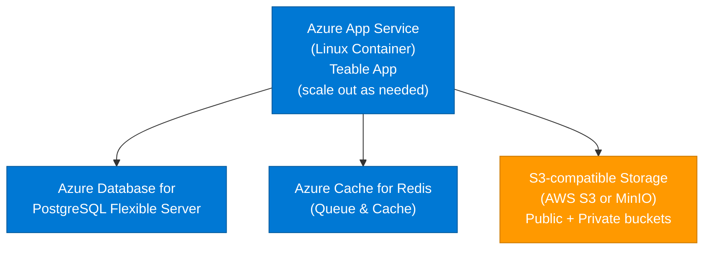
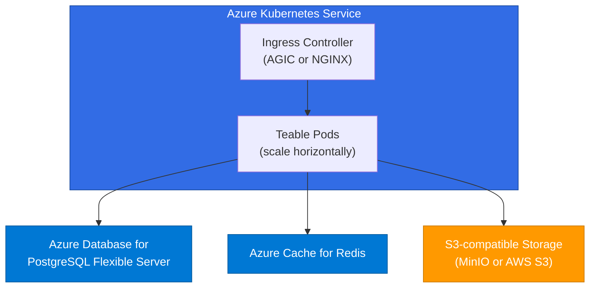

<Callout type="info">
**Recommended for:** Production deployments with 50+ users
</Callout>

## Architecture overview



<Note>
**Important**: Teable requires **S3-compatible storage**. You can use:
- **AWS S3** (cross-cloud setup)
- **MinIO** (self-hosted on Azure VM/AKS)
- Any other S3-compatible service

Azure Blob Storage is **not** directly supported because it uses a different API.
</Note>

## Prerequisites

- Azure CLI installed and logged in
- Azure subscription with permissions for App Service, PostgreSQL, Redis
- Access to an **S3-compatible storage** (e.g., AWS S3 account, or MinIO deployment)

---

## Step 1: Create Azure resources

### 1.1 Create resource group

```bash
az group create \
  --name teable-rg \
  --location eastus
```

### 1.2 Create PostgreSQL Flexible Server

```bash
az postgres flexible-server create \
  --resource-group teable-rg \
  --name teable-db \
  --location eastus \
  --admin-user teableadmin \
  --admin-password '<YourStrongPassword>' \
  --sku-name Standard_B2s \
  --tier Burstable \
  --storage-size 128 \
  --version 16 \
  --public-access 0.0.0.0-255.255.255.255
```

<Note>
Wait until provisioning completes. Get the connection string:
```bash
az postgres flexible-server show \
  --resource-group teable-rg \
  --name teable-db \
  --query "fullyQualifiedDomainName" --output tsv
```
Result: `teable-db.postgres.database.azure.com`
</Note>

### 1.3 Create Azure Cache for Redis

```bash
az redis create \
  --resource-group teable-rg \
  --name teable-cache \
  --location eastus \
  --sku Basic \
  --vm-size c0 \
  --minimum-tls-version 1.2
```

<Note>
Get the access key:
```bash
az redis list-keys \
  --resource-group teable-rg \
  --name teable-cache \
  --query "primaryKey" --output tsv
```
</Note>

---

## Step 2: Set up S3-compatible storage

Since Azure Blob Storage is not S3-compatible, choose one of the following options:

### Option A: Use AWS S3 (cross-cloud)

This is the simplest approach if you already have AWS access or don't want to manage MinIO.

1. **Create S3 buckets on AWS** (see [AWS deployment guide](/en/deploy/aws) steps 1.3-1.4)
   - Public bucket: `teable-public-<unique-suffix>`
   - Private bucket: `teable-private-<unique-suffix>`

2. **Configure public bucket** (see [Object Storage guide](/en/deploy/storage)):
   - Enable public read access
   - Configure CORS to allow any origin

You'll use these environment variables:
```bash
BACKEND_STORAGE_PROVIDER=s3
BACKEND_STORAGE_S3_REGION=us-west-2
BACKEND_STORAGE_S3_ENDPOINT=https://s3.us-west-2.amazonaws.com
BACKEND_STORAGE_S3_ACCESS_KEY=<aws-access-key>
BACKEND_STORAGE_S3_SECRET_KEY=<aws-secret-key>
BACKEND_STORAGE_PUBLIC_BUCKET=teable-public-<suffix>
BACKEND_STORAGE_PRIVATE_BUCKET=teable-private-<suffix>
STORAGE_PREFIX=https://teable-public-<suffix>.s3.us-west-2.amazonaws.com
```

### Option B: Deploy MinIO on Azure

If you prefer to keep everything in Azure, deploy MinIO as an S3-compatible gateway.

**Recommended image**: `minio/minio:RELEASE.2025-04-22T22-12-26Z`

**Quick setup (Azure VM)**:

1. Create a VM and install MinIO:
```bash
wget https://dl.min.io/server/minio/release/linux-amd64/minio
chmod +x minio
sudo mv minio /usr/local/bin/

# Start MinIO
export MINIO_ROOT_USER=admin
export MINIO_ROOT_PASSWORD=<strong-password>
minio server /data --console-address ":9001"
```

2. Create buckets via MinIO console (port 9001) or CLI:
```bash
mc alias set myminio http://your-vm-ip:9000 admin <password>
mc mb myminio/public
mc mb myminio/private
mc policy set download myminio/public
```

You'll use these environment variables:
```bash
BACKEND_STORAGE_PROVIDER=minio
BACKEND_STORAGE_MINIO_ENDPOINT=<vm-ip-or-domain>
BACKEND_STORAGE_MINIO_PORT=443
BACKEND_STORAGE_MINIO_USE_SSL=true
BACKEND_STORAGE_MINIO_ACCESS_KEY=admin
BACKEND_STORAGE_MINIO_SECRET_KEY=<password>
BACKEND_STORAGE_PUBLIC_BUCKET=public
BACKEND_STORAGE_PRIVATE_BUCKET=private
STORAGE_PREFIX=https://<vm-ip-or-domain>
```

---

## Step 3: Prepare environment variables

Create a file `app-settings.txt` with all required variables:

```bash
# Core
PUBLIC_ORIGIN=https://teable-app.azurewebsites.net
SECRET_KEY=<generate-32-char-random-string>

# Database
PRISMA_DATABASE_URL=postgresql://teableadmin:<password>@teable-db.postgres.database.azure.com:5432/postgres?sslmode=require

# Redis (required for queues)
BACKEND_CACHE_PROVIDER=redis
BACKEND_CACHE_REDIS_URI=rediss://:<redis-key>@teable-cache.redis.cache.windows.net:6380/0

# Performance cache (optional; can point to the same Redis)
BACKEND_PERFORMANCE_CACHE=rediss://:<redis-key>@teable-cache.redis.cache.windows.net:6380/0

# Storage (S3-compatible)
# For Option A (AWS S3):
BACKEND_STORAGE_PROVIDER=s3
BACKEND_STORAGE_S3_REGION=us-west-2
BACKEND_STORAGE_S3_ENDPOINT=https://s3.us-west-2.amazonaws.com
BACKEND_STORAGE_S3_ACCESS_KEY=<aws-access-key>
BACKEND_STORAGE_S3_SECRET_KEY=<aws-secret-key>
BACKEND_STORAGE_PUBLIC_BUCKET=teable-public-<suffix>
BACKEND_STORAGE_PRIVATE_BUCKET=teable-private-<suffix>
STORAGE_PREFIX=https://teable-public-<suffix>.s3.us-west-2.amazonaws.com

# For Option B (MinIO):
# BACKEND_STORAGE_PROVIDER=minio
# BACKEND_STORAGE_MINIO_ENDPOINT=<vm-ip>
# BACKEND_STORAGE_MINIO_PORT=443
# BACKEND_STORAGE_MINIO_USE_SSL=true
# BACKEND_STORAGE_MINIO_ACCESS_KEY=admin
# BACKEND_STORAGE_MINIO_SECRET_KEY=<password>
# BACKEND_STORAGE_PUBLIC_BUCKET=public
# BACKEND_STORAGE_PRIVATE_BUCKET=private
# STORAGE_PREFIX=https://<vm-ip>
```

<Tip>
Generate a strong `SECRET_KEY`:
```bash
openssl rand -base64 32
```
</Tip>

---

## Step 4: Deploy to Azure App Service

### 4.1 Create App Service Plan

```bash
az appservice plan create \
  --resource-group teable-rg \
  --name teable-plan \
  --location eastus \
  --is-linux \
  --sku P1v3
```

### 4.2 Create Web App (container-based)

```bash
az webapp create \
  --resource-group teable-rg \
  --plan teable-plan \
  --name teable-app \
  --deployment-container-image-name ghcr.io/teableio/teable:latest
```

### 4.3 Configure container settings

```bash
az webapp config container set \
  --resource-group teable-rg \
  --name teable-app \
  --docker-custom-image-name ghcr.io/teableio/teable:latest \
  --docker-registry-server-url https://ghcr.io
```

### 4.4 Set environment variables

```bash
# Convert app-settings.txt to JSON format and apply
az webapp config appsettings set \
  --resource-group teable-rg \
  --name teable-app \
  --settings \
    WEBSITES_PORT=3000 \
    PUBLIC_ORIGIN="https://teable-app.azurewebsites.net" \
    SECRET_KEY="<your-secret>" \
    PRISMA_DATABASE_URL="postgresql://..." \
    BACKEND_CACHE_PROVIDER="redis" \
    BACKEND_CACHE_REDIS_URI="rediss://..." \
    BACKEND_PERFORMANCE_CACHE="rediss://..." \
    BACKEND_STORAGE_PROVIDER="s3" \
    BACKEND_STORAGE_S3_REGION="us-west-2" \
    BACKEND_STORAGE_S3_ENDPOINT="https://s3.us-west-2.amazonaws.com" \
    BACKEND_STORAGE_S3_ACCESS_KEY="***" \
    BACKEND_STORAGE_S3_SECRET_KEY="***" \
    BACKEND_STORAGE_PUBLIC_BUCKET="teable-public-xxx" \
    BACKEND_STORAGE_PRIVATE_BUCKET="teable-private-xxx" \
    STORAGE_PREFIX="https://teable-public-xxx.s3.us-west-2.amazonaws.com"
```

### 4.5 Configure health check

```bash
az webapp config set \
  --resource-group teable-rg \
  --name teable-app \
  --generic-configurations '{"healthCheckPath": "/health"}'
```

### 4.6 Restart the app

```bash
az webapp restart \
  --resource-group teable-rg \
  --name teable-app
```

---

## Step 5: Verify deployment

1. **Check app status**:

```bash
az webapp show \
  --resource-group teable-rg \
  --name teable-app \
  --query "state" --output tsv
```

Expected: `Running`

2. **View logs**:

```bash
az webapp log tail \
  --resource-group teable-rg \
  --name teable-app
```

3. **Test health check**:

```bash
curl https://teable-app.azurewebsites.net/health
```

Expected response:
```json
{"status":"ok"}
```

4. **Open Teable in browser**: `https://teable-app.azurewebsites.net`

---

## Troubleshooting

### Database connection errors

- Verify PostgreSQL firewall allows Azure services
- Check connection string includes `?sslmode=require`
- Ensure database name is correct (default is `postgres`, not `teable`)

### Redis connection errors

- Use `rediss://` (with double 's') for TLS connections
- Use port **6380** (not 6379) for Azure Cache for Redis
- Verify access key is correct

### S3 access errors (Option A: AWS S3)

- Verify AWS credentials are correct
- Check bucket names match exactly
- Ensure public bucket has public read policy and CORS configured
- Test S3 access from Azure: `curl https://s3.us-west-2.amazonaws.com` should work

### Container fails to start

- Check logs: `az webapp log tail ...`
- Verify all required environment variables are set
- Ensure `WEBSITES_PORT=3000` is set

---

## Production best practices

<Tip>
For detailed production recommendations including resource sizing, high availability, and scaling strategies, see [Self-Hosted Overview](/en/deploy/production-overview).
</Tip>

**Azure-specific tips**:
- Use Azure Key Vault for sensitive values
- Enable HTTPS only: `az webapp update --https-only true`
- Use VNet Integration to restrict database/redis access
- Enable Application Insights for monitoring

**Custom domain setup**:
```bash
# Add custom domain
az webapp config hostname add \
  --resource-group teable-rg \
  --webapp-name teable-app \
  --hostname teable.yourcompany.com

# Create managed SSL certificate
az webapp config ssl create \
  --resource-group teable-rg \
  --name teable-app \
  --hostname teable.yourcompany.com
```

---

## Alternative: Deploy on AKS (Azure Kubernetes Service)

For larger deployments or teams already using Kubernetes, AKS provides better scalability and control.

### AKS Architecture



### Step 1: Create AKS Cluster

```bash
# Create AKS cluster
az aks create \
  --resource-group teable-rg \
  --name teable-aks \
  --location eastus \
  --node-count 2 \
  --node-vm-size Standard_D4s_v3 \
  --enable-managed-identity \
  --generate-ssh-keys

# Get credentials
az aks get-credentials \
  --resource-group teable-rg \
  --name teable-aks
```

### Step 2: Create Azure Managed Services

Create PostgreSQL and Redis using the same commands from [Step 1.2](#12-create-postgresql-flexible-server) and [Step 1.3](#13-create-azure-cache-for-redis).

<Note>
For AKS, you may want to enable VNet integration to secure the connection:

```bash
# Get AKS VNet ID
AKS_VNET=$(az aks show \
  --resource-group teable-rg \
  --name teable-aks \
  --query "networkProfile.networkPlugin" -o tsv)

# Configure PostgreSQL to accept connections from AKS VNet
az postgres flexible-server vnet-rule create \
  --resource-group teable-rg \
  --server-name teable-db \
  --name aks-access \
  --vnet-name <aks-vnet-name> \
  --subnet <aks-subnet-name>
```
</Note>

### Step 3: Deploy MinIO to AKS (Optional)

If you prefer to keep storage within Azure, deploy MinIO to AKS:

```yaml
# minio-deployment.yaml
apiVersion: apps/v1
kind: Deployment
metadata:
  name: minio
spec:
  replicas: 1
  selector:
    matchLabels:
      app: minio
  template:
    metadata:
      labels:
        app: minio
    spec:
      containers:
        - name: minio
          image: minio/minio:latest
          args:
            - server
            - /data
            - --console-address
            - ":9001"
          env:
            - name: MINIO_ROOT_USER
              value: "minioadmin"
            - name: MINIO_ROOT_PASSWORD
              valueFrom:
                secretKeyRef:
                  name: minio-secrets
                  key: password
          ports:
            - containerPort: 9000
            - containerPort: 9001
          volumeMounts:
            - name: data
              mountPath: /data
      volumes:
        - name: data
          persistentVolumeClaim:
            claimName: minio-pvc
---
apiVersion: v1
kind: Service
metadata:
  name: minio
spec:
  ports:
    - name: api
      port: 9000
      targetPort: 9000
    - name: console
      port: 9001
      targetPort: 9001
  selector:
    app: minio
---
apiVersion: v1
kind: PersistentVolumeClaim
metadata:
  name: minio-pvc
spec:
  accessModes:
    - ReadWriteOnce
  resources:
    requests:
      storage: 50Gi
  storageClassName: managed-premium
```

<Tip>
For production MinIO deployments, consider using the [MinIO Operator](https://min.io/docs/minio/kubernetes/upstream/) for distributed mode with data redundancy.
</Tip>

### Step 4: Create Kubernetes Configurations

Create the ConfigMap with Azure-specific settings:

```yaml
# teable-config.yaml
apiVersion: v1
kind: ConfigMap
metadata:
  name: teable-config
data:
  PUBLIC_ORIGIN: "https://teable.yourcompany.com"
  
  # Storage (MinIO in AKS)
  BACKEND_STORAGE_PROVIDER: "minio"
  BACKEND_STORAGE_MINIO_ENDPOINT: "minio.yourcompany.com"
  STORAGE_PREFIX: "https://minio.yourcompany.com"
  BACKEND_STORAGE_MINIO_INTERNAL_ENDPOINT: "minio.default.svc.cluster.local"
  BACKEND_STORAGE_MINIO_PORT: "443"
  BACKEND_STORAGE_MINIO_INTERNAL_PORT: "9000"
  BACKEND_STORAGE_MINIO_USE_SSL: "true"
  
  # Cache
  BACKEND_CACHE_PROVIDER: "redis"
  
  # Other
  NEXT_ENV_IMAGES_ALL_REMOTE: "true"
  PRISMA_ENGINES_CHECKSUM_IGNORE_MISSING: "1"
```

Create secrets with Azure service credentials:

```yaml
# teable-secrets.yaml
apiVersion: v1
kind: Secret
metadata:
  name: teable-secrets
type: Opaque
stringData:
  # PostgreSQL (Azure Flexible Server)
  PRISMA_DATABASE_URL: "postgresql://teableadmin:<password>@teable-db.postgres.database.azure.com:5432/postgres?sslmode=require"
  
  # Application secrets
  SECRET_KEY: "<your-secret-key>"
  
  # MinIO credentials
  BACKEND_STORAGE_PUBLIC_BUCKET: "public"
  BACKEND_STORAGE_PRIVATE_BUCKET: "private"
  BACKEND_STORAGE_MINIO_ACCESS_KEY: "minioadmin"
  BACKEND_STORAGE_MINIO_SECRET_KEY: "<minio-password>"
  
  # Redis (Azure Cache for Redis)
  BACKEND_CACHE_REDIS_URI: "rediss://:<redis-key>@teable-cache.redis.cache.windows.net:6380/0"
```

### Step 5: Deploy Teable

```yaml
# teable-deployment.yaml
apiVersion: apps/v1
kind: Deployment
metadata:
  name: teable
spec:
  replicas: 2  # Scale as needed
  selector:
    matchLabels:
      app: teable
  template:
    metadata:
      labels:
        app: teable
    spec:
      initContainers:
        - name: db-migrate
          image: ghcr.io/teableio/teable:latest
          args:
            - migrate-only
          envFrom:
            - configMapRef:
                name: teable-config
            - secretRef:
                name: teable-secrets
          resources:
            limits:
              cpu: 1000m
              memory: 1024Mi
      containers:
        - name: teable
          image: ghcr.io/teableio/teable:latest
          args:
            - skip-migrate
          ports:
            - containerPort: 3000
          envFrom:
            - configMapRef:
                name: teable-config
            - secretRef:
                name: teable-secrets
          resources:
            requests:
              cpu: 500m
              memory: 1Gi
            limits:
              cpu: 2000m
              memory: 4Gi
          livenessProbe:
            httpGet:
              path: /health
              port: 3000
            initialDelaySeconds: 30
            periodSeconds: 30
          readinessProbe:
            httpGet:
              path: /health
              port: 3000
            initialDelaySeconds: 15
            periodSeconds: 10
---
apiVersion: v1
kind: Service
metadata:
  name: teable
spec:
  ports:
    - port: 3000
      targetPort: 3000
  selector:
    app: teable
```

### Step 6: Configure Ingress

**Option A: Using NGINX Ingress Controller**

```bash
# Install NGINX Ingress
helm repo add ingress-nginx https://kubernetes.github.io/ingress-nginx
helm install ingress-nginx ingress-nginx/ingress-nginx \
  --set controller.service.annotations."service\.beta\.kubernetes\.io/azure-load-balancer-health-probe-request-path"=/healthz
```

```yaml
# teable-ingress.yaml
apiVersion: networking.k8s.io/v1
kind: Ingress
metadata:
  name: teable
  annotations:
    kubernetes.io/ingress.class: nginx
    nginx.ingress.kubernetes.io/proxy-body-size: "100m"
    cert-manager.io/cluster-issuer: letsencrypt-prod
spec:
  tls:
    - hosts:
        - teable.yourcompany.com
      secretName: teable-tls
  rules:
    - host: teable.yourcompany.com
      http:
        paths:
          - path: /
            pathType: Prefix
            backend:
              service:
                name: teable
                port:
                  number: 3000
```

**Option B: Using Azure Application Gateway Ingress Controller (AGIC)**

```bash
# Enable AGIC addon
az aks enable-addons \
  --resource-group teable-rg \
  --name teable-aks \
  --addons ingress-appgw \
  --appgw-name teable-appgw \
  --appgw-subnet-cidr "10.225.0.0/16"
```

```yaml
# teable-ingress-agic.yaml
apiVersion: networking.k8s.io/v1
kind: Ingress
metadata:
  name: teable
  annotations:
    kubernetes.io/ingress.class: azure/application-gateway
    appgw.ingress.kubernetes.io/backend-path-prefix: "/"
    appgw.ingress.kubernetes.io/ssl-redirect: "true"
spec:
  tls:
    - hosts:
        - teable.yourcompany.com
      secretName: teable-tls
  rules:
    - host: teable.yourcompany.com
      http:
        paths:
          - path: /
            pathType: Prefix
            backend:
              service:
                name: teable
                port:
                  number: 3000
```

### Step 7: Apply All Configurations

```bash
# Apply configurations
kubectl apply -f teable-config.yaml
kubectl apply -f teable-secrets.yaml
kubectl apply -f minio-deployment.yaml  # If using MinIO in AKS
kubectl apply -f teable-deployment.yaml
kubectl apply -f teable-ingress.yaml

# Verify deployment
kubectl get pods -l app=teable
kubectl logs -l app=teable
```

### AKS Production Recommendations

1. **Autoscaling**:
```bash
# Enable Horizontal Pod Autoscaler
kubectl autoscale deployment teable --cpu-percent=70 --min=2 --max=10

# Enable Cluster Autoscaler
az aks update \
  --resource-group teable-rg \
  --name teable-aks \
  --enable-cluster-autoscaler \
  --min-count 2 \
  --max-count 5
```

2. **Use Azure Key Vault** for secrets instead of Kubernetes secrets:
```bash
# Enable Key Vault secrets provider
az aks enable-addons \
  --resource-group teable-rg \
  --name teable-aks \
  --addons azure-keyvault-secrets-provider
```

3. **Enable Azure Monitor**:
```bash
az aks enable-addons \
  --resource-group teable-rg \
  --name teable-aks \
  --addons monitoring
```

4. **Use Azure Private Link** for PostgreSQL and Redis to keep traffic within Azure network.

---

## Related documentation

- [Self-Hosted Overview](/en/deploy/production-overview) — Architecture, sizing, and scaling
- [Environment Variables Reference](/en/deploy/env)
- [Object Storage (S3-compatible)](/en/deploy/storage)
- [Kubernetes Deployment](/en/deploy/k8s) (generic K8s guide)
- [AWS Deployment](/en/deploy/aws) (for S3 setup if using cross-cloud storage)
