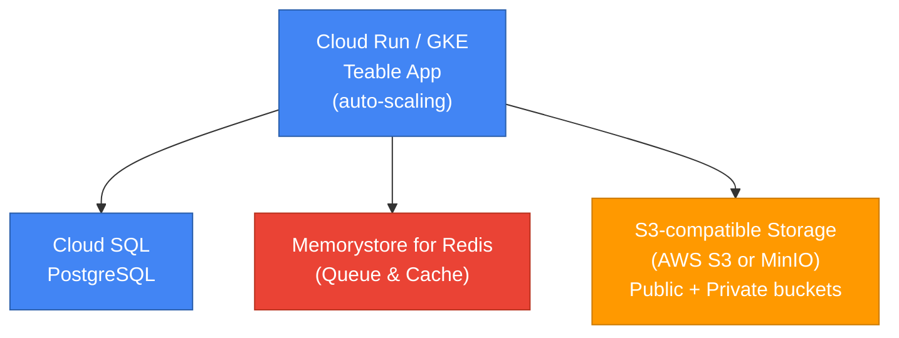

<Callout type="info">
**Recommended for:** Production deployments with 50+ users
</Callout>

## Architecture overview



<Note>
**Important**: Teable requires **S3-compatible storage**. You can use:
- **AWS S3** (cross-cloud setup)
- **MinIO** (self-hosted on GCE/GKE)
- Any other S3-compatible service

Google Cloud Storage (GCS) is **not** directly supported because it uses a different API.
</Note>

## Prerequisites

- `gcloud` CLI installed and authenticated
- GCP project with billing enabled
- Access to **S3-compatible storage** (e.g., AWS S3 account or MinIO deployment)

---

## Step 1: Create GCP resources

### 1.1 Set project and region

```bash
export PROJECT_ID=your-project-id
export REGION=us-central1

gcloud config set project $PROJECT_ID
```

### 1.2 Create Cloud SQL (PostgreSQL)

```bash
gcloud sql instances create teable-db \
  --database-version=POSTGRES_16 \
  --tier=db-custom-2-7680 \
  --region=$REGION \
  --root-password=<YourStrongPassword> \
  --storage-type=SSD \
  --storage-size=100GB
```

<Note>
Get connection name:
```bash
gcloud sql instances describe teable-db \
  --format='value(connectionName)'
```
Result: `your-project:region:teable-db`
</Note>

Create database:
```bash
gcloud sql databases create teable --instance=teable-db
```

### 1.3 Create Memorystore (Redis)

```bash
gcloud redis instances create teable-cache \
  --size=1 \
  --region=$REGION \
  --redis-version=redis_7_0
```

<Note>
Get Redis host:
```bash
gcloud redis instances describe teable-cache \
  --region=$REGION \
  --format='value(host)'
```
</Note>

---

## Step 2: Set up S3-compatible storage

Since Google Cloud Storage is not S3-compatible, choose one of the following options:

### Option A: Use AWS S3 (cross-cloud)

1. **Create S3 buckets on AWS** (see [AWS deployment guide](/en/deploy/aws) steps 1.3-1.4)
2. **Configure public bucket** (see [Object Storage guide](/en/deploy/storage))

Environment variables:
```bash
BACKEND_STORAGE_PROVIDER=s3
BACKEND_STORAGE_S3_REGION=us-west-2
BACKEND_STORAGE_S3_ENDPOINT=https://s3.us-west-2.amazonaws.com
BACKEND_STORAGE_S3_ACCESS_KEY=<aws-access-key>
BACKEND_STORAGE_S3_SECRET_KEY=<aws-secret-key>
BACKEND_STORAGE_PUBLIC_BUCKET=teable-public-<suffix>
BACKEND_STORAGE_PRIVATE_BUCKET=teable-private-<suffix>
STORAGE_PREFIX=https://teable-public-<suffix>.s3.us-west-2.amazonaws.com
```

### Option B: Deploy MinIO on GCP

Deploy MinIO on a GCE instance or GKE cluster to provide S3-compatible storage.

**Recommended image**: `minio/minio:RELEASE.2025-04-22T22-12-26Z`

**Quick setup (GCE VM)**:

```bash
# Create VM
gcloud compute instances create minio-server \
  --machine-type=e2-medium \
  --zone=us-central1-a \
  --image-family=ubuntu-2204-lts \
  --image-project=ubuntu-os-cloud \
  --boot-disk-size=100GB

# SSH and install MinIO
gcloud compute ssh minio-server --zone=us-central1-a

# On the VM:
wget https://dl.min.io/server/minio/release/linux-amd64/minio
chmod +x minio
sudo mv minio /usr/local/bin/

export MINIO_ROOT_USER=admin
export MINIO_ROOT_PASSWORD=<strong-password>
minio server /data --console-address ":9001"
```

Create buckets and configure access (see Azure guide Option B for details).

---

## Step 3: Prepare environment variables

Create `.env` file:

```bash
# Core
PUBLIC_ORIGIN=https://teable.yourcompany.com
SECRET_KEY=<generate-32-char-random-string>

# Database (Cloud SQL)
PRISMA_DATABASE_URL=postgresql://postgres:<password>@/teable?host=/cloudsql/<connection-name>

# Redis (Memorystore)
BACKEND_CACHE_PROVIDER=redis
BACKEND_CACHE_REDIS_URI=redis://<memorystore-ip>:6379/0
BACKEND_PERFORMANCE_CACHE=redis://<memorystore-ip>:6379/0

# Storage (S3-compatible)
# For Option A (AWS S3):
BACKEND_STORAGE_PROVIDER=s3
BACKEND_STORAGE_S3_REGION=us-west-2
BACKEND_STORAGE_S3_ENDPOINT=https://s3.us-west-2.amazonaws.com
BACKEND_STORAGE_S3_ACCESS_KEY=<aws-key>
BACKEND_STORAGE_S3_SECRET_KEY=<aws-secret>
BACKEND_STORAGE_PUBLIC_BUCKET=teable-public-<suffix>
BACKEND_STORAGE_PRIVATE_BUCKET=teable-private-<suffix>
STORAGE_PREFIX=https://teable-public-<suffix>.s3.us-west-2.amazonaws.com
```

---

## Step 4: Deploy to Cloud Run

### 4.1 Build and push container (or use pre-built image)

```bash
# Option 1: Use pre-built image
export IMAGE=ghcr.io/teableio/teable:latest

# Option 2: Build and push to GCR
# gcloud builds submit --tag gcr.io/$PROJECT_ID/teable
# export IMAGE=gcr.io/$PROJECT_ID/teable
```

### 4.2 Deploy to Cloud Run

```bash
gcloud run deploy teable \
  --image=$IMAGE \
  --platform=managed \
  --region=$REGION \
  --allow-unauthenticated \
  --port=3000 \
  --set-env-vars="PUBLIC_ORIGIN=https://teable.yourcompany.com" \
  --set-env-vars="SECRET_KEY=<your-secret>" \
  --set-env-vars="PRISMA_DATABASE_URL=postgresql://..." \
  --set-env-vars="BACKEND_CACHE_PROVIDER=redis" \
  --set-env-vars="BACKEND_CACHE_REDIS_URI=redis://..." \
  --set-env-vars="BACKEND_STORAGE_PROVIDER=s3" \
  --set-env-vars="BACKEND_STORAGE_S3_REGION=us-west-2" \
  --set-env-vars="BACKEND_STORAGE_S3_ENDPOINT=https://s3.us-west-2.amazonaws.com" \
  --set-env-vars="BACKEND_STORAGE_S3_ACCESS_KEY=***" \
  --set-env-vars="BACKEND_STORAGE_S3_SECRET_KEY=***" \
  --set-env-vars="BACKEND_STORAGE_PUBLIC_BUCKET=teable-public-xxx" \
  --set-env-vars="BACKEND_STORAGE_PRIVATE_BUCKET=teable-private-xxx" \
  --set-env-vars="STORAGE_PREFIX=https://teable-public-xxx.s3.us-west-2.amazonaws.com" \
  --add-cloudsql-instances=<connection-name> \
  --vpc-connector=<your-vpc-connector-for-redis>
```

<Note>
For Cloud SQL Unix socket access, use `--add-cloudsql-instances`.  
For Memorystore access, create a VPC connector first.
</Note>

---

## Step 5: Verify deployment

1. **Get service URL**:

```bash
gcloud run services describe teable \
  --region=$REGION \
  --format='value(status.url)'
```

2. **Test health check**:

```bash
curl https://<service-url>/health
```

Expected: `{"status":"ok"}`

3. **View logs**:

```bash
gcloud run services logs read teable --region=$REGION
```

---

## Production best practices

<Tip>
For detailed production recommendations including resource sizing, high availability, and scaling strategies, see [Self-Hosted Overview](/en/deploy/production-overview).
</Tip>

**GCP-specific tips**:
- Enable Cloud Run minimum instances (2+) for high availability
- Use Secret Manager for sensitive values
- Enable Cloud Monitoring and set up alerts
- Map a custom domain to Cloud Run service

---

## Related documentation

- [Self-Hosted Overview](/en/deploy/production-overview) — Architecture, sizing, and scaling
- [Environment Variables Reference](/en/deploy/env)
- [Object Storage (S3-compatible)](/en/deploy/storage)
