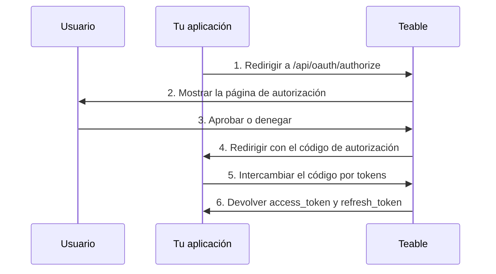

Las aplicaciones OAuth permiten que aplicaciones de terceros accedan a Teable en nombre de los usuarios. Esta guía explica cómo crear y configurar una aplicación OAuth, implementar el flujo de autorización OAuth 2.0 y usar tokens de acceso para interactuar con la API de Teable.

Teable admite tres modos de autorización OAuth 2.0:

- **Código de autorización + secreto de cliente**: Para aplicaciones web con un servidor backend
- **Código de autorización + PKCE**: Para aplicaciones nativas, herramientas de CLI, SPA y otros clientes públicos que no pueden almacenar de forma segura un secreto de cliente
- **Concesión de autorización de dispositivo**: Para clientes que no pueden recibir una redirección del navegador, como una CLI ejecutada mediante SSH, en un contenedor o en un IDE en la nube

## Crear una aplicación OAuth

1. Ve a [Configuración > Aplicaciones OAuth](https://app.teable.ai/setting/oauth-app) en tu cuenta de Teable.
2. Haz clic en **Nueva aplicación OAuth** para crear una aplicación.
3. Completa la información requerida:
   - **Nombre de la aplicación OAuth**: Un nombre descriptivo para tu aplicación
   - **URL de la página de inicio**: La URL completa del sitio web de tu aplicación
   - **URL de devolución de llamada**: La URL a la que se redirigirá a los usuarios después de la autorización
   - **Ámbitos**: Los permisos que necesita tu aplicación
   - **Habilitar flujo de dispositivo**: Está desactivado de forma predeterminada. Actívalo únicamente si tu aplicación inicia sesión mediante un código de dispositivo

4. Después de crear la aplicación, genera un **secreto de cliente**. Asegúrate de copiarlo y almacenarlo de forma segura: no podrás volver a verlo.

<Note>Recibirás un **ID de cliente** y tendrás que generar un **secreto de cliente**. Mantén seguras estas credenciales y nunca las expongas en código del lado del cliente. Si usas el flujo PKCE, no se requiere un secreto de cliente.</Note>

## Ámbitos disponibles {#available-scopes}

Los ámbitos definen qué acciones puede realizar tu aplicación OAuth. Los ámbitos disponibles se organizan por tipo de recurso:

| Recurso | Ámbitos |
|----------|--------|
| **Aplicación** | `app\|create`, `app\|read`, `app\|update`, `app\|delete` |
| **Base** | `base\|read`, `base\|read_all`, `base\|update`, `base\|table_import`, `base\|table_export`, `base\|query_data` |
| **Tabla** | `table\|create`, `table\|delete`, `table\|export`, `table\|import`, `table\|read`, `table\|update`, `table\|trash_read`, `table\|trash_update`, `table\|trash_reset` |
| **Vista** | `view\|create`, `view\|delete`, `view\|read`, `view\|update` |
| **Campo** | `field\|create`, `field\|delete`, `field\|read`, `field\|update` |
| **Registro** | `record\|comment`, `record\|create`, `record\|delete`, `record\|read`, `record\|update` |
| **Automatización** | `automation\|create`, `automation\|delete`, `automation\|read`, `automation\|update` |
| **Usuario** | `user\|email_read`, `user\|integrations` |

<Tip>Solicita únicamente los ámbitos que tu aplicación realmente necesita. Los usuarios verán los permisos solicitados durante la autorización.</Tip>

## Flujo de código de autorización OAuth 2.0

Teable implementa el flujo estándar de código de autorización OAuth 2.0:



### Paso 1: Redirigir a los usuarios a la autorización

Dirige a los usuarios al endpoint de autorización con los parámetros de tu aplicación:

```
GET https://app.teable.ai/api/oauth/authorize
```

**Parámetros de consulta:**

| Parámetro | Obligatorio | Descripción |
|-----------|----------|-------------|
| `response_type` | Sí | Debe ser `code` |
| `client_id` | Sí | El ID de cliente de tu aplicación OAuth |
| `redirect_uri` | No | Debe coincidir con una de tus URL de devolución de llamada registradas. Si se omite, se usará la primera URL de devolución de llamada registrada |
| `scope` | No | Lista de ámbitos separados por espacios. Si se omite, se usan los ámbitos configurados en tu aplicación OAuth |
| `state` | No | Cadena aleatoria para evitar ataques CSRF. Se devolverá en la llamada de retorno |

**Ejemplo:**

```
https://app.teable.ai/api/oauth/authorize?response_type=code&client_id=YOUR_CLIENT_ID&redirect_uri=https://yourapp.com/callback&scope=table|read%20record|read&state=random_state_string
```

### Paso 2: Autorización del usuario

Los usuarios verán una página de autorización que muestra:
- El nombre y el logotipo de tu aplicación
- Los permisos solicitados (ámbitos)
- Opciones para aprobar o denegar el acceso

Si el usuario ya autorizó tu aplicación anteriormente (de forma predeterminada, en los últimos 7 días), se le redirigirá de inmediato sin volver a mostrarle la página de autorización.

### Paso 3: Gestionar la llamada de retorno

Después de que el usuario apruebe (o deniegue), Teable redirige a tu URL de devolución de llamada:

**En caso de éxito:**
```
https://yourapp.com/callback?code=AUTHORIZATION_CODE&state=random_state_string
```

**En caso de denegación:**
```
https://yourapp.com/callback?error=access_denied&state=random_state_string
```

### Paso 4: Intercambiar el código por tokens

Intercambia el código de autorización por tokens de acceso y actualización:

```
POST https://app.teable.ai/api/oauth/access_token
Content-Type: application/x-www-form-urlencoded
```

**Cuerpo de la solicitud:**

| Parámetro | Obligatorio | Descripción |
|-----------|----------|-------------|
| `grant_type` | Sí | Debe ser `authorization_code` |
| `code` | Sí | El código de autorización recibido |
| `client_id` | Sí | El ID de cliente de tu aplicación OAuth |
| `client_secret` | Sí | El secreto de cliente de tu aplicación OAuth |
| `redirect_uri` | Sí | Debe coincidir exactamente con el redirect_uri usado en la autorización |

**Solicitud de ejemplo:**

```bash
curl -X POST https://app.teable.ai/api/oauth/access_token \
  -H "Content-Type: application/x-www-form-urlencoded" \
  -d "grant_type=authorization_code" \
  -d "code=AUTHORIZATION_CODE" \
  -d "client_id=YOUR_CLIENT_ID" \
  -d "client_secret=YOUR_CLIENT_SECRET" \
  -d "redirect_uri=https://yourapp.com/callback"
```

**Respuesta:**

```json
{
  "token_type": "Bearer",
  "access_token": "teable_xxxxxxxxxxxx",
  "refresh_token": "eyJhbGciOiJIUzI1NiIsInR5cCI6IkpXVCJ9...",
  "expires_in": 600,
  "refresh_expires_in": 2592000,
  "scopes": ["table|read", "record|read"]
}
```

| Campo | Descripción |
|-------|-------------|
| `token_type` | Siempre `Bearer` |
| `access_token` | Token que se usa para las solicitudes a la API |
| `refresh_token` | Token para obtener nuevos tokens de acceso |
| `expires_in` | Duración del token de acceso en segundos (valor predeterminado: 600 = 10 minutos) |
| `refresh_expires_in` | Duración del token de actualización en segundos (valor predeterminado: 2592000 = 30 días) |
| `scopes` | Matriz de ámbitos concedidos |

## Flujo de autorización PKCE

PKCE (Proof Key for Code Exchange, o clave de prueba para el intercambio de códigos) está diseñado para aplicaciones que no pueden almacenar de forma segura un secreto de cliente, como aplicaciones nativas de escritorio, aplicaciones móviles, herramientas de CLI o aplicaciones de una sola página.

### Paso 1: Generar parámetros PKCE

Antes de iniciar la autorización, el cliente debe generar un par de parámetros PKCE:

```javascript
// Generar code_verifier (cadena aleatoria de entre 43 y 128 caracteres)
const codeVerifier = generateRandomString(43);

// Generar code_challenge = BASE64URL(SHA256(code_verifier))
const encoder = new TextEncoder();
const data = encoder.encode(codeVerifier);
const digest = await crypto.subtle.digest('SHA-256', data);
const codeChallenge = btoa(String.fromCharCode(...new Uint8Array(digest)))
  .replace(/\+/g, '-').replace(/\//g, '_').replace(/=+$/, '');
```

### Paso 2: Redirigir a los usuarios a la autorización

```
GET https://app.teable.ai/api/oauth/authorize
```

**Parámetros de consulta:**

| Parámetro | Obligatorio | Descripción |
|-----------|----------|-------------|
| `response_type` | Sí | Debe ser `code` |
| `client_id` | Sí | El ID de cliente de tu aplicación OAuth |
| `redirect_uri` | No | URL de devolución de llamada. El modo PKCE admite direcciones de bucle invertido |
| `scope` | No | Lista de ámbitos separados por espacios |
| `state` | No | Cadena aleatoria para evitar ataques CSRF |
| `code_challenge` | Sí | Hash SHA-256 del code_verifier (codificado con Base64URL) |
| `code_challenge_method` | Sí | Debe ser `S256` |

**Ejemplo:**

```
https://app.teable.ai/api/oauth/authorize?response_type=code&client_id=YOUR_CLIENT_ID&redirect_uri=http://127.0.0.1:8080/callback&code_challenge=YOUR_CODE_CHALLENGE&code_challenge_method=S256&state=random_state_string
```

<Tip>En el modo PKCE, `redirect_uri` admite direcciones de bucle invertido (`http://127.0.0.1`, `http://[::1]`, `http://localhost`) con coincidencia flexible de puertos, por lo que no es necesario registrar cada puerto de forma exacta.</Tip>

### Paso 3: Gestionar la llamada de retorno

Es igual que el flujo estándar de código de autorización: después de que el usuario dé su aprobación, el código de autorización se devuelve mediante una redirección.

### Paso 4: Intercambiar el código + code_verifier por tokens

```
POST https://app.teable.ai/api/oauth/access_token
Content-Type: application/x-www-form-urlencoded
```

**Cuerpo de la solicitud:**

| Parámetro | Obligatorio | Descripción |
|-----------|----------|-------------|
| `grant_type` | Sí | Debe ser `authorization_code` |
| `code` | Sí | El código de autorización recibido |
| `client_id` | Sí | El ID de cliente de tu aplicación OAuth |
| `code_verifier` | Sí | La cadena aleatoria original generada en el paso 1 |
| `redirect_uri` | Sí | Debe coincidir exactamente con el redirect_uri usado en la autorización |

<Note>El modo PKCE no requiere `client_secret`. En su lugar, se usa `code_verifier` para verificar la identidad del cliente.</Note>

**Solicitud de ejemplo:**

```bash
curl -X POST https://app.teable.ai/api/oauth/access_token \
  -H "Content-Type: application/x-www-form-urlencoded" \
  -d "grant_type=authorization_code" \
  -d "code=AUTHORIZATION_CODE" \
  -d "client_id=YOUR_CLIENT_ID" \
  -d "code_verifier=YOUR_CODE_VERIFIER" \
  -d "redirect_uri=http://127.0.0.1:8080/callback"
```

El formato de la respuesta es el mismo que en el flujo estándar de código de autorización.

## Flujo de autorización de dispositivo

La concesión de autorización de dispositivo ([RFC 8628](https://datatracker.ietf.org/doc/html/rfc8628)) está destinada a clientes que no pueden recibir una redirección del navegador: una CLI ejecutada mediante SSH, dentro de un contenedor o en un IDE en la nube. Tu cliente muestra una URL y un código breve, el usuario da su aprobación en cualquier navegador y no es necesario escribir nada de vuelta en la terminal.

Teable sigue la RFC 8628, por lo que la mayoría de las bibliotecas de cliente OAuth pueden ejecutar este flujo sin código personalizado. A continuación se detalla lo que es específico de Teable.

<Warning>El flujo de dispositivo está desactivado de forma predeterminada. Activa **Habilitar flujo de dispositivo** en la configuración de tu aplicación OAuth antes de usarlo. Cualquier persona que conozca tu ID de cliente puede iniciar este flujo en nombre de tu aplicación, así que actívalo únicamente si tu aplicación lo necesita. Si vuelves a desactivarlo, también se detendrán las solicitudes que ya estén esperando aprobación.</Warning>

### Solicitar un código de dispositivo

Envía una solicitud `POST /api/oauth/device/code` con tu `client_id` y un `scope` opcional. El endpoint es anónimo y está limitado a 30 solicitudes cada 15 minutos por dirección IP.

```json
{
  "device_code": "xxxxxxxxxxxx",
  "user_code": "BCDF-GHJK",
  "verification_uri": "https://app.teable.ai/oauth/device",
  "expires_in": 900,
  "interval": 5
}
```

Ambos códigos caducan después de 15 minutos (`BACKEND_OAUTH_DEVICE_CODE_EXPIRE_IN`), e `interval` indica el mínimo de segundos que se debe esperar entre consultas.

Muestra `verification_uri` y `user_code`. En esa página, el usuario inicia sesión, introduce el código y revisa el nombre, la página de inicio y los ámbitos solicitados de tu aplicación antes de aprobar o denegar la solicitud. La página le advierte que no apruebe ningún código cuyo proceso no haya iniciado personalmente. Cada código se puede usar una sola vez.

<Note>Teable no devuelve `verification_uri_complete`, y tu cliente no debe construirla. Un código aprobado inicia la sesión de quien lo aprueba en su propia cuenta de Teable, por lo que un enlace que ya incluya el código es precisamente el mecanismo en el que se basa el phishing con códigos de dispositivo.</Note>

### Consultar si hay tokens disponibles

Envía una solicitud `POST /api/oauth/access_token` con `grant_type=urn:ietf:params:oauth:grant-type:device_code`, el `device_code` y tu `client_id`. Los clientes públicos no envían ningún `client_secret`; los clientes confidenciales lo añaden como en los demás flujos.

Hasta que alguien apruebe el código, el endpoint responde con un error en lugar de tokens:

| Error | Qué debe hacer tu cliente |
|-------|----------------------------|
| `authorization_pending` | Nadie ha dado su aprobación todavía. Sigue consultando según el valor de `interval` |
| `slow_down` | Has consultado demasiado rápido. Espera más antes de la siguiente consulta |
| `access_denied` | El usuario denegó la solicitud. Deja de consultar |
| `expired_token` | El código caducó o ya se utilizó. Empieza de nuevo |

Una vez que el usuario da su aprobación, la respuesta contiene los mismos tokens que en los demás flujos.

## Usar tokens de acceso

Incluye el token de acceso en el encabezado `Authorization` de las solicitudes a la API:

```bash
curl https://app.teable.ai/api/table/TABLE_ID/record \
  -H "Authorization: Bearer YOUR_ACCESS_TOKEN"
```

Normalmente, el primer paso después de obtener un token es recuperar todas las Bases accesibles para el usuario actual:

```bash
curl https://app.teable.ai/api/base/access/all \
  -H "Authorization: Bearer YOUR_ACCESS_TOKEN"
```

Este endpoint devuelve todas las Bases a las que el usuario actual tiene permiso de acceso. Puedes usar el `baseId` de la respuesta para las llamadas posteriores a la API.

## Actualizar tokens de acceso

Cuando caduque un token de acceso, usa el token de actualización para obtener uno nuevo:

```
POST https://app.teable.ai/api/oauth/access_token
Content-Type: application/x-www-form-urlencoded
```

**Cuerpo de la solicitud:**

| Parámetro | Obligatorio | Descripción |
|-----------|----------|-------------|
| `grant_type` | Sí | Debe ser `refresh_token` |
| `refresh_token` | Sí | Tu token de actualización actual |
| `client_id` | Sí | El ID de cliente de tu aplicación OAuth |
| `client_secret` | Condicional | Es obligatorio para el modo estándar de código de autorización; no es necesario para el modo PKCE |

**Solicitud de ejemplo:**

```bash
curl -X POST https://app.teable.ai/api/oauth/access_token \
  -H "Content-Type: application/x-www-form-urlencoded" \
  -d "grant_type=refresh_token" \
  -d "refresh_token=YOUR_REFRESH_TOKEN" \
  -d "client_id=YOUR_CLIENT_ID" \
  -d "client_secret=YOUR_CLIENT_SECRET"
```

<Warning>Después de la actualización, el token de actualización anterior deja de ser válido (rotación de tokens de actualización). Guarda siempre el nuevo token de actualización incluido en la respuesta.</Warning>

## Revocar el acceso

### Para propietarios de aplicaciones OAuth

Revoca el acceso de la aplicación para **todos los usuarios** (solo puede hacerlo quien creó la aplicación):

```
POST https://app.teable.ai/api/oauth/client/{clientId}/revoke-access
```

Esto elimina los registros de autorización y los tokens de todos los usuarios, e impide por completo que la aplicación acceda a los datos de cualquier usuario.

### Para usuarios

Revoca **tu propia** autorización para una aplicación específica:

```
POST https://app.teable.ai/api/oauth/client/{clientId}/revoke-token
```

Esto solo invalida los tokens de acceso y de actualización del usuario actual, sin afectar a otros usuarios.

Los usuarios también pueden revocar el acceso desde la página de configuración de [Aplicaciones autorizadas](https://app.teable.ai/setting/authorized-apps).

### Para aplicaciones

Las aplicaciones pueden revocar su propio acceso mediante un token de acceso:

```
GET https://app.teable.ai/api/oauth/client/{clientId}/revoke-token
Authorization: Bearer YOUR_ACCESS_TOKEN
```

<Note>Este endpoint solo acepta autenticación mediante token de acceso, no autenticación de sesión.</Note>

## Caducidad de los tokens

| Tipo de token | Caducidad predeterminada | Configurable mediante |
|------------|-------------------|------------------|
| Código de autorización | 5 minutos | `BACKEND_OAUTH_CODE_EXPIRE_IN` |
| Código de dispositivo | 15 minutos | `BACKEND_OAUTH_DEVICE_CODE_EXPIRE_IN` |
| Token de acceso | 10 minutos | `BACKEND_OAUTH_ACCESS_TOKEN_EXPIRE_IN` |
| Token de actualización | 30 días | `BACKEND_OAUTH_REFRESH_TOKEN_EXPIRE_IN` |
| Memoria de autorización | 7 días | `BACKEND_OAUTH_AUTHORIZED_EXPIRE_IN` |

## Gestión de errores

Respuestas de error habituales:

| Error | Descripción |
|-------|-------------|
| `invalid_client` | El ID de cliente o el secreto de cliente no son válidos |
| `invalid_grant` | El código de autorización caducó o ya se utilizó |
| `invalid_scope` | El ámbito solicitado no está permitido para esta aplicación OAuth |
| `access_denied` | El usuario denegó la solicitud de autorización |
| `redirect_uri_mismatch` | La URI de redirección no coincide con las URL registradas |
| `unauthorized_client` | La aplicación OAuth no tiene habilitado el flujo de dispositivo |
| `too_many_requests` | Se superó el límite de solicitudes. De forma predeterminada, las solicitudes de tokens están limitadas a 30 cada 15 minutos y las solicitudes de códigos de dispositivo, a 30 cada 15 minutos por dirección IP |

## Prácticas recomendadas

1. **Elige el modo adecuado**: Usa el modo con secreto de cliente para aplicaciones web con backend, el modo PKCE para aplicaciones nativas, CLI o SPA, y el flujo de dispositivo cuando el cliente no pueda recibir una redirección del navegador
2. **Almacena los secretos de forma segura**: Nunca expongas tu secreto de cliente en código del lado del cliente
3. **Usa el parámetro state**: Incluye siempre un parámetro `state` aleatorio para evitar ataques CSRF
4. **Solicita el mínimo de ámbitos**: Solicita únicamente los permisos que tu aplicación realmente necesita
5. **Gestiona la actualización de tokens**: Implementa la actualización automática del token antes de que caduque
6. **Almacena los tokens de forma segura**: Guarda de forma segura los tokens de acceso y actualización en tu servidor

## Ejemplos completos

### Node.js (código de autorización + secreto de cliente)

```javascript
const express = require('express');
const crypto = require('crypto');
const app = express();

const CLIENT_ID = 'your_client_id';
const CLIENT_SECRET = 'your_client_secret';
const REDIRECT_URI = 'http://localhost:3000/callback';
const TEABLE_URL = 'https://app.teable.ai';

// Paso 1: Redirigir al usuario a la autorización
app.get('/login', (req, res) => {
  const state = crypto.randomBytes(16).toString('hex');
  req.session.oauthState = state; // Guardar state en la sesión
  const authUrl = `${TEABLE_URL}/api/oauth/authorize?` +
    `response_type=code&` +
    `client_id=${CLIENT_ID}&` +
    `redirect_uri=${encodeURIComponent(REDIRECT_URI)}&` +
    `scope=${encodeURIComponent('record|read table|read')}&` +
    `state=${state}`;
  res.redirect(authUrl);
});

// Paso 2: Gestionar la llamada de retorno e intercambiar el código por tokens
app.get('/callback', async (req, res) => {
  const { code, state } = req.query;

  // Verificar state para evitar ataques CSRF
  if (state !== req.session.oauthState) {
    return res.status(403).send('Estado no válido');
  }

  const response = await fetch(`${TEABLE_URL}/api/oauth/access_token`, {
    method: 'POST',
    headers: { 'Content-Type': 'application/x-www-form-urlencoded' },
    body: new URLSearchParams({
      grant_type: 'authorization_code',
      client_id: CLIENT_ID,
      client_secret: CLIENT_SECRET,
      code,
      redirect_uri: REDIRECT_URI,
    }),
  });

  const tokens = await response.json();
  // tokens.access_token — usar en llamadas a la API
  // tokens.refresh_token — usar para actualizar los tokens
  res.json({ success: true, scopes: tokens.scopes });
});

app.listen(3000);
```

### Python (modo PKCE para herramientas de CLI)

```python
import hashlib
import base64
import secrets
import http.server
import urllib.parse
import requests

CLIENT_ID = 'your_client_id'
TEABLE_URL = 'https://app.teable.ai'
PORT = 8080
REDIRECT_URI = f'http://127.0.0.1:{PORT}/callback'

# Paso 1: Generar los parámetros PKCE
code_verifier = secrets.token_urlsafe(32)  # 43 caracteres
code_challenge = base64.urlsafe_b64encode(
    hashlib.sha256(code_verifier.encode()).digest()
).rstrip(b'=').decode()

# Paso 2: Crear la URL de autorización (abrir en el navegador)
auth_url = (
    f"{TEABLE_URL}/api/oauth/authorize?"
    f"response_type=code&"
    f"client_id={CLIENT_ID}&"
    f"redirect_uri={urllib.parse.quote(REDIRECT_URI)}&"
    f"code_challenge={code_challenge}&"
    f"code_challenge_method=S256"
)
print(f"Abre el enlace en el navegador:\n{auth_url}")

# Paso 3: Iniciar el servidor local para recibir la llamada de retorno
authorization_code = None

class CallbackHandler(http.server.BaseHTTPRequestHandler):
    def do_GET(self):
        global authorization_code
        query = urllib.parse.urlparse(self.path).query
        params = urllib.parse.parse_qs(query)
        authorization_code = params.get('code', [None])[0]
        self.send_response(200)
        self.end_headers()
        self.wfile.write(b'Autorizaci\xc3\xb3n correcta. Puedes cerrar esta p\xc3\xa1gina.')

    def log_message(self, format, *args):
        pass  # Silenciar los registros

server = http.server.HTTPServer(('127.0.0.1', PORT), CallbackHandler)
server.handle_request()  # Gestionar una sola solicitud

# Paso 4: Intercambiar el código + code_verifier por tokens
response = requests.post(f"{TEABLE_URL}/api/oauth/access_token", data={
    'grant_type': 'authorization_code',
    'client_id': CLIENT_ID,
    'code': authorization_code,
    'redirect_uri': REDIRECT_URI,
    'code_verifier': code_verifier,
})

tokens = response.json()
print(f"Token de acceso: {tokens['access_token']}")
print(f"Caduca en: {tokens['expires_in']}s")
```
