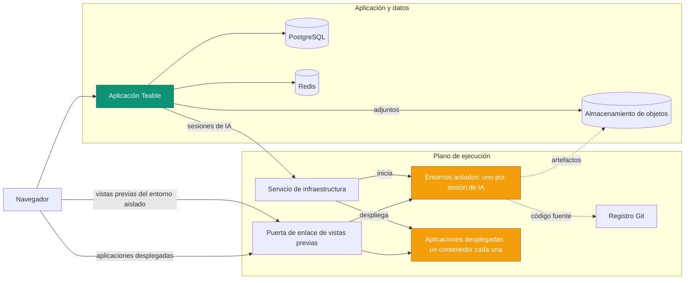

El autoalojamiento de Teable despliega cuatro plataformas en una:

- **Un entorno aislado para agentes seguro y escalable**: cada sesión de IA se ejecuta en su propio
  contenedor aislado, que se inicia bajo demanda y desaparece cuando termina la sesión.
- **Una plataforma eficiente para desplegar aplicaciones**: cada aplicación que tu equipo
  crea y publica se ejecuta en su propio contenedor ligero y persistente.
- **Un motor de flujos de trabajo de IA**: Automatizaciones desencadenadas por cambios en Registros,
  programaciones y webhooks, con pasos de IA, que se ejecutan justo donde se encuentran tus datos.
- **Una plataforma completa de colaboración con bases de datos sobre PostgreSQL**: Tablas,
  Vistas y API.

El autoalojamiento de Teable convierte tus propios recursos informáticos en un **entorno de productividad
totalmente controlado y preparado para agentes**, que pone la IA en manos de todo
tu equipo.

Esta página explica los servicios que lo hacen posible y cómo encajan entre sí. Los
recursos de despliegue (archivos de Compose, gráfico de Helm y valores) se encuentran en
[teableio/teable-deployment](https://github.com/teableio/teable-deployment).

<Tip>Las funciones de IA están disponibles en el plan Business autoalojado y superiores.</Tip>

## Qué ejecuta un despliegue

| Servicio | Finalidad |
|---|---|
| **Aplicación Teable** | Interfaz web, API, Automatizaciones y Chat de IA en una sola imagen: `ghcr.io/teableio/teable` |
| **PostgreSQL** | Base de datos principal: todas tus Tablas, Vistas y metadatos |
| **Redis** | Caché, colas y colaboración en tiempo real |
| **Almacenamiento de objetos** | Almacenamiento de archivos compatible con S3 con tres buckets: **público** (avatares y otros recursos públicos), **privado** (adjuntos) y **artefactos de compilación** (salida de App Builder) |
| **Servicio de infraestructura** | Punto de entrada único al que se conecta la aplicación Teable; coordina las compilaciones y los despliegues de aplicaciones, con su propia consola y API |
| **Motor del entorno aislado** | Ejecuta cada sesión de IA en su propio contenedor aislado |
| **Registro Git** | Almacena el código fuente de las aplicaciones que creas (App Builder lo envía aquí) |
| **Puerta de enlace de vistas previas** | Dirige los navegadores a las vistas previas de los entornos aislados y a las aplicaciones desplegadas |

Los cuatro últimos componentes forman el plano de ejecución. Los recursos de despliegue instalan todo
como una única plataforma.

## Cómo encaja todo

La aplicación Teable se comunica con el plano de ejecución mediante **una única conexión**: el
Servicio de infraestructura (`TEABLE_INFRA_API_URL` / `TEABLE_INFRA_API_KEY`). Todo lo que
hay detrás es interno. Dos tipos de cargas de trabajo realizan el trabajo efectivo y son
los que consumen los recursos de tu máquina:

- **Entornos aislados.** Cada sesión de Chat de IA o App Builder obtiene su propio
  contenedor aislado, que se inicia al comenzar la sesión y se elimina cuando termina. Esta
  es la carga principal de la plataforma y llega en ráfagas: dimensiona la máquina según
  el **máximo de sesiones de IA simultáneas**, no según el número de usuarios (los límites de recursos
  por entorno aislado se pueden establecer en Administración del sistema).
- **Aplicaciones desplegadas.** Cada aplicación que alguien publica se ejecuta en su propio contenedor
  persistente y se sirve en `*.app.<domain>`. Los entornos aislados aparecen y desaparecen; las aplicaciones
  desplegadas se acumulan y siguen ejecutándose.

Los demás servicios desempeñan funciones auxiliares: la compilación se realiza dentro del
entorno aislado de la sesión, el registro Git y el almacenamiento de objetos conservan lo que produce
(código fuente y artefactos de compilación), y la puerta de enlace dirige cada solicitud del navegador
al entorno aislado o a la aplicación correctos.

## Un dominio, cuatro Registros DNS

Todo se sirve bajo **un único dominio base**, normalmente un subdominio
tuyo, como `teable.example.com`:

| Registro | Servicio proporcionado |
|---|---|
| `<domain>` | La aplicación Teable |
| `infra.<domain>` | La consola y la API del Servicio de infraestructura; Git (`/git`) y el almacenamiento de objetos también se sirven desde rutas de este host |
| `*.app.<domain>` | Las aplicaciones que has creado y desplegado |
| `*.sandbox.<domain>` | Las vistas previas de los entornos aislados en el navegador |

Cada nombre es solo un valor predeterminado y todos los nombres de host se pueden sustituir individualmente
(consulta el ejemplo de valores en el repositorio de despliegue).

## Control de versiones

La plataforma se distribuye como **versiones de la plataforma** (`v<year>.<month>.<seq>`) del
repositorio de despliegue:

- Una **etiqueta** de versión es una instantánea verificada: `versions.yaml` fija la versión exacta
  de cada componente y el archivo `CHANGELOG.md` del repositorio indica qué ha cambiado y qué debes
  hacer, si corresponde.
- La rama `main` del repositorio contiene la versión acumulativa más reciente.
- El script **doctor** incluido compara lo que ejecuta realmente tu despliegue
  con la versión y devuelve uno de tres resultados: compatible, debes actualizar
  la aplicación Teable o combinación desconocida (sin verificar).

La aplicación Teable tiene su propia línea de versiones (etiquetas basadas en fechas; `latest` es el
canal estable). Consulta [Actualización de versiones](/es/deploy/upgrade). Cada versión de la plataforma
indica con qué versiones de la aplicación se ha verificado y doctor lo comprueba por ti. El agente
del entorno aislado que ejecuta las sesiones de IA siempre sigue por sí solo la versión de la aplicación;
no hay nada más que actualizar o administrar.

## Desplegar la plataforma

Ambas vías instalan la plataforma completa y están documentadas de principio a fin en el
repositorio de despliegue:

<CardGroup cols={2}>
  <Card title="Docker todo en uno" icon="docker" href="https://github.com/teableio/teable-deployment/blob/main/docker/all-in-one/README.md">
    Todo en una sola máquina: primer despliegue completo, en modo `local` o `server`.
  </Card>
  <Card title="Kubernetes (Helm)" icon="dharmachakra" href="https://github.com/teableio/teable-deployment/blob/main/helm/README.md">
    Un único gráfico de Helm en un clúster existente; solo se requiere `global.baseDomain`.
  </Card>
</CardGroup>

¿Todavía no necesitas IA? Puedes ejecutar solo la aplicación con PostgreSQL, Redis y
almacenamiento —un despliegue **independiente** ([Despliegue con Docker](/es/deploy/docker))—
y conectar más adelante el plano de ejecución sin mover tus datos.

Temas relacionados, todos mantenidos en el repositorio de despliegue:

- **¿Ya ejecutas Teable de forma independiente?** Tus datos permanecen en su lugar y el
  plano de ejecución se instala a su lado: [guía de migración](https://github.com/teableio/teable-deployment/blob/main/migration/2026-07-basic-to-full-featured.md)
- **¿Certificados internos de la empresa?** Si tu dominio utiliza una CA privada o
  corporativa, hay que indicar a los entornos aislados que confíen en ella:
  [private-ca.md](https://github.com/teableio/teable-deployment/blob/main/helm/private-ca.md)
- **Dimensionamiento, versiones y réplicas**: [VERSIONS.md](https://github.com/teableio/teable-deployment/blob/main/VERSIONS.md) ·
  [images/README.md](https://github.com/teableio/teable-deployment/blob/main/images/README.md)
- **Cuando algo falla**: ejecuta primero doctor y después consulta
  [TROUBLESHOOTING.md](https://github.com/teableio/teable-deployment/blob/main/TROUBLESHOOTING.md)

Después del despliegue, conecta la aplicación Teable al plano de ejecución mediante
`TEABLE_INFRA_API_URL` / `TEABLE_INFRA_API_KEY` (las guías de despliegue explican
el proceso) y establece los límites de recursos en
[Administración del sistema → Agente de entorno aislado](/es/basic/admin-panel/sandbox-agent).
