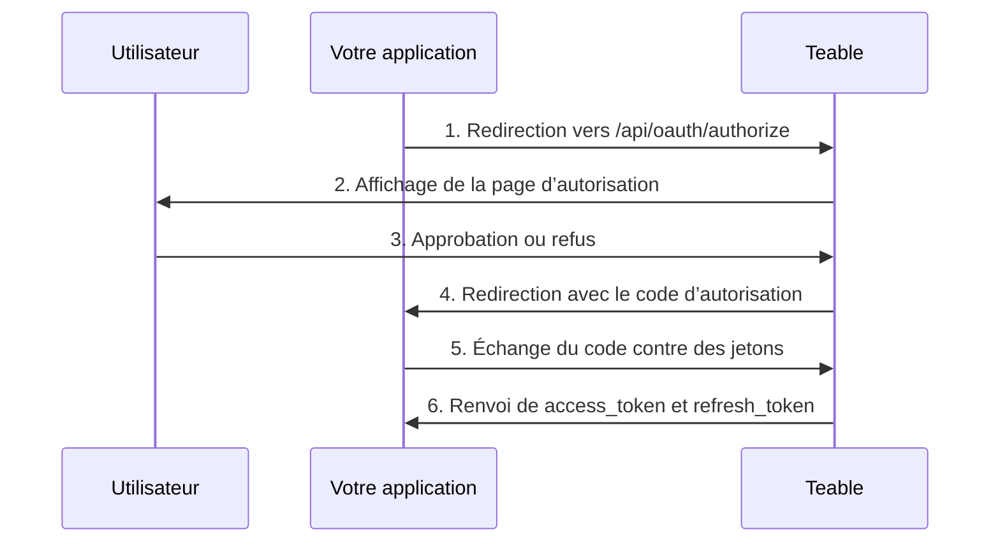

Les applications OAuth permettent à des applications tierces d’accéder à Teable au nom des utilisateurs. Ce guide explique comment créer et configurer une application OAuth, implémenter le flux d’autorisation OAuth 2.0 et utiliser des jetons d’accès pour interagir avec l’API Teable.

Teable prend en charge trois modes d’autorisation OAuth 2.0 :

- **Code d’autorisation + secret client** : pour les applications web avec un serveur backend
- **Code d’autorisation + PKCE** : pour les applications natives, les outils CLI, les SPA et les autres clients publics qui ne peuvent pas stocker de façon sécurisée un secret client
- **Flux d’autorisation d’appareil** : pour les clients qui ne peuvent pas recevoir de redirection depuis un navigateur, tels qu’un CLI exécuté via SSH, dans un conteneur ou dans un IDE cloud

## Créer une application OAuth

1. Accédez à [Paramètres > Applications OAuth](https://app.teable.ai/setting/oauth-app) dans votre compte Teable.
2. Cliquez sur **Nouvelles applications OAuth** pour créer une nouvelle application.
3. Renseignez les informations requises :
   - **Nom de l’application OAuth** : un nom descriptif pour votre application
   - **URL de la page d’accueil** : l’URL complète du site web de votre application
   - **URL de rappel** : l’URL vers laquelle les utilisateurs seront redirigés après l’autorisation
   - **Scopes** : les autorisations requises par votre application
   - **Activer le flux d’appareil** : désactivé par défaut. Activez-le uniquement si votre application connecte les utilisateurs avec un code d’appareil

4. Après avoir créé l’application, générez un **secret client**. Veillez à le copier et à le stocker de manière sécurisée : vous ne pourrez plus le consulter.

<Note>Vous recevrez un **ID client** et devrez générer un **secret client**. Protégez ces identifiants et ne les exposez jamais dans du code côté client. Si vous utilisez le flux PKCE, aucun secret client n’est requis.</Note>

## Scopes disponibles {#available-scopes}

Les scopes définissent les actions que votre application OAuth peut effectuer. Les scopes disponibles sont organisés par type de ressource :

| Ressource | Scopes |
|----------|--------|
| **Application** | `app\|create`, `app\|read`, `app\|update`, `app\|delete` |
| **Base** | `base\|read`, `base\|read_all`, `base\|update`, `base\|table_import`, `base\|table_export`, `base\|query_data` |
| **Table** | `table\|create`, `table\|delete`, `table\|export`, `table\|import`, `table\|read`, `table\|update`, `table\|trash_read`, `table\|trash_update`, `table\|trash_reset` |
| **Vue** | `view\|create`, `view\|delete`, `view\|read`, `view\|update` |
| **Champ** | `field\|create`, `field\|delete`, `field\|read`, `field\|update` |
| **Enregistrement** | `record\|comment`, `record\|create`, `record\|delete`, `record\|read`, `record\|update` |
| **Automatisation** | `automation\|create`, `automation\|delete`, `automation\|read`, `automation\|update` |
| **Utilisateur** | `user\|email_read`, `user\|integrations` |

<Tip>Demandez uniquement les scopes dont votre application a réellement besoin. Les utilisateurs verront les autorisations demandées pendant l’autorisation.</Tip>

## Flux OAuth 2.0 avec code d’autorisation

Teable implémente le flux standard OAuth 2.0 avec code d’autorisation :



### Étape 1 : rediriger les utilisateurs vers l’autorisation

Dirigez les utilisateurs vers le point de terminaison d’autorisation avec les paramètres de votre application :

```
GET https://app.teable.ai/api/oauth/authorize
```

**Paramètres de requête :**

| Paramètre | Obligatoire | Description |
|-----------|----------|-------------|
| `response_type` | Oui | Doit être `code` |
| `client_id` | Oui | L’ID client de votre application OAuth |
| `redirect_uri` | Non | Doit correspondre à l’une de vos URL de rappel enregistrées. S’il est omis, la première URL de rappel enregistrée sera utilisée |
| `scope` | Non | Liste de scopes séparés par des espaces. S’il est omis, les scopes configurés dans votre application OAuth sont utilisés |
| `state` | Non | Chaîne aléatoire pour empêcher les attaques CSRF. Elle sera renvoyée dans le rappel |

**Exemple :**

```
https://app.teable.ai/api/oauth/authorize?response_type=code&client_id=YOUR_CLIENT_ID&redirect_uri=https://yourapp.com/callback&scope=table|read%20record|read&state=random_state_string
```

### Étape 2 : autorisation de l’utilisateur

Les utilisateurs verront une page d’autorisation affichant :
- Le nom et le logo de votre application
- Les autorisations demandées (scopes)
- Des options pour approuver ou refuser l’accès

Si l’utilisateur a déjà autorisé votre application (dans les 7 derniers jours par défaut), il sera redirigé immédiatement sans revoir la page d’autorisation.

### Étape 3 : gérer le rappel

Après que l’utilisateur a approuvé (ou refusé), Teable redirige vers votre URL de rappel :

**En cas de réussite :**
```
https://yourapp.com/callback?code=AUTHORIZATION_CODE&state=random_state_string
```

**En cas de refus :**
```
https://yourapp.com/callback?error=access_denied&state=random_state_string
```

### Étape 4 : échanger le code contre des jetons

Échangez le code d’autorisation contre des jetons d’accès et d’actualisation :

```
POST https://app.teable.ai/api/oauth/access_token
Content-Type: application/x-www-form-urlencoded
```

**Corps de la requête :**

| Paramètre | Obligatoire | Description |
|-----------|----------|-------------|
| `grant_type` | Oui | Doit être `authorization_code` |
| `code` | Oui | Le code d’autorisation reçu |
| `client_id` | Oui | L’ID client de votre application OAuth |
| `client_secret` | Oui | Le secret client de votre application OAuth |
| `redirect_uri` | Oui | Doit correspondre exactement au redirect_uri utilisé lors de l’autorisation |

**Exemple de requête :**

```bash
curl -X POST https://app.teable.ai/api/oauth/access_token \
  -H "Content-Type: application/x-www-form-urlencoded" \
  -d "grant_type=authorization_code" \
  -d "code=AUTHORIZATION_CODE" \
  -d "client_id=YOUR_CLIENT_ID" \
  -d "client_secret=YOUR_CLIENT_SECRET" \
  -d "redirect_uri=https://yourapp.com/callback"
```

**Réponse :**

```json
{
  "token_type": "Bearer",
  "access_token": "teable_xxxxxxxxxxxx",
  "refresh_token": "eyJhbGciOiJIUzI1NiIsInR5cCI6IkpXVCJ9...",
  "expires_in": 600,
  "refresh_expires_in": 2592000,
  "scopes": ["table|read", "record|read"]
}
```

| Champ | Description |
|-------|-------------|
| `token_type` | Toujours `Bearer` |
| `access_token` | Jeton à utiliser pour les requêtes API |
| `refresh_token` | Jeton permettant d’obtenir de nouveaux jetons d’accès |
| `expires_in` | Durée de vie du jeton d’accès en secondes (par défaut : 600 = 10 minutes) |
| `refresh_expires_in` | Durée de vie du jeton d’actualisation en secondes (par défaut : 2592000 = 30 jours) |
| `scopes` | Tableau des scopes accordés |

## Flux d’autorisation PKCE

PKCE (Proof Key for Code Exchange) est conçu pour les applications qui ne peuvent pas stocker de façon sécurisée un secret client, telles que les applications de bureau natives, les applications mobiles, les outils CLI ou les applications monopages.

### Étape 1 : générer les paramètres PKCE

Avant d’initialiser l’autorisation, le client doit générer une paire de paramètres PKCE :

```javascript
// Générer code_verifier (chaîne aléatoire de 43 à 128 caractères)
const codeVerifier = generateRandomString(43);

// Générer code_challenge = BASE64URL(SHA256(code_verifier))
const encoder = new TextEncoder();
const data = encoder.encode(codeVerifier);
const digest = await crypto.subtle.digest('SHA-256', data);
const codeChallenge = btoa(String.fromCharCode(...new Uint8Array(digest)))
  .replace(/\+/g, '-').replace(/\//g, '_').replace(/=+$/, '');
```

### Étape 2 : rediriger les utilisateurs vers l’autorisation

```
GET https://app.teable.ai/api/oauth/authorize
```

**Paramètres de requête :**

| Paramètre | Obligatoire | Description |
|-----------|----------|-------------|
| `response_type` | Oui | Doit être `code` |
| `client_id` | Oui | L’ID client de votre application OAuth |
| `redirect_uri` | Non | URL de rappel. Le mode PKCE prend en charge les adresses loopback |
| `scope` | Non | Liste de scopes séparés par des espaces |
| `state` | Non | Chaîne aléatoire pour empêcher les attaques CSRF |
| `code_challenge` | Oui | Hachage SHA-256 du code_verifier (encodé en Base64URL) |
| `code_challenge_method` | Oui | Doit être `S256` |

**Exemple :**

```
https://app.teable.ai/api/oauth/authorize?response_type=code&client_id=YOUR_CLIENT_ID&redirect_uri=http://127.0.0.1:8080/callback&code_challenge=YOUR_CODE_CHALLENGE&code_challenge_method=S256&state=random_state_string
```

<Tip>En mode PKCE, `redirect_uri` prend en charge les adresses loopback (`http://127.0.0.1`, `http://[::1]`, `http://localhost`) avec une correspondance de port flexible : vous n’avez pas besoin d’enregistrer exactement chaque port.</Tip>

### Étape 3 : gérer le rappel

Identique au flux standard avec code d’autorisation : après l’approbation de l’utilisateur, le code d’autorisation est renvoyé via redirection.

### Étape 4 : échanger le code + code_verifier contre des jetons

```
POST https://app.teable.ai/api/oauth/access_token
Content-Type: application/x-www-form-urlencoded
```

**Corps de la requête :**

| Paramètre | Obligatoire | Description |
|-----------|----------|-------------|
| `grant_type` | Oui | Doit être `authorization_code` |
| `code` | Oui | Le code d’autorisation reçu |
| `client_id` | Oui | L’ID client de votre application OAuth |
| `code_verifier` | Oui | La chaîne aléatoire originale générée à l’étape 1 |
| `redirect_uri` | Oui | Doit correspondre exactement au redirect_uri utilisé lors de l’autorisation |

<Note>Le mode PKCE ne requiert pas de `client_secret`. Le `code_verifier` est utilisé à la place pour vérifier l’identité du client.</Note>

**Exemple de requête :**

```bash
curl -X POST https://app.teable.ai/api/oauth/access_token \
  -H "Content-Type: application/x-www-form-urlencoded" \
  -d "grant_type=authorization_code" \
  -d "code=AUTHORIZATION_CODE" \
  -d "client_id=YOUR_CLIENT_ID" \
  -d "code_verifier=YOUR_CODE_VERIFIER" \
  -d "redirect_uri=http://127.0.0.1:8080/callback"
```

Le format de réponse est le même que pour le flux standard avec code d’autorisation.

## Flux d’autorisation d’appareil

L’autorisation d’appareil ([RFC 8628](https://datatracker.ietf.org/doc/html/rfc8628)) est destinée aux clients qui ne peuvent pas recevoir de redirection depuis un navigateur : un CLI exécuté via SSH, dans un conteneur ou dans un IDE cloud. Votre client affiche une URL et un code court, l’utilisateur approuve dans n’importe quel navigateur, et rien n’est à saisir à nouveau dans le terminal.

Teable suit la RFC 8628 ; la plupart des bibliothèques clientes OAuth peuvent donc piloter ce flux sans code personnalisé. La suite décrit les éléments spécifiques à Teable.

<Warning>Le flux d’appareil est désactivé par défaut. Activez **Activer le flux d’appareil** dans les paramètres de votre application OAuth avant de l’utiliser. Toute personne connaissant votre ID client peut démarrer ce flux au nom de votre application ; ne l’activez donc que si votre application en a besoin. Le désactiver à nouveau arrête également les demandes déjà en attente d’approbation.</Warning>

### Demander un code d’appareil

`POST /api/oauth/device/code` avec votre `client_id` et un `scope` facultatif. Le point de terminaison est anonyme et limité à 30 requêtes par 15 minutes et par adresse IP.

```json
{
  "device_code": "xxxxxxxxxxxx",
  "user_code": "BCDF-GHJK",
  "verification_uri": "https://app.teable.ai/oauth/device",
  "expires_in": 900,
  "interval": 5
}
```

Les deux codes expirent après 15 minutes (`BACKEND_OAUTH_DEVICE_CODE_EXPIRE_IN`) et `interval` correspond au nombre minimal de secondes à attendre entre deux interrogations.

Affichez `verification_uri` et `user_code`. Sur cette page, l’utilisateur se connecte, saisit le code et consulte le nom, la page d’accueil et les scopes demandés de votre application avant d’approuver ou de refuser. La page l’avertit de ne pas approuver un code qu’il n’a pas initié lui-même. Chaque code ne peut être utilisé qu’une seule fois.

<Note>Teable ne renvoie pas `verification_uri_complete`, et votre client ne doit pas en construire un. Un code approuvé connecte la personne qui l’approuve à son propre compte Teable ; un lien qui contient déjà le code est donc précisément le mécanisme sur lequel repose le hameçonnage par code d’appareil.</Note>

### Interroger les jetons

`POST /api/oauth/access_token` avec `grant_type=urn:ietf:params:oauth:grant-type:device_code`, le `device_code` et votre `client_id`. Les clients publics n’envoient pas de `client_secret` ; les clients confidentiels l’ajoutent comme dans les autres flux.

Tant que personne n’a approuvé le code, le point de terminaison répond avec une erreur plutôt qu’avec des jetons :

| Erreur | Ce que votre client doit faire |
|-------|----------------------------|
| `authorization_pending` | Personne n’a encore approuvé. Continuez à interroger à l’intervalle `interval` |
| `slow_down` | Vous avez interrogé trop rapidement. Attendez plus longtemps avant la prochaine interrogation |
| `access_denied` | L’utilisateur a refusé la demande. Arrêtez d’interroger |
| `expired_token` | Le code a expiré ou a déjà été utilisé. Recommencez |

Une fois que l’utilisateur a approuvé, la réponse contient la même charge utile de jeton que les autres flux.

## Utiliser des jetons d’accès

Incluez le jeton d’accès dans l’en-tête `Authorization` des requêtes API :

```bash
curl https://app.teable.ai/api/table/TABLE_ID/record \
  -H "Authorization: Bearer YOUR_ACCESS_TOKEN"
```

En général, la première étape après l’obtention d’un jeton consiste à récupérer toutes les Bases accessibles à l’utilisateur actuel :

```bash
curl https://app.teable.ai/api/base/access/all \
  -H "Authorization: Bearer YOUR_ACCESS_TOKEN"
```

Ce point de terminaison renvoie toutes les Bases auxquelles l’utilisateur actuel est autorisé à accéder. Vous pouvez utiliser le `baseId` de la réponse pour les appels API suivants.

## Actualiser les jetons d’accès

Lorsqu’un jeton d’accès expire, utilisez le jeton d’actualisation pour en obtenir un nouveau :

```
POST https://app.teable.ai/api/oauth/access_token
Content-Type: application/x-www-form-urlencoded
```

**Corps de la requête :**

| Paramètre | Obligatoire | Description |
|-----------|----------|-------------|
| `grant_type` | Oui | Doit être `refresh_token` |
| `refresh_token` | Oui | Votre jeton d’actualisation actuel |
| `client_id` | Oui | L’ID client de votre application OAuth |
| `client_secret` | Conditionnel | Requis pour le mode standard avec code d’autorisation, inutile pour le mode PKCE |

**Exemple de requête :**

```bash
curl -X POST https://app.teable.ai/api/oauth/access_token \
  -H "Content-Type: application/x-www-form-urlencoded" \
  -d "grant_type=refresh_token" \
  -d "refresh_token=YOUR_REFRESH_TOKEN" \
  -d "client_id=YOUR_CLIENT_ID" \
  -d "client_secret=YOUR_CLIENT_SECRET"
```

<Warning>Après l’actualisation, le précédent jeton d’actualisation devient invalide (rotation des jetons d’actualisation). Stockez toujours le nouveau jeton d’actualisation de la réponse.</Warning>

## Révoquer l’accès

### Pour les propriétaires d’applications OAuth

Révoquez l’accès de l’application pour **tous les utilisateurs** (seul le créateur de l’application peut le faire) :

```
POST https://app.teable.ai/api/oauth/client/{clientId}/revoke-access
```

Cela supprime les enregistrements d’autorisation et les jetons de tous les utilisateurs, empêchant complètement l’application d’accéder aux données de tout utilisateur.

### Pour les utilisateurs

Révoquez **votre propre** autorisation pour une application spécifique :

```
POST https://app.teable.ai/api/oauth/client/{clientId}/revoke-token
```

Cela invalide uniquement les jetons d’accès et jetons d’actualisation de l’utilisateur actuel, sans affecter les autres utilisateurs.

Les utilisateurs peuvent également révoquer l’accès depuis leur page de paramètres [Applications autorisées](https://app.teable.ai/setting/authorized-apps).

### Pour les applications

Les applications peuvent révoquer leur propre accès à l’aide d’un jeton d’accès :

```
GET https://app.teable.ai/api/oauth/client/{clientId}/revoke-token
Authorization: Bearer YOUR_ACCESS_TOKEN
```

<Note>Ce point de terminaison accepte uniquement l’authentification par jeton d’accès, et non l’authentification par session.</Note>

## Expiration des jetons

| Type de jeton | Expiration par défaut | Configurable via |
|------------|-------------------|------------------|
| Code d’autorisation | 5 minutes | `BACKEND_OAUTH_CODE_EXPIRE_IN` |
| Code d’appareil | 15 minutes | `BACKEND_OAUTH_DEVICE_CODE_EXPIRE_IN` |
| Jeton d’accès | 10 minutes | `BACKEND_OAUTH_ACCESS_TOKEN_EXPIRE_IN` |
| Jeton d’actualisation | 30 jours | `BACKEND_OAUTH_REFRESH_TOKEN_EXPIRE_IN` |
| Mémorisation de l’autorisation | 7 jours | `BACKEND_OAUTH_AUTHORIZED_EXPIRE_IN` |

## Gestion des erreurs

Réponses d’erreur courantes :

| Erreur | Description |
|-------|-------------|
| `invalid_client` | ID client ou secret client invalide |
| `invalid_grant` | Le code d’autorisation a expiré ou a déjà été utilisé |
| `invalid_scope` | Le scope demandé n’est pas autorisé pour cette application OAuth |
| `access_denied` | L’utilisateur a refusé la demande d’autorisation |
| `redirect_uri_mismatch` | L’URI de redirection ne correspond pas aux URL enregistrées |
| `unauthorized_client` | L’application OAuth n’a pas activé le flux d’appareil |
| `too_many_requests` | Limite de débit dépassée. Les requêtes de jeton sont limitées par défaut à 30 par 15 minutes, et les requêtes de code d’appareil à 30 par 15 minutes et par adresse IP |

## Bonnes pratiques

1. **Choisissez le bon mode** : utilisez le mode avec secret client pour les applications web avec backend, le mode PKCE pour les applications natives/CLI/SPA et le flux d’appareil lorsque le client ne peut pas recevoir de redirection depuis un navigateur
2. **Stockez les secrets de manière sécurisée** : n’exposez jamais votre secret client dans du code côté client
3. **Utilisez le paramètre state** : incluez toujours un paramètre `state` aléatoire pour empêcher les attaques CSRF
4. **Demandez le minimum de scopes** : demandez uniquement les autorisations dont votre application a réellement besoin
5. **Gérez l’actualisation des jetons** : implémentez l’actualisation automatique des jetons avant leur expiration
6. **Sécurisez le stockage des jetons** : stockez les jetons d’accès et d’actualisation de manière sécurisée sur votre serveur

## Exemples complets

### Node.js (code d’autorisation + secret client)

```javascript
const express = require('express');
const crypto = require('crypto');
const app = express();

const CLIENT_ID = 'your_client_id';
const CLIENT_SECRET = 'your_client_secret';
const REDIRECT_URI = 'http://localhost:3000/callback';
const TEABLE_URL = 'https://app.teable.ai';

// Étape 1 : rediriger l’utilisateur vers l’autorisation
app.get('/login', (req, res) => {
  const state = crypto.randomBytes(16).toString('hex');
  req.session.oauthState = state; // Store state in session
  const authUrl = `${TEABLE_URL}/api/oauth/authorize?` +
    `response_type=code&` +
    `client_id=${CLIENT_ID}&` +
    `redirect_uri=${encodeURIComponent(REDIRECT_URI)}&` +
    `scope=${encodeURIComponent('record|read table|read')}&` +
    `state=${state}`;
  res.redirect(authUrl);
});

// Étape 2 : traiter le rappel et échanger le code contre des jetons
app.get('/callback', async (req, res) => {
  const { code, state } = req.query;

  // Vérifier state pour empêcher les attaques CSRF
  if (state !== req.session.oauthState) {
    return res.status(403).send('Invalid state');
  }

  const response = await fetch(`${TEABLE_URL}/api/oauth/access_token`, {
    method: 'POST',
    headers: { 'Content-Type': 'application/x-www-form-urlencoded' },
    body: new URLSearchParams({
      grant_type: 'authorization_code',
      client_id: CLIENT_ID,
      client_secret: CLIENT_SECRET,
      code,
      redirect_uri: REDIRECT_URI,
    }),
  });

  const tokens = await response.json();
  // tokens.access_token — à utiliser pour les appels d’API
  // tokens.refresh_token — à utiliser pour actualiser les jetons
  res.json({ success: true, scopes: tokens.scopes });
});

app.listen(3000);
```

### Python (mode PKCE pour les outils CLI)

```python
import hashlib
import base64
import secrets
import http.server
import urllib.parse
import requests

CLIENT_ID = 'your_client_id'
TEABLE_URL = 'https://app.teable.ai'
PORT = 8080
REDIRECT_URI = f'http://127.0.0.1:{PORT}/callback'

# Étape 1 : générer les paramètres PKCE
code_verifier = secrets.token_urlsafe(32)  # 43 characters
code_challenge = base64.urlsafe_b64encode(
    hashlib.sha256(code_verifier.encode()).digest()
).rstrip(b'=').decode()

# Étape 2 : créer l’URL d’autorisation (à ouvrir dans le navigateur)
auth_url = (
    f"{TEABLE_URL}/api/oauth/authorize?"
    f"response_type=code&"
    f"client_id={CLIENT_ID}&"
    f"redirect_uri={urllib.parse.quote(REDIRECT_URI)}&"
    f"code_challenge={code_challenge}&"
    f"code_challenge_method=S256"
)
print(f"Ouvrez dans votre navigateur :\n{auth_url}")

# Étape 3 : démarrer le serveur local pour recevoir le rappel
authorization_code = None

class CallbackHandler(http.server.BaseHTTPRequestHandler):
    def do_GET(self):
        global authorization_code
        query = urllib.parse.urlparse(self.path).query
        params = urllib.parse.parse_qs(query)
        authorization_code = params.get('code', [None])[0]
        self.send_response(200)
        self.end_headers()
        self.wfile.write('Autorisation réussie ! Vous pouvez fermer cette page.'.encode('utf-8'))

    def log_message(self, format, *args):
        pass  # Silence logs

server = http.server.HTTPServer(('127.0.0.1', PORT), CallbackHandler)
server.handle_request()  # Handle single request

# Étape 4 : échanger code + code_verifier contre des jetons
response = requests.post(f"{TEABLE_URL}/api/oauth/access_token", data={
    'grant_type': 'authorization_code',
    'client_id': CLIENT_ID,
    'code': authorization_code,
    'redirect_uri': REDIRECT_URI,
    'code_verifier': code_verifier,
})

tokens = response.json()
print(f"Access Token: {tokens['access_token']}")
print(f"Expires in: {tokens['expires_in']}s")
```
