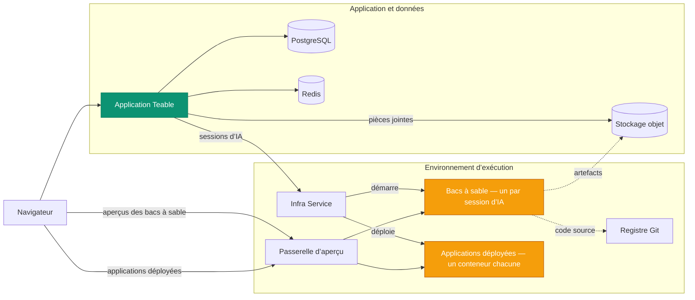

L’auto-hébergement de Teable déploie quatre plateformes en une :

- **Un bac à sable sécurisé et évolutif pour les agents** — chaque session d’IA s’exécute dans son propre conteneur isolé, démarré à la demande et supprimé à la fin de la session.
- **Une plateforme de déploiement d’applications économe en ressources** — chaque application que votre équipe crée et publie s’exécute dans son propre conteneur léger et durable.
- **Un moteur de flux de travail d’IA** — des automatisations déclenchées par les modifications d’enregistrements, les planifications et les webhooks, avec des étapes d’IA, s’exécutant là où résident vos données.
- **Une plateforme complète de collaboration sur des bases de données PostgreSQL** — tables, vues et API.

L’auto-hébergement de Teable intègre votre propre puissance de calcul dans un **environnement de productivité entièrement contrôlé et prêt pour les agents** — mettant l’IA entre les mains de tous les membres de votre équipe.

Cette page explique les services sous-jacents et la manière dont ils s’articulent. Les ressources déployables (fichiers Compose, chart Helm, valeurs) se trouvent dans [teableio/teable-deployment](https://github.com/teableio/teable-deployment).

<Tip>Les fonctionnalités d’IA sont disponibles avec l’offre Business auto-hébergée et les offres supérieures.</Tip>

## Ce qu’exécute un déploiement

| Service | Rôle |
|---|---|
| **Application Teable** | Interface Web, API, automatisations, chat IA — une image unique : `ghcr.io/teableio/teable` |
| **PostgreSQL** | La base de données principale : toutes vos tables, vues et métadonnées |
| **Redis** | Cache, files d’attente, collaboration en temps réel |
| **Stockage d’objets** | Stockage de fichiers compatible S3 avec trois compartiments : **public** (avatars et autres ressources publiques), **privé** (pièces jointes), **artefacts de build** (sortie d’App Builder) |
| **Service d’infrastructure** | Le point d’entrée unique auquel l’application Teable se connecte ; coordonne les builds et les déploiements d’applications, avec sa propre console et son API |
| **Moteur de bac à sable** | Exécute chaque session d’IA dans son propre conteneur isolé |
| **Registre Git** | Stocke le code source des applications que vous créez (App Builder y envoie le code) |
| **Passerelle d’aperçu** | Achemine les navigateurs vers les aperçus de bac à sable et les applications déployées |

Les quatre derniers constituent le plan d’exécution. Les ressources de déploiement installent l’ensemble sous la forme d’une seule plateforme.

## Comment les éléments s’articulent

L’application Teable communique avec le plan d’exécution par **une seule connexion** : le service d’infrastructure (`TEABLE_INFRA_API_URL` / `TEABLE_INFRA_API_KEY`). Tout ce qui se trouve derrière est interne. Deux types de charges de travail assurent le véritable fonctionnement — et ce sont eux qui consomment les ressources de votre machine :

- **Bacs à sable.** Chaque session de chat IA ou d’App Builder reçoit son propre conteneur isolé, démarré au début de la session et supprimé à sa fin. Il s’agit de la charge principale de la plateforme, et elle arrive par pics : dimensionnez votre machine selon le **nombre maximal de sessions d’IA simultanées**, et non selon le nombre d’utilisateurs (les limites de ressources par bac à sable peuvent être définies dans le panneau d’administration).
- **Applications déployées.** Chaque application publiée par un utilisateur s’exécute dans son propre conteneur durable, accessible à `*.app.<domain>`. Les bacs à sable apparaissent et disparaissent ; les applications déployées s’accumulent et continuent de s’exécuter.

Les autres services jouent un rôle de support : les builds s’effectuent dans le bac à sable de la session, le registre Git et le stockage d’objets conservent ce qu’il produit (code source et artefacts de build), et la passerelle achemine chaque requête du navigateur vers le bon bac à sable ou la bonne application.

## Un domaine, quatre enregistrements DNS

Tout est servi sous **un domaine de base** — généralement un sous-domaine qui vous appartient, tel que `teable.example.com` :

| Enregistrement | Sert |
|---|---|
| `<domain>` | L’application Teable |
| `infra.<domain>` | La console et l’API du service d’infrastructure ; Git (`/git`) et le stockage d’objets sont également servis depuis des chemins sur cet hôte |
| `*.app.<domain>` | Les applications que vous avez créées et déployées |
| `*.sandbox.<domain>` | Les aperçus de bac à sable dans le navigateur |

Chaque nom n’est qu’une valeur par défaut, et chaque nom d’hôte peut être remplacé individuellement (consultez l’exemple de valeurs dans le dépôt de déploiement).

## Gestion des versions

La plateforme est fournie sous forme de **versions de plateforme** (`v<year>.<month>.<seq>`) du dépôt de déploiement :

- Une **étiquette** de version est un instantané vérifié : `versions.yaml` fige la version exacte de chaque composant, et le fichier `CHANGELOG.md` du dépôt indique ce qui a changé et ce que vous devez éventuellement faire.
- La branche `main` du dépôt correspond à la dernière version en continu.
- Le script **doctor** inclus compare ce qu’exécute réellement votre déploiement à la version et renvoie l’un des trois résultats suivants : compatible, mettre à niveau l’application Teable, ou combinaison inconnue (non vérifiée).

L’application Teable possède sa propre ligne de versions (étiquettes basées sur les dates ; `latest` est le canal stable) — consultez [Mise à niveau de version](/fr/deploy/upgrade). Chaque version de plateforme indique les versions d’application avec lesquelles elle a été vérifiée, et le script doctor le contrôle pour vous. L’agent de bac à sable derrière les sessions d’IA suit toujours la version de l’application de son côté — il n’y a rien de supplémentaire à mettre à niveau ou à gérer.

## Déployer la plateforme

Les deux méthodes installent la plateforme complète et sont documentées de bout en bout dans le dépôt de déploiement :

<CardGroup cols={2}>
  <Card title="Docker tout-en-un" icon="docker" href="https://github.com/teableio/teable-deployment/blob/main/docker/all-in-one/README.md">
    Tout sur une seule machine — premier déploiement complet, mode `local` ou `server`.
  </Card>
  <Card title="Kubernetes (Helm)" icon="dharmachakra" href="https://github.com/teableio/teable-deployment/blob/main/helm/README.md">
    Un seul chart Helm sur un cluster existant ; seul `global.baseDomain` est requis.
  </Card>
</CardGroup>

Vous n’avez pas encore besoin d’IA ? Vous pouvez exécuter uniquement l’application avec PostgreSQL, Redis et le stockage — un déploiement **autonome** ([Déploiement Docker](/fr/deploy/docker)) — puis ajouter le plan d’exécution plus tard, sans déplacer vos données.

Sujets connexes, tous maintenus dans le dépôt de déploiement :

- **Teable autonome déjà en cours d’exécution ?** Vos données restent en place — le plan d’exécution s’installe à côté : [guide de migration](https://github.com/teableio/teable-deployment/blob/main/migration/2026-07-basic-to-full-featured.md)
- **Certificats internes à l’entreprise ?** Si votre domaine utilise une AC privée ou d’entreprise, les bacs à sable doivent être configurés pour lui faire confiance — [private-ca.md](https://github.com/teableio/teable-deployment/blob/main/helm/private-ca.md)
- **Dimensionnement, versions et miroirs** : [VERSIONS.md](https://github.com/teableio/teable-deployment/blob/main/VERSIONS.md) · [images/README.md](https://github.com/teableio/teable-deployment/blob/main/images/README.md)
- **En cas d’échec** : exécutez d’abord le script doctor, puis consultez [TROUBLESHOOTING.md](https://github.com/teableio/teable-deployment/blob/main/TROUBLESHOOTING.md)

Après le déploiement, connectez l’application Teable au plan d’exécution avec `TEABLE_INFRA_API_URL` / `TEABLE_INFRA_API_KEY` (les guides de déploiement expliquent cette procédure), puis définissez les limites de ressources dans [Panneau d’administration → Agent de bac à sable](/fr/basic/admin-panel/sandbox-agent).
