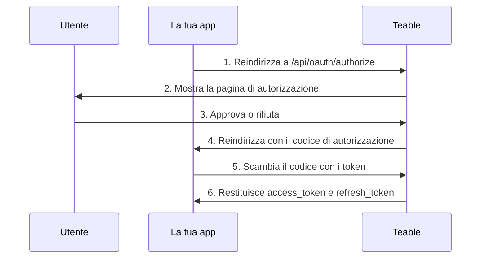

Le app OAuth consentono alle applicazioni di terze parti di accedere a Teable per conto degli utenti. Questa guida spiega come creare e configurare un'app OAuth, implementare il flusso di autorizzazione OAuth 2.0 e utilizzare i token di accesso per interagire con l'API di Teable.

Teable supporta tre modalità di autorizzazione OAuth 2.0:

- **Codice di autorizzazione + Segreto client**: per le applicazioni web dotate di server backend
- **Codice di autorizzazione + PKCE**: per app native, strumenti CLI, SPA e altri client pubblici che non possono archiviare in modo sicuro un segreto client
- **Concessione di autorizzazione del dispositivo**: per i client che non possono ricevere alcun reindirizzamento del browser, ad esempio una CLI eseguita tramite SSH, in un container o in un IDE cloud

## Creare un'app OAuth

1. Nel tuo account Teable, vai a [Impostazioni > App OAuth](https://app.teable.ai/setting/oauth-app).
2. Fai clic su **Nuova app OAuth** per creare una nuova applicazione.
3. Compila le informazioni richieste:
   - **Nome dell'app OAuth**: un nome descrittivo per l'applicazione
   - **URL della home page**: l'URL completo del sito web dell'applicazione
   - **URL di callback**: l'URL al quale verranno reindirizzati gli utenti dopo l'autorizzazione
   - **Ambiti**: le autorizzazioni necessarie all'applicazione
   - **Abilita flusso del dispositivo**: disattivato per impostazione predefinita. Attivalo soltanto se l'applicazione esegue l'accesso degli utenti tramite un codice dispositivo

4. Dopo aver creato l'app, genera un **Segreto client**. Assicurati di copiarlo e conservarlo in modo sicuro: non potrai visualizzarlo di nuovo.

<Note>Riceverai un **ID client** e dovrai generare un **Segreto client**. Conserva queste credenziali in modo sicuro e non esporle mai nel codice lato client. Se utilizzi il flusso PKCE, il segreto client non è necessario.</Note>

## Ambiti disponibili {#available-scopes}

Gli ambiti definiscono le azioni che l'app OAuth può eseguire. Gli ambiti disponibili sono organizzati per tipo di risorsa:

| Risorsa | Ambiti |
|----------|--------|
| **App** | `app\|create`, `app\|read`, `app\|update`, `app\|delete` |
| **Base** | `base\|read`, `base\|read_all`, `base\|update`, `base\|table_import`, `base\|table_export`, `base\|query_data` |
| **Tabella** | `table\|create`, `table\|delete`, `table\|export`, `table\|import`, `table\|read`, `table\|update`, `table\|trash_read`, `table\|trash_update`, `table\|trash_reset` |
| **Vista** | `view\|create`, `view\|delete`, `view\|read`, `view\|update` |
| **Campo** | `field\|create`, `field\|delete`, `field\|read`, `field\|update` |
| **Record** | `record\|comment`, `record\|create`, `record\|delete`, `record\|read`, `record\|update` |
| **Automazione** | `automation\|create`, `automation\|delete`, `automation\|read`, `automation\|update` |
| **Utente** | `user\|email_read`, `user\|integrations` |

<Tip>Richiedi soltanto gli ambiti effettivamente necessari all'applicazione. Durante l'autorizzazione, gli utenti vedranno le autorizzazioni richieste.</Tip>

## Flusso del codice di autorizzazione OAuth 2.0

Teable implementa il flusso standard del codice di autorizzazione OAuth 2.0:



### Passaggio 1: reindirizzare gli utenti all'autorizzazione

Indirizza gli utenti all'endpoint di autorizzazione con i parametri della tua applicazione:

```
GET https://app.teable.ai/api/oauth/authorize
```

**Parametri di query:**

| Parametro | Obbligatorio | Descrizione |
|-----------|----------|-------------|
| `response_type` | Sì | Deve essere `code` |
| `client_id` | Sì | ID client dell'app OAuth |
| `redirect_uri` | No | Deve corrispondere a uno degli URL di callback registrati. Se omesso, verrà utilizzato il primo URL di callback registrato |
| `scope` | No | Elenco di ambiti separati da spazi. Se omesso, utilizza gli ambiti configurati nell'app OAuth |
| `state` | No | Stringa casuale per prevenire attacchi CSRF. Verrà restituita nel callback |

**Esempio:**

```
https://app.teable.ai/api/oauth/authorize?response_type=code&client_id=YOUR_CLIENT_ID&redirect_uri=https://yourapp.com/callback&scope=table|read%20record|read&state=random_state_string
```

### Passaggio 2: autorizzazione dell'utente

Gli utenti vedranno una pagina di autorizzazione contenente:
- Il nome e il logo dell'applicazione
- Le autorizzazioni richieste (ambiti)
- Le opzioni per approvare o negare l'accesso

Se l'utente ha già autorizzato l'app in precedenza (per impostazione predefinita, negli ultimi 7 giorni), verrà reindirizzato immediatamente senza visualizzare nuovamente la pagina di autorizzazione.

### Passaggio 3: gestire il callback

Dopo l'approvazione (o il rifiuto) dell'utente, Teable reindirizza all'URL di callback:

**In caso di successo:**
```
https://yourapp.com/callback?code=AUTHORIZATION_CODE&state=random_state_string
```

**In caso di rifiuto:**
```
https://yourapp.com/callback?error=access_denied&state=random_state_string
```

### Passaggio 4: scambiare il codice con i token

Scambia il codice di autorizzazione con i token di accesso e di aggiornamento:

```
POST https://app.teable.ai/api/oauth/access_token
Content-Type: application/x-www-form-urlencoded
```

**Corpo della richiesta:**

| Parametro | Obbligatorio | Descrizione |
|-----------|----------|-------------|
| `grant_type` | Sì | Deve essere `authorization_code` |
| `code` | Sì | Codice di autorizzazione ricevuto |
| `client_id` | Sì | ID client dell'app OAuth |
| `client_secret` | Sì | Segreto client dell'app OAuth |
| `redirect_uri` | Sì | Deve corrispondere esattamente al redirect_uri utilizzato per l'autorizzazione |

**Richiesta di esempio:**

```bash
curl -X POST https://app.teable.ai/api/oauth/access_token \
  -H "Content-Type: application/x-www-form-urlencoded" \
  -d "grant_type=authorization_code" \
  -d "code=AUTHORIZATION_CODE" \
  -d "client_id=YOUR_CLIENT_ID" \
  -d "client_secret=YOUR_CLIENT_SECRET" \
  -d "redirect_uri=https://yourapp.com/callback"
```

**Risposta:**

```json
{
  "token_type": "Bearer",
  "access_token": "teable_xxxxxxxxxxxx",
  "refresh_token": "eyJhbGciOiJIUzI1NiIsInR5cCI6IkpXVCJ9...",
  "expires_in": 600,
  "refresh_expires_in": 2592000,
  "scopes": ["table|read", "record|read"]
}
```

| Campo | Descrizione |
|-------|-------------|
| `token_type` | Sempre `Bearer` |
| `access_token` | Token da utilizzare per le richieste API |
| `refresh_token` | Token per ottenere nuovi token di accesso |
| `expires_in` | Durata del token di accesso in secondi (valore predefinito: 600 = 10 minuti) |
| `refresh_expires_in` | Durata del token di aggiornamento in secondi (valore predefinito: 2592000 = 30 giorni) |
| `scopes` | Array degli ambiti concessi |

## Flusso di autorizzazione PKCE

PKCE (Proof Key for Code Exchange) è progettato per le applicazioni che non possono archiviare in modo sicuro un segreto client, ad esempio app desktop native, app mobili, strumenti CLI o applicazioni a pagina singola.

### Passaggio 1: generare i parametri PKCE

Prima di avviare l'autorizzazione, il client deve generare una coppia di parametri PKCE:

```javascript
// Genera code_verifier (stringa casuale di 43-128 caratteri)
const codeVerifier = generateRandomString(43);

// Genera code_challenge = BASE64URL(SHA256(code_verifier))
const encoder = new TextEncoder();
const data = encoder.encode(codeVerifier);
const digest = await crypto.subtle.digest('SHA-256', data);
const codeChallenge = btoa(String.fromCharCode(...new Uint8Array(digest)))
  .replace(/\+/g, '-').replace(/\//g, '_').replace(/=+$/, '');
```

### Passaggio 2: reindirizzare gli utenti all'autorizzazione

```
GET https://app.teable.ai/api/oauth/authorize
```

**Parametri di query:**

| Parametro | Obbligatorio | Descrizione |
|-----------|----------|-------------|
| `response_type` | Sì | Deve essere `code` |
| `client_id` | Sì | ID client dell'app OAuth |
| `redirect_uri` | No | URL di callback. La modalità PKCE supporta gli indirizzi di loopback |
| `scope` | No | Elenco di ambiti separati da spazi |
| `state` | No | Stringa casuale per prevenire attacchi CSRF |
| `code_challenge` | Sì | Hash SHA-256 del code_verifier (codificato in Base64URL) |
| `code_challenge_method` | Sì | Deve essere `S256` |

**Esempio:**

```
https://app.teable.ai/api/oauth/authorize?response_type=code&client_id=YOUR_CLIENT_ID&redirect_uri=http://127.0.0.1:8080/callback&code_challenge=YOUR_CODE_CHALLENGE&code_challenge_method=S256&state=random_state_string
```

<Tip>In modalità PKCE, `redirect_uri` supporta gli indirizzi di loopback (`http://127.0.0.1`, `http://[::1]`, `http://localhost`) con corrispondenza flessibile della porta: non è necessario registrare ogni porta esatta.</Tip>

### Passaggio 3: gestire il callback

Come nel flusso standard del codice di autorizzazione: dopo l'approvazione dell'utente, il codice di autorizzazione viene restituito tramite reindirizzamento.

### Passaggio 4: scambiare il codice + code_verifier con i token

```
POST https://app.teable.ai/api/oauth/access_token
Content-Type: application/x-www-form-urlencoded
```

**Corpo della richiesta:**

| Parametro | Obbligatorio | Descrizione |
|-----------|----------|-------------|
| `grant_type` | Sì | Deve essere `authorization_code` |
| `code` | Sì | Codice di autorizzazione ricevuto |
| `client_id` | Sì | ID client dell'app OAuth |
| `code_verifier` | Sì | Stringa casuale originale generata nel Passaggio 1 |
| `redirect_uri` | Sì | Deve corrispondere esattamente al redirect_uri utilizzato per l'autorizzazione |

<Note>La modalità PKCE non richiede `client_secret`. Al suo posto viene utilizzato `code_verifier` per verificare l'identità del client.</Note>

**Richiesta di esempio:**

```bash
curl -X POST https://app.teable.ai/api/oauth/access_token \
  -H "Content-Type: application/x-www-form-urlencoded" \
  -d "grant_type=authorization_code" \
  -d "code=AUTHORIZATION_CODE" \
  -d "client_id=YOUR_CLIENT_ID" \
  -d "code_verifier=YOUR_CODE_VERIFIER" \
  -d "redirect_uri=http://127.0.0.1:8080/callback"
```

Il formato della risposta è identico a quello del flusso standard del codice di autorizzazione.

## Flusso di autorizzazione del dispositivo

La concessione di autorizzazione del dispositivo ([RFC 8628](https://datatracker.ietf.org/doc/html/rfc8628)) è destinata ai client che non possono ricevere un reindirizzamento del browser: una CLI eseguita tramite SSH, all'interno di un container o in un IDE cloud. Il client mostra un URL e un breve codice, l'utente approva in qualsiasi browser e non deve digitare nulla nel terminale.

Teable segue la specifica RFC 8628, pertanto la maggior parte delle librerie client OAuth può gestire questo flusso senza codice personalizzato. Di seguito sono riportati gli aspetti specifici di Teable.

<Warning>Il flusso del dispositivo è disattivato per impostazione predefinita. Prima di utilizzarlo, attiva **Abilita flusso del dispositivo** nelle impostazioni dell'app OAuth. Chiunque conosca il tuo ID client può avviare questo flusso a nome della tua app, quindi abilitalo soltanto se è necessario. Disattivandolo nuovamente, verranno interrotte anche le richieste già in attesa di approvazione.</Warning>

### Richiedere un codice dispositivo

`POST /api/oauth/device/code` con il tuo `client_id` e un `scope` facoltativo. L'endpoint è anonimo e soggetto a un limite di frequenza di 30 richieste ogni 15 minuti per indirizzo IP.

```json
{
  "device_code": "xxxxxxxxxxxx",
  "user_code": "BCDF-GHJK",
  "verification_uri": "https://app.teable.ai/oauth/device",
  "expires_in": 900,
  "interval": 5
}
```

Entrambi i codici scadono dopo 15 minuti (`BACKEND_OAUTH_DEVICE_CODE_EXPIRE_IN`) e `interval` indica il numero minimo di secondi da attendere tra i tentativi di polling.

Mostra `verification_uri` e `user_code`. In quella pagina l'utente accede, inserisce il codice ed esamina il nome dell'app, la home page e gli ambiti richiesti prima di approvare o rifiutare. La pagina avverte di non approvare un codice la cui procedura non è stata avviata personalmente. Ogni codice può essere utilizzato una sola volta.

<Note>Teable non restituisce `verification_uri_complete` e il client non deve crearne uno. Un codice approvato consente all'utente che lo approva di accedere al proprio account Teable, pertanto un link che contiene già il codice è esattamente ciò su cui si basa il phishing tramite codice dispositivo.</Note>

### Eseguire il polling per ottenere i token

`POST /api/oauth/access_token` con `grant_type=urn:ietf:params:oauth:grant-type:device_code`, il `device_code` e il tuo `client_id`. I client pubblici non inviano alcun `client_secret`; i client riservati lo aggiungono come negli altri flussi.

Finché qualcuno non approva il codice, l'endpoint risponde con un errore anziché con i token:

| Errore | Azione che il client deve eseguire |
|-------|----------------------------|
| `authorization_pending` | Nessuno ha ancora approvato. Continua il polling all'intervallo `interval` |
| `slow_down` | Il polling è troppo rapido. Attendi più a lungo prima del tentativo successivo |
| `access_denied` | L'utente ha rifiutato la richiesta. Interrompi il polling |
| `expired_token` | Il codice è scaduto o è già stato utilizzato. Ricomincia |

Dopo l'approvazione dell'utente, la risposta contiene lo stesso payload di token degli altri flussi.

## Utilizzare i token di accesso

Includi il token di accesso nell'header `Authorization` delle richieste API:

```bash
curl https://app.teable.ai/api/table/TABLE_ID/record \
  -H "Authorization: Bearer YOUR_ACCESS_TOKEN"
```

In genere, il primo passaggio dopo aver ottenuto un token consiste nel recuperare tutte le Base accessibili all'utente corrente:

```bash
curl https://app.teable.ai/api/base/access/all \
  -H "Authorization: Bearer YOUR_ACCESS_TOKEN"
```

Questo endpoint restituisce tutte le Base a cui l'utente corrente è autorizzato ad accedere. Puoi utilizzare il `baseId` presente nella risposta per le chiamate API successive.

## Aggiornare i token di accesso

Quando un token di accesso scade, utilizza il token di aggiornamento per ottenerne uno nuovo:

```
POST https://app.teable.ai/api/oauth/access_token
Content-Type: application/x-www-form-urlencoded
```

**Corpo della richiesta:**

| Parametro | Obbligatorio | Descrizione |
|-----------|----------|-------------|
| `grant_type` | Sì | Deve essere `refresh_token` |
| `refresh_token` | Sì | Token di aggiornamento corrente |
| `client_id` | Sì | ID client dell'app OAuth |
| `client_secret` | Condizionale | Obbligatorio per la modalità standard con codice di autorizzazione, non necessario per la modalità PKCE |

**Richiesta di esempio:**

```bash
curl -X POST https://app.teable.ai/api/oauth/access_token \
  -H "Content-Type: application/x-www-form-urlencoded" \
  -d "grant_type=refresh_token" \
  -d "refresh_token=YOUR_REFRESH_TOKEN" \
  -d "client_id=YOUR_CLIENT_ID" \
  -d "client_secret=YOUR_CLIENT_SECRET"
```

<Warning>Dopo l'aggiornamento, il token di aggiornamento precedente perde validità (rotazione del token di aggiornamento). Archivia sempre il nuovo token di aggiornamento restituito nella risposta.</Warning>

## Revocare l'accesso

### Per i proprietari di app OAuth

Revoca l'accesso dell'app per **tutti gli utenti** (soltanto l'autore dell'app può farlo):

```
POST https://app.teable.ai/api/oauth/client/{clientId}/revoke-access
```

Questa operazione elimina i record di autorizzazione e i token di tutti gli utenti, impedendo completamente all'app di accedere ai dati di qualsiasi utente.

### Per gli utenti

Revoca la **tua** autorizzazione per una determinata app:

```
POST https://app.teable.ai/api/oauth/client/{clientId}/revoke-token
```

Questa operazione invalida soltanto i token di accesso e di aggiornamento dell'utente corrente, senza influire sugli altri utenti.

Gli utenti possono revocare l'accesso anche tramite la pagina delle impostazioni [App autorizzate](https://app.teable.ai/setting/authorized-apps).

### Per le applicazioni

Le applicazioni possono revocare il proprio accesso utilizzando un token di accesso:

```
GET https://app.teable.ai/api/oauth/client/{clientId}/revoke-token
Authorization: Bearer YOUR_ACCESS_TOKEN
```

<Note>Questo endpoint accetta soltanto l'autenticazione con token di accesso, non l'autenticazione della sessione.</Note>

## Scadenza dei token

| Tipo di token | Scadenza predefinita | Configurabile tramite |
|------------|-------------------|------------------|
| Codice di autorizzazione | 5 minuti | `BACKEND_OAUTH_CODE_EXPIRE_IN` |
| Codice dispositivo | 15 minuti | `BACKEND_OAUTH_DEVICE_CODE_EXPIRE_IN` |
| Token di accesso | 10 minuti | `BACKEND_OAUTH_ACCESS_TOKEN_EXPIRE_IN` |
| Token di aggiornamento | 30 giorni | `BACKEND_OAUTH_REFRESH_TOKEN_EXPIRE_IN` |
| Memoria dell'autorizzazione | 7 giorni | `BACKEND_OAUTH_AUTHORIZED_EXPIRE_IN` |

## Gestione degli errori

Risposte di errore comuni:

| Errore | Descrizione |
|-------|-------------|
| `invalid_client` | ID client o Segreto client non valido |
| `invalid_grant` | Codice di autorizzazione scaduto o già utilizzato |
| `invalid_scope` | L'ambito richiesto non è consentito per questa app OAuth |
| `access_denied` | L'utente ha rifiutato la richiesta di autorizzazione |
| `redirect_uri_mismatch` | L'URI di reindirizzamento non corrisponde agli URL registrati |
| `unauthorized_client` | L'app OAuth non ha abilitato il flusso del dispositivo |
| `too_many_requests` | Limite di frequenza superato. Per impostazione predefinita, le richieste di token sono limitate a 30 ogni 15 minuti e le richieste di codice dispositivo a 30 ogni 15 minuti per indirizzo IP |

## Procedure consigliate

1. **Scegli la modalità corretta**: usa la modalità con segreto client per le app web dotate di backend, la modalità PKCE per app native, CLI o SPA e il flusso del dispositivo quando il client non può ricevere un reindirizzamento del browser
2. **Archivia i segreti in modo sicuro**: non esporre mai il Segreto client nel codice lato client
3. **Usa il parametro state**: includi sempre un parametro casuale `state` per prevenire attacchi CSRF
4. **Richiedi gli ambiti minimi**: richiedi soltanto le autorizzazioni effettivamente necessarie all'applicazione
5. **Gestisci l'aggiornamento dei token**: implementa l'aggiornamento automatico dei token prima della scadenza
6. **Proteggi l'archiviazione dei token**: archivia in modo sicuro sul server i token di accesso e di aggiornamento

## Esempi completi

### Node.js (Codice di autorizzazione + Segreto client)

```javascript
const express = require('express');
const crypto = require('crypto');
const app = express();

const CLIENT_ID = 'your_client_id';
const CLIENT_SECRET = 'your_client_secret';
const REDIRECT_URI = 'http://localhost:3000/callback';
const TEABLE_URL = 'https://app.teable.ai';

// Passaggio 1: reindirizza l'utente all'autorizzazione
app.get('/login', (req, res) => {
  const state = crypto.randomBytes(16).toString('hex');
  req.session.oauthState = state; // Salva state nella sessione
  const authUrl = `${TEABLE_URL}/api/oauth/authorize?` +
    `response_type=code&` +
    `client_id=${CLIENT_ID}&` +
    `redirect_uri=${encodeURIComponent(REDIRECT_URI)}&` +
    `scope=${encodeURIComponent('record|read table|read')}&` +
    `state=${state}`;
  res.redirect(authUrl);
});

// Passaggio 2: gestisci il callback e scambia il codice con i token
app.get('/callback', async (req, res) => {
  const { code, state } = req.query;

  // Verifica state per prevenire attacchi CSRF
  if (state !== req.session.oauthState) {
    return res.status(403).send('Stato non valido');
  }

  const response = await fetch(`${TEABLE_URL}/api/oauth/access_token`, {
    method: 'POST',
    headers: { 'Content-Type': 'application/x-www-form-urlencoded' },
    body: new URLSearchParams({
      grant_type: 'authorization_code',
      client_id: CLIENT_ID,
      client_secret: CLIENT_SECRET,
      code,
      redirect_uri: REDIRECT_URI,
    }),
  });

  const tokens = await response.json();
  // tokens.access_token — da usare per le chiamate API
  // tokens.refresh_token — da usare per aggiornare i token
  res.json({ success: true, scopes: tokens.scopes });
});

app.listen(3000);
```

### Python (modalità PKCE per strumenti CLI)

```python
import hashlib
import base64
import secrets
import http.server
import urllib.parse
import requests

CLIENT_ID = 'your_client_id'
TEABLE_URL = 'https://app.teable.ai'
PORT = 8080
REDIRECT_URI = f'http://127.0.0.1:{PORT}/callback'

# Passaggio 1: genera i parametri PKCE
code_verifier = secrets.token_urlsafe(32)  # 43 caratteri
code_challenge = base64.urlsafe_b64encode(
    hashlib.sha256(code_verifier.encode()).digest()
).rstrip(b'=').decode()

# Passaggio 2: crea l'URL di autorizzazione (da aprire nel browser)
auth_url = (
    f"{TEABLE_URL}/api/oauth/authorize?"
    f"response_type=code&"
    f"client_id={CLIENT_ID}&"
    f"redirect_uri={urllib.parse.quote(REDIRECT_URI)}&"
    f"code_challenge={code_challenge}&"
    f"code_challenge_method=S256"
)
print(f"Apri nel browser:\n{auth_url}")

# Passaggio 3: avvia il server locale per ricevere il callback
authorization_code = None

class CallbackHandler(http.server.BaseHTTPRequestHandler):
    def do_GET(self):
        global authorization_code
        query = urllib.parse.urlparse(self.path).query
        params = urllib.parse.parse_qs(query)
        authorization_code = params.get('code', [None])[0]
        self.send_response(200)
        self.end_headers()
        self.wfile.write(b'Autorizzazione riuscita! Ora puoi chiudere questa pagina.')

    def log_message(self, format, *args):
        pass  # Disattiva i log

server = http.server.HTTPServer(('127.0.0.1', PORT), CallbackHandler)
server.handle_request()  # Gestisce una singola richiesta

# Passaggio 4: scambia il codice + code_verifier con i token
response = requests.post(f"{TEABLE_URL}/api/oauth/access_token", data={
    'grant_type': 'authorization_code',
    'client_id': CLIENT_ID,
    'code': authorization_code,
    'redirect_uri': REDIRECT_URI,
    'code_verifier': code_verifier,
})

tokens = response.json()
print(f"Token di accesso: {tokens['access_token']}")
print(f"Scade tra: {tokens['expires_in']}s")
```
