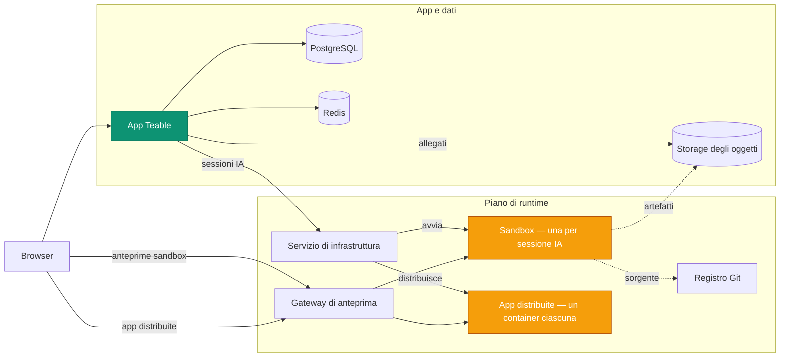

L'hosting autonomo di Teable distribuisce quattro piattaforme in una:

- **Una sandbox sicura e scalabile per agenti** — ogni sessione IA viene eseguita in un
  container isolato dedicato, avviato su richiesta e rimosso al termine della sessione.
- **Una piattaforma efficiente per il deployment delle app** — ogni app creata e
  pubblicata dal team viene eseguita nel proprio container leggero e persistente.
- **Un motore di workflow IA** — Automazioni attivate da modifiche ai Record,
  pianificazioni e webhook, con passaggi IA eseguiti dove risiedono i dati.
- **Una piattaforma completa di collaborazione su database PostgreSQL** — Tabelle,
  Viste e API.

L'hosting autonomo di Teable trasforma le tue risorse di calcolo in un **ambiente di
produttività pronto per gli agenti e completamente controllato**, mettendo l'IA
a disposizione di tutto il team.

Questa pagina descrive i servizi alla base della piattaforma e come interagiscono.
Le risorse distribuibili (file Compose, chart Helm e valori) si trovano in
[teableio/teable-deployment](https://github.com/teableio/teable-deployment).

<Tip>Le funzionalità IA sono disponibili con il piano self-hosted Business e superiori.</Tip>

## Servizi eseguiti da un deployment

| Servizio | Scopo |
|---|---|
| **App Teable** | Interfaccia web, API, Automazioni e AI Chat, il tutto in un'unica immagine: `ghcr.io/teableio/teable` |
| **PostgreSQL** | Il database principale: tutte le Tabelle, le Viste e i metadati |
| **Redis** | Cache, code e collaborazione in tempo reale |
| **Storage degli oggetti** | Storage di file compatibile con S3 con tre bucket: **pubblico** (avatar e altre risorse pubbliche), **privato** (allegati), **artefatti di build** (output di App Builder) |
| **Servizio di infrastruttura** | L'unico punto di ingresso a cui si collega l'app Teable; coordina le build e i deployment delle app, con una propria console e API |
| **Motore sandbox** | Esegue ogni sessione IA nel proprio container isolato |
| **Registro Git** | Archivia il codice sorgente delle app create (App Builder esegue il push qui) |
| **Gateway di anteprima** | Instrada i browser verso le anteprime sandbox e le app distribuite |

Gli ultimi quattro servizi costituiscono il piano di runtime. Le risorse di deployment
installano tutto questo come un'unica piattaforma.

## Come interagiscono i componenti

L'app Teable comunica con il piano di runtime tramite **un'unica connessione**: il
Servizio di infrastruttura (`TEABLE_INFRA_API_URL` / `TEABLE_INFRA_API_KEY`). Tutto ciò
che si trova dietro di esso è interno. Due tipi di carico di lavoro svolgono le attività
effettive e consumano le risorse della macchina:

- **Sandbox.** Ogni sessione di AI Chat o App Builder riceve un proprio container
  isolato, avviato all'inizio della sessione e rimosso al termine. È il carico
  principale della piattaforma e si presenta a picchi: dimensiona la macchina in base
  alle **sessioni IA simultanee di picco**, non al numero di utenti (i limiti di risorse
  per sandbox possono essere impostati nell'Amministrazione di sistema).
- **App distribuite.** Ogni app pubblicata viene eseguita nel proprio container
  persistente, disponibile all'indirizzo `*.app.<domain>`. Le sandbox vengono create
  e rimosse; le app distribuite si accumulano e rimangono in esecuzione.

Gli altri servizi svolgono funzioni di supporto: la build avviene nella sandbox della
sessione, il registro Git e lo storage degli oggetti conservano ciò che viene prodotto
(codice sorgente e artefatti di build), mentre il gateway instrada ogni richiesta del
browser verso la sandbox o l'app corretta.

## Un dominio, quattro record DNS

Tutto viene pubblicato sotto **un unico dominio di base**, in genere un tuo sottodominio,
come `teable.example.com`:

| Record | Servizio fornito |
|---|---|
| `<domain>` | L'app Teable |
| `infra.<domain>` | La console e l'API del Servizio di infrastruttura; anche Git (`/git`) e lo storage degli oggetti vengono pubblicati da percorsi di questo host |
| `*.app.<domain>` | Le app create e distribuite |
| `*.sandbox.<domain>` | Le anteprime sandbox nel browser |

Ogni nome è solo un valore predefinito e ciascun hostname può essere sovrascritto
singolarmente (consulta l'esempio dei valori nel repository di deployment).

## Gestione delle versioni

La piattaforma viene distribuita tramite **release della piattaforma** (`v<year>.<month>.<seq>`) nel
repository di deployment:

- Un **tag** di release è uno snapshot verificato: `versions.yaml` blocca la versione
  esatta di ogni componente e il file `CHANGELOG.md` del repository indica cosa è
  cambiato e quali eventuali operazioni sono necessarie.
- Il branch `main` del repository contiene sempre la versione più recente.
- Lo script **doctor** incluso confronta ciò che il deployment esegue effettivamente
  con la release e segnala uno di tre risultati: compatibile, app Teable da aggiornare
  oppure combinazione sconosciuta (non verificata).

L'app Teable segue una propria linea di release (tag basati sulla data; `latest` è il
canale stabile): consulta [Aggiornamento della versione](/it/deploy/upgrade). Ogni release
della piattaforma indica le versioni dell'app con cui è stata verificata e doctor esegue
questo controllo per te. L'agente sandbox alla base delle sessioni IA segue sempre e
automaticamente la versione dell'app: non occorre aggiornare o gestire altro.

## Eseguire il deployment

Entrambi i percorsi installano l'intera piattaforma e sono documentati dall'inizio alla
fine nel repository di deployment:

<CardGroup cols={2}>
  <Card title="Docker tutto in uno" icon="docker" href="https://github.com/teableio/teable-deployment/blob/main/docker/all-in-one/README.md">
    Tutto su un'unica macchina: primo deployment completo, in modalità `local` o `server`.
  </Card>
  <Card title="Kubernetes (Helm)" icon="dharmachakra" href="https://github.com/teableio/teable-deployment/blob/main/helm/README.md">
    Un unico chart Helm su un cluster esistente; è obbligatorio solo `global.baseDomain`.
  </Card>
</CardGroup>

Non ti serve ancora l'IA? Puoi eseguire soltanto l'app con PostgreSQL, Redis e
storage, tramite un deployment **autonomo** ([Deployment con Docker](/it/deploy/docker)),
e collegare il piano di runtime in seguito, mantenendo i dati esistenti.

Argomenti correlati, tutti gestiti nel repository di deployment:

- **Teable è già in esecuzione in modalità autonoma?** I dati rimangono al loro posto:
  il piano di runtime viene installato accanto all'istanza esistente. Consulta la
  [guida alla migrazione](https://github.com/teableio/teable-deployment/blob/main/migration/2026-07-basic-to-full-featured.md)
- **Certificati aziendali interni?** Se il dominio usa una CA privata o aziendale,
  devi configurare le sandbox in modo che la considerino attendibile. Consulta
  [private-ca.md](https://github.com/teableio/teable-deployment/blob/main/helm/private-ca.md)
- **Dimensionamento, versioni e mirror**: [VERSIONS.md](https://github.com/teableio/teable-deployment/blob/main/VERSIONS.md) ·
  [images/README.md](https://github.com/teableio/teable-deployment/blob/main/images/README.md)
- **Quando qualcosa non funziona**: esegui prima doctor, quindi consulta
  [TROUBLESHOOTING.md](https://github.com/teableio/teable-deployment/blob/main/TROUBLESHOOTING.md)

Dopo il deployment, collega l'app Teable al piano di runtime tramite
`TEABLE_INFRA_API_URL` / `TEABLE_INFRA_API_KEY` (le guide al deployment descrivono
la procedura), quindi imposta i limiti delle risorse in
[Amministrazione di sistema → Agente sandbox](/it/basic/admin-panel/sandbox-agent).
