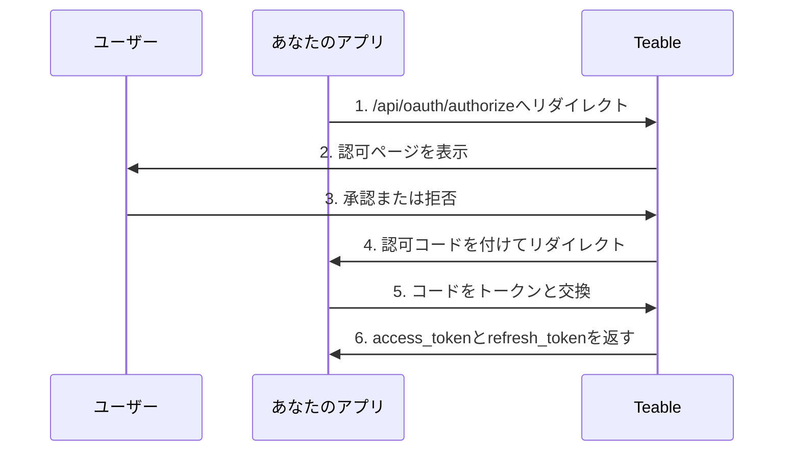

OAuthアプリを使用すると、サードパーティーアプリケーションがユーザーに代わってTeableへアクセスできます。このガイドでは、OAuthアプリの作成と設定、OAuth 2.0認可フローの実装、アクセストークンを使用したTeable APIの操作について説明します。

Teableは、次の3つのOAuth 2.0認可モードに対応しています。

- **認可コード + クライアントシークレット**: バックエンドサーバーを持つWebアプリケーション向け
- **認可コード + PKCE**: クライアントシークレットを安全に保管できないネイティブアプリ、CLIツール、SPA、その他のパブリッククライアント向け
- **デバイス認可グラント**: SSH経由で実行するCLI、コンテナ内、クラウドIDEなど、ブラウザーからのリダイレクトを受信できないクライアント向け

## OAuthアプリを作成する

1. Teableアカウントで[設定 > OAuthアプリ](https://app.teable.ai/setting/oauth-app)を開きます。
2. **新しいOAuthアプリ**をクリックして、新しいアプリケーションを作成します。
3. 必須情報を入力します。
   - **OAuthアプリ名**: アプリケーションの内容がわかる名前
   - **ホームページURL**: アプリケーションのWebサイトの完全なURL
   - **コールバックURL**: 認可後にユーザーがリダイレクトされるURL
   - **スコープ**: アプリケーションに必要な権限
   - **デバイスフローを有効化**: デフォルトではオフです。アプリケーションがデバイスコードを使ってユーザーをサインインさせる場合にのみオンにしてください

4. アプリを作成したら、**クライアントシークレット**を生成します。再表示できないため、必ずコピーして安全に保管してください。

<Note>**クライアントID**が発行され、**クライアントシークレット**を生成する必要があります。これらの認証情報を安全に保管し、クライアント側のコードには絶対に公開しないでください。PKCEフローを使用する場合、クライアントシークレットは不要です。</Note>

## 利用可能なスコープ {#available-scopes}

スコープは、OAuthアプリが実行できる操作を定義します。利用可能なスコープは、リソースの種類ごとに分類されています。

| リソース | スコープ |
|----------|--------|
| **アプリ** | `app\|create`, `app\|read`, `app\|update`, `app\|delete` |
| **ベース** | `base\|read`, `base\|read_all`, `base\|update`, `base\|table_import`, `base\|table_export`, `base\|query_data` |
| **テーブル** | `table\|create`, `table\|delete`, `table\|export`, `table\|import`, `table\|read`, `table\|update`, `table\|trash_read`, `table\|trash_update`, `table\|trash_reset` |
| **ビュー** | `view\|create`, `view\|delete`, `view\|read`, `view\|update` |
| **フィールド** | `field\|create`, `field\|delete`, `field\|read`, `field\|update` |
| **レコード** | `record\|comment`, `record\|create`, `record\|delete`, `record\|read`, `record\|update` |
| **自動化** | `automation\|create`, `automation\|delete`, `automation\|read`, `automation\|update` |
| **ユーザー** | `user\|email_read`, `user\|integrations` |

<Tip>アプリケーションで実際に必要なスコープだけをリクエストしてください。認可時に、要求された権限がユーザーへ表示されます。</Tip>

## OAuth 2.0認可コードフロー

Teableは、標準のOAuth 2.0認可コードフローを実装しています。



### ステップ1: ユーザーを認可ページへリダイレクトする

アプリケーションのパラメーターを指定して、ユーザーを認可エンドポイントへ誘導します。

```
GET https://app.teable.ai/api/oauth/authorize
```

**クエリパラメーター:**

| パラメーター | 必須 | 説明 |
|-----------|----------|-------------|
| `response_type` | はい | `code`である必要があります |
| `client_id` | はい | OAuthアプリのクライアントID |
| `redirect_uri` | いいえ | 登録済みのコールバックURLのいずれかと一致する必要があります。省略した場合は、最初に登録されたコールバックURLが使用されます |
| `scope` | いいえ | スペース区切りのスコープ一覧。省略した場合は、OAuthアプリに設定されたスコープが使用されます |
| `state` | いいえ | CSRF攻撃を防ぐためのランダムな文字列。コールバックでそのまま返されます |

**例:**

```
https://app.teable.ai/api/oauth/authorize?response_type=code&client_id=YOUR_CLIENT_ID&redirect_uri=https://yourapp.com/callback&scope=table|read%20record|read&state=random_state_string
```

### ステップ2: ユーザーによる認可

ユーザーには、次の情報を含む認可ページが表示されます。
- アプリケーションの名前とロゴ
- 要求された権限（スコープ）
- アクセスを許可または拒否するための選択肢

ユーザーが以前にアプリを認可している場合（デフォルトでは7日以内）、認可ページを再表示せず、すぐにリダイレクトされます。

### ステップ3: コールバックを処理する

ユーザーが許可（または拒否）すると、TeableはコールバックURLへリダイレクトします。

**成功時:**
```
https://yourapp.com/callback?code=AUTHORIZATION_CODE&state=random_state_string
```

**拒否時:**
```
https://yourapp.com/callback?error=access_denied&state=random_state_string
```

### ステップ4: コードをトークンと交換する

認可コードをアクセストークンとリフレッシュトークンに交換します。

```
POST https://app.teable.ai/api/oauth/access_token
Content-Type: application/x-www-form-urlencoded
```

**リクエスト本文:**

| パラメーター | 必須 | 説明 |
|-----------|----------|-------------|
| `grant_type` | はい | `authorization_code`である必要があります |
| `code` | はい | 受け取った認可コード |
| `client_id` | はい | OAuthアプリのクライアントID |
| `client_secret` | はい | OAuthアプリのクライアントシークレット |
| `redirect_uri` | はい | 認可時に使用したredirect_uriと完全に一致する必要があります |

**リクエスト例:**

```bash
curl -X POST https://app.teable.ai/api/oauth/access_token \
  -H "Content-Type: application/x-www-form-urlencoded" \
  -d "grant_type=authorization_code" \
  -d "code=AUTHORIZATION_CODE" \
  -d "client_id=YOUR_CLIENT_ID" \
  -d "client_secret=YOUR_CLIENT_SECRET" \
  -d "redirect_uri=https://yourapp.com/callback"
```

**レスポンス:**

```json
{
  "token_type": "Bearer",
  "access_token": "teable_xxxxxxxxxxxx",
  "refresh_token": "eyJhbGciOiJIUzI1NiIsInR5cCI6IkpXVCJ9...",
  "expires_in": 600,
  "refresh_expires_in": 2592000,
  "scopes": ["table|read", "record|read"]
}
```

| フィールド | 説明 |
|-------|-------------|
| `token_type` | 常に`Bearer` |
| `access_token` | APIリクエストに使用するトークン |
| `refresh_token` | 新しいアクセストークンの取得に使用するトークン |
| `expires_in` | アクセストークンの有効期間（秒、デフォルト: 600 = 10分） |
| `refresh_expires_in` | リフレッシュトークンの有効期間（秒、デフォルト: 2592000 = 30日） |
| `scopes` | 付与されたスコープの配列 |

## PKCE認可フロー

PKCE（Proof Key for Code Exchange）は、ネイティブデスクトップアプリ、モバイルアプリ、CLIツール、シングルページアプリケーションなど、クライアントシークレットを安全に保管できないアプリケーション向けに設計されています。

### ステップ1: PKCEパラメーターを生成する

認可を開始する前に、クライアントで一組のPKCEパラメーターを生成する必要があります。

```javascript
// code_verifierを生成する（43～128文字のランダムな文字列）
const codeVerifier = generateRandomString(43);

// code_challenge = BASE64URL(SHA256(code_verifier))を生成する
const encoder = new TextEncoder();
const data = encoder.encode(codeVerifier);
const digest = await crypto.subtle.digest('SHA-256', data);
const codeChallenge = btoa(String.fromCharCode(...new Uint8Array(digest)))
  .replace(/\+/g, '-').replace(/\//g, '_').replace(/=+$/, '');
```

### ステップ2: ユーザーを認可ページへリダイレクトする

```
GET https://app.teable.ai/api/oauth/authorize
```

**クエリパラメーター:**

| パラメーター | 必須 | 説明 |
|-----------|----------|-------------|
| `response_type` | はい | `code`である必要があります |
| `client_id` | はい | OAuthアプリのクライアントID |
| `redirect_uri` | いいえ | コールバックURL。PKCEモードではループバックアドレスを使用できます |
| `scope` | いいえ | スペース区切りのスコープ一覧 |
| `state` | いいえ | CSRF攻撃を防ぐためのランダムな文字列 |
| `code_challenge` | はい | code_verifierのSHA-256ハッシュ（Base64URLエンコード） |
| `code_challenge_method` | はい | `S256`である必要があります |

**例:**

```
https://app.teable.ai/api/oauth/authorize?response_type=code&client_id=YOUR_CLIENT_ID&redirect_uri=http://127.0.0.1:8080/callback&code_challenge=YOUR_CODE_CHALLENGE&code_challenge_method=S256&state=random_state_string
```

<Tip>PKCEモードでは、`redirect_uri`にループバックアドレス（`http://127.0.0.1`、`http://[::1]`、`http://localhost`）を使用でき、ポートは柔軟に照合されます。各ポートを個別に登録する必要はありません。</Tip>

### ステップ3: コールバックを処理する

標準の認可コードフローと同じです。ユーザーが許可すると、リダイレクトを通じて認可コードが返されます。

### ステップ4: コードとcode_verifierをトークンと交換する

```
POST https://app.teable.ai/api/oauth/access_token
Content-Type: application/x-www-form-urlencoded
```

**リクエスト本文:**

| パラメーター | 必須 | 説明 |
|-----------|----------|-------------|
| `grant_type` | はい | `authorization_code`である必要があります |
| `code` | はい | 受け取った認可コード |
| `client_id` | はい | OAuthアプリのクライアントID |
| `code_verifier` | はい | ステップ1で生成した元のランダムな文字列 |
| `redirect_uri` | はい | 認可時に使用したredirect_uriと完全に一致する必要があります |

<Note>PKCEモードでは`client_secret`は不要です。代わりに`code_verifier`を使用して、クライアントの身元を検証します。</Note>

**リクエスト例:**

```bash
curl -X POST https://app.teable.ai/api/oauth/access_token \
  -H "Content-Type: application/x-www-form-urlencoded" \
  -d "grant_type=authorization_code" \
  -d "code=AUTHORIZATION_CODE" \
  -d "client_id=YOUR_CLIENT_ID" \
  -d "code_verifier=YOUR_CODE_VERIFIER" \
  -d "redirect_uri=http://127.0.0.1:8080/callback"
```

レスポンスの形式は、標準の認可コードフローと同じです。

## デバイス認可フロー

デバイス認可グラント（[RFC 8628](https://datatracker.ietf.org/doc/html/rfc8628)）は、SSH経由で実行するCLI、コンテナ内、クラウドIDEなど、ブラウザーからのリダイレクトを受信できないクライアント向けです。クライアントはURLと短いコードを表示し、ユーザーは任意のブラウザーで認可を行います。ターミナルへ入力を戻す必要はありません。

TeableはRFC 8628に準拠しているため、ほとんどのOAuthクライアントライブラリでは、カスタムコードなしでこのフローを実行できます。以下では、Teable固有の事項を説明します。

<Warning>デバイスフローはデフォルトでオフになっています。使用する前に、OAuthアプリの設定で**デバイスフローを有効化**をオンにしてください。クライアントIDを知っている人は誰でも、アプリの名前でこのフローを開始できるため、アプリで必要な場合にのみ有効にしてください。再びオフにすると、すでに認可待ちのリクエストも停止します。</Warning>

### デバイスコードをリクエストする

`POST /api/oauth/device/code`を、`client_id`と任意の`scope`を指定して呼び出します。このエンドポイントは認証不要で、IPアドレスごとに15分間で30リクエストまでに制限されています。

```json
{
  "device_code": "xxxxxxxxxxxx",
  "user_code": "BCDF-GHJK",
  "verification_uri": "https://app.teable.ai/oauth/device",
  "expires_in": 900,
  "interval": 5
}
```

両方のコードは15分後に期限切れになり（`BACKEND_OAUTH_DEVICE_CODE_EXPIRE_IN`）、`interval`はポーリング間に待機する最小秒数です。

`verification_uri`と`user_code`を表示します。そのページでユーザーがサインインし、コードを入力して、アプリの名前、ホームページ、要求されたスコープを確認したうえで、許可または拒否します。ページには、自分で開始していないコードを許可しないよう警告が表示されます。各コードは一度だけ使用できます。

<Note>Teableは`verification_uri_complete`を返さないため、クライアント側で作成しないでください。許可されたコードは、許可したユーザー自身のTeableアカウントへサインインさせます。そのため、コードがあらかじめ埋め込まれたリンクは、まさにデバイスコードフィッシングで悪用されるものです。</Note>

### トークンをポーリングする

`POST /api/oauth/access_token`を、`grant_type=urn:ietf:params:oauth:grant-type:device_code`、`device_code`、`client_id`を指定して呼び出します。パブリッククライアントは`client_secret`を送信しません。機密クライアントは、他のフローと同様に追加します。

コードが許可されるまでは、エンドポイントからトークンの代わりにエラーが返されます。

| エラー | クライアントでの対応 |
|-------|----------------------------|
| `authorization_pending` | まだ誰も許可していません。`interval`の間隔でポーリングを続けます |
| `slow_down` | ポーリングが速すぎます。次のポーリングまでの待機時間を延ばします |
| `access_denied` | ユーザーがリクエストを拒否しました。ポーリングを停止します |
| `expired_token` | コードが期限切れか、すでに使用されています。最初からやり直します |

ユーザーが許可すると、他のフローと同じトークンペイロードが返されます。

## アクセストークンを使用する

APIリクエストの`Authorization`ヘッダーにアクセストークンを含めます。

```bash
curl https://app.teable.ai/api/table/TABLE_ID/record \
  -H "Authorization: Bearer YOUR_ACCESS_TOKEN"
```

通常、トークン取得後の最初の手順は、現在のユーザーがアクセスできるすべてのベースを取得することです。

```bash
curl https://app.teable.ai/api/base/access/all \
  -H "Authorization: Bearer YOUR_ACCESS_TOKEN"
```

このエンドポイントは、現在のユーザーがアクセス権限を持つすべてのベースを返します。レスポンス内の`baseId`を以降のAPI呼び出しに使用できます。

## アクセストークンを更新する

アクセストークンの有効期限が切れたら、リフレッシュトークンを使用して新しいトークンを取得します。

```
POST https://app.teable.ai/api/oauth/access_token
Content-Type: application/x-www-form-urlencoded
```

**リクエスト本文:**

| パラメーター | 必須 | 説明 |
|-----------|----------|-------------|
| `grant_type` | はい | `refresh_token`である必要があります |
| `refresh_token` | はい | 現在のリフレッシュトークン |
| `client_id` | はい | OAuthアプリのクライアントID |
| `client_secret` | 条件付き | 標準の認可コードモードでは必須、PKCEモードでは不要です |

**リクエスト例:**

```bash
curl -X POST https://app.teable.ai/api/oauth/access_token \
  -H "Content-Type: application/x-www-form-urlencoded" \
  -d "grant_type=refresh_token" \
  -d "refresh_token=YOUR_REFRESH_TOKEN" \
  -d "client_id=YOUR_CLIENT_ID" \
  -d "client_secret=YOUR_CLIENT_SECRET"
```

<Warning>更新後、以前のリフレッシュトークンは無効になります（リフレッシュトークンローテーション）。レスポンスで返された新しいリフレッシュトークンを必ず保存してください。</Warning>

## アクセスを取り消す

### OAuthアプリの所有者の場合

**すべてのユーザー**に対するアプリのアクセス権を取り消します（アプリの作成者だけが実行できます）。

```
POST https://app.teable.ai/api/oauth/client/{clientId}/revoke-access
```

これにより、すべてのユーザーの認可レコードとトークンが削除され、アプリはどのユーザーのデータにもアクセスできなくなります。

### ユーザーの場合

特定のアプリに対する**自分自身の**認可を取り消します。

```
POST https://app.teable.ai/api/oauth/client/{clientId}/revoke-token
```

他のユーザーには影響を与えず、現在のユーザーのアクセストークンとリフレッシュトークンだけを無効にします。

ユーザーは、[認可済みアプリ](https://app.teable.ai/setting/authorized-apps)の設定ページからアクセス権を取り消すこともできます。

### アプリケーションの場合

アプリケーションは、アクセストークンを使用して自身のアクセス権を取り消せます。

```
GET https://app.teable.ai/api/oauth/client/{clientId}/revoke-token
Authorization: Bearer YOUR_ACCESS_TOKEN
```

<Note>このエンドポイントはアクセストークン認証だけを受け付けます。セッション認証は使用できません。</Note>

## トークンの有効期限

| トークンの種類 | デフォルトの有効期限 | 設定に使用する変数 |
|------------|-------------------|------------------|
| 認可コード | 5分 | `BACKEND_OAUTH_CODE_EXPIRE_IN` |
| デバイスコード | 15分 | `BACKEND_OAUTH_DEVICE_CODE_EXPIRE_IN` |
| アクセストークン | 10分 | `BACKEND_OAUTH_ACCESS_TOKEN_EXPIRE_IN` |
| リフレッシュトークン | 30日 | `BACKEND_OAUTH_REFRESH_TOKEN_EXPIRE_IN` |
| 認可の記憶期間 | 7日 | `BACKEND_OAUTH_AUTHORIZED_EXPIRE_IN` |

## エラー処理

一般的なエラーレスポンスは次のとおりです。

| エラー | 説明 |
|-------|-------------|
| `invalid_client` | クライアントIDまたはクライアントシークレットが無効です |
| `invalid_grant` | 認可コードが期限切れか、すでに使用されています |
| `invalid_scope` | 要求したスコープは、このOAuthアプリでは許可されていません |
| `access_denied` | ユーザーが認可リクエストを拒否しました |
| `redirect_uri_mismatch` | リダイレクトURIが登録済みURLと一致しません |
| `unauthorized_client` | OAuthアプリでデバイスフローが有効になっていません |
| `too_many_requests` | レート制限を超えました。トークンリクエストのデフォルトは15分間で30回、デバイスコードのリクエストはIPアドレスごとに15分間で30回です |

## ベストプラクティス

1. **適切なモードを選択する**: バックエンドを持つWebアプリにはクライアントシークレットモード、ネイティブアプリ、CLI、SPAにはPKCEモード、ブラウザーからのリダイレクトを受信できないクライアントにはデバイスフローを使用します
2. **シークレットを安全に保管する**: クライアント側のコードにクライアントシークレットを絶対に公開しないでください
3. **stateパラメーターを使用する**: CSRF攻撃を防ぐため、ランダムな`state`パラメーターを必ず含めます
4. **最小限のスコープを要求する**: アプリケーションで実際に必要な権限だけを要求します
5. **トークンの更新を処理する**: 有効期限が切れる前にトークンを自動更新する処理を実装します
6. **トークンを安全に保管する**: アクセストークンとリフレッシュトークンをサーバー上で安全に保管します

## 完全な例

### Node.js（認可コード + クライアントシークレット）

```javascript
const express = require('express');
const crypto = require('crypto');
const app = express();

const CLIENT_ID = 'your_client_id';
const CLIENT_SECRET = 'your_client_secret';
const REDIRECT_URI = 'http://localhost:3000/callback';
const TEABLE_URL = 'https://app.teable.ai';

// ステップ1：ユーザーを認可ページへリダイレクトする
app.get('/login', (req, res) => {
  const state = crypto.randomBytes(16).toString('hex');
  req.session.oauthState = state; // stateをセッションに保存する
  const authUrl = `${TEABLE_URL}/api/oauth/authorize?` +
    `response_type=code&` +
    `client_id=${CLIENT_ID}&` +
    `redirect_uri=${encodeURIComponent(REDIRECT_URI)}&` +
    `scope=${encodeURIComponent('record|read table|read')}&` +
    `state=${state}`;
  res.redirect(authUrl);
});

// ステップ2：コールバックを処理し、コードをトークンと交換する
app.get('/callback', async (req, res) => {
  const { code, state } = req.query;

  // CSRF を防ぐためstateを検証する
  if (state !== req.session.oauthState) {
    return res.status(403).send('stateが無効です');
  }

  const response = await fetch(`${TEABLE_URL}/api/oauth/access_token`, {
    method: 'POST',
    headers: { 'Content-Type': 'application/x-www-form-urlencoded' },
    body: new URLSearchParams({
      grant_type: 'authorization_code',
      client_id: CLIENT_ID,
      client_secret: CLIENT_SECRET,
      code,
      redirect_uri: REDIRECT_URI,
    }),
  });

  const tokens = await response.json();
  // tokens.access_token — API呼び出しに使用する
  // tokens.refresh_token — トークンの更新に使用する
  res.json({ success: true, scopes: tokens.scopes });
});

app.listen(3000);
```

### Python（CLIツール向けPKCEモード）

```python
import hashlib
import base64
import secrets
import http.server
import urllib.parse
import requests

CLIENT_ID = 'your_client_id'
TEABLE_URL = 'https://app.teable.ai'
PORT = 8080
REDIRECT_URI = f'http://127.0.0.1:{PORT}/callback'

# ステップ1：PKCE パラメーターを生成する
code_verifier = secrets.token_urlsafe(32)  # 43文字
code_challenge = base64.urlsafe_b64encode(
    hashlib.sha256(code_verifier.encode()).digest()
).rstrip(b'=').decode()

# ステップ2：認可URLを作成する（ブラウザーで開く）
auth_url = (
    f"{TEABLE_URL}/api/oauth/authorize?"
    f"response_type=code&"
    f"client_id={CLIENT_ID}&"
    f"redirect_uri={urllib.parse.quote(REDIRECT_URI)}&"
    f"code_challenge={code_challenge}&"
    f"code_challenge_method=S256"
)
print(f"ブラウザーで開いてください：\n{auth_url}")

# ステップ3：コールバックを受け取るローカルサーバーを起動する
authorization_code = None

class CallbackHandler(http.server.BaseHTTPRequestHandler):
    def do_GET(self):
        global authorization_code
        query = urllib.parse.urlparse(self.path).query
        params = urllib.parse.parse_qs(query)
        authorization_code = params.get('code', [None])[0]
        self.send_response(200)
        self.end_headers()
        self.wfile.write('認可が完了しました。このページを閉じてもかまいません。'.encode('utf-8'))

    def log_message(self, format, *args):
        pass  # ログを出力しない

server = http.server.HTTPServer(('127.0.0.1', PORT), CallbackHandler)
server.handle_request()  # 1件のリクエストを処理する

# ステップ4：コードとcode_verifierをトークンと交換する
response = requests.post(f"{TEABLE_URL}/api/oauth/access_token", data={
    'grant_type': 'authorization_code',
    'client_id': CLIENT_ID,
    'code': authorization_code,
    'redirect_uri': REDIRECT_URI,
    'code_verifier': code_verifier,
})

tokens = response.json()
print(f"アクセストークン: {tokens['access_token']}")
print(f"有効期限: {tokens['expires_in']}秒")
```
