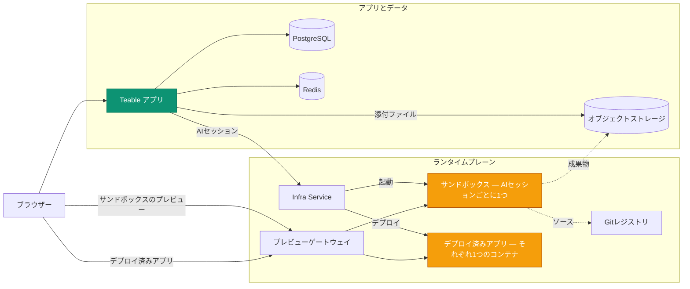

Teable をセルフホストすると、次の4つのプラットフォームを1つにまとめてデプロイできます。

- **安全でスケーラブルなエージェントサンドボックス** — 各AIセッションは、必要に応じて起動し、セッション終了時に破棄される専用の隔離コンテナで実行されます。
- **リソース効率の高いアプリデプロイ基盤** — チームが構築して公開する各アプリは、軽量で長時間稼働する専用コンテナで実行されます。
- **AIワークフローエンジン** — レコードの変更、スケジュール、Webhook をトリガーとするオートメーションが、AIステップを含め、データが存在する場所で実行されます。
- **PostgreSQL 上のフル機能データベース共同作業基盤** — テーブル、ビュー、APIを提供します。

Teable をセルフホストすることで、ご自身のコンピューティング環境が**エージェント対応の完全に管理可能な生産性環境**となり、チームの全員がAIを活用できるようになります。

このページでは、その背後で動作するサービスと、各サービスの連携方法を説明します。デプロイ可能な資材（Compose ファイル、Helm チャート、values）は、[teableio/teable-deployment](https://github.com/teableio/teable-deployment)にあります。

<Tip>AI機能は、セルフホスト版の Business プラン以上で利用できます。</Tip>

## デプロイで実行されるもの

| サービス | 目的 |
|---|---|
| **Teable アプリ** | Web UI、API、オートメーション、AIチャットを1つのイメージ `ghcr.io/teableio/teable` で提供します |
| **PostgreSQL** | メインデータベース：すべてのテーブル、ビュー、メタデータを保持します |
| **Redis** | キャッシュ、キュー、リアルタイム共同作業を担います |
| **オブジェクトストレージ** | S3互換のファイルストレージ。**public**（アバターなどの公開アセット）、**private**（添付ファイル）、**build artifacts**（アプリビルダーの出力）の3つのバケットを使用します |
| **Infra Service** | Teable アプリが接続する単一の入口。独自のコンソールとAPIを備え、ビルドとアプリのデプロイを調整します |
| **サンドボックスエンジン** | 各AIセッションを専用の隔離コンテナで実行します |
| **Gitレジストリ** | 構築したアプリのソースコードを保存します（アプリビルダーからここへプッシュされます） |
| **プレビューゲートウェイ** | ブラウザーからのアクセスをサンドボックスのプレビューやデプロイ済みアプリへ振り分けます |

最後の4つがランタイムプレーンを構成します。デプロイ資材によって、そのすべてが1つのプラットフォームとしてインストールされます。

## 全体の連携

Teable アプリは、Infra Service（`TEABLE_INFRA_API_URL` / `TEABLE_INFRA_API_KEY`）という**1つの接続**を介してランタイムプレーンと通信します。その背後はすべて内部接続です。実際の処理を担い、マシンのリソースを消費するワークロードは2種類あります。

- **サンドボックス。** AIチャットまたはアプリビルダーの各セッションには、専用の隔離コンテナが割り当てられます。コンテナはセッション開始時に起動し、終了時に削除されます。これがプラットフォームの主な負荷となり、突発的に発生します。マシンの容量はユーザー数ではなく、**同時実行するAIセッションのピーク数**に基づいて決めてください（サンドボックスごとのリソース上限はシステム管理で設定できます）。
- **デプロイ済みアプリ。** 誰かが公開した各アプリは、`*.app.<domain>` で提供される、長時間稼働する専用コンテナとして実行されます。サンドボックスは起動と終了を繰り返しますが、デプロイ済みアプリは蓄積され、稼働し続けます。

その他のサービスは補助的な役割を担います。ビルドはセッションのサンドボックス内で実行され、Gitレジストリとオブジェクトストレージが生成物（ソースコードとビルド成果物）を保持し、ゲートウェイが各ブラウザーリクエストを適切なサンドボックスまたはアプリへ振り分けます。

## 1つのドメイン、4つの DNS レコード

すべてが**1つのベースドメイン**（通常は `teable.example.com` のような自社ドメインのサブドメイン）で提供されます。

| レコード | 提供するもの |
|---|---|
| `<domain>` | Teable アプリ |
| `infra.<domain>` | Infra Service のコンソールとAPI。Git（`/git`）とオブジェクトストレージも、このホスト上のパスから提供されます |
| `*.app.<domain>` | 構築してデプロイしたアプリ |
| `*.sandbox.<domain>` | ブラウザー内のサンドボックスプレビュー |

各名前はデフォルトにすぎず、すべてのホスト名を個別に上書きできます（デプロイリポジトリの values の例を参照してください）。

## バージョン管理

プラットフォームは、デプロイリポジトリの**プラットフォームリリース**（`v<year>.<month>.<seq>`）として提供されます。

- リリースの**タグ**は検証済みのスナップショットです。`versions.yaml` によって各コンポーネントの正確なバージョンが固定され、リポジトリの `CHANGELOG.md` に変更内容と必要な作業が記載されます。
- リポジトリの `main` ブランチは、継続的に更新される最新版です。
- 付属の**診断**スクリプトは、デプロイで実際に実行されている内容をリリースと比較し、「互換性あり」「Teable アプリのアップグレードが必要」「不明（未検証の組み合わせ）」のいずれかを報告します。

Teable アプリには独自のリリース系列（日付ベースのタグ。`latest` が安定版チャンネル）があります。詳しくは[バージョンアップグレード](/ja/deploy/upgrade)を参照してください。各プラットフォームリリースには、検証済みのアプリバージョンが記載され、診断スクリプトが確認します。AIセッションの背後で動くサンドボックスエージェントは、常にアプリのバージョンへ自動的に追従するため、個別のアップグレードや管理は不要です。

## デプロイする

どちらの方法でもプラットフォーム全体がインストールされ、デプロイリポジトリに最初から最後までの手順が記載されています。

<CardGroup cols={2}>
  <Card title="Docker オールインワン" icon="docker" href="https://github.com/teableio/teable-deployment/blob/main/docker/all-in-one/README.md">
    すべてを1台のマシンにインストールします。初回のフルデプロイでは、`local` または `server` モードを使用します。
  </Card>
  <Card title="Kubernetes（Helm）" icon="dharmachakra" href="https://github.com/teableio/teable-deployment/blob/main/helm/README.md">
    既存のクラスターに1つの Helm チャートをインストールします。必須なのは `global.baseDomain` だけです。
  </Card>
</CardGroup>

まだAIが必要でなければ、PostgreSQL、Redis、ストレージとともにアプリだけを実行する**スタンドアロン**デプロイ（[Docker デプロイ](/ja/deploy/docker)）を利用できます。データをそのまま維持しながら、後からランタイムプレーンを接続できます。

関連トピックはすべてデプロイリポジトリで管理されています。

- **すでにスタンドアロンの Teable を運用していますか？** データはそのまま維持され、ランタイムプレーンが既存環境と並行してインストールされます：[移行ガイド](https://github.com/teableio/teable-deployment/blob/main/migration/2026-07-basic-to-full-featured.md)
- **社内用の証明書を使用していますか？** ドメインでプライベートCAまたは企業CAを使用する場合は、サンドボックスが信頼するように設定する必要があります：[private-ca.md](https://github.com/teableio/teable-deployment/blob/main/helm/private-ca.md)
- **サイジング、バージョン、ミラー**：[VERSIONS.md](https://github.com/teableio/teable-deployment/blob/main/VERSIONS.md) · [images/README.md](https://github.com/teableio/teable-deployment/blob/main/images/README.md)
- **問題が発生した場合**：まず診断スクリプトを実行してから、[TROUBLESHOOTING.md](https://github.com/teableio/teable-deployment/blob/main/TROUBLESHOOTING.md)を参照してください

デプロイ後、`TEABLE_INFRA_API_URL` / `TEABLE_INFRA_API_KEY` を使用して Teable アプリをランタイムプレーンへ接続し（デプロイガイドに手順があります）、[システム管理 → サンドボックスエージェント](/ja/basic/admin-panel/sandbox-agent)でリソース上限を設定します。
