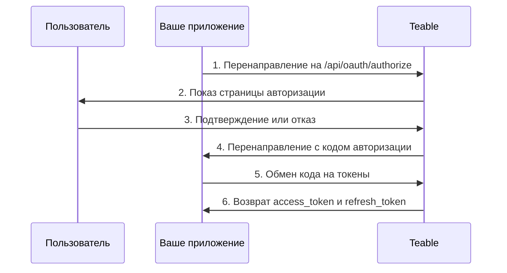

OAuth-приложения позволяют сторонним приложениям получать доступ к Teable от имени пользователей. В этом руководстве объясняется, как создать и настроить OAuth-приложение, реализовать поток авторизации OAuth 2.0 и использовать токены доступа для взаимодействия с API Teable.

Teable поддерживает три режима авторизации OAuth 2.0:

- **Код авторизации + секрет клиента**: для веб-приложений с серверной частью
- **Код авторизации + PKCE**: для нативных приложений, инструментов CLI, SPA и других публичных клиентов, которые не могут безопасно хранить секрет клиента
- **Предоставление авторизации устройства**: для клиентов, которые вообще не могут получить перенаправление браузера, например CLI, запущенного через SSH, в контейнере или в облачной IDE

## Создание OAuth-приложения

1. Перейдите в раздел [Настройки > OAuth-приложения](https://app.teable.ai/setting/oauth-app) в своей учетной записи Teable.
2. Нажмите **Новое OAuth-приложение**, чтобы создать новое приложение.
3. Заполните необходимую информацию:
   - **Название OAuth-приложения**: понятное название вашего приложения
   - **URL главной страницы**: полный URL веб-сайта вашего приложения
   - **URL обратного вызова**: URL, на который пользователи будут перенаправлены после авторизации
   - **Области действия**: разрешения, необходимые вашему приложению
   - **Включить поток устройства**: по умолчанию выключено. Включайте только если ваше приложение выполняет вход пользователей с помощью кода устройства

4. После создания приложения сгенерируйте **секрет клиента**. Обязательно скопируйте и надежно сохраните его — повторно увидеть его будет нельзя.

<Note>Вы получите **идентификатор клиента** и должны будете сгенерировать **секрет клиента**. Надежно храните эти учетные данные и никогда не раскрывайте их в клиентском коде. При использовании потока PKCE секрет клиента не требуется.</Note>

## Доступные области действия {#available-scopes}

Области действия определяют, какие действия может выполнять ваше OAuth-приложение. Доступные области действия сгруппированы по типу ресурса:

| Ресурс | Области действия |
|----------|--------|
| **Приложение** | `app\|create`, `app\|read`, `app\|update`, `app\|delete` |
| **База** | `base\|read`, `base\|read_all`, `base\|update`, `base\|table_import`, `base\|table_export`, `base\|query_data` |
| **Таблица** | `table\|create`, `table\|delete`, `table\|export`, `table\|import`, `table\|read`, `table\|update`, `table\|trash_read`, `table\|trash_update`, `table\|trash_reset` |
| **Представление** | `view\|create`, `view\|delete`, `view\|read`, `view\|update` |
| **Поле** | `field\|create`, `field\|delete`, `field\|read`, `field\|update` |
| **Запись** | `record\|comment`, `record\|create`, `record\|delete`, `record\|read`, `record\|update` |
| **Автоматизация** | `automation\|create`, `automation\|delete`, `automation\|read`, `automation\|update` |
| **Пользователь** | `user\|email_read`, `user\|integrations` |

<Tip>Запрашивайте только те области действия, которые действительно нужны вашему приложению. Пользователи увидят запрошенные разрешения во время авторизации.</Tip>

## Поток OAuth 2.0 с кодом авторизации

Teable реализует стандартный поток OAuth 2.0 с кодом авторизации:



### Шаг 1: перенаправление пользователей на авторизацию

Направьте пользователей на конечную точку авторизации с параметрами вашего приложения:

```
GET https://app.teable.ai/api/oauth/authorize
```

**Параметры запроса:**

| Параметр | Обязательный | Описание |
|-----------|----------|-------------|
| `response_type` | Да | Должен быть `code` |
| `client_id` | Да | Идентификатор клиента вашего OAuth-приложения |
| `redirect_uri` | Нет | Должен соответствовать одному из зарегистрированных URL обратного вызова. Если не указан, будет использован первый зарегистрированный URL обратного вызова |
| `scope` | Нет | Список областей действия, разделенных пробелами. Если не указан, используются области действия, настроенные в вашем OAuth-приложении |
| `state` | Нет | Случайная строка для предотвращения CSRF-атак. Будет возвращена в обратном вызове |

**Пример:**

```
https://app.teable.ai/api/oauth/authorize?response_type=code&client_id=YOUR_CLIENT_ID&redirect_uri=https://yourapp.com/callback&scope=table|read%20record|read&state=random_state_string
```

### Шаг 2: авторизация пользователя

Пользователи увидят страницу авторизации со следующими элементами:
- Название и логотип вашего приложения
- Запрошенные разрешения (области действия)
- Варианты разрешить или отклонить доступ

Если пользователь ранее авторизовал ваше приложение (по умолчанию в течение 7 дней), он будет перенаправлен немедленно, без повторного показа страницы авторизации.

### Шаг 3: обработка обратного вызова

После того как пользователь разрешит (или отклонит) запрос, Teable перенаправит его на ваш URL обратного вызова:

**При успехе:**
```
https://yourapp.com/callback?code=AUTHORIZATION_CODE&state=random_state_string
```

**При отклонении:**
```
https://yourapp.com/callback?error=access_denied&state=random_state_string
```

### Шаг 4: обмен кода на токены

Обменяйте код авторизации на токены доступа и обновления:

```
POST https://app.teable.ai/api/oauth/access_token
Content-Type: application/x-www-form-urlencoded
```

**Тело запроса:**

| Параметр | Обязательный | Описание |
|-----------|----------|-------------|
| `grant_type` | Да | Должен быть `authorization_code` |
| `code` | Да | Полученный код авторизации |
| `client_id` | Да | Идентификатор клиента вашего OAuth-приложения |
| `client_secret` | Да | Секрет клиента вашего OAuth-приложения |
| `redirect_uri` | Да | Должен в точности совпадать с redirect_uri, использованным при авторизации |

**Пример запроса:**

```bash
curl -X POST https://app.teable.ai/api/oauth/access_token \
  -H "Content-Type: application/x-www-form-urlencoded" \
  -d "grant_type=authorization_code" \
  -d "code=AUTHORIZATION_CODE" \
  -d "client_id=YOUR_CLIENT_ID" \
  -d "client_secret=YOUR_CLIENT_SECRET" \
  -d "redirect_uri=https://yourapp.com/callback"
```

**Ответ:**

```json
{
  "token_type": "Bearer",
  "access_token": "teable_xxxxxxxxxxxx",
  "refresh_token": "eyJhbGciOiJIUzI1NiIsInR5cCI6IkpXVCJ9...",
  "expires_in": 600,
  "refresh_expires_in": 2592000,
  "scopes": ["table|read", "record|read"]
}
```

| Поле | Описание |
|-------|-------------|
| `token_type` | Всегда `Bearer` |
| `access_token` | Токен для использования в API-запросах |
| `refresh_token` | Токен для получения новых токенов доступа |
| `expires_in` | Срок действия токена доступа в секундах (по умолчанию: 600 = 10 минут) |
| `refresh_expires_in` | Срок действия токена обновления в секундах (по умолчанию: 2592000 = 30 дней) |
| `scopes` | Массив предоставленных областей действия |

## Поток авторизации PKCE

PKCE (Proof Key for Code Exchange) предназначен для приложений, которые не могут безопасно хранить секрет клиента, таких как нативные приложения для компьютера, мобильные приложения, инструменты CLI или одностраничные приложения.

### Шаг 1: генерация параметров PKCE

Перед началом авторизации клиенту необходимо сгенерировать пару параметров PKCE:

```javascript
// Сгенерируйте code_verifier (случайную строку из 43–128 символов)
const codeVerifier = generateRandomString(43);

// Сгенерируйте code_challenge = BASE64URL(SHA256(code_verifier))
const encoder = new TextEncoder();
const data = encoder.encode(codeVerifier);
const digest = await crypto.subtle.digest('SHA-256', data);
const codeChallenge = btoa(String.fromCharCode(...new Uint8Array(digest)))
  .replace(/\+/g, '-').replace(/\//g, '_').replace(/=+$/, '');
```

### Шаг 2: перенаправление пользователей на авторизацию

```
GET https://app.teable.ai/api/oauth/authorize
```

**Параметры запроса:**

| Параметр | Обязательный | Описание |
|-----------|----------|-------------|
| `response_type` | Да | Должен быть `code` |
| `client_id` | Да | Идентификатор клиента вашего OAuth-приложения |
| `redirect_uri` | Нет | URL обратного вызова. Режим PKCE поддерживает loopback-адреса |
| `scope` | Нет | Список областей действия, разделенных пробелами |
| `state` | Нет | Случайная строка для предотвращения CSRF-атак |
| `code_challenge` | Да | Хеш SHA-256 от code_verifier (в кодировке Base64URL) |
| `code_challenge_method` | Да | Должен быть `S256` |

**Пример:**

```
https://app.teable.ai/api/oauth/authorize?response_type=code&client_id=YOUR_CLIENT_ID&redirect_uri=http://127.0.0.1:8080/callback&code_challenge=YOUR_CODE_CHALLENGE&code_challenge_method=S256&state=random_state_string
```

<Tip>В режиме PKCE `redirect_uri` поддерживает loopback-адреса (`http://127.0.0.1`, `http://[::1]`, `http://localhost`) с гибким сопоставлением портов — вам не нужно точно регистрировать каждый порт.</Tip>

### Шаг 3: обработка обратного вызова

Как и в стандартном потоке с кодом авторизации: после одобрения пользователем код авторизации возвращается через перенаправление.

### Шаг 4: обмен кода + code_verifier на токены

```
POST https://app.teable.ai/api/oauth/access_token
Content-Type: application/x-www-form-urlencoded
```

**Тело запроса:**

| Параметр | Обязательный | Описание |
|-----------|----------|-------------|
| `grant_type` | Да | Должен быть `authorization_code` |
| `code` | Да | Полученный код авторизации |
| `client_id` | Да | Идентификатор клиента вашего OAuth-приложения |
| `code_verifier` | Да | Исходная случайная строка, сгенерированная на шаге 1 |
| `redirect_uri` | Да | Должен в точности совпадать с redirect_uri, использованным при авторизации |

<Note>В режиме PKCE не требуется `client_secret`. Вместо него для проверки идентичности клиента используется `code_verifier`.</Note>

**Пример запроса:**

```bash
curl -X POST https://app.teable.ai/api/oauth/access_token \
  -H "Content-Type: application/x-www-form-urlencoded" \
  -d "grant_type=authorization_code" \
  -d "code=AUTHORIZATION_CODE" \
  -d "client_id=YOUR_CLIENT_ID" \
  -d "code_verifier=YOUR_CODE_VERIFIER" \
  -d "redirect_uri=http://127.0.0.1:8080/callback"
```

Формат ответа такой же, как в стандартном потоке с кодом авторизации.

## Поток авторизации устройства

Предоставление авторизации устройства ([RFC 8628](https://datatracker.ietf.org/doc/html/rfc8628)) предназначено для клиентов, которые не могут получить перенаправление браузера: CLI, запущенного через SSH, внутри контейнера или в облачной IDE. Ваш клиент показывает URL и короткий код, пользователь подтверждает действие в любом браузере, и в терминал ничего вводить не нужно.

Teable следует RFC 8628, поэтому большинство библиотек OAuth-клиентов могут реализовать этот поток без специального кода. Ниже описано то, что специфично для Teable.

<Warning>Поток устройства по умолчанию выключен. Перед использованием включите **Включить поток устройства** в настройках OAuth-приложения. Любой, кто знает ваш идентификатор клиента, может запустить этот поток от имени вашего приложения, поэтому включайте его только при необходимости. Повторное отключение также остановит запросы, уже ожидающие подтверждения.</Warning>

### Запрос кода устройства

`POST /api/oauth/device/code` с вашим `client_id` и необязательным `scope`. Конечная точка доступна без аутентификации и ограничена 30 запросами за 15 минут на IP-адрес.

```json
{
  "device_code": "xxxxxxxxxxxx",
  "user_code": "BCDF-GHJK",
  "verification_uri": "https://app.teable.ai/oauth/device",
  "expires_in": 900,
  "interval": 5
}
```

Оба кода истекают через 15 минут (`BACKEND_OAUTH_DEVICE_CODE_EXPIRE_IN`), а `interval` — это минимальное число секунд ожидания между опросами.

Выведите `verification_uri` и `user_code`. На этой странице пользователь входит в систему, вводит код и перед одобрением или отклонением проверяет название, главную страницу и запрошенные области действия вашего приложения. Страница предупреждает не подтверждать код, который пользователь не запускал сам. Каждый код можно использовать один раз.

<Note>Teable не возвращает `verification_uri_complete`, и ваш клиент не должен формировать его. Одобренный код выполняет вход подтвердившего пользователя в его собственную учетную запись Teable, поэтому ссылка, уже содержащая код, — именно то, на чем основан фишинг с кодом устройства.</Note>

### Опрос для получения токенов

`POST /api/oauth/access_token` с `grant_type=urn:ietf:params:oauth:grant-type:device_code`, `device_code` и вашим `client_id`. Публичные клиенты не передают `client_secret`; конфиденциальные клиенты добавляют его, как и в других потоках.

Пока кто-то не подтвердит код, конечная точка возвращает ошибку вместо токенов:

| Ошибка | Что должен сделать ваш клиент |
|-------|----------------------------|
| `authorization_pending` | Никто еще не подтвердил. Продолжайте опрос с `interval` |
| `slow_down` | Вы выполняли опрос слишком быстро. Подождите дольше перед следующим опросом |
| `access_denied` | Пользователь отклонил запрос. Прекратите опрос |
| `expired_token` | Срок действия кода истек или он уже был использован. Начните заново |

После одобрения пользователем ответ содержит ту же полезную нагрузку токена, что и в других потоках.

## Использование токенов доступа

Включайте токен доступа в заголовок `Authorization` для API-запросов:

```bash
curl https://app.teable.ai/api/table/TABLE_ID/record \
  -H "Authorization: Bearer YOUR_ACCESS_TOKEN"
```

Как правило, первым шагом после получения токена является получение всех Баз, доступных текущему пользователю:

```bash
curl https://app.teable.ai/api/base/access/all \
  -H "Authorization: Bearer YOUR_ACCESS_TOKEN"
```

Эта конечная точка возвращает все Базы, к которым текущий пользователь имеет разрешение на доступ. Для последующих вызовов API можно использовать `baseId` из ответа.

## Обновление токенов доступа

Когда срок действия токена доступа истекает, используйте токен обновления для получения нового:

```
POST https://app.teable.ai/api/oauth/access_token
Content-Type: application/x-www-form-urlencoded
```

**Тело запроса:**

| Параметр | Обязательный | Описание |
|-----------|----------|-------------|
| `grant_type` | Да | Должен быть `refresh_token` |
| `refresh_token` | Да | Ваш текущий токен обновления |
| `client_id` | Да | Идентификатор клиента вашего OAuth-приложения |
| `client_secret` | Условно | Требуется для стандартного режима с кодом авторизации; не нужен для режима PKCE |

**Пример запроса:**

```bash
curl -X POST https://app.teable.ai/api/oauth/access_token \
  -H "Content-Type: application/x-www-form-urlencoded" \
  -d "grant_type=refresh_token" \
  -d "refresh_token=YOUR_REFRESH_TOKEN" \
  -d "client_id=YOUR_CLIENT_ID" \
  -d "client_secret=YOUR_CLIENT_SECRET"
```

<Warning>После обновления предыдущий токен обновления становится недействительным (ротация токенов обновления). Всегда сохраняйте новый токен обновления из ответа.</Warning>

## Отзыв доступа

### Для владельцев OAuth-приложений

Отзовите доступ приложения у **всех пользователей** (это может сделать только создатель приложения):

```
POST https://app.teable.ai/api/oauth/client/{clientId}/revoke-access
```

Это удаляет записи авторизации и токены всех пользователей, полностью предотвращая доступ приложения к данным любого пользователя.

### Для пользователей

Отзовите **собственную** авторизацию для конкретного приложения:

```
POST https://app.teable.ai/api/oauth/client/{clientId}/revoke-token
```

Это делает недействительными только токены доступа и токены обновления текущего пользователя, не затрагивая других пользователей.

Пользователи также могут отозвать доступ на странице настроек [Авторизованные приложения](https://app.teable.ai/setting/authorized-apps).

### Для приложений

Приложения могут отозвать собственный доступ с помощью токена доступа:

```
GET https://app.teable.ai/api/oauth/client/{clientId}/revoke-token
Authorization: Bearer YOUR_ACCESS_TOKEN
```

<Note>Эта конечная точка принимает только аутентификацию токеном доступа, но не сеансовую аутентификацию.</Note>

## Срок действия токенов

| Тип токена | Срок действия по умолчанию | Настраивается через |
|------------|-------------------|------------------|
| Код авторизации | 5 минут | `BACKEND_OAUTH_CODE_EXPIRE_IN` |
| Код устройства | 15 минут | `BACKEND_OAUTH_DEVICE_CODE_EXPIRE_IN` |
| Токен доступа | 10 минут | `BACKEND_OAUTH_ACCESS_TOKEN_EXPIRE_IN` |
| Токен обновления | 30 дней | `BACKEND_OAUTH_REFRESH_TOKEN_EXPIRE_IN` |
| Память авторизации | 7 дней | `BACKEND_OAUTH_AUTHORIZED_EXPIRE_IN` |

## Обработка ошибок

Распространенные ответы с ошибками:

| Ошибка | Описание |
|-------|-------------|
| `invalid_client` | Недействительный идентификатор клиента или секрет клиента |
| `invalid_grant` | Срок действия кода авторизации истек или он уже был использован |
| `invalid_scope` | Запрошенная область действия не разрешена для этого OAuth-приложения |
| `access_denied` | Пользователь отклонил запрос авторизации |
| `redirect_uri_mismatch` | URI перенаправления не соответствует зарегистрированным URL |
| `unauthorized_client` | В OAuth-приложении не включен поток устройства |
| `too_many_requests` | Превышено ограничение частоты. По умолчанию запросы токенов ограничены 30 за 15 минут, а запросы кодов устройства — 30 за 15 минут на IP-адрес |

## Рекомендации

1. **Выберите подходящий режим**: используйте режим секрета клиента для веб-приложений с серверной частью, режим PKCE для нативных приложений/CLI/SPA и поток устройства, если клиент не может получить перенаправление браузера
2. **Надежно храните секреты**: никогда не раскрывайте секрет клиента в клиентском коде
3. **Используйте параметр state**: всегда включайте случайный параметр `state` для предотвращения CSRF-атак
4. **Запрашивайте минимальные области действия**: запрашивайте только те разрешения, которые действительно нужны вашему приложению
5. **Обрабатывайте обновление токенов**: реализуйте автоматическое обновление токенов до истечения их срока действия
6. **Безопасное хранение токенов**: надежно храните токены доступа и обновления на своем сервере

## Полные примеры

### Node.js (код авторизации + секрет клиента)

```javascript
const express = require('express');
const crypto = require('crypto');
const app = express();

const CLIENT_ID = 'your_client_id';
const CLIENT_SECRET = 'your_client_secret';
const REDIRECT_URI = 'http://localhost:3000/callback';
const TEABLE_URL = 'https://app.teable.ai';

// Шаг 1: перенаправьте пользователя на авторизацию
app.get('/login', (req, res) => {
  const state = crypto.randomBytes(16).toString('hex');
  req.session.oauthState = state; // Store state in session
  const authUrl = `${TEABLE_URL}/api/oauth/authorize?` +
    `response_type=code&` +
    `client_id=${CLIENT_ID}&` +
    `redirect_uri=${encodeURIComponent(REDIRECT_URI)}&` +
    `scope=${encodeURIComponent('record|read table|read')}&` +
    `state=${state}`;
  res.redirect(authUrl);
});

// Шаг 2: обработайте обратный вызов и обменяйте код на токены
app.get('/callback', async (req, res) => {
  const { code, state } = req.query;

  // Проверьте state для защиты от CSRF
  if (state !== req.session.oauthState) {
    return res.status(403).send('Invalid state');
  }

  const response = await fetch(`${TEABLE_URL}/api/oauth/access_token`, {
    method: 'POST',
    headers: { 'Content-Type': 'application/x-www-form-urlencoded' },
    body: new URLSearchParams({
      grant_type: 'authorization_code',
      client_id: CLIENT_ID,
      client_secret: CLIENT_SECRET,
      code,
      redirect_uri: REDIRECT_URI,
    }),
  });

  const tokens = await response.json();
  // tokens.access_token — используйте для вызовов API
  // tokens.refresh_token — используйте для обновления токенов
  res.json({ success: true, scopes: tokens.scopes });
});

app.listen(3000);
```

### Python (режим PKCE для инструментов CLI)

```python
import hashlib
import base64
import secrets
import http.server
import urllib.parse
import requests

CLIENT_ID = 'your_client_id'
TEABLE_URL = 'https://app.teable.ai'
PORT = 8080
REDIRECT_URI = f'http://127.0.0.1:{PORT}/callback'

# Шаг 1: сгенерируйте параметры PKCE
code_verifier = secrets.token_urlsafe(32)  # 43 characters
code_challenge = base64.urlsafe_b64encode(
    hashlib.sha256(code_verifier.encode()).digest()
).rstrip(b'=').decode()

# Шаг 2: сформируйте URL авторизации (откройте в браузере)
auth_url = (
    f"{TEABLE_URL}/api/oauth/authorize?"
    f"response_type=code&"
    f"client_id={CLIENT_ID}&"
    f"redirect_uri={urllib.parse.quote(REDIRECT_URI)}&"
    f"code_challenge={code_challenge}&"
    f"code_challenge_method=S256"
)
print(f"Откройте в браузере:\n{auth_url}")

# Шаг 3: запустите локальный сервер для получения обратного вызова
authorization_code = None

class CallbackHandler(http.server.BaseHTTPRequestHandler):
    def do_GET(self):
        global authorization_code
        query = urllib.parse.urlparse(self.path).query
        params = urllib.parse.parse_qs(query)
        authorization_code = params.get('code', [None])[0]
        self.send_response(200)
        self.end_headers()
        self.wfile.write('Авторизация успешно завершена! Эту страницу можно закрыть.'.encode('utf-8'))

    def log_message(self, format, *args):
        pass  # Silence logs

server = http.server.HTTPServer(('127.0.0.1', PORT), CallbackHandler)
server.handle_request()  # Handle single request

# Шаг 4: обменяйте code + code_verifier на токены
response = requests.post(f"{TEABLE_URL}/api/oauth/access_token", data={
    'grant_type': 'authorization_code',
    'client_id': CLIENT_ID,
    'code': authorization_code,
    'redirect_uri': REDIRECT_URI,
    'code_verifier': code_verifier,
})

tokens = response.json()
print(f"Access Token: {tokens['access_token']}")
print(f"Expires in: {tokens['expires_in']}s")
```
