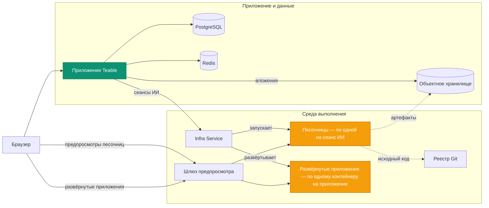

Самостоятельное размещение Teable развёртывает четыре платформы в одной:

- **Безопасная масштабируемая песочница агентов** — каждый сеанс ИИ выполняется в собственном
  изолированном контейнере, который запускается по требованию и удаляется по завершении сеанса.
- **Ресурсосберегающая платформа развёртывания приложений** — каждое приложение, которое ваша команда
  создаёт и публикует, работает в отдельном лёгком долговременном контейнере.
- **Движок ИИ-процессов** — автоматизации, запускаемые изменениями записей,
  расписаниями и вебхуками, с шагами ИИ, выполняющимися там, где находятся ваши данные.
- **Полнофункциональная платформа для совместной работы с базами данных на PostgreSQL** — таблицы,
  представления и API.

Самостоятельное размещение Teable объединяет ваши собственные вычислительные ресурсы в **готовую для агентов, полностью
контролируемую среду продуктивной работы** — передавая ИИ в руки каждого
члена вашей команды.

На этой странице описаны сервисы, обеспечивающие это решение, и их взаимосвязь. Ресурсы,
доступные для развёртывания (файлы compose, Helm chart, values), находятся в
[teableio/teable-deployment](https://github.com/teableio/teable-deployment).

<Tip>Функции ИИ доступны в тарифе Business для самостоятельного размещения и выше.</Tip>

## Что запускает развёртывание

| Сервис | Назначение |
|---|---|
| **Приложение Teable** | Веб-интерфейс, API, автоматизации, чат с ИИ — один образ: `ghcr.io/teableio/teable` |
| **PostgreSQL** | Основная база данных: все ваши таблицы, представления и метаданные |
| **Redis** | Кэш, очереди, совместная работа в реальном времени |
| **Объектное хранилище** | S3-совместимое файловое хранилище с тремя бакетами: **публичный** (аватары и другие публичные ресурсы), **приватный** (вложения), **артефакты сборки** (результат Конструктора приложений) |
| **Сервис инфраструктуры** | Единая точка входа, к которой подключается приложение Teable; координирует сборки и развёртывания приложений, имеет собственную консоль и API |
| **Движок песочниц** | Запускает каждый сеанс ИИ в отдельном изолированном контейнере |
| **Git-реестр** | Хранит исходный код создаваемых приложений (Конструктор приложений отправляет его сюда) |
| **Шлюз предпросмотра** | Направляет браузеры к предпросмотрам песочниц и развёрнутым приложениям |

Последние четыре образуют плоскость выполнения. Ресурсы развёртывания устанавливают всё
это как единую платформу.

## Как всё работает вместе

Приложение Teable взаимодействует с плоскостью выполнения через **одно подключение**:
Сервис инфраструктуры (`TEABLE_INFRA_API_URL` / `TEABLE_INFRA_API_KEY`). Всё,
что находится за ним, является внутренним. Фактическую работу выполняют два типа нагрузок — и именно они
потребляют ресурсы вашей машины:

- **Песочницы.** Каждый чат с ИИ или сеанс Конструктора приложений получает собственный изолированный
  контейнер, который запускается в начале сеанса и удаляется по его окончании. Это
  основная нагрузка платформы, поступающая всплесками: выбирайте размер машины по
  **пиковому количеству одновременных сеансов ИИ**, а не по числу пользователей (лимиты ресурсов
  для каждой песочницы можно задать в панели администратора).
- **Развёрнутые приложения.** Каждое опубликованное пользователем приложение работает в собственном долговременном
  контейнере и обслуживается по адресу `*.app.<domain>`. Песочницы появляются и исчезают; развёрнутые приложения
  накапливаются и продолжают работать.

Остальные сервисы выполняют вспомогательные роли: сборка происходит внутри
песочницы сеанса, Git-реестр и объектное хранилище сохраняют создаваемые ею
исходный код и артефакты сборки, а шлюз направляет каждый запрос браузера
к нужной песочнице или приложению.

## Один домен, четыре DNS-записи

Всё обслуживается под **одним базовым доменом** — обычно это ваш поддомен,
например `teable.example.com`:

| Запись | Обслуживает |
|---|---|
| `<domain>` | Приложение Teable |
| `infra.<domain>` | Консоль и API Сервиса инфраструктуры; Git (`/git`) и объектное хранилище также обслуживаются по путям на этом хосте |
| `*.app.<domain>` | Созданные и развёрнутые приложения |
| `*.sandbox.<domain>` | Предпросмотры песочниц в браузере |

Каждое имя — лишь значение по умолчанию, и каждое имя хоста можно переопределить отдельно
(см. пример values в репозитории развёртывания).

## Версионирование

Платформа выпускается как **релизы платформы** (`v<year>.<month>.<seq>`) репозитория
развёртывания:

- **Тег** релиза — это проверенный снимок: `versions.yaml` фиксирует точную
  версию каждого компонента, а `CHANGELOG.md` репозитория сообщает, что
  изменилось и что, если вообще что-то, необходимо сделать.
- Ветка `main` репозитория содержит непрерывно обновляемую актуальную версию.
- Входящий в комплект скрипт **doctor** сравнивает то, что фактически запущено в развёртывании,
  с релизом и сообщает один из трёх результатов: совместимо, обновите приложение
  Teable или неизвестная (непроверенная) комбинация.

Приложение Teable имеет собственную линейку релизов (теги с датами; `latest` —
стабильный канал) — см. [Обновление версии](/ru/deploy/upgrade). В каждом релизе платформы
указано, с какими версиями приложения он был проверен, а doctor проверяет это за вас. Агент песочницы, обеспечивающий сеансы ИИ, всегда следует версии
приложения самостоятельно — ничего дополнительно обновлять или обслуживать не требуется.

## Развёртывание

Оба пути устанавливают всю платформу и полностью описаны в
репозитории развёртывания:

<CardGroup cols={2}>
  <Card title="Docker всё в одном" icon="docker" href="https://github.com/teableio/teable-deployment/blob/main/docker/all-in-one/README.md">
    Всё на одной машине — первое полное развёртывание, режим `local` или `server`.
  </Card>
  <Card title="Kubernetes (Helm)" icon="dharmachakra" href="https://github.com/teableio/teable-deployment/blob/main/helm/README.md">
    Один Helm chart в существующем кластере; требуется только `global.baseDomain`.
  </Card>
</CardGroup>

ИИ пока не нужен? Можно запустить только приложение с PostgreSQL, Redis и
хранилищем — **автономное** развёртывание ([Развёртывание с Docker](/ru/deploy/docker))
— и позднее подключить плоскость выполнения, сохранив данные на месте.

Связанные темы, все поддерживаются в репозитории развёртывания:

- **Уже используете автономный Teable?** Ваши данные остаются на месте —
  плоскость выполнения устанавливается рядом с ним: [руководство по миграции](https://github.com/teableio/teable-deployment/blob/main/migration/2026-07-basic-to-full-featured.md)
- **Внутренние сертификаты компании?** Если ваш домен использует частный или
  корпоративный CA, песочницам необходимо указать доверять ему —
  [private-ca.md](https://github.com/teableio/teable-deployment/blob/main/helm/private-ca.md)
- **Расчёт ресурсов, версии и зеркала**: [VERSIONS.md](https://github.com/teableio/teable-deployment/blob/main/VERSIONS.md) ·
  [images/README.md](https://github.com/teableio/teable-deployment/blob/main/images/README.md)
- **Если что-то не работает**: сначала запустите doctor, затем
  [TROUBLESHOOTING.md](https://github.com/teableio/teable-deployment/blob/main/TROUBLESHOOTING.md)

После развёртывания подключите приложение Teable к плоскости выполнения с помощью
`TEABLE_INFRA_API_URL` / `TEABLE_INFRA_API_KEY` (это описано в руководствах по развёртыванию), затем задайте лимиты ресурсов в
[Панель администратора → Агент песочницы](/ru/basic/admin-panel/sandbox-agent).
