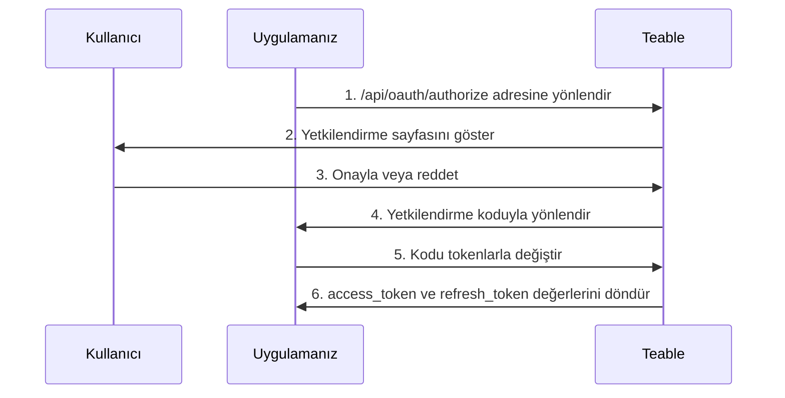

OAuth Uygulamaları, üçüncü taraf uygulamaların kullanıcılar adına Teable'a erişmesini sağlar. Bu kılavuzda bir OAuth Uygulamasının nasıl oluşturulup yapılandırılacağı, OAuth 2.0 yetkilendirme akışının nasıl uygulanacağı ve Teable API ile etkileşim kurmak için erişim token'larının nasıl kullanılacağı açıklanmaktadır.

Teable üç OAuth 2.0 yetkilendirme modunu destekler:

- **Yetkilendirme Kodu + İstemci Gizli Anahtarı**: Arka uç sunucusu bulunan web uygulamaları için
- **Yetkilendirme Kodu + PKCE**: İstemci gizli anahtarını güvenli şekilde saklayamayan yerel uygulamalar, CLI araçları, SPA'lar ve diğer genel istemciler için
- **Cihaz Yetkilendirme İzni**: SSH üzerinden, bir kapsayıcıda veya bulut IDE'sinde çalışan CLI gibi tarayıcı yönlendirmesi alamayan istemciler için

## OAuth Uygulaması Oluşturma

1. Teable hesabınızda [Ayarlar > OAuth Uygulamaları](https://app.teable.ai/setting/oauth-app) bölümüne gidin.
2. Yeni bir uygulama oluşturmak için **Yeni OAuth Uygulamaları**'na tıklayın.
3. Gerekli bilgileri doldurun:
   - **OAuth Uygulaması adı**: Uygulamanızı açıklayan bir ad
   - **Ana sayfa URL'si**: Uygulamanızın web sitesinin tam URL'si
   - **Geri çağırma URL'si**: Yetkilendirmeden sonra kullanıcıların yönlendirileceği URL
   - **Kapsamlar**: Uygulamanızın ihtiyaç duyduğu izinler
   - **Cihaz akışını etkinleştir**: Varsayılan olarak kapalıdır. Yalnızca uygulamanız kullanıcıların cihaz koduyla oturum açmasını sağlıyorsa etkinleştirin

4. Uygulamayı oluşturduktan sonra bir **İstemci Gizli Anahtarı** oluşturun. Güvenli bir şekilde kopyalayıp sakladığınızdan emin olun; anahtarı tekrar göremezsiniz.

<Note>Bir **İstemci Kimliği** alırsınız ve bir **İstemci Gizli Anahtarı** oluşturmanız gerekir. Bu kimlik bilgilerini güvenli tutun ve istemci tarafı kodunda asla göstermeyin. PKCE akışını kullanıyorsanız istemci gizli anahtarı gerekmez.</Note>

## Kullanılabilir Kapsamlar {#available-scopes}

Kapsamlar, OAuth Uygulamanızın hangi işlemleri gerçekleştirebileceğini belirler. Kullanılabilir kapsamlar kaynak türüne göre düzenlenmiştir:

| Kaynak | Kapsamlar |
|----------|--------|
| **Uygulama** | `app\|create`, `app\|read`, `app\|update`, `app\|delete` |
| **Veritabanı** | `base\|read`, `base\|read_all`, `base\|update`, `base\|table_import`, `base\|table_export`, `base\|query_data` |
| **Tablo** | `table\|create`, `table\|delete`, `table\|export`, `table\|import`, `table\|read`, `table\|update`, `table\|trash_read`, `table\|trash_update`, `table\|trash_reset` |
| **Görünüm** | `view\|create`, `view\|delete`, `view\|read`, `view\|update` |
| **Alan** | `field\|create`, `field\|delete`, `field\|read`, `field\|update` |
| **Kayıt** | `record\|comment`, `record\|create`, `record\|delete`, `record\|read`, `record\|update` |
| **Otomasyon** | `automation\|create`, `automation\|delete`, `automation\|read`, `automation\|update` |
| **Kullanıcı** | `user\|email_read`, `user\|integrations` |

<Tip>Yalnızca uygulamanızın gerçekten ihtiyaç duyduğu kapsamları isteyin. Kullanıcılar, yetkilendirme sırasında istenen izinleri görür.</Tip>

## OAuth 2.0 Yetkilendirme Kodu Akışı

Teable, standart OAuth 2.0 Yetkilendirme Kodu akışını uygular:



### 1. Adım: Kullanıcıları Yetkilendirmeye Yönlendirme

Kullanıcıları uygulama parametrelerinizle birlikte yetkilendirme uç noktasına yönlendirin:

```
GET https://app.teable.ai/api/oauth/authorize
```

**Sorgu Parametreleri:**

| Parametre | Zorunlu | Açıklama |
|-----------|----------|-------------|
| `response_type` | Evet | `code` olmalıdır |
| `client_id` | Evet | OAuth Uygulamanızın İstemci Kimliği |
| `redirect_uri` | Hayır | Kayıtlı geri çağırma URL'lerinizden biriyle eşleşmelidir. Belirtilmezse kayıtlı ilk geri çağırma URL'si kullanılır |
| `scope` | Hayır | Boşlukla ayrılmış kapsam listesi. Belirtilmezse OAuth Uygulamanızda yapılandırılmış kapsamlar kullanılır |
| `state` | Hayır | CSRF saldırılarını önlemeye yönelik rastgele dize. Geri çağırmada döndürülür |

**Örnek:**

```
https://app.teable.ai/api/oauth/authorize?response_type=code&client_id=YOUR_CLIENT_ID&redirect_uri=https://yourapp.com/callback&scope=table|read%20record|read&state=random_state_string
```

### 2. Adım: Kullanıcı Yetkilendirmesi

Kullanıcılara aşağıdakileri gösteren bir yetkilendirme sayfası sunulur:
- Uygulamanızın adı ve logosu
- İstenen izinler (kapsamlar)
- Erişimi onaylama veya reddetme seçenekleri

Kullanıcı uygulamanızı daha önce yetkilendirdiyse (varsayılan olarak son 7 gün içinde), yetkilendirme sayfasını yeniden görmeden hemen yönlendirilir.

### 3. Adım: Geri Çağırmayı İşleme

Kullanıcı onayladıktan (veya reddettikten) sonra Teable, geri çağırma URL'nize yönlendirir:

**Başarılı olduğunda:**
```
https://yourapp.com/callback?code=AUTHORIZATION_CODE&state=random_state_string
```

**Reddedildiğinde:**
```
https://yourapp.com/callback?error=access_denied&state=random_state_string
```

### 4. Adım: Kodu Token'larla Değiştirme

Yetkilendirme kodunu erişim ve yenileme token'larıyla değiştirin:

```
POST https://app.teable.ai/api/oauth/access_token
Content-Type: application/x-www-form-urlencoded
```

**İstek Gövdesi:**

| Parametre | Zorunlu | Açıklama |
|-----------|----------|-------------|
| `grant_type` | Evet | `authorization_code` olmalıdır |
| `code` | Evet | Alınan yetkilendirme kodu |
| `client_id` | Evet | OAuth Uygulamanızın İstemci Kimliği |
| `client_secret` | Evet | OAuth Uygulamanızın İstemci Gizli Anahtarı |
| `redirect_uri` | Evet | Yetkilendirmede kullanılan redirect_uri ile tam olarak eşleşmelidir |

**Örnek İstek:**

```bash
curl -X POST https://app.teable.ai/api/oauth/access_token \
  -H "Content-Type: application/x-www-form-urlencoded" \
  -d "grant_type=authorization_code" \
  -d "code=AUTHORIZATION_CODE" \
  -d "client_id=YOUR_CLIENT_ID" \
  -d "client_secret=YOUR_CLIENT_SECRET" \
  -d "redirect_uri=https://yourapp.com/callback"
```

**Yanıt:**

```json
{
  "token_type": "Bearer",
  "access_token": "teable_xxxxxxxxxxxx",
  "refresh_token": "eyJhbGciOiJIUzI1NiIsInR5cCI6IkpXVCJ9...",
  "expires_in": 600,
  "refresh_expires_in": 2592000,
  "scopes": ["table|read", "record|read"]
}
```

| Alan | Açıklama |
|-------|-------------|
| `token_type` | Her zaman `Bearer` |
| `access_token` | API isteklerinde kullanılacak token |
| `refresh_token` | Yeni erişim token'ları almak için kullanılacak token |
| `expires_in` | Erişim token'ının saniye cinsinden kullanım süresi (varsayılan: 600 = 10 dakika) |
| `refresh_expires_in` | Yenileme token'ının saniye cinsinden kullanım süresi (varsayılan: 2592000 = 30 gün) |
| `scopes` | Verilen kapsamlar dizisi |

## PKCE Yetkilendirme Akışı

PKCE (Proof Key for Code Exchange), yerel masaüstü uygulamaları, mobil uygulamalar, CLI araçları veya tek sayfalı uygulamalar gibi istemci gizli anahtarını güvenli şekilde saklayamayan uygulamalar için tasarlanmıştır.

### 1. Adım: PKCE Parametreleri Oluşturma

Yetkilendirme başlatılmadan önce istemcinin bir PKCE parametresi çifti oluşturması gerekir:

```javascript
// code_verifier oluştur (43-128 karakterlik rastgele dize)
const codeVerifier = generateRandomString(43);

// code_challenge oluştur = BASE64URL(SHA256(code_verifier))
const encoder = new TextEncoder();
const data = encoder.encode(codeVerifier);
const digest = await crypto.subtle.digest('SHA-256', data);
const codeChallenge = btoa(String.fromCharCode(...new Uint8Array(digest)))
  .replace(/\+/g, '-').replace(/\//g, '_').replace(/=+$/, '');
```

### 2. Adım: Kullanıcıları Yetkilendirmeye Yönlendirme

```
GET https://app.teable.ai/api/oauth/authorize
```

**Sorgu Parametreleri:**

| Parametre | Zorunlu | Açıklama |
|-----------|----------|-------------|
| `response_type` | Evet | `code` olmalıdır |
| `client_id` | Evet | OAuth Uygulamanızın İstemci Kimliği |
| `redirect_uri` | Hayır | Geri çağırma URL'si. PKCE modu geri döngü adreslerini destekler |
| `scope` | Hayır | Boşlukla ayrılmış kapsam listesi |
| `state` | Hayır | CSRF saldırılarını önlemeye yönelik rastgele dize |
| `code_challenge` | Evet | code_verifier değerinin SHA-256 karması (Base64URL ile kodlanmış) |
| `code_challenge_method` | Evet | `S256` olmalıdır |

**Örnek:**

```
https://app.teable.ai/api/oauth/authorize?response_type=code&client_id=YOUR_CLIENT_ID&redirect_uri=http://127.0.0.1:8080/callback&code_challenge=YOUR_CODE_CHALLENGE&code_challenge_method=S256&state=random_state_string
```

<Tip>PKCE modunda `redirect_uri`, esnek bağlantı noktası eşleştirmesiyle geri döngü adreslerini (`http://127.0.0.1`, `http://[::1]`, `http://localhost`) destekler; her bağlantı noktasını ayrı ayrı kaydetmeniz gerekmez.</Tip>

### 3. Adım: Geri Çağırmayı İşleme

Standart yetkilendirme kodu akışıyla aynıdır; kullanıcı onayından sonra yetkilendirme kodu yönlendirme aracılığıyla döndürülür.

### 4. Adım: Kod + code_verifier Değerini Token'larla Değiştirme

```
POST https://app.teable.ai/api/oauth/access_token
Content-Type: application/x-www-form-urlencoded
```

**İstek Gövdesi:**

| Parametre | Zorunlu | Açıklama |
|-----------|----------|-------------|
| `grant_type` | Evet | `authorization_code` olmalıdır |
| `code` | Evet | Alınan yetkilendirme kodu |
| `client_id` | Evet | OAuth Uygulamanızın İstemci Kimliği |
| `code_verifier` | Evet | 1. Adımda oluşturulan özgün rastgele dize |
| `redirect_uri` | Evet | Yetkilendirmede kullanılan redirect_uri ile tam olarak eşleşmelidir |

<Note>PKCE modu `client_secret` gerektirmez. Bunun yerine istemcinin kimliğini doğrulamak için `code_verifier` kullanılır.</Note>

**Örnek İstek:**

```bash
curl -X POST https://app.teable.ai/api/oauth/access_token \
  -H "Content-Type: application/x-www-form-urlencoded" \
  -d "grant_type=authorization_code" \
  -d "code=AUTHORIZATION_CODE" \
  -d "client_id=YOUR_CLIENT_ID" \
  -d "code_verifier=YOUR_CODE_VERIFIER" \
  -d "redirect_uri=http://127.0.0.1:8080/callback"
```

Yanıt biçimi standart yetkilendirme kodu akışıyla aynıdır.

## Cihaz Yetkilendirme Akışı

Cihaz Yetkilendirme İzni ([RFC 8628](https://datatracker.ietf.org/doc/html/rfc8628)), tarayıcı yönlendirmesi alamayan istemcilere yöneliktir: SSH üzerinden, bir kapsayıcı içinde veya bulut IDE'sinde çalışan bir CLI gibi. İstemciniz bir URL ve kısa bir kod gösterir, kullanıcı herhangi bir tarayıcıda onay verir ve terminale hiçbir şeyin yeniden yazılması gerekmez.

Teable, RFC 8628'i izlediğinden çoğu OAuth istemci kitaplığı bu akışı özel kod olmadan yürütebilir. Aşağıda Teable'a özgü noktalar açıklanmaktadır.

<Warning>Cihaz akışı varsayılan olarak kapalıdır. Kullanmadan önce OAuth Uygulaması ayarlarınızda **Cihaz akışını etkinleştir** seçeneğini açın. İstemci Kimliğinizi bilen herkes uygulamanızın adıyla bu akışı başlatabilir; bu nedenle yalnızca uygulamanızın ihtiyacı varsa etkinleştirin. Yeniden kapatılması, hâlihazırda onay bekleyen istekleri de durdurur.</Warning>

### Cihaz Kodu İsteme

`client_id` ve isteğe bağlı `scope` ile `POST /api/oauth/device/code` isteği gönderin. Uç nokta anonimdir ve IP adresi başına 15 dakikada 30 istekle sınırlandırılmıştır.

```json
{
  "device_code": "xxxxxxxxxxxx",
  "user_code": "BCDF-GHJK",
  "verification_uri": "https://app.teable.ai/oauth/device",
  "expires_in": 900,
  "interval": 5
}
```

Her iki kodun süresi de 15 dakika sonra dolar (`BACKEND_OAUTH_DEVICE_CODE_EXPIRE_IN`) ve `interval`, yoklamalar arasında beklenecek en az saniye sayısıdır.

`verification_uri` ve `user_code` değerlerini gösterin. Kullanıcı bu sayfada oturum açar, kodu girer ve onaylamadan veya reddetmeden önce uygulamanızın adını, ana sayfasını ve istenen kapsamları inceler. Sayfa, kendisinin başlatmadığı bir kodu onaylamaması konusunda kullanıcıyı uyarır. Her kod yalnızca bir kez kullanılabilir.

<Note>Teable `verification_uri_complete` değerini döndürmez ve istemciniz de bu değeri oluşturmamalıdır. Onaylanan kod, onaylayan kişiyi kendi Teable hesabında oturum açtırır; dolayısıyla kodu önceden içeren bir bağlantı, cihaz kodu kimlik avının tam olarak dayandığı yöntemdir.</Note>

### Token'ları Yoklama

`grant_type=urn:ietf:params:oauth:grant-type:device_code`, `device_code` ve `client_id` ile `POST /api/oauth/access_token` isteği gönderin. Genel istemciler `client_secret` göndermez; gizli istemciler bunu diğer akışlarda olduğu gibi ekler.

Birisi kodu onaylayana kadar uç nokta, token'lar yerine bir hata döndürür:

| Hata | İstemcinizin yapması gereken |
|-------|----------------------------|
| `authorization_pending` | Henüz kimse onaylamadı. `interval` aralığında yoklamaya devam edin |
| `slow_down` | Çok hızlı yoklama yaptınız. Sonraki yoklamadan önce daha uzun süre bekleyin |
| `access_denied` | Kullanıcı isteği reddetti. Yoklamayı durdurun |
| `expired_token` | Kodun süresi doldu veya kod daha önce kullanıldı. Baştan başlayın |

Kullanıcı onayladıktan sonra yanıt, diğer akışlardaki token yüküyle aynı olur.

## Erişim Token'larını Kullanma

API istekleri için erişim token'ını `Authorization` başlığına ekleyin:

```bash
curl https://app.teable.ai/api/table/TABLE_ID/record \
  -H "Authorization: Bearer YOUR_ACCESS_TOKEN"
```

Token alındıktan sonraki ilk adım genellikle mevcut kullanıcının erişebildiği tüm Veritabanlarını almaktır:

```bash
curl https://app.teable.ai/api/base/access/all \
  -H "Authorization: Bearer YOUR_ACCESS_TOKEN"
```

Bu uç nokta, mevcut kullanıcının erişim iznine sahip olduğu tüm Veritabanlarını döndürür. Sonraki API çağrılarında yanıttaki `baseId` değerini kullanabilirsiniz.

## Erişim Token'larını Yenileme

Bir erişim token'ının süresi dolduğunda yenisini almak için yenileme token'ını kullanın:

```
POST https://app.teable.ai/api/oauth/access_token
Content-Type: application/x-www-form-urlencoded
```

**İstek Gövdesi:**

| Parametre | Zorunlu | Açıklama |
|-----------|----------|-------------|
| `grant_type` | Evet | `refresh_token` olmalıdır |
| `refresh_token` | Evet | Geçerli yenileme token'ınız |
| `client_id` | Evet | OAuth Uygulamanızın İstemci Kimliği |
| `client_secret` | Koşullu | Standart yetkilendirme kodu modunda zorunludur, PKCE modunda gerekmez |

**Örnek İstek:**

```bash
curl -X POST https://app.teable.ai/api/oauth/access_token \
  -H "Content-Type: application/x-www-form-urlencoded" \
  -d "grant_type=refresh_token" \
  -d "refresh_token=YOUR_REFRESH_TOKEN" \
  -d "client_id=YOUR_CLIENT_ID" \
  -d "client_secret=YOUR_CLIENT_SECRET"
```

<Warning>Yenilemeden sonra önceki yenileme token'ı geçersiz olur (Yenileme Token'ı Rotasyonu). Yanıttaki yeni yenileme token'ını her zaman saklayın.</Warning>

## Erişimi İptal Etme

### OAuth Uygulaması Sahipleri İçin

Uygulamanın **tüm kullanıcılara** erişimini iptal edin (bunu yalnızca uygulamayı oluşturan kişi yapabilir):

```
POST https://app.teable.ai/api/oauth/client/{clientId}/revoke-access
```

Bu işlem tüm kullanıcıların yetkilendirme Kayıtlarını ve token'larını silerek uygulamanın herhangi bir kullanıcının verilerine erişmesini tamamen engeller.

### Kullanıcılar İçin

Belirli bir uygulama için **kendi** yetkilendirmenizi iptal edin:

```
POST https://app.teable.ai/api/oauth/client/{clientId}/revoke-token
```

Bu işlem diğer kullanıcıları etkilemeden yalnızca mevcut kullanıcının erişim ve yenileme token'larını geçersiz kılar.

Kullanıcılar, [Yetkilendirilmiş Uygulamalar](https://app.teable.ai/setting/authorized-apps) ayarları sayfasından da erişimi iptal edebilir.

### Uygulamalar İçin

Uygulamalar, bir Erişim Token'ı kullanarak kendi erişimlerini iptal edebilir:

```
GET https://app.teable.ai/api/oauth/client/{clientId}/revoke-token
Authorization: Bearer YOUR_ACCESS_TOKEN
```

<Note>Bu uç nokta oturum kimlik doğrulamasını değil, yalnızca Erişim Token'ı kimlik doğrulamasını kabul eder.</Note>

## Token Süreleri

| Token Türü | Varsayılan Süre | Şununla Yapılandırılabilir |
|------------|-------------------|------------------|
| Yetkilendirme Kodu | 5 dakika | `BACKEND_OAUTH_CODE_EXPIRE_IN` |
| Cihaz Kodu | 15 dakika | `BACKEND_OAUTH_DEVICE_CODE_EXPIRE_IN` |
| Erişim Token'ı | 10 dakika | `BACKEND_OAUTH_ACCESS_TOKEN_EXPIRE_IN` |
| Yenileme Token'ı | 30 gün | `BACKEND_OAUTH_REFRESH_TOKEN_EXPIRE_IN` |
| Yetkilendirme Belleği | 7 gün | `BACKEND_OAUTH_AUTHORIZED_EXPIRE_IN` |

## Hata İşleme

Yaygın hata yanıtları:

| Hata | Açıklama |
|-------|-------------|
| `invalid_client` | Geçersiz İstemci Kimliği veya İstemci Gizli Anahtarı |
| `invalid_grant` | Yetkilendirme kodunun süresi dolmuş veya kod daha önce kullanılmış |
| `invalid_scope` | İstenen kapsama bu OAuth Uygulaması için izin verilmiyor |
| `access_denied` | Kullanıcı yetkilendirme isteğini reddetti |
| `redirect_uri_mismatch` | Yönlendirme URI'si kayıtlı URL'lerle eşleşmiyor |
| `unauthorized_client` | OAuth Uygulamasında cihaz akışı etkinleştirilmemiş |
| `too_many_requests` | Hız sınırı aşıldı. Token istekleri varsayılan olarak 15 dakikada 30, cihaz kodu istekleri ise IP adresi başına 15 dakikada 30 istekle sınırlıdır |

## En İyi Uygulamalar

1. **Doğru modu seçin**: Arka ucu bulunan web uygulamalarında istemci gizli anahtarı modunu, yerel uygulamalarda/CLI/SPA'larda PKCE modunu, istemcinin tarayıcı yönlendirmesi alamadığı durumlarda ise cihaz akışını kullanın
2. **Gizli anahtarları güvenle saklayın**: İstemci Gizli Anahtarınızı istemci tarafı kodunda asla göstermeyin
3. **state parametresini kullanın**: CSRF saldırılarını önlemek için her zaman rastgele bir `state` parametresi ekleyin
4. **Asgari kapsamları isteyin**: Yalnızca uygulamanızın gerçekten ihtiyaç duyduğu izinleri isteyin
5. **Token yenilemeyi yönetin**: Süre dolmadan önce otomatik token yenilemeyi uygulayın
6. **Token'ları güvenle saklayın**: Erişim ve yenileme token'larını sunucunuzda güvenli bir şekilde saklayın

## Eksiksiz Örnekler

### Node.js (Yetkilendirme Kodu + İstemci Gizli Anahtarı)

```javascript
const express = require('express');
const crypto = require('crypto');
const app = express();

const CLIENT_ID = 'your_client_id';
const CLIENT_SECRET = 'your_client_secret';
const REDIRECT_URI = 'http://localhost:3000/callback';
const TEABLE_URL = 'https://app.teable.ai';

// Adım 1: Kullanıcıyı yetkilendirmeye yönlendir
app.get('/login', (req, res) => {
  const state = crypto.randomBytes(16).toString('hex');
  req.session.oauthState = state; // state değerini oturumda sakla
  const authUrl = `${TEABLE_URL}/api/oauth/authorize?` +
    `response_type=code&` +
    `client_id=${CLIENT_ID}&` +
    `redirect_uri=${encodeURIComponent(REDIRECT_URI)}&` +
    `scope=${encodeURIComponent('record|read table|read')}&` +
    `state=${state}`;
  res.redirect(authUrl);
});

// Adım 2: Geri çağrıyı işle ve kodu tokenlarla değiştir
app.get('/callback', async (req, res) => {
  const { code, state } = req.query;

  // CSRF'yi önlemek için state değerini doğrula
  if (state !== req.session.oauthState) {
    return res.status(403).send('Geçersiz state');
  }

  const response = await fetch(`${TEABLE_URL}/api/oauth/access_token`, {
    method: 'POST',
    headers: { 'Content-Type': 'application/x-www-form-urlencoded' },
    body: new URLSearchParams({
      grant_type: 'authorization_code',
      client_id: CLIENT_ID,
      client_secret: CLIENT_SECRET,
      code,
      redirect_uri: REDIRECT_URI,
    }),
  });

  const tokens = await response.json();
  // tokens.access_token — API çağrılarında kullan
  // tokens.refresh_token — tokenları yenilemek için kullan
  res.json({ success: true, scopes: tokens.scopes });
});

app.listen(3000);
```

### Python (CLI Araçları için PKCE Modu)

```python
import hashlib
import base64
import secrets
import http.server
import urllib.parse
import requests

CLIENT_ID = 'your_client_id'
TEABLE_URL = 'https://app.teable.ai'
PORT = 8080
REDIRECT_URI = f'http://127.0.0.1:{PORT}/callback'

# Adım 1: PKCE parametrelerini oluştur
code_verifier = secrets.token_urlsafe(32)  # 43 characters
code_challenge = base64.urlsafe_b64encode(
    hashlib.sha256(code_verifier.encode()).digest()
).rstrip(b'=').decode()

# Adım 2: Yetkilendirme URL'sini oluştur (tarayıcıda aç)
auth_url = (
    f"{TEABLE_URL}/api/oauth/authorize?"
    f"response_type=code&"
    f"client_id={CLIENT_ID}&"
    f"redirect_uri={urllib.parse.quote(REDIRECT_URI)}&"
    f"code_challenge={code_challenge}&"
    f"code_challenge_method=S256"
)
print(f"Tarayıcınızda açın:\n{auth_url}")

# Adım 3: Geri çağrıyı almak için yerel sunucuyu başlat
authorization_code = None

class CallbackHandler(http.server.BaseHTTPRequestHandler):
    def do_GET(self):
        global authorization_code
        query = urllib.parse.urlparse(self.path).query
        params = urllib.parse.parse_qs(query)
        authorization_code = params.get('code', [None])[0]
        self.send_response(200)
        self.end_headers()
        self.wfile.write('Yetkilendirme başarılı! Bu sayfayı kapatabilirsiniz.'.encode('utf-8'))

    def log_message(self, format, *args):
        pass  # Günlükleri sustur

server = http.server.HTTPServer(('127.0.0.1', PORT), CallbackHandler)
server.handle_request()  # Tek bir isteği işle

# Adım 4: code + code_verifier değerlerini tokenlarla değiştir
response = requests.post(f"{TEABLE_URL}/api/oauth/access_token", data={
    'grant_type': 'authorization_code',
    'client_id': CLIENT_ID,
    'code': authorization_code,
    'redirect_uri': REDIRECT_URI,
    'code_verifier': code_verifier,
})

tokens = response.json()
print(f"Erişim Tokenı: {tokens['access_token']}")
print(f"Sona erme süresi: {tokens['expires_in']} sn")
```
