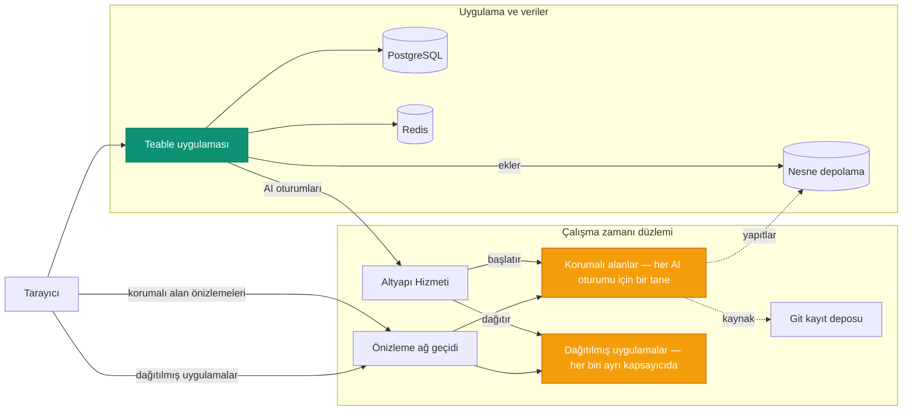

Teable'ı kendi sunucunuzda barındırmak dört platformu bir arada dağıtır:

- **Güvenli ve ölçeklenebilir bir aracı korumalı alanı** — her AI oturumu kendi
  yalıtılmış kapsayıcısında çalışır, gerektiğinde başlatılır ve oturum sona erdiğinde kaldırılır.
- **Kaynakları verimli kullanan bir uygulama dağıtım platformu** — ekibinizin oluşturup
  yayımladığı her uygulama kendi hafif ve uzun ömürlü kapsayıcısında çalışır.
- **Bir AI iş akışı motoru** — Kayıt değişiklikleri, zamanlamalar ve webhook'larla
  tetiklenen otomasyonlar, AI adımlarıyla birlikte verilerinizin bulunduğu yerde çalışır.
- **PostgreSQL üzerinde tüm özelliklere sahip bir veritabanı işbirliği platformu** — Tablolar,
  Görünümler ve API.

Teable'ı kendi sunucunuzda barındırmak, kendi işlem kaynaklarınızı **aracılara hazır ve tamamen
denetiminizde olan bir üretkenlik ortamına** dönüştürerek AI'ı ekibinizdeki herkesin
kullanımına sunar.

Bu sayfada bunun arkasındaki hizmetler ve bunların birlikte nasıl çalıştığı açıklanır. Dağıtılabilir
varlıklar (compose dosyaları, Helm chart'ı ve değerler)
[teableio/teable-deployment](https://github.com/teableio/teable-deployment) deposunda bulunur.

<Tip>AI özellikleri, kendi sunucunuzda barındırılan Business ve üzeri planlarda kullanılabilir.</Tip>

## Dağıtımın Çalıştırdığı Bileşenler

| Hizmet | Amaç |
|---|---|
| **Teable uygulaması** | Web kullanıcı arayüzü, API, otomasyonlar, AI Chat — tek bir imaj: `ghcr.io/teableio/teable` |
| **PostgreSQL** | Ana veritabanı: tüm Tablolarınız, Görünümleriniz ve meta verileriniz |
| **Redis** | Önbellek, kuyruklar ve gerçek zamanlı işbirliği |
| **Nesne depolama** | Üç bucket içeren S3 uyumlu dosya depolama: **genel** (avatarlar ve diğer genel varlıklar), **özel** (ekler), **derleme yapıtları** (App Builder çıktısı) |
| **Altyapı Hizmeti** | Teable uygulamasının bağlandığı tek giriş noktası; kendi konsolu ve API'siyle derlemeleri ve uygulama dağıtımlarını koordine eder |
| **Korumalı alan motoru** | Her AI oturumunu kendi yalıtılmış kapsayıcısında çalıştırır |
| **Git kayıt deposu** | Oluşturduğunuz uygulamaların kaynak kodunu saklar (App Builder buraya gönderir) |
| **Önizleme ağ geçidi** | Tarayıcıları korumalı alan önizlemelerine ve dağıtılmış uygulamalara yönlendirir |

Son dört bileşen çalışma zamanı düzlemini oluşturur. Dağıtım varlıkları bunların tümünü
tek bir platform olarak yükler.

## Bileşenlerin Birlikte Çalışması

Teable uygulaması çalışma zamanı düzlemiyle **tek bir bağlantı** üzerinden iletişim kurar:
Altyapı Hizmeti (`TEABLE_INFRA_API_URL` / `TEABLE_INFRA_API_KEY`). Arkasındaki her şey
dahilidir. Asıl işi ve makinenizin kaynaklarını tüketen iki tür iş yükü vardır:

- **Korumalı alanlar.** Her AI Chat veya App Builder oturumu kendi yalıtılmış
  kapsayıcısını alır; kapsayıcı oturum başladığında başlatılır ve sona erdiğinde kaldırılır. Bu,
  platformun ana yüküdür ve ani artışlarla gelir: Makinenizi kullanıcı sayısına göre değil,
  **en yüksek eş zamanlı AI oturumu** sayısına göre boyutlandırın (korumalı alan başına kaynak
  sınırları yönetici panelinden belirlenebilir).
- **Dağıtılmış uygulamalar.** Bir kişinin yayımladığı her uygulama, `*.app.<domain>`
  adresinden sunulan kendi uzun ömürlü kapsayıcısında çalışır. Korumalı alanlar açılıp kapanırken dağıtılmış uygulamaların
  sayısı artar ve bunlar çalışmaya devam eder.

Diğer hizmetler destekleyici roller üstlenir: Derleme oturumun korumalı alanında gerçekleşir,
Git kayıt deposu ve nesne depolama üretilenleri (kaynak kodu ve derleme yapıtlarını) saklar,
ağ geçidi ise her tarayıcı isteğini doğru korumalı alana veya uygulamaya yönlendirir.

## Tek Alan Adı, Dört DNS Kaydı

Her şey **tek bir temel alan adı** altında sunulur; bu genellikle size ait
`teable.example.com` gibi bir alt alan adıdır:

| Kayıt | Sunduğu hizmet |
|---|---|
| `<domain>` | Teable uygulaması |
| `infra.<domain>` | Altyapı Hizmeti konsolu ve API'si; Git (`/git`) ve nesne depolama da bu ana bilgisayardaki yollar üzerinden sunulur |
| `*.app.<domain>` | Oluşturup dağıttığınız uygulamalar |
| `*.sandbox.<domain>` | Tarayıcıdaki korumalı alan önizlemeleri |

Her ad yalnızca varsayılandır ve her ana bilgisayar adı ayrı ayrı geçersiz kılınabilir
(dağıtım deposundaki değerler örneğine bakın).

## Sürüm Oluşturma

Platform, dağıtım deposunun **platform sürümleri** (`v<year>.<month>.<seq>`) olarak
yayımlanır:

- Bir sürüm **etiketi** doğrulanmış anlık görüntüdür: `versions.yaml` her bileşenin tam
  sürümünü kilitler ve deponun `CHANGELOG.md` dosyası nelerin değiştiğini ve varsa
  yapmanız gerekenleri açıklar.
- Deponun `main` dalı sürekli güncellenen en yeni sürümdür.
- Paketle gelen **doctor** komut dosyası, dağıtımınızın gerçekte çalıştırdığı bileşenleri
  sürümle karşılaştırır ve üç sonuçtan birini bildirir: uyumlu, Teable uygulamasını
  yükseltin veya bilinmeyen (doğrulanmamış) kombinasyon.

Teable uygulamasının kendi sürüm akışı vardır (tarih tabanlı etiketler; `latest`
kararlı kanaldır) — [Sürüm Yükseltme](/tr/deploy/upgrade) bölümüne bakın. Her platform
sürümü hangi uygulama sürümleriyle doğrulandığını belirtir ve doctor bunu sizin için
kontrol eder. AI oturumlarının arkasındaki korumalı alan aracısı, uygulamanın sürümünü her zaman
kendiliğinden izler; yükseltmeniz veya yönetmeniz gereken ek bir bileşen yoktur.

## Dağıtma

Her iki yol da platformun tamamını yükler ve dağıtım deposunda baştan sona
açıklanır:

<CardGroup cols={2}>
  <Card title="Hepsi bir arada Docker" icon="docker" href="https://github.com/teableio/teable-deployment/blob/main/docker/all-in-one/README.md">
    Her şey tek makinede — ilk tam dağıtım, `local` veya `server` modu.
  </Card>
  <Card title="Kubernetes (Helm)" icon="dharmachakra" href="https://github.com/teableio/teable-deployment/blob/main/helm/README.md">
    Mevcut bir kümede tek Helm chart'ı; yalnızca `global.baseDomain` gereklidir.
  </Card>
</CardGroup>

Henüz AI'a ihtiyacınız yok mu? Yalnızca uygulamayı PostgreSQL, Redis ve
depolamayla çalıştırabilir, yani **bağımsız** dağıtım ([Docker Dağıtımı](/tr/deploy/docker))
yapabilir ve verileriniz yerindeyken çalışma zamanı düzlemini daha sonra bağlayabilirsiniz.

Tümü dağıtım deposunda tutulan ilgili konular:

- **Bağımsız Teable'ı zaten çalıştırıyor musunuz?** Verileriniz yerinde kalır;
  çalışma zamanı düzlemi yanına yüklenir: [taşıma kılavuzu](https://github.com/teableio/teable-deployment/blob/main/migration/2026-07-basic-to-full-featured.md)
- **Şirket içi sertifikalar mı kullanıyorsunuz?** Alan adınız özel veya
  kurumsal bir CA kullanıyorsa korumalı alanlara buna güvenmeleri gerektiği bildirilmelidir:
  [private-ca.md](https://github.com/teableio/teable-deployment/blob/main/helm/private-ca.md)
- **Boyutlandırma, sürümler ve yansılar**: [VERSIONS.md](https://github.com/teableio/teable-deployment/blob/main/VERSIONS.md) ·
  [images/README.md](https://github.com/teableio/teable-deployment/blob/main/images/README.md)
- **Bir sorun oluştuğunda**: Önce doctor'ı çalıştırın, ardından
  [TROUBLESHOOTING.md](https://github.com/teableio/teable-deployment/blob/main/TROUBLESHOOTING.md) belgesine bakın

Dağıtımdan sonra Teable uygulamasını çalışma zamanı düzlemine
`TEABLE_INFRA_API_URL` / `TEABLE_INFRA_API_KEY` ile bağlayın (dağıtım kılavuzları bunu
açıklar), ardından kaynak sınırlarını
[Yönetici Paneli → Korumalı Alan Aracısı](/tr/basic/admin-panel/sandbox-agent) bölümünden ayarlayın.
