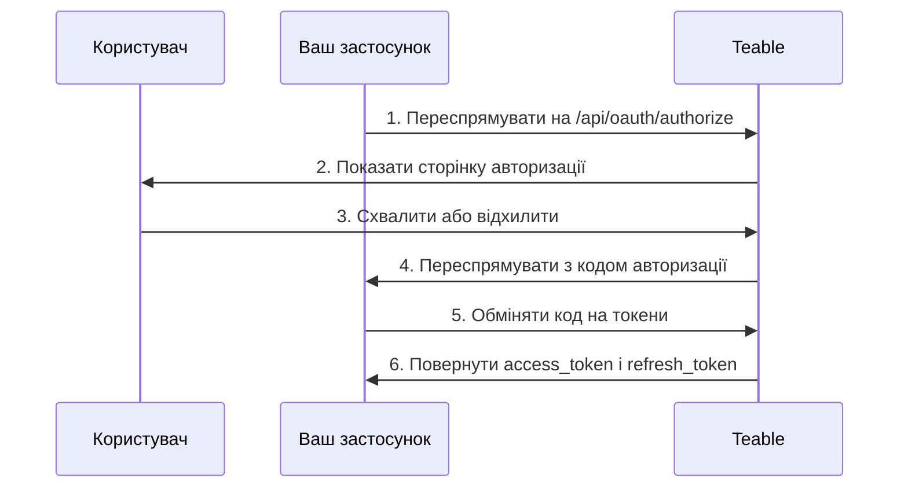

Застосунки OAuth дають стороннім застосункам доступ до Teable від імені користувачів. У цьому посібнику пояснюється, як створити й налаштувати застосунок OAuth, реалізувати потік авторизації OAuth 2.0 і використовувати токени доступу для взаємодії з API Teable.

Teable підтримує три режими авторизації OAuth 2.0:

- **Код авторизації + секрет клієнта**: для вебзастосунків із серверною частиною
- **Код авторизації + PKCE**: для нативних застосунків, інструментів CLI, SPA та інших публічних клієнтів, які не можуть безпечно зберігати секрет клієнта
- **Надання авторизації пристрою**: для клієнтів, які взагалі не можуть прийняти переспрямування браузера, наприклад CLI, що працює через SSH, у контейнері або хмарному середовищі розробки

## Створення застосунку OAuth

1. У своєму обліковому записі Teable перейдіть до розділу [Settings > OAuth Apps](https://app.teable.ai/setting/oauth-app).
2. Натисніть **New OAuth Apps**, щоб створити новий застосунок.
3. Заповніть обов’язкові відомості:
   - **Назва застосунку OAuth**: описова назва вашого застосунку
   - **URL-адреса головної сторінки**: повна URL-адреса вебсайту вашого застосунку
   - **URL-адреса зворотного виклику**: URL-адреса, на яку користувачів буде переспрямовано після авторизації
   - **Області дозволів**: дозволи, потрібні вашому застосунку
   - **Увімкнути потік пристрою**: за замовчуванням вимкнено. Увімкніть, лише якщо ваш застосунок виконує вхід користувачів за кодом пристрою

4. Після створення застосунку згенеруйте **секрет клієнта**. Обов’язково скопіюйте та збережіть його в безпечному місці: надалі переглянути його буде неможливо.

<Note>Ви отримаєте **Client ID**, після чого потрібно згенерувати **Client Secret**. Зберігайте ці облікові дані в безпеці й ніколи не розкривайте їх у клієнтському коді. Для потоку PKCE секрет клієнта не потрібен.</Note>

## Доступні області дозволів {#available-scopes}

Області дозволів визначають, які дії може виконувати ваш застосунок OAuth. Доступні області дозволів згруповано за типом ресурсу:

| Ресурс | Області дозволів |
|----------|--------|
| **Застосунок** | `app\|create`, `app\|read`, `app\|update`, `app\|delete` |
| **База** | `base\|read`, `base\|read_all`, `base\|update`, `base\|table_import`, `base\|table_export`, `base\|query_data` |
| **Таблиця** | `table\|create`, `table\|delete`, `table\|export`, `table\|import`, `table\|read`, `table\|update`, `table\|trash_read`, `table\|trash_update`, `table\|trash_reset` |
| **Перегляд** | `view\|create`, `view\|delete`, `view\|read`, `view\|update` |
| **Поле** | `field\|create`, `field\|delete`, `field\|read`, `field\|update` |
| **Запис** | `record\|comment`, `record\|create`, `record\|delete`, `record\|read`, `record\|update` |
| **Автоматизація** | `automation\|create`, `automation\|delete`, `automation\|read`, `automation\|update` |
| **Користувач** | `user\|email_read`, `user\|integrations` |

<Tip>Запитуйте лише ті області дозволів, які справді потрібні вашому застосунку. Під час авторизації користувачі бачитимуть запитані дозволи.</Tip>

## Потік коду авторизації OAuth 2.0

Teable реалізує стандартний потік коду авторизації OAuth 2.0:



### Крок 1. Переспрямуйте користувачів на сторінку авторизації

Спрямуйте користувачів до кінцевої точки авторизації з параметрами вашого застосунку:

```
GET https://app.teable.ai/api/oauth/authorize
```

**Параметри запиту:**

| Параметр | Обов’язковий | Опис |
|-----------|----------|-------------|
| `response_type` | Так | Має бути `code` |
| `client_id` | Так | Client ID вашого застосунку OAuth |
| `redirect_uri` | Ні | Має відповідати одній із зареєстрованих URL-адрес зворотного виклику. Якщо параметр не вказано, використовуватиметься перша зареєстрована URL-адреса зворотного виклику |
| `scope` | Ні | Список областей дозволів, розділених пробілами. Якщо параметр не вказано, використовуються області дозволів, налаштовані у вашому застосунку OAuth |
| `state` | Ні | Випадковий рядок для запобігання атакам CSRF. Буде повернений у зворотному виклику |

**Приклад:**

```
https://app.teable.ai/api/oauth/authorize?response_type=code&client_id=YOUR_CLIENT_ID&redirect_uri=https://yourapp.com/callback&scope=table|read%20record|read&state=random_state_string
```

### Крок 2. Авторизація користувача

Користувачі побачать сторінку авторизації з такими відомостями:
- Назва й логотип вашого застосунку
- Запитані дозволи (області дозволів)
- Варіанти надання або відхилення доступу

Якщо користувач уже авторизував ваш застосунок (за замовчуванням протягом останніх 7 днів), його буде негайно переспрямовано без повторного показу сторінки авторизації.

### Крок 3. Обробіть зворотний виклик

Коли користувач надає (або відхиляє) доступ, Teable переспрямовує його на вашу URL-адресу зворотного виклику:

**У разі успіху:**
```
https://yourapp.com/callback?code=AUTHORIZATION_CODE&state=random_state_string
```

**У разі відхилення:**
```
https://yourapp.com/callback?error=access_denied&state=random_state_string
```

### Крок 4. Обміняйте код на токени

Обміняйте код авторизації на токени доступу й оновлення:

```
POST https://app.teable.ai/api/oauth/access_token
Content-Type: application/x-www-form-urlencoded
```

**Тіло запиту:**

| Параметр | Обов’язковий | Опис |
|-----------|----------|-------------|
| `grant_type` | Так | Має бути `authorization_code` |
| `code` | Так | Отриманий код авторизації |
| `client_id` | Так | Client ID вашого застосунку OAuth |
| `client_secret` | Так | Client Secret вашого застосунку OAuth |
| `redirect_uri` | Так | Має точно відповідати redirect_uri, використаному під час авторизації |

**Приклад запиту:**

```bash
curl -X POST https://app.teable.ai/api/oauth/access_token \
  -H "Content-Type: application/x-www-form-urlencoded" \
  -d "grant_type=authorization_code" \
  -d "code=AUTHORIZATION_CODE" \
  -d "client_id=YOUR_CLIENT_ID" \
  -d "client_secret=YOUR_CLIENT_SECRET" \
  -d "redirect_uri=https://yourapp.com/callback"
```

**Відповідь:**

```json
{
  "token_type": "Bearer",
  "access_token": "teable_xxxxxxxxxxxx",
  "refresh_token": "eyJhbGciOiJIUzI1NiIsInR5cCI6IkpXVCJ9...",
  "expires_in": 600,
  "refresh_expires_in": 2592000,
  "scopes": ["table|read", "record|read"]
}
```

| Поле | Опис |
|-------|-------------|
| `token_type` | Завжди `Bearer` |
| `access_token` | Токен для запитів API |
| `refresh_token` | Токен для отримання нових токенів доступу |
| `expires_in` | Термін дії токена доступу в секундах (за замовчуванням: 600 = 10 хвилин) |
| `refresh_expires_in` | Термін дії токена оновлення в секундах (за замовчуванням: 2592000 = 30 днів) |
| `scopes` | Масив наданих областей дозволів |

## Потік авторизації PKCE

PKCE (Proof Key for Code Exchange) призначено для застосунків, які не можуть безпечно зберігати секрет клієнта, наприклад нативних настільних і мобільних застосунків, інструментів CLI або односторінкових застосунків.

### Крок 1. Згенеруйте параметри PKCE

Перед початком авторизації клієнт має згенерувати пару параметрів PKCE:

```javascript
// Згенерувати code_verifier (випадковий рядок із 43–128 символів)
const codeVerifier = generateRandomString(43);

// Згенерувати code_challenge = BASE64URL(SHA256(code_verifier))
const encoder = new TextEncoder();
const data = encoder.encode(codeVerifier);
const digest = await crypto.subtle.digest('SHA-256', data);
const codeChallenge = btoa(String.fromCharCode(...new Uint8Array(digest)))
  .replace(/\+/g, '-').replace(/\//g, '_').replace(/=+$/, '');
```

### Крок 2. Переспрямуйте користувачів на сторінку авторизації

```
GET https://app.teable.ai/api/oauth/authorize
```

**Параметри запиту:**

| Параметр | Обов’язковий | Опис |
|-----------|----------|-------------|
| `response_type` | Так | Має бути `code` |
| `client_id` | Так | Client ID вашого застосунку OAuth |
| `redirect_uri` | Ні | URL-адреса зворотного виклику. Режим PKCE підтримує loopback-адреси |
| `scope` | Ні | Список областей дозволів, розділених пробілами |
| `state` | Ні | Випадковий рядок для запобігання атакам CSRF |
| `code_challenge` | Так | Хеш SHA-256 значення code_verifier (закодований у Base64URL) |
| `code_challenge_method` | Так | Має бути `S256` |

**Приклад:**

```
https://app.teable.ai/api/oauth/authorize?response_type=code&client_id=YOUR_CLIENT_ID&redirect_uri=http://127.0.0.1:8080/callback&code_challenge=YOUR_CODE_CHALLENGE&code_challenge_method=S256&state=random_state_string
```

<Tip>У режимі PKCE параметр `redirect_uri` підтримує loopback-адреси (`http://127.0.0.1`, `http://[::1]`, `http://localhost`) із гнучким зіставленням портів — не потрібно точно реєструвати кожен порт.</Tip>

### Крок 3. Обробіть зворотний виклик

Так само, як у стандартному потоці коду авторизації: після схвалення користувачем код авторизації повертається через переспрямування.

### Крок 4. Обміняйте код і code_verifier на токени

```
POST https://app.teable.ai/api/oauth/access_token
Content-Type: application/x-www-form-urlencoded
```

**Тіло запиту:**

| Параметр | Обов’язковий | Опис |
|-----------|----------|-------------|
| `grant_type` | Так | Має бути `authorization_code` |
| `code` | Так | Отриманий код авторизації |
| `client_id` | Так | Client ID вашого застосунку OAuth |
| `code_verifier` | Так | Вихідний випадковий рядок, згенерований на кроці 1 |
| `redirect_uri` | Так | Має точно відповідати redirect_uri, використаному під час авторизації |

<Note>Режим PKCE не потребує `client_secret`. Натомість для перевірки ідентичності клієнта використовується `code_verifier`.</Note>

**Приклад запиту:**

```bash
curl -X POST https://app.teable.ai/api/oauth/access_token \
  -H "Content-Type: application/x-www-form-urlencoded" \
  -d "grant_type=authorization_code" \
  -d "code=AUTHORIZATION_CODE" \
  -d "client_id=YOUR_CLIENT_ID" \
  -d "code_verifier=YOUR_CODE_VERIFIER" \
  -d "redirect_uri=http://127.0.0.1:8080/callback"
```

Формат відповіді такий самий, як у стандартному потоці коду авторизації.

## Потік авторизації пристрою

Надання авторизації пристрою ([RFC 8628](https://datatracker.ietf.org/doc/html/rfc8628)) призначене для клієнтів, які не можуть прийняти переспрямування браузера: CLI, що працює через SSH, у контейнері або хмарному середовищі розробки. Ваш клієнт показує URL-адресу й короткий код, користувач надає дозвіл у будь-якому браузері, а вводити щось назад у терміналі не потрібно.

Teable дотримується RFC 8628, тому більшість клієнтських бібліотек OAuth можуть виконувати цей потік без спеціального коду. Нижче описано особливості Teable.

<Warning>Потік пристрою за замовчуванням вимкнено. Перш ніж використовувати його, увімкніть **Увімкнути потік пристрою** в налаштуваннях застосунку OAuth. Будь-хто, хто знає ваш Client ID, може запустити цей потік від імені вашого застосунку, тому вмикайте його, лише якщо він потрібен застосунку. Повторне вимкнення також зупиняє запити, які вже очікують на схвалення.</Warning>

### Запит коду пристрою

Виконайте `POST /api/oauth/device/code` зі своїм `client_id` і необов’язковим параметром `scope`. Ця кінцева точка анонімна, а частоту запитів обмежено до 30 за 15 хвилин з однієї IP-адреси.

```json
{
  "device_code": "xxxxxxxxxxxx",
  "user_code": "BCDF-GHJK",
  "verification_uri": "https://app.teable.ai/oauth/device",
  "expires_in": 900,
  "interval": 5
}
```

Обидва коди діють 15 хвилин (`BACKEND_OAUTH_DEVICE_CODE_EXPIRE_IN`), а `interval` визначає мінімальну кількість секунд між опитуваннями.

Виведіть `verification_uri` та `user_code`. На цій сторінці користувач входить у систему, вводить код і перевіряє назву вашого застосунку, головну сторінку та запитані області дозволів, перш ніж надати або відхилити доступ. Сторінка застерігає не схвалювати код, запит на який користувач не ініціював самостійно. Кожен код можна використати лише один раз.

<Note>Teable не повертає `verification_uri_complete`, і ваш клієнт не повинен створювати його самостійно. Схвалений код виконує вхід користувача, який його схвалив, до його власного облікового запису Teable, тому посилання, що вже містить код, є саме тим механізмом, на який спирається фішинг із кодом пристрою.</Note>

### Опитування для отримання токенів

Виконайте `POST /api/oauth/access_token` із `grant_type=urn:ietf:params:oauth:grant-type:device_code`, значенням `device_code` і своїм `client_id`. Публічні клієнти не надсилають `client_secret`; конфіденційні клієнти додають його так само, як в інших потоках.

Доки код не схвалено, кінцева точка повертає помилку замість токенів:

| Помилка | Що має робити ваш клієнт |
|-------|----------------------------|
| `authorization_pending` | Код ще ніхто не схвалив. Продовжуйте опитування з інтервалом `interval` |
| `slow_down` | Опитування виконуються надто часто. Довше зачекайте перед наступним опитуванням |
| `access_denied` | Користувач відхилив запит. Припиніть опитування |
| `expired_token` | Термін дії коду минув або його вже використано. Почніть знову |

Після схвалення користувачем відповідь міститиме таке саме корисне навантаження токена, як і в інших потоках.

## Використання токенів доступу

Додавайте токен доступу до заголовка `Authorization` у запитах API:

```bash
curl https://app.teable.ai/api/table/TABLE_ID/record \
  -H "Authorization: Bearer YOUR_ACCESS_TOKEN"
```

Зазвичай перший крок після отримання токена — отримати всі Бази, доступні поточному користувачу:

```bash
curl https://app.teable.ai/api/base/access/all \
  -H "Authorization: Bearer YOUR_ACCESS_TOKEN"
```

Ця кінцева точка повертає всі Бази, до яких поточний користувач має дозвіл на доступ. Значення `baseId` із відповіді можна використовувати в наступних викликах API.

## Оновлення токенів доступу

Коли термін дії токена доступу закінчиться, скористайтеся токеном оновлення, щоб отримати новий:

```
POST https://app.teable.ai/api/oauth/access_token
Content-Type: application/x-www-form-urlencoded
```

**Тіло запиту:**

| Параметр | Обов’язковий | Опис |
|-----------|----------|-------------|
| `grant_type` | Так | Має бути `refresh_token` |
| `refresh_token` | Так | Ваш поточний токен оновлення |
| `client_id` | Так | Client ID вашого застосунку OAuth |
| `client_secret` | Залежить від режиму | Обов’язковий для стандартного режиму коду авторизації, але не потрібен у режимі PKCE |

**Приклад запиту:**

```bash
curl -X POST https://app.teable.ai/api/oauth/access_token \
  -H "Content-Type: application/x-www-form-urlencoded" \
  -d "grant_type=refresh_token" \
  -d "refresh_token=YOUR_REFRESH_TOKEN" \
  -d "client_id=YOUR_CLIENT_ID" \
  -d "client_secret=YOUR_CLIENT_SECRET"
```

<Warning>Після оновлення попередній токен оновлення стає недійсним (ротація токенів оновлення). Завжди зберігайте новий токен оновлення з відповіді.</Warning>

## Відкликання доступу

### Для власників застосунків OAuth

Відкличте доступ застосунку для **всіх користувачів** (це може зробити лише автор застосунку):

```
POST https://app.teable.ai/api/oauth/client/{clientId}/revoke-access
```

Це видаляє записи авторизації та токени всіх користувачів і повністю унеможливлює доступ застосунку до даних будь-якого користувача.

### Для користувачів

Відкличте **власну** авторизацію для певного застосунку:

```
POST https://app.teable.ai/api/oauth/client/{clientId}/revoke-token
```

Це робить недійсними лише токени доступу й оновлення поточного користувача, не впливаючи на інших користувачів.

Користувачі також можуть відкликати доступ на сторінці налаштувань [Авторизовані застосунки](https://app.teable.ai/setting/authorized-apps).

### Для застосунків

Застосунки можуть відкликати власний доступ за допомогою токена доступу:

```
GET https://app.teable.ai/api/oauth/client/{clientId}/revoke-token
Authorization: Bearer YOUR_ACCESS_TOKEN
```

<Note>Ця кінцева точка приймає лише автентифікацію за токеном доступу, а не автентифікацію сеансу.</Note>

## Термін дії токенів

| Тип токена | Термін дії за замовчуванням | Налаштовується за допомогою |
|------------|-------------------|------------------|
| Код авторизації | 5 хвилин | `BACKEND_OAUTH_CODE_EXPIRE_IN` |
| Код пристрою | 15 хвилин | `BACKEND_OAUTH_DEVICE_CODE_EXPIRE_IN` |
| Токен доступу | 10 хвилин | `BACKEND_OAUTH_ACCESS_TOKEN_EXPIRE_IN` |
| Токен оновлення | 30 днів | `BACKEND_OAUTH_REFRESH_TOKEN_EXPIRE_IN` |
| Збережена авторизація | 7 днів | `BACKEND_OAUTH_AUTHORIZED_EXPIRE_IN` |

## Обробка помилок

Поширені відповіді з помилками:

| Помилка | Опис |
|-------|-------------|
| `invalid_client` | Недійсний Client ID або Client Secret |
| `invalid_grant` | Термін дії коду авторизації минув або його вже використано |
| `invalid_scope` | Запитану область дозволів заборонено для цього застосунку OAuth |
| `access_denied` | Користувач відхилив запит на авторизацію |
| `redirect_uri_mismatch` | URI переспрямування не відповідає зареєстрованим URL-адресам |
| `unauthorized_client` | У застосунку OAuth не ввімкнено потік пристрою |
| `too_many_requests` | Перевищено обмеження частоти запитів. За замовчуванням для запитів токенів діє обмеження 30 запитів за 15 хвилин, а для запитів коду пристрою — 30 запитів за 15 хвилин з однієї IP-адреси |

## Рекомендації

1. **Виберіть правильний режим**: використовуйте режим секрету клієнта для вебзастосунків із серверною частиною, режим PKCE — для нативних застосунків, CLI та SPA, а потік пристрою — коли клієнт не може прийняти переспрямування браузера
2. **Безпечно зберігайте секрети**: ніколи не розкривайте Client Secret у клієнтському коді
3. **Використовуйте параметр state**: завжди додавайте випадковий параметр `state`, щоб запобігти атакам CSRF
4. **Запитуйте мінімальні області дозволів**: запитуйте лише ті дозволи, які справді потрібні вашому застосунку
5. **Обробляйте оновлення токенів**: реалізуйте автоматичне оновлення токенів до завершення терміну їх дії
6. **Захистіть сховище токенів**: безпечно зберігайте токени доступу й оновлення на своєму сервері

## Повні приклади

### Node.js (код авторизації + секрет клієнта)

```javascript
const express = require('express');
const crypto = require('crypto');
const app = express();

const CLIENT_ID = 'your_client_id';
const CLIENT_SECRET = 'your_client_secret';
const REDIRECT_URI = 'http://localhost:3000/callback';
const TEABLE_URL = 'https://app.teable.ai';

// Крок 1: Переспрямувати користувача на авторизацію
app.get('/login', (req, res) => {
  const state = crypto.randomBytes(16).toString('hex');
  req.session.oauthState = state; // Зберегти state у сесії
  const authUrl = `${TEABLE_URL}/api/oauth/authorize?` +
    `response_type=code&` +
    `client_id=${CLIENT_ID}&` +
    `redirect_uri=${encodeURIComponent(REDIRECT_URI)}&` +
    `scope=${encodeURIComponent('record|read table|read')}&` +
    `state=${state}`;
  res.redirect(authUrl);
});

// Крок 2: Обробити зворотний виклик і обміняти код на токени
app.get('/callback', async (req, res) => {
  const { code, state } = req.query;

  // Перевірити state для захисту від CSRF
  if (state !== req.session.oauthState) {
    return res.status(403).send('Недійсний state');
  }

  const response = await fetch(`${TEABLE_URL}/api/oauth/access_token`, {
    method: 'POST',
    headers: { 'Content-Type': 'application/x-www-form-urlencoded' },
    body: new URLSearchParams({
      grant_type: 'authorization_code',
      client_id: CLIENT_ID,
      client_secret: CLIENT_SECRET,
      code,
      redirect_uri: REDIRECT_URI,
    }),
  });

  const tokens = await response.json();
  // tokens.access_token — використовувати для викликів API
  // tokens.refresh_token — використовувати для оновлення токенів
  res.json({ success: true, scopes: tokens.scopes });
});

app.listen(3000);
```

### Python (режим PKCE для інструментів CLI)

```python
import hashlib
import base64
import secrets
import http.server
import urllib.parse
import requests

CLIENT_ID = 'your_client_id'
TEABLE_URL = 'https://app.teable.ai'
PORT = 8080
REDIRECT_URI = f'http://127.0.0.1:{PORT}/callback'

# Крок 1: Згенерувати параметри PKCE
code_verifier = secrets.token_urlsafe(32)  # 43 characters
code_challenge = base64.urlsafe_b64encode(
    hashlib.sha256(code_verifier.encode()).digest()
).rstrip(b'=').decode()

# Крок 2: Сформувати URL авторизації (відкрити в браузері)
auth_url = (
    f"{TEABLE_URL}/api/oauth/authorize?"
    f"response_type=code&"
    f"client_id={CLIENT_ID}&"
    f"redirect_uri={urllib.parse.quote(REDIRECT_URI)}&"
    f"code_challenge={code_challenge}&"
    f"code_challenge_method=S256"
)
print(f"Відкрийте у браузері:\n{auth_url}")

# Крок 3: Запустити локальний сервер для отримання зворотного виклику
authorization_code = None

class CallbackHandler(http.server.BaseHTTPRequestHandler):
    def do_GET(self):
        global authorization_code
        query = urllib.parse.urlparse(self.path).query
        params = urllib.parse.parse_qs(query)
        authorization_code = params.get('code', [None])[0]
        self.send_response(200)
        self.end_headers()
        self.wfile.write('Авторизація успішна! Цю сторінку можна закрити.'.encode('utf-8'))

    def log_message(self, format, *args):
        pass  # Не виводити журнали

server = http.server.HTTPServer(('127.0.0.1', PORT), CallbackHandler)
server.handle_request()  # Обробити один запит

# Крок 4: Обміняти code + code_verifier на токени
response = requests.post(f"{TEABLE_URL}/api/oauth/access_token", data={
    'grant_type': 'authorization_code',
    'client_id': CLIENT_ID,
    'code': authorization_code,
    'redirect_uri': REDIRECT_URI,
    'code_verifier': code_verifier,
})

tokens = response.json()
print(f"Токен доступу: {tokens['access_token']}")
print(f"Термін дії: {tokens['expires_in']} с")
```
