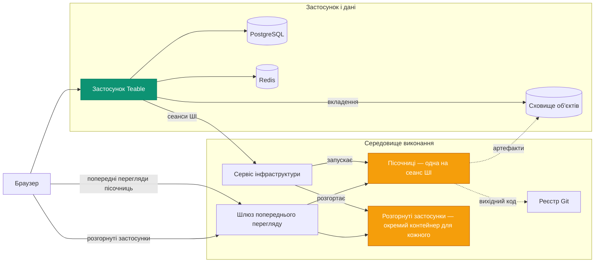

Самостійне розгортання Teable надає чотири платформи в одній:

- **Захищена масштабована пісочниця агентів** — кожен сеанс ШІ працює у власному
  ізольованому контейнері, який запускається за потреби й видаляється після завершення сеансу.
- **Ресурсоефективна платформа розгортання застосунків** — кожен застосунок, який ваша команда
  створює й публікує, працює у власному легкому довготривалому контейнері.
- **Рушій робочих процесів ШІ** — автоматизації, що запускаються змінами Записів,
  розкладами й вебхуками та містять кроки ШІ, виконуються безпосередньо там, де зберігаються ваші дані.
- **Повнофункціональна платформа спільної роботи з базами даних на PostgreSQL** — Таблиці,
  Перегляди й API.

Самостійне розгортання Teable перетворює ваші власні обчислювальні ресурси на **повністю
контрольоване продуктивне середовище, готове до роботи з агентами**, — і робить ШІ доступним кожному
учаснику вашої команди.

На цій сторінці описано відповідні сервіси та їхню взаємодію. Ресурси
для розгортання (файли Compose, діаграма Helm, значення) містяться в репозиторії
[teableio/teable-deployment](https://github.com/teableio/teable-deployment).

<Tip>Функції ШІ доступні для самостійно розгорнутого тарифного плану Business та вище.</Tip>

## Сервіси розгортання

| Сервіс | Призначення |
|---|---|
| **Застосунок Teable** | Вебінтерфейс, API, автоматизації, AI Chat — єдиний образ: `ghcr.io/teableio/teable` |
| **PostgreSQL** | Основна база даних: усі ваші Таблиці, Перегляди й метадані |
| **Redis** | Кеш, черги, спільна робота в реальному часі |
| **Сховище об’єктів** | S3-сумісне сховище файлів із трьома контейнерами: **загальнодоступний** (аватари й інші загальнодоступні ресурси), **приватний** (вкладення), **артефакти збірки** (результати App Builder) |
| **Сервіс інфраструктури** | Єдина точка входу, до якої підключається застосунок Teable; координує збірки й розгортання застосунків і має власну консоль та API |
| **Рушій пісочниць** | Запускає кожен сеанс ШІ у власному ізольованому контейнері |
| **Реєстр Git** | Зберігає вихідний код створених вами застосунків (App Builder надсилає код сюди) |
| **Шлюз попереднього перегляду** | Спрямовує браузери до попередніх Переглядів пісочниць і розгорнутих застосунків |

Останні чотири компоненти утворюють середовище виконання. Ресурси розгортання встановлюють усе це
як одну платформу.

## Взаємодія компонентів

Застосунок Teable взаємодіє із середовищем виконання через **одне підключення**: 
Сервіс інфраструктури (`TEABLE_INFRA_API_URL` / `TEABLE_INFRA_API_KEY`). Усе
за ним є внутрішнім. Основну роботу виконують два типи навантаження — саме вони
споживають ресурси вашого комп’ютера:

- **Пісочниці.** Кожен сеанс AI Chat або App Builder отримує власний ізольований
  контейнер, який запускається на початку сеансу й видаляється після завершення. Це
  основне навантаження платформи, що виникає сплесками: визначайте розмір комп’ютера за
  **піковою кількістю одночасних сеансів ШІ**, а не кількістю користувачів (обмеження ресурсів
  окремої пісочниці можна налаштувати на Панелі адміністратора).
- **Розгорнуті застосунки.** Кожен опублікований застосунок працює у власному довготривалому
  контейнері й доступний за адресою `*.app.<domain>`. Пісочниці з’являються й зникають, а розгорнуті застосунки
  накопичуються й продовжують працювати.

Інші сервіси виконують допоміжні ролі: збірка відбувається в пісочниці
сеансу, реєстр Git і сховище об’єктів зберігають створені результати
(вихідний код і артефакти збірки), а шлюз спрямовує кожен запит браузера
до потрібної пісочниці або застосунку.

## Один домен, чотири записи DNS

Усе доступне в межах **одного базового домену** — зазвичай вашого субдомену,
наприклад `teable.example.com`:

| Запис | Обслуговує |
|---|---|
| `<domain>` | Застосунок Teable |
| `infra.<domain>` | Консоль і API Сервісу інфраструктури; Git (`/git`) і сховище об’єктів також доступні за шляхами на цьому хості |
| `*.app.<domain>` | Створені й розгорнуті вами застосунки |
| `*.sandbox.<domain>` | Попередні Перегляди пісочниць у браузері |

Кожна назва є лише стандартним значенням, а будь-яке ім’я хоста можна змінити окремо
(див. приклад значень у репозиторії розгортання).

## Керування версіями

Платформа постачається як **випуски платформи** (`v<year>.<month>.<seq>`) у
репозиторії розгортання:

- **Тег** випуску є перевіреним знімком: `versions.yaml` фіксує точну
  версію кожного компонента, а файл `CHANGELOG.md` у репозиторії описує
  зміни й усі необхідні дії.
- Гілка `main` репозиторію містить найновішу поточну версію.
- Вбудований діагностичний скрипт **doctor** порівнює фактичні компоненти розгортання
  з випуском і повідомляє один із трьох результатів: сумісно, потрібно оновити
  застосунок Teable або невідома (неперевірена) комбінація.

Застосунок Teable має власну лінійку випусків (теги на основі дат; `latest` —
стабільний канал) — див. розділ [Оновлення версії](/uk/deploy/upgrade). У кожному випуску платформи
вказано перевірені версії застосунку, а скрипт doctor перевіряє це автоматично.
Агент пісочниці для сеансів ШІ завжди автоматично відповідає версії
застосунку — окреме оновлення або керування не потрібне.

## Розгортання

Обидва способи встановлюють усю платформу й повністю описані в
репозиторії розгортання:

<CardGroup cols={2}>
  <Card title="Комплексне рішення Docker" icon="docker" href="https://github.com/teableio/teable-deployment/blob/main/docker/all-in-one/README.md">
    Усі компоненти на одному комп’ютері — перше повне розгортання в режимі `local` або `server`.
  </Card>
  <Card title="Kubernetes (Helm)" icon="dharmachakra" href="https://github.com/teableio/teable-deployment/blob/main/helm/README.md">
    Єдина діаграма Helm у наявному кластері; обов’язковим є лише `global.baseDomain`.
  </Card>
</CardGroup>

ШІ поки що не потрібен? Можна запустити лише застосунок із PostgreSQL, Redis і
сховищем — **автономне** розгортання ([Розгортання Docker](/uk/deploy/docker))
— і підключити середовище виконання пізніше, не переміщуючи дані.

Пов’язані теми, що підтримуються в репозиторії розгортання:

- **Уже використовуєте автономний Teable?** Ваші дані залишаються на місці, а
  середовище виконання встановлюється поруч: [посібник з перенесення](https://github.com/teableio/teable-deployment/blob/main/migration/2026-07-basic-to-full-featured.md)
- **Внутрішні сертифікати компанії?** Якщо домен використовує приватний або
  корпоративний центр сертифікації, пісочниці потрібно налаштувати для довіри до нього —
  [private-ca.md](https://github.com/teableio/teable-deployment/blob/main/helm/private-ca.md)
- **Розрахунок ресурсів, версії та дзеркала**: [VERSIONS.md](https://github.com/teableio/teable-deployment/blob/main/VERSIONS.md) ·
  [images/README.md](https://github.com/teableio/teable-deployment/blob/main/images/README.md)
- **Якщо щось не працює**: спочатку запустіть скрипт doctor, а потім перегляньте
  [TROUBLESHOOTING.md](https://github.com/teableio/teable-deployment/blob/main/TROUBLESHOOTING.md)

Після розгортання підключіть застосунок Teable до середовища виконання за допомогою
`TEABLE_INFRA_API_URL` / `TEABLE_INFRA_API_KEY` (це описано в посібниках
із розгортання), а потім налаштуйте обмеження ресурсів у розділі
[Панель адміністратора → Sandbox Agent](/uk/basic/admin-panel/sandbox-agent).
