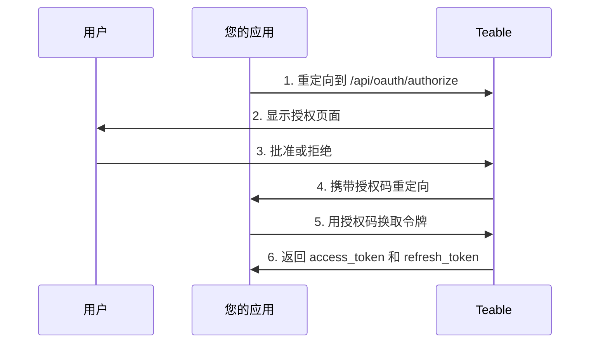

OAuth 应用允许第三方应用代表用户访问 Teable。本指南介绍如何创建和配置 OAuth 应用、实现 OAuth 2.0 授权流程，以及使用访问令牌与 Teable API 交互。

## 创建 OAuth 应用

1. 进入 Teable 账户的[设置 > OAuth 应用](https://app.teable.cn/setting/oauth-app)页面。
2. 点击**新增 OAuth 应用**创建新应用。
3. 填写必要信息：
   - **OAuth 应用名称**：应用的描述性名称
   - **主页 URL**：应用网站的完整 URL
   - **回调 URL**：用户授权后重定向的 URL
   - **权限范围**：应用所需的权限

4. 创建应用后，生成**客户端密钥**。请务必复制并安全保存——您将无法再次查看。

<Note>您将获得一个**客户端 ID**，并需要生成**客户端密钥**。请妥善保管这些凭据，切勿在客户端代码中暴露。</Note>

## 可用权限范围

权限范围定义了 OAuth 应用可以执行的操作。可用范围按资源类型组织：

| 资源 | 权限范围 |
|------|----------|
| **表格** | `table\|create`, `table\|delete`, `table\|export`, `table\|import`, `table\|read`, `table\|update`, `table\|trash_read`, `table\|trash_update`, `table\|trash_reset` |
| **视图** | `view\|create`, `view\|delete`, `view\|read`, `view\|update` |
| **字段** | `field\|create`, `field\|delete`, `field\|read`, `field\|update` |
| **记录** | `record\|comment`, `record\|create`, `record\|delete`, `record\|read`, `record\|update` |
| **自动化** | `automation\|create`, `automation\|delete`, `automation\|read`, `automation\|update` |
| **用户** | `user\|email_read` |

<Tip>只请求应用实际需要的权限范围。用户在授权时会看到请求的权限列表。</Tip>

## OAuth 2.0 授权流程

Teable 实现了标准的 OAuth 2.0 授权码流程：



### 步骤 1：将用户重定向到授权页面

使用应用参数将用户引导到授权端点：

```
GET https://app.teable.cn/api/oauth/authorize
```

**查询参数：**

| 参数 | 是否必需 | 描述 |
|------|----------|------|
| `response_type` | 是 | 必须为 `code` |
| `client_id` | 是 | 您的 OAuth 应用的客户端 ID |
| `redirect_uri` | 否 | 必须与注册的回调 URL 之一匹配。如省略，将使用第一个注册的回调 URL |
| `scope` | 否 | 以空格分隔的权限范围列表。如省略，使用 OAuth 应用中配置的范围 |
| `state` | 否 | 用于防止 CSRF 攻击的随机字符串。将在回调中返回 |

**示例：**

```
https://app.teable.cn/api/oauth/authorize?response_type=code&client_id=YOUR_CLIENT_ID&redirect_uri=https://yourapp.com/callback&scope=table|read%20record|read&state=random_state_string
```

### 步骤 2：用户授权

用户将看到授权页面，显示：
- 您的应用名称和标志
- 请求的权限（范围）
- 批准或拒绝选项

如果用户之前已授权过您的应用（默认 7 天内有效），将直接重定向而不再显示授权页面。

### 步骤 3：处理回调

用户批准（或拒绝）后，Teable 会重定向到您的回调 URL：

**成功时：**
```
https://yourapp.com/callback?code=AUTHORIZATION_CODE&state=random_state_string
```

**拒绝时：**
```
https://yourapp.com/callback?error=access_denied&state=random_state_string
```

### 步骤 4：用授权码换取令牌

用授权码换取访问令牌和刷新令牌：

```
POST https://app.teable.cn/api/oauth/access_token
Content-Type: application/x-www-form-urlencoded
```

**请求体：**

| 参数 | 是否必需 | 描述 |
|------|----------|------|
| `grant_type` | 是 | 必须为 `authorization_code` |
| `code` | 是 | 收到的授权码 |
| `client_id` | 是 | 您的 OAuth 应用的客户端 ID |
| `client_secret` | 是 | 您的 OAuth 应用的客户端密钥 |
| `redirect_uri` | 否 | 必须与授权时使用的 redirect_uri 匹配 |

**请求示例：**

```bash
curl -X POST https://app.teable.cn/api/oauth/access_token \
  -H "Content-Type: application/x-www-form-urlencoded" \
  -d "grant_type=authorization_code" \
  -d "code=AUTHORIZATION_CODE" \
  -d "client_id=YOUR_CLIENT_ID" \
  -d "client_secret=YOUR_CLIENT_SECRET" \
  -d "redirect_uri=https://yourapp.com/callback"
```

**响应：**

```json
{
  "token_type": "Bearer",
  "access_token": "teable_xxxxxxxxxxxx",
  "refresh_token": "eyJhbGciOiJIUzI1NiIsInR5cCI6IkpXVCJ9...",
  "expires_in": 600,
  "refresh_expires_in": 2592000,
  "scopes": ["table|read", "record|read"]
}
```

| 字段 | 描述 |
|------|------|
| `token_type` | 始终为 `Bearer` |
| `access_token` | 用于 API 请求的令牌 |
| `refresh_token` | 用于获取新访问令牌的令牌 |
| `expires_in` | 访问令牌有效期（秒）（默认：600 = 10 分钟） |
| `refresh_expires_in` | 刷新令牌有效期（秒）（默认：2592000 = 30 天） |
| `scopes` | 已授权的权限范围数组 |

## 使用访问令牌

在 API 请求的 `Authorization` 头中包含访问令牌：

```bash
curl https://app.teable.cn/api/table/TABLE_ID/record \
  -H "Authorization: Bearer YOUR_ACCESS_TOKEN"
```

## 刷新访问令牌

当访问令牌过期时，使用刷新令牌获取新的访问令牌：

```
POST https://app.teable.cn/api/oauth/access_token
Content-Type: application/x-www-form-urlencoded
```

**请求体：**

| 参数 | 是否必需 | 描述 |
|------|----------|------|
| `grant_type` | 是 | 必须为 `refresh_token` |
| `refresh_token` | 是 | 当前的刷新令牌 |
| `client_id` | 是 | 您的 OAuth 应用的客户端 ID |
| `client_secret` | 是 | 您的 OAuth 应用的客户端密钥 |

**请求示例：**

```bash
curl -X POST https://app.teable.cn/api/oauth/access_token \
  -H "Content-Type: application/x-www-form-urlencoded" \
  -d "grant_type=refresh_token" \
  -d "refresh_token=YOUR_REFRESH_TOKEN" \
  -d "client_id=YOUR_CLIENT_ID" \
  -d "client_secret=YOUR_CLIENT_SECRET"
```

<Warning>刷新后，之前的刷新令牌将失效。请务必保存响应中的新刷新令牌。</Warning>

## 撤销访问权限

### OAuth 应用所有者

要撤销为特定客户端发放的所有令牌，使用撤销端点：

```
POST https://app.teable.cn/api/oauth/client/{clientId}/revoke-token
```

这将使该 OAuth 应用的所有访问令牌和刷新令牌失效。

### 用户

用户可以通过[已授权应用](https://app.teable.cn/setting/authorized-apps)设置页面撤销访问权限。

### 应用程序

应用程序可以撤销自己的访问权限：

```
GET https://app.teable.cn/api/oauth/client/{clientId}/revoke-token
Authorization: Bearer YOUR_ACCESS_TOKEN
```

## 令牌过期时间

| 令牌类型 | 默认过期时间 | 可通过环境变量配置 |
|----------|--------------|-------------------|
| 授权码 | 5 分钟 | `BACKEND_OAUTH_CODE_EXPIRE_IN` |
| 访问令牌 | 10 分钟 | `BACKEND_OAUTH_ACCESS_TOKEN_EXPIRE_IN` |
| 刷新令牌 | 30 天 | `BACKEND_OAUTH_REFRESH_TOKEN_EXPIRE_IN` |
| 授权记忆期 | 7 天 | `BACKEND_OAUTH_AUTHORIZED_EXPIRE_IN` |

## 错误处理

常见错误响应：

| 错误 | 描述 |
|------|------|
| `invalid_client` | 无效的客户端 ID 或客户端密钥 |
| `invalid_grant` | 授权码已过期或已使用 |
| `invalid_scope` | 请求的权限范围不被该 OAuth 应用允许 |
| `access_denied` | 用户拒绝了授权请求 |
| `redirect_uri_mismatch` | 重定向 URI 与注册的 URL 不匹配 |

## 最佳实践

1. **安全存储密钥**：切勿在客户端代码中暴露您的客户端密钥
2. **使用 state 参数**：始终包含随机的 `state` 参数以防止 CSRF 攻击
3. **请求最小权限范围**：只请求应用实际需要的权限
4. **处理令牌刷新**：在令牌过期前实现自动刷新
5. **安全存储令牌**：将访问令牌和刷新令牌安全地存储在服务器端

