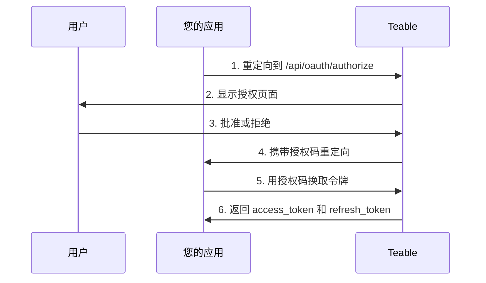

OAuth 应用允许第三方应用代表用户访问 Teable。本指南介绍如何创建和配置 OAuth 应用、实现 OAuth 2.0 授权流程，以及使用访问令牌与 Teable API 交互。

Teable 支持两种 OAuth 2.0 授权模式：

- **授权码 + 客户端密钥**：适用于有后端服务器的 Web 应用
- **授权码 + PKCE**：适用于原生应用、CLI 工具、单页应用等无法安全存储密钥的公共客户端

## 创建 OAuth 应用

1. 进入 Teable 账户的[设置 > OAuth 应用](https://app.teable.cn/setting/oauth-app)页面。
2. 点击**新增 OAuth 应用**创建新应用。
3. 填写必要信息：
   - **OAuth 应用名称**：应用的描述性名称
   - **主页 URL**：应用网站的完整 URL
   - **回调 URL**：用户授权后重定向的 URL
   - **权限范围**：应用所需的权限

4. 创建应用后，生成**客户端密钥**。请务必复制并安全保存——您将无法再次查看。

<Note>您将获得一个**客户端 ID**，并需要生成**客户端密钥**。请妥善保管这些凭据，切勿在客户端代码中暴露。如果使用 PKCE 模式，则不需要客户端密钥。</Note>

## 可用权限范围

权限范围定义了 OAuth 应用可以执行的操作。可用范围按资源类型组织：

| 资源 | 权限范围 |
|------|----------|
| **应用** | `app\|create`, `app\|read`, `app\|update`, `app\|delete` |
| **数据库** | `base\|read`, `base\|read_all`, `base\|update`, `base\|table_import`, `base\|table_export`, `base\|query_data` |
| **表格** | `table\|create`, `table\|delete`, `table\|export`, `table\|import`, `table\|read`, `table\|update`, `table\|trash_read`, `table\|trash_update`, `table\|trash_reset` |
| **视图** | `view\|create`, `view\|delete`, `view\|read`, `view\|update` |
| **字段** | `field\|create`, `field\|delete`, `field\|read`, `field\|update` |
| **记录** | `record\|comment`, `record\|create`, `record\|delete`, `record\|read`, `record\|update` |
| **自动化** | `automation\|create`, `automation\|delete`, `automation\|read`, `automation\|update` |
| **用户** | `user\|email_read`, `user\|integrations` |

<Tip>只请求应用实际需要的权限范围。用户在授权时会看到请求的权限列表。</Tip>

## OAuth 2.0 授权码流程

Teable 实现了标准的 OAuth 2.0 授权码流程：


```mermaid
sequenceDiagram
    participant User as 用户
    participant App as 您的应用
    participant Teable

    App->>Teable: 1. 重定向到 /api/oauth/authorize
    Teable->>User: 2. 显示授权页面
    User->>Teable: 3. 批准或拒绝
    Teable->>App: 4. 携带授权码重定向
    App->>Teable: 5. 用授权码换取令牌
    Teable->>App: 6. 返回 access_token 和 refresh_token
```

### 步骤 1：将用户重定向到授权页面

使用应用参数将用户引导到授权端点：

```
GET https://app.teable.cn/api/oauth/authorize
```

**查询参数：**

| 参数 | 是否必需 | 描述 |
|------|----------|------|
| `response_type` | 是 | 必须为 `code` |
| `client_id` | 是 | 您的 OAuth 应用的客户端 ID |
| `redirect_uri` | 否 | 必须与注册的回调 URL 之一匹配。如省略，将使用第一个注册的回调 URL |
| `scope` | 否 | 以空格分隔的权限范围列表。如省略，使用 OAuth 应用中配置的范围 |
| `state` | 否 | 用于防止 CSRF 攻击的随机字符串。将在回调中返回 |

**示例：**

```
https://app.teable.cn/api/oauth/authorize?response_type=code&client_id=YOUR_CLIENT_ID&redirect_uri=https://yourapp.com/callback&scope=table|read%20record|read&state=random_state_string
```

### 步骤 2：用户授权

用户将看到授权页面，显示：
- 您的应用名称和标志
- 请求的权限（范围）
- 批准或拒绝选项

如果用户之前已授权过您的应用（默认 7 天内有效），将直接重定向而不再显示授权页面。

### 步骤 3：处理回调

用户批准（或拒绝）后，Teable 会重定向到您的回调 URL：

**成功时：**
```
https://yourapp.com/callback?code=AUTHORIZATION_CODE&state=random_state_string
```

**拒绝时：**
```
https://yourapp.com/callback?error=access_denied&state=random_state_string
```

### 步骤 4：用授权码换取令牌

用授权码换取访问令牌和刷新令牌：

```
POST https://app.teable.cn/api/oauth/access_token
Content-Type: application/x-www-form-urlencoded
```

**请求体：**

| 参数 | 是否必需 | 描述 |
|------|----------|------|
| `grant_type` | 是 | 必须为 `authorization_code` |
| `code` | 是 | 收到的授权码 |
| `client_id` | 是 | 您的 OAuth 应用的客户端 ID |
| `client_secret` | 是 | 您的 OAuth 应用的客户端密钥 |
| `redirect_uri` | 是 | 必须与授权时使用的 redirect_uri 完全匹配 |

**请求示例：**

```bash
curl -X POST https://app.teable.cn/api/oauth/access_token \
  -H "Content-Type: application/x-www-form-urlencoded" \
  -d "grant_type=authorization_code" \
  -d "code=AUTHORIZATION_CODE" \
  -d "client_id=YOUR_CLIENT_ID" \
  -d "client_secret=YOUR_CLIENT_SECRET" \
  -d "redirect_uri=https://yourapp.com/callback"
```

**响应：**

```json
{
  "token_type": "Bearer",
  "access_token": "teable_xxxxxxxxxxxx",
  "refresh_token": "eyJhbGciOiJIUzI1NiIsInR5cCI6IkpXVCJ9...",
  "expires_in": 600,
  "refresh_expires_in": 2592000,
  "scopes": ["table|read", "record|read"]
}
```

| 字段 | 描述 |
|------|------|
| `token_type` | 始终为 `Bearer` |
| `access_token` | 用于 API 请求的令牌 |
| `refresh_token` | 用于获取新访问令牌的令牌 |
| `expires_in` | 访问令牌有效期（秒）（默认：600 = 10 分钟） |
| `refresh_expires_in` | 刷新令牌有效期（秒）（默认：2592000 = 30 天） |
| `scopes` | 已授权的权限范围数组 |

## PKCE 授权流程

PKCE（Proof Key for Code Exchange）是为无法安全存储客户端密钥的应用设计的授权模式，如原生桌面应用、移动应用、CLI 工具或单页应用。

### 步骤 1：生成 PKCE 参数

在发起授权前，客户端需要生成一对 PKCE 参数：

```javascript
// 生成 code_verifier（43-128 位随机字符串）
const codeVerifier = generateRandomString(43);

// 生成 code_challenge = BASE64URL(SHA256(code_verifier))
const encoder = new TextEncoder();
const data = encoder.encode(codeVerifier);
const digest = await crypto.subtle.digest('SHA-256', data);
const codeChallenge = btoa(String.fromCharCode(...new Uint8Array(digest)))
  .replace(/\+/g, '-').replace(/\//g, '_').replace(/=+$/, '');
```

### 步骤 2：将用户重定向到授权页面

```
GET https://app.teable.cn/api/oauth/authorize
```

**查询参数：**

| 参数 | 是否必需 | 描述 |
|------|----------|------|
| `response_type` | 是 | 必须为 `code` |
| `client_id` | 是 | 您的 OAuth 应用的客户端 ID |
| `redirect_uri` | 否 | 回调地址，PKCE 模式支持 loopback 地址 |
| `scope` | 否 | 以空格分隔的权限范围列表 |
| `state` | 否 | 用于防止 CSRF 攻击的随机字符串 |
| `code_challenge` | 是 | 由 code_verifier 生成的 SHA-256 哈希值（Base64URL 编码） |
| `code_challenge_method` | 是 | 必须为 `S256` |

**示例：**

```
https://app.teable.cn/api/oauth/authorize?response_type=code&client_id=YOUR_CLIENT_ID&redirect_uri=http://127.0.0.1:8080/callback&code_challenge=YOUR_CODE_CHALLENGE&code_challenge_method=S256&state=random_state_string
```

<Tip>PKCE 模式下，`redirect_uri` 支持 loopback 地址（`http://127.0.0.1`、`http://[::1]`、`http://localhost`），端口可以灵活匹配，无需精确注册每个端口。</Tip>

### 步骤 3：处理回调

与标准授权码流程相同，用户批准后会携带 `code` 重定向到您的回调地址。

### 步骤 4：用授权码 + code_verifier 换取令牌

```
POST https://app.teable.cn/api/oauth/access_token
Content-Type: application/x-www-form-urlencoded
```

**请求体：**

| 参数 | 是否必需 | 描述 |
|------|----------|------|
| `grant_type` | 是 | 必须为 `authorization_code` |
| `code` | 是 | 收到的授权码 |
| `client_id` | 是 | 您的 OAuth 应用的客户端 ID |
| `code_verifier` | 是 | 步骤 1 中生成的原始随机字符串 |
| `redirect_uri` | 是 | 必须与授权时使用的 redirect_uri 完全匹配 |

<Note>PKCE 模式不需要 `client_secret`，用 `code_verifier` 代替密钥来验证客户端身份。</Note>

**请求示例：**

```bash
curl -X POST https://app.teable.cn/api/oauth/access_token \
  -H "Content-Type: application/x-www-form-urlencoded" \
  -d "grant_type=authorization_code" \
  -d "code=AUTHORIZATION_CODE" \
  -d "client_id=YOUR_CLIENT_ID" \
  -d "code_verifier=YOUR_CODE_VERIFIER" \
  -d "redirect_uri=http://127.0.0.1:8080/callback"
```

响应格式与标准授权码流程相同。

## 使用访问令牌

在 API 请求的 `Authorization` 头中包含访问令牌：

```bash
curl https://app.teable.cn/api/table/TABLE_ID/record \
  -H "Authorization: Bearer YOUR_ACCESS_TOKEN"
```

通常在获取令牌后，第一步是获取当前用户可访问的所有 Base 列表：

```bash
curl https://app.teable.cn/api/base/access/all \
  -H "Authorization: Bearer YOUR_ACCESS_TOKEN"
```

该接口返回当前用户有权限访问的所有 Base，可从中获取 `baseId` 用于后续 API 调用。

## 刷新访问令牌

当访问令牌过期时，使用刷新令牌获取新的访问令牌：

```
POST https://app.teable.cn/api/oauth/access_token
Content-Type: application/x-www-form-urlencoded
```

**请求体：**

| 参数 | 是否必需 | 描述 |
|------|----------|------|
| `grant_type` | 是 | 必须为 `refresh_token` |
| `refresh_token` | 是 | 当前的刷新令牌 |
| `client_id` | 是 | 您的 OAuth 应用的客户端 ID |
| `client_secret` | 条件必需 | 标准授权码模式必需，PKCE 模式不需要 |

**请求示例：**

```bash
curl -X POST https://app.teable.cn/api/oauth/access_token \
  -H "Content-Type: application/x-www-form-urlencoded" \
  -d "grant_type=refresh_token" \
  -d "refresh_token=YOUR_REFRESH_TOKEN" \
  -d "client_id=YOUR_CLIENT_ID" \
  -d "client_secret=YOUR_CLIENT_SECRET"
```

<Warning>刷新后，之前的刷新令牌将失效（Refresh Token Rotation）。请务必保存响应中的新刷新令牌。</Warning>

## 撤销访问权限

### OAuth 应用所有者

撤销该应用对**所有用户**的访问权限（仅应用创建者可操作）：

```
POST https://app.teable.cn/api/oauth/client/{clientId}/revoke-access
```

这将删除所有用户的授权记录和令牌，使该应用完全无法访问任何用户的数据。

### 用户撤销自己的授权

撤销**当前用户**对某个应用的授权：

```
POST https://app.teable.cn/api/oauth/client/{clientId}/revoke-token
```

这只会使当前用户的访问令牌和刷新令牌失效，不影响其他用户。

用户也可以通过[已授权应用](https://app.teable.cn/setting/authorized-apps)设置页面撤销。

### 应用程序自行撤销

应用程序可以使用 Access Token 撤销自己的访问权限：

```
GET https://app.teable.cn/api/oauth/client/{clientId}/revoke-token
Authorization: Bearer YOUR_ACCESS_TOKEN
```

<Note>此端点仅接受 Access Token 认证，不支持 Session 认证。</Note>

## 令牌过期时间

| 令牌类型 | 默认过期时间 | 可通过环境变量配置 |
|----------|--------------|-------------------|
| 授权码 | 5 分钟 | `BACKEND_OAUTH_CODE_EXPIRE_IN` |
| 访问令牌 | 10 分钟 | `BACKEND_OAUTH_ACCESS_TOKEN_EXPIRE_IN` |
| 刷新令牌 | 30 天 | `BACKEND_OAUTH_REFRESH_TOKEN_EXPIRE_IN` |
| 授权记忆期 | 7 天 | `BACKEND_OAUTH_AUTHORIZED_EXPIRE_IN` |

## 错误处理

常见错误响应：

| 错误 | 描述 |
|------|------|
| `invalid_client` | 无效的客户端 ID 或客户端密钥 |
| `invalid_grant` | 授权码已过期或已使用 |
| `invalid_scope` | 请求的权限范围不被该 OAuth 应用允许 |
| `access_denied` | 用户拒绝了授权请求 |
| `redirect_uri_mismatch` | 重定向 URI 与注册的 URL 不匹配 |
| `too_many_requests` | Token 请求超过速率限制（默认每 15 分钟 30 次） |

## 最佳实践

1. **选择合适的模式**：有后端服务器的 Web 应用使用客户端密钥模式，原生应用/CLI/SPA 使用 PKCE 模式
2. **安全存储密钥**：切勿在客户端代码中暴露您的客户端密钥
3. **使用 state 参数**：始终包含随机的 `state` 参数以防止 CSRF 攻击
4. **请求最小权限范围**：只请求应用实际需要的权限
5. **处理令牌刷新**：在令牌过期前实现自动刷新
6. **安全存储令牌**：将访问令牌和刷新令牌安全地存储在服务器端

## 完整示例

### Node.js（授权码 + 客户端密钥）

```javascript
const express = require('express');
const crypto = require('crypto');
const app = express();

const CLIENT_ID = 'your_client_id';
const CLIENT_SECRET = 'your_client_secret';
const REDIRECT_URI = 'http://localhost:3000/callback';
const TEABLE_URL = 'https://app.teable.cn';

// 步骤 1：引导用户授权
app.get('/login', (req, res) => {
  const state = crypto.randomBytes(16).toString('hex');
  req.session.oauthState = state; // 将 state 存入 session
  const authUrl = `${TEABLE_URL}/api/oauth/authorize?` +
    `response_type=code&` +
    `client_id=${CLIENT_ID}&` +
    `redirect_uri=${encodeURIComponent(REDIRECT_URI)}&` +
    `scope=${encodeURIComponent('record|read table|read')}&` +
    `state=${state}`;
  res.redirect(authUrl);
});

// 步骤 2：处理回调，用授权码换取令牌
app.get('/callback', async (req, res) => {
  const { code, state } = req.query;

  // 验证 state 参数防止 CSRF
  if (state !== req.session.oauthState) {
    return res.status(403).send('Invalid state');
  }

  const response = await fetch(`${TEABLE_URL}/api/oauth/access_token`, {
    method: 'POST',
    headers: { 'Content-Type': 'application/x-www-form-urlencoded' },
    body: new URLSearchParams({
      grant_type: 'authorization_code',
      client_id: CLIENT_ID,
      client_secret: CLIENT_SECRET,
      code,
      redirect_uri: REDIRECT_URI,
    }),
  });

  const tokens = await response.json();
  // tokens.access_token — 用于调用 API
  // tokens.refresh_token — 用于刷新令牌
  res.json({ success: true, scopes: tokens.scopes });
});

app.listen(3000);
```

### Python（PKCE 模式，适用于 CLI 工具）

```python
import hashlib
import base64
import secrets
import http.server
import urllib.parse
import requests

CLIENT_ID = 'your_client_id'
TEABLE_URL = 'https://app.teable.cn'
PORT = 8080
REDIRECT_URI = f'http://127.0.0.1:{PORT}/callback'

# 步骤 1：生成 PKCE 参数
code_verifier = secrets.token_urlsafe(32)  # 43 字符
code_challenge = base64.urlsafe_b64encode(
    hashlib.sha256(code_verifier.encode()).digest()
).rstrip(b'=').decode()

# 步骤 2：构造授权 URL（在浏览器中打开）
auth_url = (
    f"{TEABLE_URL}/api/oauth/authorize?"
    f"response_type=code&"
    f"client_id={CLIENT_ID}&"
    f"redirect_uri={urllib.parse.quote(REDIRECT_URI)}&"
    f"code_challenge={code_challenge}&"
    f"code_challenge_method=S256"
)
print(f"请在浏览器中打开:\n{auth_url}")

# 步骤 3：启动本地服务器接收回调
authorization_code = None

class CallbackHandler(http.server.BaseHTTPRequestHandler):
    def do_GET(self):
        global authorization_code
        query = urllib.parse.urlparse(self.path).query
        params = urllib.parse.parse_qs(query)
        authorization_code = params.get('code', [None])[0]
        self.send_response(200)
        self.end_headers()
        self.wfile.write(b'Authorization successful! You can close this page.')

    def log_message(self, format, *args):
        pass  # 静默日志

server = http.server.HTTPServer(('127.0.0.1', PORT), CallbackHandler)
server.handle_request()  # 只处理一个请求

# 步骤 4：用授权码 + code_verifier 换取令牌
response = requests.post(f"{TEABLE_URL}/api/oauth/access_token", data={
    'grant_type': 'authorization_code',
    'client_id': CLIENT_ID,
    'code': authorization_code,
    'redirect_uri': REDIRECT_URI,
    'code_verifier': code_verifier,
})

tokens = response.json()
print(f"Access Token: {tokens['access_token']}")
print(f"Expires in: {tokens['expires_in']}s")
```
