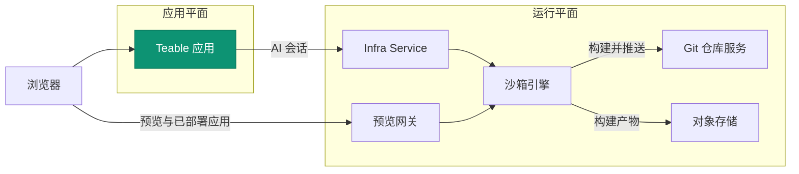

<Tip>私有化部署 Business 及以上套餐可用</Tip>

Teable 的 AI 能力 —— **AI Chat**、**App Builder** 与**应用部署** —— 运行在一个与
Teable 应用并列自部署的**运行面**上。本页只讲架构;可部署资产(compose、Helm chart、
values)全部在 [teableio/teable-deployment](https://github.com/teableio/teable-deployment)
仓库中维护,那里是唯一事实源 —— 本页没有任何需要复制的内容。

## 两个平面

一套全功能部署由两个平面组成:

| 平面 | 内容 |
|---|---|
| **应用平面** | Teable 应用本体,及其 PostgreSQL 与 Redis |
| **运行平面** | 支撑全部 AI 能力的服务(见下) |

运行平面包含五个服务:

| 服务 | 职责 |
|---|---|
| **沙箱引擎** | 每个 AI 会话都在独立的沙箱容器中运行 |
| **Infra Service** | 控制台与 API,Teable 应用的对接点;编排构建与应用部署 |
| **Git 仓库服务** | 你构建的应用的源码事实源(App Builder 推送至此) |
| **对象存储** | 附件与构建产物(S3 兼容) |
| **预览网关** | 在浏览器中提供沙箱预览与已部署应用的访问 |

AI 对话在沙箱内运行;App Builder 在同一个沙箱里构建,把源码推到 Git 仓库服务、
把构建产物存入对象存储,部署后的应用经预览网关对外提供访问。

## 一个域名,四条 DNS 记录

一切派生自**一个基础域名** —— 通常是你组织域名的子域,例如 `teable.example.com`:

| 记录 | 用途 |
|---|---|
| `<domain>` | Teable 应用 |
| `infra.<domain>` | Infra 控制台与 API —— git(`/git` 路径)与对象存储(桶路径)共用此主机 |
| `*.app.<domain>` | 你构建并部署的应用 |
| `*.sandbox.<domain>` | 浏览器中的沙箱预览 |

每个名字都只是默认值,任何主机名均可单独覆盖(见部署仓库的 values 示例)。

## Agent 如何与应用保持同步

沙箱 agent 镜像配置为**不带 tag 的前缀**。Teable 应用启动 AI 会话时会拼上
**自身的发布版本 tag**,因此 agent 永远与应用版本配对 —— 并且应用会经
Infra Service 预热这个镜像,首次会话不必现场拉取数 GB 镜像。
你永远不需要手动拉取或钉定 agent。

## 版本体系

运行平面以部署仓库的**平台版本**(`v<年>.<月>.<序号>`)形式发布:

- **tag** 是已验证的快照:`versions.yaml` 钉定每个组件镜像(含 digest),
  仓库的 `CHANGELOG.md` 写明每版变了什么、你需要做什么;
- 仓库 `main` 分支是滚动最新;
- 自带的 **doctor** 脚本会把你实际运行的组合与版本清单比对,给出三态结论:
  兼容 / 需升级 Teable 应用 / 未知(未经验证的)组合。

Teable 应用有自己独立的发版线(日期型 tag;`latest` 为稳定通道)——
见[版本升级](/zh/deploy/upgrade)。平台版本会声明应用兼容窗口,doctor 替你检查。

## 部署

两条路径安装的是同一套平台,部署仓库内有完整指引:

<CardGroup cols={2}>
  <Card title="Docker 单机全栈" icon="docker" href="https://github.com/teableio/teable-deployment/blob/main/docker/all-in-one/README.md">
    一台机器装下一切 —— 首次全功能部署,支持 local / server 两种模式。
  </Card>
  <Card title="Kubernetes(Helm)" icon="dharmachakra" href="https://github.com/teableio/teable-deployment/blob/main/helm/README.md">
    一个伞形 chart 装进现有集群;只需设置 global.baseDomain。
  </Card>
</CardGroup>

相关主题(均在部署仓库中维护):

- **已在运行基础版 Teable?** 数据原地不动,运行平面挂在旁边即可:
  [迁移指南](https://github.com/teableio/teable-deployment/blob/main/migration/2026-07-basic-to-full-featured.md)
- **私有/企业 CA**:沙箱必须信任你入口的证书 ——
  [private-ca.md](https://github.com/teableio/teable-deployment/blob/main/helm/private-ca.md)
- **容量、版本与镜像加速**:[VERSIONS.md](https://github.com/teableio/teable-deployment/blob/main/VERSIONS.md) ·
  [images/README.md](https://github.com/teableio/teable-deployment/blob/main/images/README.md)
- **出问题时**:先跑 doctor,再看
  [TROUBLESHOOTING.md](https://github.com/teableio/teable-deployment/blob/main/TROUBLESHOOTING.md)

部署完成后,用 `TEABLE_INFRA_API_URL` / `TEABLE_INFRA_API_KEY` 把 Teable 应用接到
运行平面(部署指引中有说明),然后在
[管理面板 → Sandbox Agent](/zh/basic/admin-panel/sandbox-agent) 配置运行限制。
