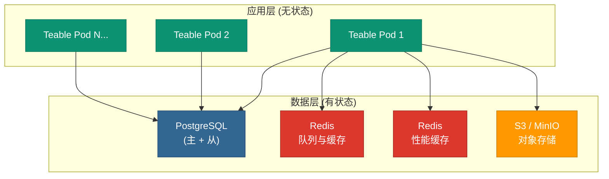

<Callout type="info">
**推荐场景**：50+ 用户的生产环境
</Callout>

## 架构概览

Teable 采用**无状态应用层**配合**外部状态服务**的设计，支持水平扩展和高可用。

### 组件说明

| 组件 | 用途 | 托管服务示例 |
|------|------|-------------|
| **Teable 应用** | 无状态 Web 应用 | K8s, AWS ECS, Azure App Service, GCP Cloud Run |
| **PostgreSQL** | 主数据存储 | AWS RDS, Azure PostgreSQL, Google Cloud SQL |
| **Redis (队列)** | 后台任务与缓存 | ElastiCache, Azure Cache, Memorystore |
| **Redis (性能)** | 读取性能缓存 | 可使用同一个或独立实例 |
| **对象存储** | 文件与附件 | AWS S3, MinIO, 任何 S3 兼容存储 |

<Note>
**核心要点**：Teable 应用不持有任何持久化状态，可以通过增加 Pod 实现水平扩展，任何 Pod 都能处理任何请求。
</Note>

---

## 配置建议

<Warning>
以下是 Teable 工程团队的**生产环境**配置建议。如需评估测试，请参考 [Docker 快速部署](/zh/deploy/docker)。
</Warning>

### 应用层 (Teable Pods)

| 配置项 | 建议值 |
|--------|--------|
| 每 Pod CPU | 2 vCPU |
| 每 Pod 内存 | 4 GB |
| 最小副本数 | 2 |
| 自动扩容触发 | CPU 使用率 50% |

<Tip>
使用 Kubernetes 的 Horizontal Pod Autoscaler (HPA)，或 AWS ECS / Azure App Service / GCP Cloud Run 的等效自动扩缩容功能。
</Tip>

### 数据库 (PostgreSQL)

| 配置项 | 建议值 |
|--------|--------|
| CPU | 4 vCPU |
| 内存 | 16 GB |
| 拓扑 | 1 主 + 1 从 |
| 备份 | 每日自动备份 |
| 版本 | 15+ 推荐 |

<Warning>
务必配置从库以实现高可用。使用托管数据库服务可获得自动故障转移能力。
</Warning>

### 缓存 (Redis)

Teable 使用**两个独立的 Redis 实例**：

| 用途 | 环境变量 | CPU | 内存 |
|------|----------|-----|------|
| 队列与缓存 | `BACKEND_CACHE_REDIS_URI` | 1 vCPU | 2 GB |
| 性能缓存 | `BACKEND_PERFORMANCE_CACHE` | 2 vCPU | 4 GB |

<Note>
性能缓存 (`BACKEND_PERFORMANCE_CACHE`) 可选但**强烈建议**配置，对多人协作场景能显著提升读取性能。
</Note>

### 对象存储

- **类型**：S3 兼容存储（AWS S3, MinIO 等）
- **存储桶**：需要 2 个（公开 + 私有）
- **容量**：使用托管 S3 服务可自动扩展

详见 [对象存储配置指南](/zh/deploy/storage)。

---

## 扩容策略

| 组件 | 扩容方式 | 扩容时机 |
|------|----------|----------|
| Teable 应用 | **自动**（水平扩展） | CPU > 50%（增加 Pod） |
| PostgreSQL | **手动**（垂直扩展） | CPU > 70% 持续 |
| Redis | **手动**（垂直扩展） | 内存 > 80% 或 CPU > 60% |

<Accordion title="为什么采用两种扩容方式？">
**应用层**：无状态设计支持自动水平扩展。Kubernetes HPA 或云服务自动扩缩容会根据 CPU 指标自动处理。

**数据库和 Redis**：这些是有状态服务，垂直扩展（更大的实例）比水平扩展更简单安全。监控指标，在超过阈值时进行扩容。
</Accordion>

---

## 最小配置 vs 生产配置

| | 最小配置 (PoC) | 生产配置 |
|---|----------------|----------|
| Teable 应用 | 1 实例, 2c4g | 2+ Pod, 每个 2c4g, 自动扩缩容 |
| PostgreSQL | 2c4g, 单实例 | 4c16g, 1 主 + 1 从 |
| Redis | 1 实例, 1c2g | 2 实例（队列 + 性能） |
| 存储 | S3 兼容对象存储 | S3 兼容对象存储 |
| 可用性 | 无（单点故障） | 高可用冗余 |

<Warning>
"最小配置"仅供**评估测试**使用，没有冗余——服务器故障可能导致数据丢失。
</Warning>

---

## 下一步：选择部署平台

<CardGroup cols={2}>
  <Card title="Kubernetes" icon="dharmachakra" href="/zh/deploy/k8s">
    在任意 K8s 集群上部署，完全掌控基础设施。
  </Card>
  <Card title="AWS" icon="aws" href="/zh/deploy/aws">
    ECS + RDS + ElastiCache + S3，推荐 50+ 用户使用。
  </Card>
  <Card title="Azure" icon="microsoft" href="/zh/deploy/azure">
    App Service + PostgreSQL + Redis + S3 兼容存储。
  </Card>
  <Card title="Google Cloud" icon="google" href="/zh/deploy/gcp">
    Cloud Run + Cloud SQL + Memorystore + Cloud Storage。
  </Card>
</CardGroup>

---

## 相关文档

- [环境变量参考](/zh/deploy/env) — 所有配置选项
- [对象存储配置](/zh/deploy/storage) — S3 存储桶配置
- [许可证激活](/zh/deploy/activate) — 激活私有化部署许可证
