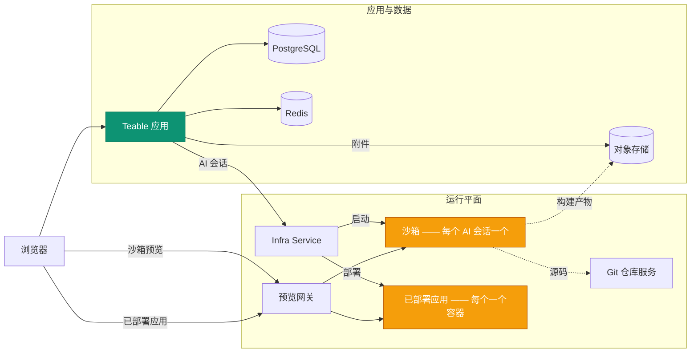

Teable 本身就是 AI 产品;私有化部署一套 Teable,等于同时部署了三个平台:

- **一套安全、可扩展的 agent 沙箱** —— 每个 AI 会话都在自己独立的容器中运行,
  按需启动,会话结束即回收;
- **一套资源利用率极高的应用部署平台** —— 团队构建并发布的每个应用,都以
  自己的轻量长驻容器运行;
- **一套基于 PostgreSQL 的全功能数据库协作平台** —— 表格、视图、API、自动化。

通过 Teable 私有化部署,你的计算资源被封装成一个 **agent-ready、完全可控的
生产力环境** —— 把 AI 能力交到团队每个人手里。

本页讲清这背后的各个服务与它们如何协同。可部署资产(compose、Helm chart、
values)全部在
[teableio/teable-deployment](https://github.com/teableio/teable-deployment)
仓库中维护,那里是唯一事实源 —— 本页没有任何需要复制的内容。

<Tip>AI 能力面向私有化部署 Business 及以上套餐提供。</Tip>

## 一套部署包含什么

| 服务 | 作用 |
|---|---|
| **Teable 应用** | Web 界面、API、自动化、AI 对话 —— 单一镜像:`ghcr.io/teableio/teable` |
| **PostgreSQL** | 主数据库:你的所有表、视图与元数据都存在这里 |
| **Redis** | 缓存、队列、实时协作 |
| **对象存储** | S3 兼容的文件存储,三个桶:**public**(头像等公开资源)、**private**(附件)、**build artifacts**(App Builder 的构建产物) |
| **Infra Service** | Teable 应用唯一连接的入口;协调构建与应用部署,自带控制台与 API |
| **沙箱引擎** | 让每个 AI 会话在自己独立的容器里运行 |
| **Git 仓库服务** | 保存你构建的应用的源码(App Builder 推送至此) |
| **预览网关** | 把浏览器请求转到沙箱预览或已部署应用 |

后四个组成运行平面。部署资产会把以上全部作为一个平台一次装好。

## 如何协同

```mermaid
graph LR
    U["浏览器"]
    subgraph "应用与数据"
        T["Teable 应用"]
        P[("PostgreSQL")]
        R[("Redis")]
        S[("对象存储")]
    end
    subgraph "运行平面"
        I["Infra Service"]
        E["沙箱 —— 每个 AI 会话一个"]
        A["已部署应用 —— 每个一个容器"]
        G["Git 仓库服务"]
        W["预览网关"]
    end
    U --> T
    T --> P
    T --> R
    T -- "附件" --> S
    T -- "AI 会话" --> I
    I -- "启动" --> E
    I -- "部署" --> A
    E -. "源码" .-> G
    E -. "构建产物" .-> S
    U -- "沙箱预览" --> W
    U -- "已部署应用" --> W
    W --> E
    W --> A

    style T fill:#0D9373,stroke:#0a7a5e,color:#fff
    style E fill:#F59E0B,stroke:#b45309,color:#fff
    style A fill:#F59E0B,stroke:#b45309,color:#fff
```

Teable 应用只通过**一个连接**接入运行平面:Infra Service
(`TEABLE_INFRA_API_URL` / `TEABLE_INFRA_API_KEY`),其余交互都发生在运行平面
内部,你无需关心。真正干活、也真正消耗机器资源的,是两类负载:

- **沙箱。** 每个 AI 对话、每次 App Builder 构建会话,都会得到一个自己独立的
  容器 —— 会话开始时启动,结束即回收。这是平台最主要的负载,而且一阵一阵来:
  机器规格按 **AI 会话的峰值并发**来估,而不是按用户数(单个沙箱的资源限额
  可在管理面板设置)。
- **已部署应用。** 每个被发布出去的应用都是一个长期运行的容器,通过
  `*.app.<domain>` 对外服务。沙箱来了又走,已部署应用则越攒越多、持续运行。

其余服务都是配角:构建在会话的沙箱里完成,Git 仓库服务与对象存储保存它产出的
源码和构建产物,网关把每个浏览器请求转到对应的沙箱或应用。

## 一个域名,四条 DNS 记录

所有服务都挂在**一个基础域名**下 —— 通常是你组织域名的子域,例如
`teable.example.com`:

| 记录 | 用途 |
|---|---|
| `<domain>` | Teable 应用 |
| `infra.<domain>` | Infra Service 的控制台与 API;git(`/git`)与对象存储也从这个域名下的路径提供 |
| `*.app.<domain>` | 你构建并部署的应用 |
| `*.sandbox.<domain>` | 浏览器中的沙箱预览 |

每个名字都只是默认值,任何主机名均可单独覆盖(见部署仓库的 values 示例)。

## 版本体系

平台以部署仓库的**平台版本**(`v<年>.<月>.<序号>`)形式发布:

- 版本 **tag** 是已验证的快照:`versions.yaml` 锁定每个组件的确切版本,
  仓库的 `CHANGELOG.md` 写明每版变了什么、你需要做什么;
- 仓库 `main` 分支是滚动最新;
- 自带的 **doctor** 脚本会把你实际运行的组合与版本清单比对,给出三种结论之一:
  兼容 / 需升级 Teable 应用 / 未知(未经验证的)组合。

Teable 应用有自己独立的发版线(日期型 tag;`latest` 为稳定通道)——
见[版本升级](/zh/deploy/upgrade)。每个平台版本都写明它验证过哪些应用版本,
doctor 替你检查。支撑 AI 会话的沙箱 agent 会自动跟随应用自身的版本 ——
没有任何需要你额外升级或管理的东西。

## 部署

两条路径安装的是同一套完整平台,部署仓库内有完整指引:

<CardGroup cols={2}>
  <Card title="Docker 单机全栈" icon="docker" href="https://github.com/teableio/teable-deployment/blob/main/docker/all-in-one/README.md">
    一台机器装下一切 —— 首次全功能部署,支持 local / server 两种模式。
  </Card>
  <Card title="Kubernetes(Helm)" icon="dharmachakra" href="https://github.com/teableio/teable-deployment/blob/main/helm/README.md">
    一个 Helm chart 装进现有集群;只需设置 global.baseDomain。
  </Card>
</CardGroup>

暂时不需要 AI?也可以只运行应用与 PostgreSQL、Redis、存储 ——
即**基础版**部署([Docker 部署](/zh/deploy/docker)),之后随时把运行平面
装到旁边,数据原地不动。

相关主题(均在部署仓库中维护):

- **已在运行基础版 Teable?** 数据原地不动,运行平面装在旁边即可:
  [迁移指南](https://github.com/teableio/teable-deployment/blob/main/migration/2026-07-basic-to-full-featured.md)
- **公司内部证书?** 如果你的域名用的是私有/企业 CA,需要让沙箱信任它 ——
  [private-ca.md](https://github.com/teableio/teable-deployment/blob/main/helm/private-ca.md)
- **容量、版本与镜像加速**:[VERSIONS.md](https://github.com/teableio/teable-deployment/blob/main/VERSIONS.md) ·
  [images/README.md](https://github.com/teableio/teable-deployment/blob/main/images/README.md)
- **出问题时**:先跑 doctor,再看
  [TROUBLESHOOTING.md](https://github.com/teableio/teable-deployment/blob/main/TROUBLESHOOTING.md)

部署完成后,用 `TEABLE_INFRA_API_URL` / `TEABLE_INFRA_API_KEY` 把 Teable 应用
接到运行平面(部署指引中有说明),然后在
[管理面板 → Sandbox Agent](/zh/basic/admin-panel/sandbox-agent) 设置资源限额。
