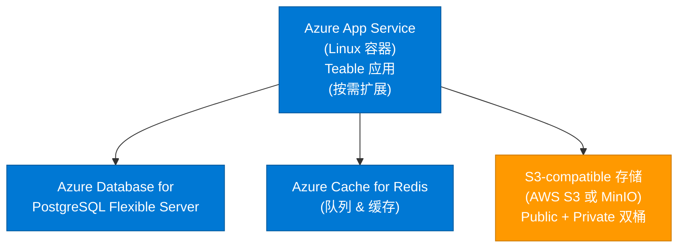
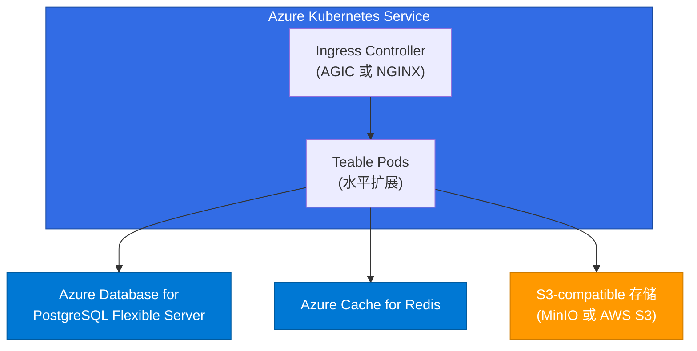

<Callout type="info">
**推荐场景**：50+ 用户的生产环境
</Callout>

## 架构概览



<Note>
**重要**：Teable 需要 **S3-compatible 存储**。你可以选择：
- **AWS S3**（跨云方案）
- **MinIO**（在 Azure VM/AKS 自建）
- 其他 S3-compatible 服务

Azure Blob Storage **不直接支持**，因为它使用不同的 API。
</Note>

## 前置要求

- 已安装并登录 Azure CLI
- Azure 订阅具备 App Service、PostgreSQL、Redis 权限
- 具备 **S3-compatible 存储**访问权（例如 AWS S3 账号或 MinIO 部署）

---

## 步骤 1：创建 Azure 资源

### 1.1 创建资源组

```bash
az group create \
  --name teable-rg \
  --location eastus
```

### 1.2 创建 PostgreSQL Flexible Server

```bash
az postgres flexible-server create \
  --resource-group teable-rg \
  --name teable-db \
  --location eastus \
  --admin-user teableadmin \
  --admin-password '<你的强密码>' \
  --sku-name Standard_B2s \
  --tier Burstable \
  --storage-size 128 \
  --version 16 \
  --public-access 0.0.0.0-255.255.255.255
```

<Note>
等待预配完成。获取连接字符串：
```bash
az postgres flexible-server show \
  --resource-group teable-rg \
  --name teable-db \
  --query "fullyQualifiedDomainName" --output tsv
```
结果：`teable-db.postgres.database.azure.com`
</Note>

### 1.3 创建 Azure Cache for Redis

```bash
az redis create \
  --resource-group teable-rg \
  --name teable-cache \
  --location eastus \
  --sku Basic \
  --vm-size c0 \
  --minimum-tls-version 1.2
```

<Note>
获取访问密钥：
```bash
az redis list-keys \
  --resource-group teable-rg \
  --name teable-cache \
  --query "primaryKey" --output tsv
```
</Note>

---

## 步骤 2：设置 S3-compatible 存储

由于 Azure Blob Storage 不兼容 S3，请选择以下方案之一：

### 方案 A：使用 AWS S3（跨云）

如果你已有 AWS 访问权或不想管理 MinIO，这是最简单的方案。

1. **在 AWS 上创建 S3 bucket**（参见 [AWS 部署指引](/zh/deploy/aws) 步骤 1.3-1.4）
   - Public bucket：`teable-public-<唯一后缀>`
   - Private bucket：`teable-private-<唯一后缀>`

2. **配置 public bucket**（参见 [对象存储指引](/zh/deploy/storage)）：
   - 启用 public read 访问
   - 配置 CORS 允许任意跨域

你将使用这些环境变量：
```bash
BACKEND_STORAGE_PROVIDER=s3
BACKEND_STORAGE_S3_REGION=us-west-2
BACKEND_STORAGE_S3_ENDPOINT=https://s3.us-west-2.amazonaws.com
BACKEND_STORAGE_S3_ACCESS_KEY=<aws-access-key>
BACKEND_STORAGE_S3_SECRET_KEY=<aws-secret-key>
BACKEND_STORAGE_PUBLIC_BUCKET=teable-public-<后缀>
BACKEND_STORAGE_PRIVATE_BUCKET=teable-private-<后缀>
STORAGE_PREFIX=https://teable-public-<后缀>.s3.us-west-2.amazonaws.com
```

### 方案 B：在 Azure 上部署 MinIO

如果希望所有资源都在 Azure，可部署 MinIO 作为 S3-compatible 网关。

**推荐镜像**：`minio/minio:RELEASE.2025-04-22T22-12-26Z`

**快速设置（Azure VM）**：

1. 创建 VM 并安装 MinIO：
```bash
wget https://dl.min.io/server/minio/release/linux-amd64/minio
chmod +x minio
sudo mv minio /usr/local/bin/

# 启动 MinIO
export MINIO_ROOT_USER=admin
export MINIO_ROOT_PASSWORD=<强密码>
minio server /data --console-address ":9001"
```

2. 通过 MinIO 控制台（端口 9001）或 CLI 创建 bucket：
```bash
mc alias set myminio http://your-vm-ip:9000 admin <密码>
mc mb myminio/public
mc mb myminio/private
mc policy set download myminio/public
```

你将使用这些环境变量：
```bash
BACKEND_STORAGE_PROVIDER=minio
BACKEND_STORAGE_MINIO_ENDPOINT=<vm-ip-或域名>
BACKEND_STORAGE_MINIO_PORT=443
BACKEND_STORAGE_MINIO_USE_SSL=true
BACKEND_STORAGE_MINIO_ACCESS_KEY=admin
BACKEND_STORAGE_MINIO_SECRET_KEY=<密码>
BACKEND_STORAGE_PUBLIC_BUCKET=public
BACKEND_STORAGE_PRIVATE_BUCKET=private
STORAGE_PREFIX=https://<vm-ip-或域名>
```

---

## 步骤 3：准备环境变量

创建文件 `app-settings.txt`，包含所有必需变量：

```bash
# Core
PUBLIC_ORIGIN=https://teable-app.azurewebsites.net
SECRET_KEY=<生成32位随机字符串>

# Database
PRISMA_DATABASE_URL=postgresql://teableadmin:<密码>@teable-db.postgres.database.azure.com:5432/postgres?sslmode=require

# Redis（队列依赖）
BACKEND_CACHE_PROVIDER=redis
BACKEND_CACHE_REDIS_URI=rediss://:<redis-key>@teable-cache.redis.cache.windows.net:6380/0

# 性能缓存（可选；可指向同一个 Redis）
BACKEND_PERFORMANCE_CACHE=rediss://:<redis-key>@teable-cache.redis.cache.windows.net:6380/0

# Storage（S3-compatible）
# 方案 A（AWS S3）：
BACKEND_STORAGE_PROVIDER=s3
BACKEND_STORAGE_S3_REGION=us-west-2
BACKEND_STORAGE_S3_ENDPOINT=https://s3.us-west-2.amazonaws.com
BACKEND_STORAGE_S3_ACCESS_KEY=<aws-access-key>
BACKEND_STORAGE_S3_SECRET_KEY=<aws-secret-key>
BACKEND_STORAGE_PUBLIC_BUCKET=teable-public-<后缀>
BACKEND_STORAGE_PRIVATE_BUCKET=teable-private-<后缀>
STORAGE_PREFIX=https://teable-public-<后缀>.s3.us-west-2.amazonaws.com

# 方案 B（MinIO）：
# BACKEND_STORAGE_PROVIDER=minio
# BACKEND_STORAGE_MINIO_ENDPOINT=<vm-ip>
# BACKEND_STORAGE_MINIO_PORT=443
# BACKEND_STORAGE_MINIO_USE_SSL=true
# BACKEND_STORAGE_MINIO_ACCESS_KEY=admin
# BACKEND_STORAGE_MINIO_SECRET_KEY=<密码>
# BACKEND_STORAGE_PUBLIC_BUCKET=public
# BACKEND_STORAGE_PRIVATE_BUCKET=private
# STORAGE_PREFIX=https://<vm-ip>
```

<Tip>
生成强 `SECRET_KEY`：
```bash
openssl rand -base64 32
```
</Tip>

---

## 步骤 4：部署到 Azure App Service

### 4.1 创建 App Service Plan

```bash
az appservice plan create \
  --resource-group teable-rg \
  --name teable-plan \
  --location eastus \
  --is-linux \
  --sku P1v3
```

### 4.2 创建 Web App（容器方式）

```bash
az webapp create \
  --resource-group teable-rg \
  --plan teable-plan \
  --name teable-app \
  --deployment-container-image-name ghcr.io/teableio/teable:latest
```

### 4.3 配置容器设置

```bash
az webapp config container set \
  --resource-group teable-rg \
  --name teable-app \
  --docker-custom-image-name ghcr.io/teableio/teable:latest \
  --docker-registry-server-url https://ghcr.io
```

### 4.4 设置环境变量

```bash
# 将 app-settings.txt 转为 JSON 格式并应用
az webapp config appsettings set \
  --resource-group teable-rg \
  --name teable-app \
  --settings \
    WEBSITES_PORT=3000 \
    PUBLIC_ORIGIN="https://teable-app.azurewebsites.net" \
    SECRET_KEY="<你的secret>" \
    PRISMA_DATABASE_URL="postgresql://..." \
    BACKEND_CACHE_PROVIDER="redis" \
    BACKEND_CACHE_REDIS_URI="rediss://..." \
    BACKEND_PERFORMANCE_CACHE="rediss://..." \
    BACKEND_STORAGE_PROVIDER="s3" \
    BACKEND_STORAGE_S3_REGION="us-west-2" \
    BACKEND_STORAGE_S3_ENDPOINT="https://s3.us-west-2.amazonaws.com" \
    BACKEND_STORAGE_S3_ACCESS_KEY="***" \
    BACKEND_STORAGE_S3_SECRET_KEY="***" \
    BACKEND_STORAGE_PUBLIC_BUCKET="teable-public-xxx" \
    BACKEND_STORAGE_PRIVATE_BUCKET="teable-private-xxx" \
    STORAGE_PREFIX="https://teable-public-xxx.s3.us-west-2.amazonaws.com"
```

### 4.5 配置健康检查

```bash
az webapp config set \
  --resource-group teable-rg \
  --name teable-app \
  --generic-configurations '{"healthCheckPath": "/health"}'
```

### 4.6 重启应用

```bash
az webapp restart \
  --resource-group teable-rg \
  --name teable-app
```

---

## 步骤 5：验证部署

1. **检查应用状态**：

```bash
az webapp show \
  --resource-group teable-rg \
  --name teable-app \
  --query "state" --output tsv
```

预期：`Running`

2. **查看日志**：

```bash
az webapp log tail \
  --resource-group teable-rg \
  --name teable-app
```

3. **测试健康检查**：

```bash
curl https://teable-app.azurewebsites.net/health
```

预期返回：
```json
{"status":"ok"}
```

4. **浏览器访问 Teable**：`https://teable-app.azurewebsites.net`

---

## 故障排查

### 数据库连接错误

- 验证 PostgreSQL 防火墙允许 Azure 服务
- 检查连接字符串包含 `?sslmode=require`
- 确保数据库名称正确（默认是 `postgres`，不是 `teable`）

### Redis 连接错误

- 使用 `rediss://`（双's'）进行 TLS 连接
- 使用端口 **6380**（不是 6379）连接 Azure Cache for Redis
- 验证访问密钥正确

### S3 访问错误（方案 A：AWS S3）

- 验证 AWS 凭据正确
- 检查 bucket 名称完全匹配
- 确保 public bucket 已配置 public read 策略与 CORS
- 测试 S3 从 Azure 的访问：`curl https://s3.us-west-2.amazonaws.com` 应该可用

### 容器启动失败

- 检查日志：`az webapp log tail ...`
- 验证所有必需环境变量已设置
- 确保 `WEBSITES_PORT=3000` 已设置

---

## 生产环境最佳实践

<Tip>
详细的生产环境建议（包括配置、高可用、扩展策略）请参考 [私有化部署概览](/zh/deploy/production-overview)。
</Tip>

**Azure 特定建议**：
- 使用 Azure Key Vault 存储敏感值
- 启用仅 HTTPS：`az webapp update --https-only true`
- 使用 VNet Integration 限制数据库/redis 访问
- 启用 Application Insights 监控

**自定义域名配置**：
```bash
# 添加自定义域名
az webapp config hostname add \
  --resource-group teable-rg \
  --webapp-name teable-app \
  --hostname teable.yourcompany.com

# 创建托管 SSL 证书
az webapp config ssl create \
  --resource-group teable-rg \
  --name teable-app \
  --hostname teable.yourcompany.com
```

---

## 替代方案：在 AKS 上部署（Azure Kubernetes Service）

对于大规模部署或已使用 Kubernetes 的团队，AKS 提供更好的可扩展性和控制能力。

### AKS 架构



### 步骤 1：创建 AKS 集群

```bash
# 创建 AKS 集群
az aks create \
  --resource-group teable-rg \
  --name teable-aks \
  --location eastus \
  --node-count 2 \
  --node-vm-size Standard_D4s_v3 \
  --enable-managed-identity \
  --generate-ssh-keys

# 获取凭据
az aks get-credentials \
  --resource-group teable-rg \
  --name teable-aks
```

### 步骤 2：创建 Azure 托管服务

使用与 [步骤 1.2](#12-创建-postgresql-flexible-server) 和 [步骤 1.3](#13-创建-azure-cache-for-redis) 相同的命令创建 PostgreSQL 和 Redis。

<Note>
对于 AKS，建议启用 VNet 集成以保护连接：

```bash
# 获取 AKS VNet ID
AKS_VNET=$(az aks show \
  --resource-group teable-rg \
  --name teable-aks \
  --query "networkProfile.networkPlugin" -o tsv)

# 配置 PostgreSQL 接受来自 AKS VNet 的连接
az postgres flexible-server vnet-rule create \
  --resource-group teable-rg \
  --server-name teable-db \
  --name aks-access \
  --vnet-name <aks-vnet-名称> \
  --subnet <aks-subnet-名称>
```
</Note>

### 步骤 3：在 AKS 中部署 MinIO（可选）

如果希望存储保持在 Azure 内部，可以在 AKS 中部署 MinIO：

```yaml
# minio-deployment.yaml
apiVersion: apps/v1
kind: Deployment
metadata:
  name: minio
spec:
  replicas: 1
  selector:
    matchLabels:
      app: minio
  template:
    metadata:
      labels:
        app: minio
    spec:
      containers:
        - name: minio
          image: minio/minio:latest
          args:
            - server
            - /data
            - --console-address
            - ":9001"
          env:
            - name: MINIO_ROOT_USER
              value: "minioadmin"
            - name: MINIO_ROOT_PASSWORD
              valueFrom:
                secretKeyRef:
                  name: minio-secrets
                  key: password
          ports:
            - containerPort: 9000
            - containerPort: 9001
          volumeMounts:
            - name: data
              mountPath: /data
      volumes:
        - name: data
          persistentVolumeClaim:
            claimName: minio-pvc
---
apiVersion: v1
kind: Service
metadata:
  name: minio
spec:
  ports:
    - name: api
      port: 9000
      targetPort: 9000
    - name: console
      port: 9001
      targetPort: 9001
  selector:
    app: minio
---
apiVersion: v1
kind: PersistentVolumeClaim
metadata:
  name: minio-pvc
spec:
  accessModes:
    - ReadWriteOnce
  resources:
    requests:
      storage: 50Gi
  storageClassName: managed-premium
```

<Tip>
对于生产环境的 MinIO 部署，建议使用 [MinIO Operator](https://min.io/docs/minio/kubernetes/upstream/) 实现分布式模式与数据冗余。
</Tip>

### 步骤 4：创建 Kubernetes 配置

创建包含 Azure 特定设置的 ConfigMap：

```yaml
# teable-config.yaml
apiVersion: v1
kind: ConfigMap
metadata:
  name: teable-config
data:
  PUBLIC_ORIGIN: "https://teable.yourcompany.com"
  
  # 存储（AKS 内的 MinIO）
  BACKEND_STORAGE_PROVIDER: "minio"
  BACKEND_STORAGE_MINIO_ENDPOINT: "minio.yourcompany.com"
  STORAGE_PREFIX: "https://minio.yourcompany.com"
  BACKEND_STORAGE_MINIO_INTERNAL_ENDPOINT: "minio.default.svc.cluster.local"
  BACKEND_STORAGE_MINIO_PORT: "443"
  BACKEND_STORAGE_MINIO_INTERNAL_PORT: "9000"
  BACKEND_STORAGE_MINIO_USE_SSL: "true"
  
  # 缓存
  BACKEND_CACHE_PROVIDER: "redis"
  
  # 其他
  NEXT_ENV_IMAGES_ALL_REMOTE: "true"
  PRISMA_ENGINES_CHECKSUM_IGNORE_MISSING: "1"
```

创建包含 Azure 服务凭据的 Secrets：

```yaml
# teable-secrets.yaml
apiVersion: v1
kind: Secret
metadata:
  name: teable-secrets
type: Opaque
stringData:
  # PostgreSQL (Azure Flexible Server)
  PRISMA_DATABASE_URL: "postgresql://teableadmin:<密码>@teable-db.postgres.database.azure.com:5432/postgres?sslmode=require"
  
  # 应用密钥
  SECRET_KEY: "<你的密钥>"
  
  # MinIO 凭据
  BACKEND_STORAGE_PUBLIC_BUCKET: "public"
  BACKEND_STORAGE_PRIVATE_BUCKET: "private"
  BACKEND_STORAGE_MINIO_ACCESS_KEY: "minioadmin"
  BACKEND_STORAGE_MINIO_SECRET_KEY: "<minio-密码>"
  
  # Redis (Azure Cache for Redis)
  BACKEND_CACHE_REDIS_URI: "rediss://:<redis-key>@teable-cache.redis.cache.windows.net:6380/0"
```

### 步骤 5：部署 Teable

```yaml
# teable-deployment.yaml
apiVersion: apps/v1
kind: Deployment
metadata:
  name: teable
spec:
  replicas: 2  # 按需扩展
  selector:
    matchLabels:
      app: teable
  template:
    metadata:
      labels:
        app: teable
    spec:
      initContainers:
        - name: db-migrate
          image: ghcr.io/teableio/teable:latest
          args:
            - migrate-only
          envFrom:
            - configMapRef:
                name: teable-config
            - secretRef:
                name: teable-secrets
          resources:
            limits:
              cpu: 1000m
              memory: 1024Mi
      containers:
        - name: teable
          image: ghcr.io/teableio/teable:latest
          args:
            - skip-migrate
          ports:
            - containerPort: 3000
          envFrom:
            - configMapRef:
                name: teable-config
            - secretRef:
                name: teable-secrets
          resources:
            requests:
              cpu: 500m
              memory: 1Gi
            limits:
              cpu: 2000m
              memory: 4Gi
          livenessProbe:
            httpGet:
              path: /health
              port: 3000
            initialDelaySeconds: 30
            periodSeconds: 30
          readinessProbe:
            httpGet:
              path: /health
              port: 3000
            initialDelaySeconds: 15
            periodSeconds: 10
---
apiVersion: v1
kind: Service
metadata:
  name: teable
spec:
  ports:
    - port: 3000
      targetPort: 3000
  selector:
    app: teable
```

### 步骤 6：配置 Ingress

**方案 A：使用 NGINX Ingress Controller**

```bash
# 安装 NGINX Ingress
helm repo add ingress-nginx https://kubernetes.github.io/ingress-nginx
helm install ingress-nginx ingress-nginx/ingress-nginx \
  --set controller.service.annotations."service\.beta\.kubernetes\.io/azure-load-balancer-health-probe-request-path"=/healthz
```

```yaml
# teable-ingress.yaml
apiVersion: networking.k8s.io/v1
kind: Ingress
metadata:
  name: teable
  annotations:
    kubernetes.io/ingress.class: nginx
    nginx.ingress.kubernetes.io/proxy-body-size: "100m"
    cert-manager.io/cluster-issuer: letsencrypt-prod
spec:
  tls:
    - hosts:
        - teable.yourcompany.com
      secretName: teable-tls
  rules:
    - host: teable.yourcompany.com
      http:
        paths:
          - path: /
            pathType: Prefix
            backend:
              service:
                name: teable
                port:
                  number: 3000
```

**方案 B：使用 Azure Application Gateway Ingress Controller (AGIC)**

```bash
# 启用 AGIC 插件
az aks enable-addons \
  --resource-group teable-rg \
  --name teable-aks \
  --addons ingress-appgw \
  --appgw-name teable-appgw \
  --appgw-subnet-cidr "10.225.0.0/16"
```

```yaml
# teable-ingress-agic.yaml
apiVersion: networking.k8s.io/v1
kind: Ingress
metadata:
  name: teable
  annotations:
    kubernetes.io/ingress.class: azure/application-gateway
    appgw.ingress.kubernetes.io/backend-path-prefix: "/"
    appgw.ingress.kubernetes.io/ssl-redirect: "true"
spec:
  tls:
    - hosts:
        - teable.yourcompany.com
      secretName: teable-tls
  rules:
    - host: teable.yourcompany.com
      http:
        paths:
          - path: /
            pathType: Prefix
            backend:
              service:
                name: teable
                port:
                  number: 3000
```

### 步骤 7：应用所有配置

```bash
# 应用配置
kubectl apply -f teable-config.yaml
kubectl apply -f teable-secrets.yaml
kubectl apply -f minio-deployment.yaml  # 如果在 AKS 中使用 MinIO
kubectl apply -f teable-deployment.yaml
kubectl apply -f teable-ingress.yaml

# 验证部署
kubectl get pods -l app=teable
kubectl logs -l app=teable
```

### AKS 生产环境建议

1. **自动扩缩容**：
```bash
# 启用 Horizontal Pod Autoscaler
kubectl autoscale deployment teable --cpu-percent=70 --min=2 --max=10

# 启用集群自动扩缩容
az aks update \
  --resource-group teable-rg \
  --name teable-aks \
  --enable-cluster-autoscaler \
  --min-count 2 \
  --max-count 5
```

2. **使用 Azure Key Vault** 替代 Kubernetes secrets 存储敏感信息：
```bash
# 启用 Key Vault secrets provider
az aks enable-addons \
  --resource-group teable-rg \
  --name teable-aks \
  --addons azure-keyvault-secrets-provider
```

3. **启用 Azure Monitor**：
```bash
az aks enable-addons \
  --resource-group teable-rg \
  --name teable-aks \
  --addons monitoring
```

4. **使用 Azure Private Link** 连接 PostgreSQL 和 Redis，保持流量在 Azure 网络内。

---

## 相关文档

- [私有化部署概览](/zh/deploy/production-overview) — 架构、配置与扩展
- [环境变量参考](/zh/deploy/env)
- [对象存储（S3-compatible）](/zh/deploy/storage)
- [Kubernetes 部署](/zh/deploy/k8s)（通用 K8s 指南）
- [AWS 部署](/zh/deploy/aws)（如使用跨云存储需参考 S3 设置）
