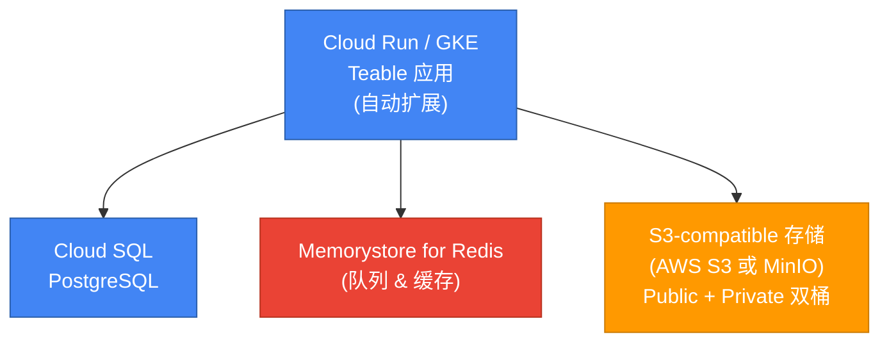

<Callout type="info">
**推荐场景**：100+ 用户的生产环境
</Callout>

## 架构概览



<Note>
**重要**：Teable 需要 **S3-compatible 存储**。你可以选择：
- **AWS S3**（跨云方案）
- **MinIO**（在 GCE/GKE 自建）
- 其他 S3-compatible 服务

Google Cloud Storage (GCS) **不直接支持**，因为它使用不同的 API。
</Note>

## 前置要求

- 已安装并认证 `gcloud` CLI
- GCP 项目已启用计费
- 具备 **S3-compatible 存储**访问权（例如 AWS S3 账号或 MinIO 部署）

---

## 步骤 1：创建 GCP 资源

### 1.1 设置项目和区域

```bash
export PROJECT_ID=your-project-id
export REGION=us-central1

gcloud config set project $PROJECT_ID
```

### 1.2 创建 Cloud SQL (PostgreSQL)

```bash
gcloud sql instances create teable-db \
  --database-version=POSTGRES_16 \
  --tier=db-custom-2-7680 \
  --region=$REGION \
  --root-password=<你的强密码> \
  --storage-type=SSD \
  --storage-size=100GB
```

<Note>
获取连接名称：
```bash
gcloud sql instances describe teable-db \
  --format='value(connectionName)'
```
结果：`your-project:region:teable-db`
</Note>

创建数据库：
```bash
gcloud sql databases create teable --instance=teable-db
```

### 1.3 创建 Memorystore (Redis)

```bash
gcloud redis instances create teable-cache \
  --size=1 \
  --region=$REGION \
  --redis-version=redis_7_0
```

<Note>
获取 Redis 主机地址：
```bash
gcloud redis instances describe teable-cache \
  --region=$REGION \
  --format='value(host)'
```
</Note>

---

## 步骤 2：设置 S3-compatible 存储

由于 Google Cloud Storage 不兼容 S3，请选择以下方案之一：

### 方案 A：使用 AWS S3（跨云）

1. **在 AWS 上创建 S3 bucket**（参见 [AWS 部署指引](/zh/deploy/aws) 步骤 1.3-1.4）
2. **配置 public bucket**（参见 [对象存储指引](/zh/deploy/storage)）

环境变量：
```bash
BACKEND_STORAGE_PROVIDER=s3
BACKEND_STORAGE_S3_REGION=us-west-2
BACKEND_STORAGE_S3_ENDPOINT=https://s3.us-west-2.amazonaws.com
BACKEND_STORAGE_S3_ACCESS_KEY=<aws-access-key>
BACKEND_STORAGE_S3_SECRET_KEY=<aws-secret-key>
BACKEND_STORAGE_PUBLIC_BUCKET=teable-public-<后缀>
BACKEND_STORAGE_PRIVATE_BUCKET=teable-private-<后缀>
STORAGE_PREFIX=https://teable-public-<后缀>.s3.us-west-2.amazonaws.com
```

### 方案 B：在 GCP 上部署 MinIO

在 GCE 实例或 GKE 集群上部署 MinIO 提供 S3-compatible 存储。

**快速设置（GCE VM）**：

```bash
# 创建 VM
gcloud compute instances create minio-server \
  --machine-type=e2-medium \
  --zone=us-central1-a \
  --image-family=ubuntu-2204-lts \
  --image-project=ubuntu-os-cloud \
  --boot-disk-size=100GB

# SSH 登录并安装 MinIO
gcloud compute ssh minio-server --zone=us-central1-a

# 在 VM 上：
wget https://dl.min.io/server/minio/release/linux-amd64/minio
chmod +x minio
sudo mv minio /usr/local/bin/

export MINIO_ROOT_USER=admin
export MINIO_ROOT_PASSWORD=<强密码>
minio server /data --console-address ":9001"
```

创建 bucket 并配置访问（详见 Azure 指引方案 B）。

---

## 步骤 3：准备环境变量

创建 `.env` 文件：

```bash
# Core
PUBLIC_ORIGIN=https://teable.yourcompany.com
SECRET_KEY=<生成32位随机字符串>

# Database (Cloud SQL)
PRISMA_DATABASE_URL=postgresql://postgres:<密码>@/teable?host=/cloudsql/<connection-name>

# Redis (Memorystore)
BACKEND_CACHE_PROVIDER=redis
BACKEND_CACHE_REDIS_URI=redis://<memorystore-ip>:6379/0
BACKEND_PERFORMANCE_CACHE=redis://<memorystore-ip>:6379/0

# Storage (S3-compatible)
# 方案 A (AWS S3)：
BACKEND_STORAGE_PROVIDER=s3
BACKEND_STORAGE_S3_REGION=us-west-2
BACKEND_STORAGE_S3_ENDPOINT=https://s3.us-west-2.amazonaws.com
BACKEND_STORAGE_S3_ACCESS_KEY=<aws-key>
BACKEND_STORAGE_S3_SECRET_KEY=<aws-secret>
BACKEND_STORAGE_PUBLIC_BUCKET=teable-public-<后缀>
BACKEND_STORAGE_PRIVATE_BUCKET=teable-private-<后缀>
STORAGE_PREFIX=https://teable-public-<后缀>.s3.us-west-2.amazonaws.com
```

---

## 步骤 4：部署到 Cloud Run

### 4.1 构建并推送容器（或使用预构建镜像）

```bash
# 方案 1：使用预构建镜像
export IMAGE=ghcr.io/teableio/teable:latest

# 方案 2：构建并推送到 GCR
# gcloud builds submit --tag gcr.io/$PROJECT_ID/teable
# export IMAGE=gcr.io/$PROJECT_ID/teable
```

### 4.2 部署到 Cloud Run

```bash
gcloud run deploy teable \
  --image=$IMAGE \
  --platform=managed \
  --region=$REGION \
  --allow-unauthenticated \
  --port=3000 \
  --set-env-vars="PUBLIC_ORIGIN=https://teable.yourcompany.com" \
  --set-env-vars="SECRET_KEY=<你的secret>" \
  --set-env-vars="PRISMA_DATABASE_URL=postgresql://..." \
  --set-env-vars="BACKEND_CACHE_PROVIDER=redis" \
  --set-env-vars="BACKEND_CACHE_REDIS_URI=redis://..." \
  --set-env-vars="BACKEND_STORAGE_PROVIDER=s3" \
  --set-env-vars="BACKEND_STORAGE_S3_REGION=us-west-2" \
  --set-env-vars="BACKEND_STORAGE_S3_ENDPOINT=https://s3.us-west-2.amazonaws.com" \
  --set-env-vars="BACKEND_STORAGE_S3_ACCESS_KEY=***" \
  --set-env-vars="BACKEND_STORAGE_S3_SECRET_KEY=***" \
  --set-env-vars="BACKEND_STORAGE_PUBLIC_BUCKET=teable-public-xxx" \
  --set-env-vars="BACKEND_STORAGE_PRIVATE_BUCKET=teable-private-xxx" \
  --set-env-vars="STORAGE_PREFIX=https://teable-public-xxx.s3.us-west-2.amazonaws.com" \
  --add-cloudsql-instances=<connection-name> \
  --vpc-connector=<your-vpc-connector-for-redis>
```

<Note>
访问 Cloud SQL 使用 `--add-cloudsql-instances`。  
访问 Memorystore 需先创建 VPC connector。
</Note>

---

## 步骤 5：验证部署

1. **获取服务 URL**：

```bash
gcloud run services describe teable \
  --region=$REGION \
  --format='value(status.url)'
```

2. **测试健康检查**：

```bash
curl https://<service-url>/health
```

预期：`{"status":"ok"}`

3. **查看日志**：

```bash
gcloud run services logs read teable --region=$REGION
```

---

## 生产环境建议

1. **高可用**：启用 Cloud Run 最小实例数（2+）
2. **安全**：使用 Secret Manager 存储敏感值
3. **监控**：启用 Cloud Monitoring 并设置告警
4. **备份**：启用 Cloud SQL 自动备份
5. **自定义域名**：将自定义域名映射到 Cloud Run 服务

---

## 相关文档

- [环境变量参考](/zh/deploy/env)
- [对象存储（S3-compatible）](/zh/deploy/storage)
- [Kubernetes 部署](/zh/deploy/k8s)
